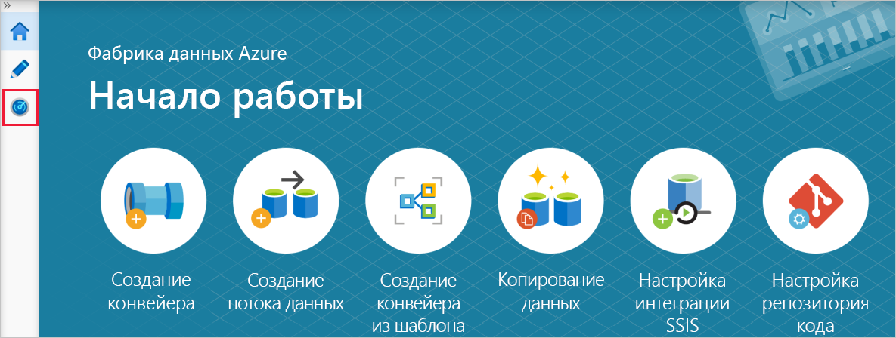
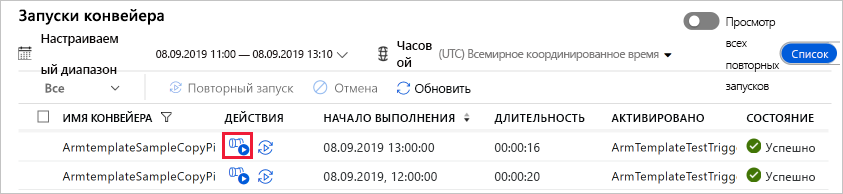
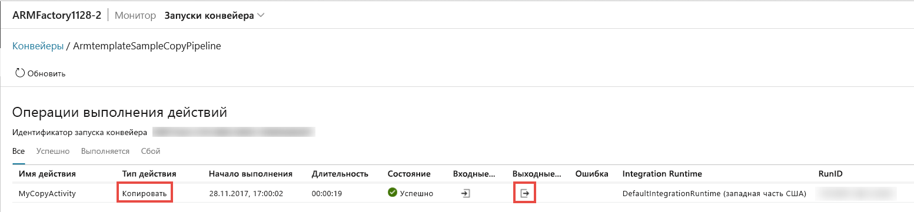

# <a name="tutorial-create-an-azure-data-factory-using-azure-resource-manager-template"></a>Руководство по Создание фабрики данных Azure с помощью шаблона Azure Resource Manager

> [!div class="op_single_selector" title1="Выберите используемую версию службы "Фабрика данных":"]
> * [Версия 1](v1/data-factory-build-your-first-pipeline-using-arm.md)
> * [Текущая версия](quickstart-create-data-factory-resource-manager-template.md)

В этом руководстве объясняется, как создать фабрику данных Azure с использованием шаблона Azure Resource Manager. Конвейер, который вы создадите в этой фабрике данных, **копирует** данные из одной папки в другую в хранилище BLOB-объектов Azure. Инструкции по **преобразованию** данных с помощью Фабрики данных Azure см. в статье [Преобразование данных с помощью действия Spark в фабрике данных Azure](transform-data-using-spark.md).

> [!NOTE]
> Эта статья не содержит подробный обзор службы фабрики данных. Общие сведения о службе фабрики данных Azure см. в статье [Введение в фабрику данных Azure](introduction.md).

[!INCLUDE [data-factory-quickstart-prerequisites](../../includes/data-factory-quickstart-prerequisites.md)]

### <a name="azure-powershell"></a>Azure PowerShell

[!INCLUDE [updated-for-az](../../includes/updated-for-az.md)]

Чтобы установить модули Azure PowerShell, выполните инструкции из статьи [Установка и настройка Azure PowerShell](/powershell/azure/install-Az-ps).

## <a name="resource-manager-templates"></a>Шаблоны Resource Manager

Общие сведения о шаблонах Azure Resource Manager см. в руководстве по [созданию шаблонов Azure Resource Manager](../azure-resource-manager/resource-group-authoring-templates.md).

В следующем разделе содержится полный шаблон Resource Manager для определения сущностей фабрики данных. Таким образом, вы сможете быстро изучить это руководство и протестировать шаблон. Дополнительные сведения о том, как определяется каждая сущность фабрики данных, см. в разделе [Сущности фабрики данных в шаблоне](#data-factory-entities-in-the-template).

Дополнительные сведения о синтаксисе JSON и свойствах для ресурсов Фабрики данных в шаблоне см. в статье о [типах ресурсов Microsoft.DataFactory](/azure/templates/microsoft.datafactory/allversions).

## <a name="data-factory-json"></a>JSON-файл фабрики данных

Создайте в папке **C:\ADFTutorial** (если такой папки не существует, создайте ее) JSON-файл под названием **ADFTutorialARM.json** со следующим содержимым:

```json
{  
    "$schema":"http://schema.management.azure.com/schemas/2015-01-01/deploymentTemplate.json#",
    "contentVersion":"1.0.0.0",
    "parameters":{  
        "dataFactoryName":{  
            "type":"string",
            "metadata":"Data Factory Name"
        },
        "dataFactoryLocation":{  
            "type":"string",
            "defaultValue":"East US",
            "metadata":{  
                "description":"Location of the data factory. Currently, only East US, East US 2, and West Europe are supported. "
            }
        },
        "storageAccountName":{  
            "type":"string",
            "metadata":{  
                "description":"Name of the Azure storage account that contains the input/output data."
            }
        },
        "storageAccountKey":{  
            "type":"securestring",
            "metadata":{  
                "description":"Key for the Azure storage account."
            }
        },
        "triggerStartTime": {
            "type": "string",
            "metadata": {
                "description": "Start time for the trigger."
            }
        },
        "triggerEndTime": {
            "type": "string",
            "metadata": {
                "description": "End time for the trigger."
            }
        }
    },      
    "variables":{  
        "factoryId":"[concat('Microsoft.DataFactory/factories/', parameters('dataFactoryName'))]"
    },
    "resources":[  
        {  
            "name":"[parameters('dataFactoryName')]",
            "apiVersion":"2018-06-01",
            "type":"Microsoft.DataFactory/factories",
            "location":"[parameters('dataFactoryLocation')]",
            "identity":{  
                "type":"SystemAssigned"
            },
            "resources":[  
                {  
                    "name":"[concat(parameters('dataFactoryName'), '/ArmtemplateStorageLinkedService')]",
                    "type":"Microsoft.DataFactory/factories/linkedServices",
                    "apiVersion":"2018-06-01",
                    "properties":{  
                        "annotations":[  

                        ],
                        "type":"AzureBlobStorage",
                        "typeProperties":{  
                            "connectionString":"[concat('DefaultEndpointsProtocol=https;AccountName=',parameters('storageAccountName'),';AccountKey=',parameters('storageAccountKey'))]"
                        }
                    },
                    "dependsOn":[  
                        "[parameters('dataFactoryName')]"
                    ]
                },
                {  
                    "name":"[concat(parameters('dataFactoryName'), '/ArmtemplateTestDatasetIn')]",
                    "type":"Microsoft.DataFactory/factories/datasets",
                    "apiVersion":"2018-06-01",
                    "properties":{  
                        "linkedServiceName":{  
                            "referenceName":"ArmtemplateStorageLinkedService",
                            "type":"LinkedServiceReference"
                        },
                        "annotations":[  

                        ],
                        "type":"Binary",
                        "typeProperties":{  
                            "location":{  
                                "type":"AzureBlobStorageLocation",
                                "fileName":"emp.txt",
                                "folderPath":"input",
                                "container":"adftutorial"
                            }
                        }
                    },
                    "dependsOn":[  
                        "[parameters('dataFactoryName')]",
                        "[concat(variables('factoryId'), '/linkedServices/ArmtemplateStorageLinkedService')]"
                    ]
                },
                {  
                    "name":"[concat(parameters('dataFactoryName'), '/ArmtemplateTestDatasetOut')]",
                    "type":"Microsoft.DataFactory/factories/datasets",
                    "apiVersion":"2018-06-01",
                    "properties":{  
                        "linkedServiceName":{  
                            "referenceName":"ArmtemplateStorageLinkedService",
                            "type":"LinkedServiceReference"
                        },
                        "annotations":[  

                        ],
                        "type":"Binary",
                        "typeProperties":{  
                            "location":{  
                                "type":"AzureBlobStorageLocation",
                                "folderPath":"output",
                                "container":"adftutorial"
                            }
                        }
                    },
                    "dependsOn":[  
                        "[parameters('dataFactoryName')]",
                        "[concat(variables('factoryId'), '/linkedServices/ArmtemplateStorageLinkedService')]"
                    ]
                },
                {  
                    "name":"[concat(parameters('dataFactoryName'), '/ArmtemplateSampleCopyPipeline')]",
                    "type":"Microsoft.DataFactory/factories/pipelines",
                    "apiVersion":"2018-06-01",
                    "properties":{  
                        "activities":[  
                            {  
                                "name":"MyCopyActivity",
                                "type":"Copy",
                                "dependsOn":[  

                                ],
                                "policy":{  
                                    "timeout":"7.00:00:00",
                                    "retry":0,
                                    "retryIntervalInSeconds":30,
                                    "secureOutput":false,
                                    "secureInput":false
                                },
                                "userProperties":[  

                                ],
                                "typeProperties":{  
                                    "source":{  
                                        "type":"BinarySource",
                                        "storeSettings":{  
                                            "type":"AzureBlobStorageReadSettings",
                                            "recursive":true
                                        }
                                    },
                                    "sink":{  
                                        "type":"BinarySink",
                                        "storeSettings":{  
                                            "type":"AzureBlobStorageWriteSettings"
                                        }
                                    },
                                    "enableStaging":false
                                },
                                "inputs":[  
                                    {  
                                        "referenceName":"ArmtemplateTestDatasetIn",
                                        "type":"DatasetReference",
                                        "parameters":{  

                                        }
                                    }
                                ],
                                "outputs":[  
                                    {  
                                        "referenceName":"ArmtemplateTestDatasetOut",
                                        "type":"DatasetReference",
                                        "parameters":{  

                                        }
                                    }
                                ]
                            }
                        ],
                        "annotations":[  

                        ]
                    },
                    "dependsOn":[  
                        "[parameters('dataFactoryName')]",
                        "[concat(variables('factoryId'), '/datasets/ArmtemplateTestDatasetIn')]",
                        "[concat(variables('factoryId'), '/datasets/ArmtemplateTestDatasetOut')]"
                    ]
                },
                {  
                    "name":"[concat(parameters('dataFactoryName'), '/ArmTemplateTestTrigger')]",
                    "type":"Microsoft.DataFactory/factories/triggers",
                    "apiVersion":"2018-06-01",
                    "properties":{  
                        "annotations":[  

                        ],
                        "runtimeState":"Started",
                        "pipelines":[  
                            {  
                                "pipelineReference":{  
                                    "referenceName":"ArmtemplateSampleCopyPipeline",
                                    "type":"PipelineReference"
                                },
                                "parameters":{  

                                }
                            }
                        ],
                        "type":"ScheduleTrigger",
                        "typeProperties":{  
                            "recurrence":{  
                                "frequency":"Hour",
                                "interval":1,
                                "startTime":"[parameters('triggerStartTime')]",
                                "endTime":"[parameters('triggerEndTime')]",
                                "timeZone":"UTC"
                            }
                        }
                    },
                    "dependsOn":[  
                        "[parameters('dataFactoryName')]",
                        "[concat(variables('factoryId'), '/pipelines/ArmtemplateSampleCopyPipeline')]"
                    ]
                }
            ]
        }
    ]
}
```
## <a name="parameters-json"></a>JSON-файл параметров

Создайте JSON-файл с именем **ADFTutorialARM Parameters.json**, содержащий параметры для шаблона Azure Resource Manager.

> [!IMPORTANT]
> - Укажите значения имени и ключа вашей учетной записи хранения Azure для параметров **storageAccountName** и **storageAccountKey** в этом файле параметров. Вы создали контейнер adftutorial и передали пример файла (emp.txt) в папку входных данных в этом хранилище больших двоичных объектов Azure.
> - Укажите глобально уникальное имя фабрики данных для параметра **dataFactoryName**. Например:  ARMTutorialFactoryJohnDoe11282017.
> - Для параметра **triggerStartTime** укажите текущую дату в таком формате: `2019-09-08T00:00:00`.
> - Для параметра **triggerEndTime** укажите завтрашнюю дату в таком формате: `2019-09-09T00:00:00`. Также можно проверить текущее время UTC и указать следующий час или два часа как время окончания. Например, если текущее время UTC — 1:32:00, укажите `2019-09-09:03:00:00` в качестве времени окончания. В этом случае триггер запустит конвейер дважды (в 2:00 и 3:00).

```json
{  
    "$schema":"https://schema.management.azure.com/schemas/2015-01-01/deploymentParameters.json#",
    "contentVersion":"1.0.0.0",
    "parameters":{  
        "dataFactoryName":{  
            "value":"<datafactoryname>"
        },
        "dataFactoryLocation":{  
            "value":"East US"
        },
        "storageAccountName":{  
            "value":"<yourstorageaccountname>"
        },
        "storageAccountKey":{  
            "value":"<yourstorageaccountkey>"
        },
        "triggerStartTime":{  
            "value":"2019-09-08T11:00:00"
        },
        "triggerEndTime":{  
            "value":"2019-09-08T14:00:00"
        }
    }
}
```

> [!IMPORTANT]
> Можно создать отдельные JSON-файлы параметров для сред разработки, тестирования и рабочей среды, которые можно использовать с одним и тем же шаблоном JSON фабрики данных. Скрипт PowerShell позволяет автоматизировать развертывание сущностей фабрики данных в этих средах.

## <a name="deploy-data-factory-entities"></a>Развертывание сущностей фабрики данных

В PowerShell запустите следующую команду для развертывания элементов Data Factory в вашей группе ресурсов (в данном случае возьмите ADFTutorialResourceGroup в качестве примера), используя шаблон Resource Manager, который вы создали ранее в этом кратком руководстве.

```powershell
New-AzResourceGroupDeployment -Name MyARMDeployment -ResourceGroupName ADFTutorialResourceGroup -TemplateFile C:\ADFTutorial\ADFTutorialARM.json -TemplateParameterFile C:\ADFTutorial\ADFTutorialARM-Parameters.json
```

Вы увидите похожий результат:

```console
DeploymentName          : MyARMDeployment
ResourceGroupName       : ADFTutorialResourceGroup
ProvisioningState       : Succeeded
Timestamp               : 9/8/2019 10:52:29 AM
Mode                    : Incremental
TemplateLink            : 
Parameters              : 
                          Name                   Type                       Value     
                          =====================  =========================  ==========
                          dataFactoryName        String                     <data factory name>
                          dataFactoryLocation    String                     East US   
                          storageAccountName     String                     <storage account name>
                          storageAccountKey      SecureString                         
                          triggerStartTime       String                     9/8/2019 11:00:00 AM
                          triggerEndTime         String                     9/8/2019 2:00:00 PM
                          
Outputs                 : 
DeploymentDebugLogLevel : 
```

## <a name="start-the-trigger"></a>Запуск триггера

Шаблон развертывает следующие сущности фабрики данных:

- Связанная служба хранения Azure
- Двоичные наборы данных Azure (входные и выходные)
- Конвейер с действием копирования
- Триггер для активации конвейера

Развернутый триггер находится в остановленном состоянии. Один из способов запуска триггера — использование командлета PowerShell **Start-AzDataFactoryV2Trigger**. Ниже приведены подробные инструкции.

1. В окне PowerShell создайте переменную для хранения имени группы ресурсов. Скопируйте следующую команду в окно PowerShell и нажмите клавишу ВВОД. Если вы указали другое имя группы ресурсов для команды New-AzResourceGroupDeployment, обновите значение здесь.

    ```powershell
    $resourceGroupName = "ADFTutorialResourceGroup"
    ```
2. Создайте переменную для хранения имени фабрики данных. Укажите то же имя, которое вы указали в файле ADFTutorialARM-Parameters.json.

    ```powershell
    $dataFactoryName = "<yourdatafactoryname>"
    ```
3. Задайте переменную для имени триггера. Имя триггера закодировано в файле шаблона Resource Manager (ADFTutorialARM.json).

    ```powershell
    $triggerName = "ArmTemplateTestTrigger"
    ```
4. Чтобы получить **состояние триггера**, выполните следующую команду PowerShell, указав имя фабрики данных и триггер:

    ```powershell
    Get-AzDataFactoryV2Trigger -ResourceGroupName $resourceGroupName -DataFactoryName $dataFactoryName -Name $triggerName
    ```

    Пример выходных данных:

    ```json

    TriggerName       : ArmTemplateTestTrigger
    ResourceGroupName : ADFTutorialResourceGroup
    DataFactoryName   : ADFQuickstartsDataFactory0905
    Properties        : Microsoft.Azure.Management.DataFactory.Models.ScheduleTrigger
    RuntimeState      : Stopped
    ```
    
    Обратите внимание, что среда выполнения триггера находится в состоянии **Остановлено**.
5. **Запустите триггер**. Триггер выполняет конвейер во время, определенное в шаблоне. То есть при выполнении этой команды в 14:25 триггер впервые выполняет конвейер в 15:00. Затем он будет запускать конвейер каждый час, пока не истечет время завершения, указанное для триггера.

    ```powershell
    Start-AzDataFactoryV2Trigger -ResourceGroupName $resourceGroupName -DataFactoryName $dataFactoryName -TriggerName $triggerName
    ```
    
    Пример выходных данных:
    
    ```console
    Confirm
    Are you sure you want to start trigger 'ArmTemplateTestTrigger' in data factory 'ARMFactory1128'?
    [Y] Yes  [N] No  [S] Suspend  [?] Help (default is "Y"): y
    True
    ```
6. Обязательно запустите триггер с помощью команды Get-AzDataFactoryV2Trigger еще раз.

    ```powershell
    Get-AzDataFactoryV2Trigger -ResourceGroupName $resourceGroupName -DataFactoryName $dataFactoryName -TriggerName $triggerName
    ```
    
    Пример выходных данных:
    
    ```console
    TriggerName       : ArmTemplateTestTrigger
    ResourceGroupName : ADFTutorialResourceGroup
    DataFactoryName   : ADFQuickstartsDataFactory0905
    Properties        : Microsoft.Azure.Management.DataFactory.Models.ScheduleTrigger
    RuntimeState      : Started
    ```

## <a name="monitor-the-pipeline"></a>Мониторинг конвейера

1. На [портале Azure](https://portal.azure.com/) в разделе **Все службы** выполните поиск по ключевому слову, например **фабрики да**, и выберите **Фабрики данных**.

2. На странице **Фабрики данных** щелкните созданную фабрику данных. При необходимости отфильтруйте список по имени фабрики данных.

3. На странице "Фабрика данных" щелкните **Создание и мониторинг**.

4. На странице **Начало работы** выберите **вкладку "Мониторинг"** .  

    > [!IMPORTANT]
    > Как видите, конвейер запускается только по часам (например, в 4:00, 5: 00, 6:00 и т. д.). Нажмите кнопку **Обновить** на панели инструментов, чтобы обновить список, когда наступит следующий час.

5. Щелкните ссылку **View Activity Runs** (Просмотр запусков действий) в столбце **Actions** (Действия).

    

6. Вы увидите, что выполняется действие, связанное с выполнением конвейера. В этом кратком руководстве конвейер содержит только один тип действия: копирование. Поэтому вы видите выполнение этого действия.

    
7. Щелкните ссылку **выходные данные** в столбце действия. Вы увидите результат операции копирования в окне **Вывод**. Чтобы просмотреть все результаты, нажмите кнопку "Развернуть". Можно закрыть развернутое окно вывода.

8. Остановите триггер, после успешного выполнения или сбоя выполнения. Триггер запускает конвейер раз в час. Конвейер копирует один и тот же файл из входной папки в выходную для каждого запуска. Чтобы остановить триггер, в окне PowerShell введите следующую команду.
    
    ```powershell
    Stop-AzDataFactoryV2Trigger -ResourceGroupName $resourceGroupName -DataFactoryName $dataFactoryName -Name $triggerName
    ```

[!INCLUDE [data-factory-quickstart-verify-output-cleanup.md](../../includes/data-factory-quickstart-verify-output-cleanup.md)]

## <a name="data-factory-entities-in-the-template"></a> Определения JSON для сущностей

В шаблоне JSON определены следующие сущности фабрики данных:

- [Связанная служба хранения Azure](#azure-storage-linked-service)
- [Входной двоичный набор данных](#binary-input-dataset)
- [Выходной двоичный набор данных](#binary-output-dataset)
- [Конвейер данных с действием копирования](#data-pipeline)
- [Триггер](#trigger)

#### <a name="azure-storage-linked-service"></a>Связанная служба хранения Azure

Связанная служба хранилища Azure связывает учетную запись хранения Azure с фабрикой данных. Вы создали контейнер и отправили данные в эту учетную запись хранения для выполнения предварительных требований. В этом разделе вы укажете имя и ключ вашей учетной записи хранения Azure. Дополнительные сведения о свойствах JSON для определения связанной службы хранилища Azure см. в разделе [Связанная служба хранилища Azure](connector-azure-blob-storage.md#linked-service-properties).

```json
{  
    "name":"[concat(parameters('dataFactoryName'), '/ArmtemplateStorageLinkedService')]",
    "type":"Microsoft.DataFactory/factories/linkedServices",
    "apiVersion":"2018-06-01",
    "properties":{  
        "annotations":[  

        ],
        "type":"AzureBlobStorage",
        "typeProperties":{  
            "connectionString":"[concat('DefaultEndpointsProtocol=https;AccountName=',parameters('storageAccountName'),';AccountKey=',parameters('storageAccountKey'))]"
        }
    },
    "dependsOn":[  
        "[parameters('dataFactoryName')]"
    ]
}
```

Для connectionString используются параметры storageAccountName и storageAccountKey. Значения для этих параметров передаются с помощью файла конфигурации. В этом определении также используются переменные azureStorageLinkedService и dataFactoryName, заданные в шаблоне.

#### <a name="binary-input-dataset"></a>Входной двоичный набор данных

Связанная служба хранилища Azure указывает строку подключения, которую фабрика данных использует во время выполнения, чтобы подключиться к учетной записи хранения Azure. В поле двоичного набора данных Azure укажите имена контейнера больших двоичных объектов, папки и файла, содержащего входные данные. Подробные сведения о свойствах JSON, которые используются для определения [двоичного набора данных](format-binary.md#dataset-properties), см. в разделе Свойства типа "Двоичный набор данных".

```json
{  
    "name":"[concat(parameters('dataFactoryName'), '/ArmtemplateTestDatasetIn')]",
    "type":"Microsoft.DataFactory/factories/datasets",
    "apiVersion":"2018-06-01",
    "properties":{  
        "linkedServiceName":{  
            "referenceName":"ArmtemplateStorageLinkedService",
            "type":"LinkedServiceReference"
        },
        "annotations":[  

        ],
        "type":"Binary",
        "typeProperties":{  
            "location":{  
                "type":"AzureBlobStorageLocation",
                "fileName":"emp.txt",
                "folderPath":"input",
                "container":"adftutorial"
            }
        }
    },
    "dependsOn":[  
        "[parameters('dataFactoryName')]",
        "[concat(variables('factoryId'), '/linkedServices/ArmtemplateStorageLinkedService')]"
    ]
}
```

#### <a name="binary-output-dataset"></a>Выходной двоичный набор данных

Укажите имя папки в хранилище BLOB-объектов Azure, которая содержит скопированные данные из входной папки. Подробные сведения о свойствах JSON, которые используются для определения [двоичного набора данных](format-binary.md#dataset-properties), см. в разделе Свойства типа "Двоичный набор данных".

```json
{  
    "name":"[concat(parameters('dataFactoryName'), '/ArmtemplateTestDatasetOut')]",
    "type":"Microsoft.DataFactory/factories/datasets",
    "apiVersion":"2018-06-01",
    "properties":{  
        "linkedServiceName":{  
            "referenceName":"ArmtemplateStorageLinkedService",
            "type":"LinkedServiceReference"
        },
        "annotations":[  

        ],
        "type":"Binary",
        "typeProperties":{  
            "location":{  
                "type":"AzureBlobStorageLocation",
                "folderPath":"output",
                "container":"adftutorial"
            }
        }
    },
    "dependsOn":[  
        "[parameters('dataFactoryName')]",
        "[concat(variables('factoryId'), '/linkedServices/ArmtemplateStorageLinkedService')]"
    ]
}
```

#### <a name="data-pipeline"></a>Конвейер данных

Определите конвейер, который копирует данные из двоичного набора данных Azure в другой такой двоичный набор данных. В разделе [Конвейер JSON](concepts-pipelines-activities.md#pipeline-json) описаны элементы JSON, используемые для определения конвейера в этом примере.

```json
{  
    "name":"[concat(parameters('dataFactoryName'), '/ArmtemplateSampleCopyPipeline')]",
    "type":"Microsoft.DataFactory/factories/pipelines",
    "apiVersion":"2018-06-01",
    "properties":{  
        "activities":[  
            {  
                "name":"MyCopyActivity",
                "type":"Copy",
                "dependsOn":[  

                ],
                "policy":{  
                    "timeout":"7.00:00:00",
                    "retry":0,
                    "retryIntervalInSeconds":30,
                    "secureOutput":false,
                    "secureInput":false
                },
                "userProperties":[  

                ],
                "typeProperties":{  
                    "source":{  
                        "type":"BinarySource",
                        "storeSettings":{  
                            "type":"AzureBlobStorageReadSettings",
                            "recursive":true
                        }
                    },
                    "sink":{  
                        "type":"BinarySink",
                        "storeSettings":{  
                            "type":"AzureBlobStorageWriteSettings"
                        }
                    },
                    "enableStaging":false
                },
                "inputs":[  
                    {  
                        "referenceName":"ArmtemplateTestDatasetIn",
                        "type":"DatasetReference",
                        "parameters":{  

                        }
                    }
                ],
                "outputs":[  
                    {  
                        "referenceName":"ArmtemplateTestDatasetOut",
                        "type":"DatasetReference",
                        "parameters":{  

                        }
                    }
                ]
            }
        ],
        "annotations":[  

        ]
    },
    "dependsOn":[  
        "[parameters('dataFactoryName')]",
        "[concat(variables('factoryId'), '/datasets/ArmtemplateTestDatasetIn')]",
        "[concat(variables('factoryId'), '/datasets/ArmtemplateTestDatasetOut')]"
    ]
}
```

#### <a name="trigger"></a>Триггер

Определите триггер, который выполняет конвейер раз в час. Развернутый триггер находится в остановленном состоянии. Запустите триггер с помощью командлета **Start-AzDataFactoryV2Trigger**. Дополнительные сведения см. в руководстве по [выполнению конвейера и использованию триггеров](concepts-pipeline-execution-triggers.md#triggers).

```json
{  
    "name":"[concat(parameters('dataFactoryName'), '/ArmTemplateTestTrigger')]",
    "type":"Microsoft.DataFactory/factories/triggers",
    "apiVersion":"2018-06-01",
    "properties":{  
        "annotations":[  

        ],
        "runtimeState":"Started",
        "pipelines":[  
            {  
                "pipelineReference":{  
                    "referenceName":"ArmtemplateSampleCopyPipeline",
                    "type":"PipelineReference"
                },
                "parameters":{  

                }
            }
        ],
        "type":"ScheduleTrigger",
        "typeProperties":{  
            "recurrence":{  
                "frequency":"Hour",
                "interval":1,
                "startTime":"[parameters('triggerStartTime')]",
                "endTime":"[parameters('triggerEndTime')]",
                "timeZone":"UTC"
            }
        }
    },
    "dependsOn":[  
        "[parameters('dataFactoryName')]",
        "[concat(variables('factoryId'), '/pipelines/ArmtemplateSampleCopyPipeline')]"
    ]
}
```

## <a name="reuse-the-template"></a>Повторное использование шаблона

В этом руководстве описывается создание шаблона для определения сущностей фабрики данных, а также шаблона, передающего значения для параметров. Чтобы использовать один шаблон для развертывания сущностей фабрики данных в разных средах, нужно создать файл параметров для каждой среды и использовать его при развертывании в определенной среде.

Пример:

```powershell
New-AzResourceGroupDeployment -Name MyARMDeployment -ResourceGroupName ADFTutorialResourceGroup -TemplateFile ADFTutorialARM.json -TemplateParameterFile ADFTutorialARM-Parameters-Dev.json

New-AzResourceGroupDeployment -Name MyARMDeployment -ResourceGroupName ADFTutorialResourceGroup -TemplateFile ADFTutorialARM.json -TemplateParameterFile ADFTutorialARM-Parameters-Test.json

New-AzResourceGroupDeployment -Name MyARMDeployment -ResourceGroupName ADFTutorialResourceGroup -TemplateFile ADFTutorialARM.json -TemplateParameterFile ADFTutorialARM-Parameters-Production.json
```

Обратите внимание, что первая команда использует файл параметров для среды разработки, вторая — для среды тестирования, а третья — для рабочей среды.

Шаблон можно снова использовать для выполнения повторяющихся задач. Например, создайте несколько фабрик данных с одним или с несколькими конвейерами, которые реализуют одинаковую логику, но чтобы каждая фабрика данных использовала разные учетные записи хранения Azure. В этом сценарии для создания фабрик данных используется один шаблон в той же среде (разработки, тестирования или рабочей) с различными файлами параметров.

## <a name="next-steps"></a>Дополнительная информация

В этом примере конвейер копирует данные из одного расположения в другое в хранилище BLOB-объектов Azure. Перейдите к [руководствам](tutorial-copy-data-dot-net.md), чтобы узнать об использовании фабрики данных в различных сценариях.
