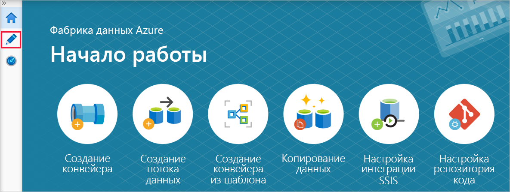

# <a name="copy-multiple-tables-in-bulk-by-using-azure-data-factory"></a>Копирование нескольких таблиц в пакетном режиме с помощью фабрики данных Azure
В этом руководстве показано **копирование нескольких таблиц из базы данных SQL Azure в хранилище данных SQL Azure**. Этот подход можно применить и в других сценариях. Например, копирование таблиц из SQL Server или Oracle в Базу данных SQL Azure, хранилище данных или большой двоичный объект Azure, копирование различных путей из большого двоичного объекта в таблицы Базы данных SQL Azure.

> [!NOTE]
> - Если вы еще не работали с фабрикой данных Azure, ознакомьтесь со статьей [Введение в фабрику данных Azure](introduction.md).

В целом это руководство включает следующие шаги:

> [!div class="checklist"]
> * Создание фабрики данных.
> * Создание связанных служб базы данных SQL Azure, хранилища данных SQL Azure и службы хранилища Azure.
> * Создание наборов данных Базы данных SQL Azure и хранилища данных SQL.
> * Создание конвейера для поиска таблиц, которые нужно скопировать, и конвейера для выполнения операции копирования. 
> * Запуск конвейера.
> * Мониторинг конвейера и выполнения действий.

В этом руководстве используется портал Azure. Сведения об использовании других средств или пакетов SDK для создания фабрики данных см. в [этом кратком руководстве](quickstart-create-data-factory-dot-net.md). 

## <a name="end-to-end-workflow"></a>Комплексный рабочий процесс
Предположим, у вас есть несколько таблиц в базе данных SQL Azure и вы хотите скопировать их в хранилище данных SQL. Вот логическая последовательность действий рабочего процесса в конвейерах:


* Первый конвейер ищет список таблиц, который необходимо скопировать в хранилище данных-приемник.  В качестве альтернативы можно создать таблицу метаданных, в которой перечислены все таблицы, которые нужно скопировать в хранилище данных-приемник. Затем конвейер активирует другой конвейер, который выполняет итерацию по каждой таблице базы данных и выполняет операцию копирования данных.
* Второй конвейер выполняет фактическое копирование. Он принимает список таблиц в качестве параметра. Чтобы добиться лучшей производительности, для каждой таблицы в списке скопируйте определенную таблицу из базы данных SQL Azure в соответствующую таблицу хранилища данных SQL Azure, используя [промежуточное копирование с помощью хранилища BLOB-объектов и PolyBase](connector-azure-sql-data-warehouse.md#use-polybase-to-load-data-into-azure-sql-data-warehouse). В этом примере первый конвейер передает список таблиц в качестве значения параметра. 

Если у вас еще нет подписки Azure, [создайте бесплатную учетную запись Azure](https://azure.microsoft.com/free/), прежде чем начинать работу.

## <a name="prerequisites"></a>Предварительные требования
* **Учетная запись хранения Azure.** Учетная запись хранения Azure используется в качестве промежуточного хранилища больших двоичных объектов в операции массового копирования. 
* **База данных SQL Azure**. Эта база данных содержит исходные данные. 
* **Хранилище данных Azure SQL.** Это хранилище данных содержит данные, копируемые из базы данных SQL. 

### <a name="prepare-sql-database-and-sql-data-warehouse"></a>Подготовка базы данных SQL и хранилища данных SQL

**Подготовка исходной базы данных SQL Azure:**

Создайте базу данных SQL Azure, используя пример данных Adventure Works LT, представленный в статье [Создание базы данных SQL Azure на портале Azure](../sql-database/sql-database-get-started-portal.md). В этом руководстве копируются все таблицы из этого примера базы данных в хранилище данных SQL.

**Подготовка хранилища данных-приемника SQL Azure:**

1. Если у вас нет хранилища данных SQL Azure, выполните шаги из раздела [Создание хранилища данных SQL](../sql-data-warehouse/sql-data-warehouse-get-started-tutorial.md).

1. Создайте соответствующие схемы таблиц в хранилище данных SQL Azure. [Служебную программу переноса](https://www.microsoft.com/download/details.aspx?id=49100) можно использовать для **миграции схемы** из Базы данных SQL Azure в хранилище данных SQL Azure. Фабрика данных Azure используется для миграции и копирования данных на более поздних этапах.

## <a name="azure-services-to-access-sql-server"></a>Доступ служб Azure к серверу SQL Server

В базе данных SQL и хранилище данных SQL Azure предоставьте службам Azure доступ к серверу SQL Server. Убедитесь, что параметр **Разрешить доступ к службам Azure** имеет значение **ВКЛ** для вашего сервера Azure SQL. Этот параметр позволяет службе фабрики данных читать данные из базы данных SQL Azure и записывать данные в хранилище данных SQL Azure. 

Чтобы проверить и при необходимости включить этот параметр, перейдите к серверу Azure SQL Server, выберите "Безопасность" > "Брандмауэры и виртуальные сети", задайте для параметра **Разрешить доступ к службам Azure** значение **Вкл.**

## <a name="create-a-data-factory"></a>Создание фабрики данных
1. Запустите веб-браузер **Microsoft Edge** или **Google Chrome**. Сейчас только эти браузеры поддерживают пользовательский интерфейс фабрики данных.
1. В меню слева выберите **Создать ресурс** > **Аналитика** > **Фабрика данных**: 

1. На странице **Новая фабрика данных** введите **ADFTutorialBulkCopyDF** в поле **Имя**. 
 
   Имя фабрики данных Azure должно быть **глобально уникальным**. Если вы увидите следующую ошибку для поля имени, введите другое имя фабрики данных (например, ваше_имя_ADFTutorialBulkCopyDF). Ознакомьтесь со статьей [Фабрика данных Azure — правила именования](naming-rules.md), чтобы узнать правила именования для артефактов службы "Фабрика данных".
  
       `Data factory name “ADFTutorialBulkCopyDF” is not available`
1. Выберите **подписку** Azure, в рамках которой вы хотите создать фабрику данных. 
1. Для **группы ресурсов** выполните одно из следующих действий.
     
   - Выберите **Использовать существующую**и укажите существующую группу ресурсов в раскрывающемся списке. 
   - Выберите **Создать новую**и укажите имя группы ресурсов.   
         
     Сведения о группах ресурсов см. в статье, где описывается [использование групп ресурсов для управления ресурсами Azure](../azure-resource-manager/resource-group-overview.md).  
1. Укажите **V2** при выборе **версии**.
1. Укажите **расположение** фабрики данных. Чтобы получить список регионов Azure, в которых сейчас доступна Фабрика данных, выберите интересующие вас регионы на следующей странице, а затем разверните раздел **Аналитика**, чтобы найти пункт **Фабрика данных**: [Доступность продуктов по регионам](https://azure.microsoft.com/global-infrastructure/services/). Хранилища данных (служба хранилища Azure, база данных SQL Azure и т. д.) и вычисления (HDInsight и т. д.), используемые фабрикой данных, могут располагаться в других регионах.
1. Нажмите кнопку **Создать**.
1. Когда создание завершится, откроется страница **Фабрика данных**.
   
1. Щелкните плитку **Создание и мониторинг**, чтобы открыть на отдельной вкладке приложение пользовательского интерфейса фабрики данных.
1. На странице **начала работы** откройте вкладку **Автор** на панели слева, как показано на следующем рисунке:  

     

## <a name="create-linked-services"></a>Создание связанных служб
Связанная служба связывает хранилища данных и вычислительные ресурсы с фабрикой данных. Связанная служба содержит сведения о подключении, которые Фабрика данных использует для подключения к хранилищу данных в среде выполнения. 

В этом руководстве вы создадите привязку к фабрике данных для базы данных SQL Azure, хранилища данных SQL Azure и хранилища BLOB-объектов Azure. База данных Azure SQL используется в качестве исходного хранилища данных. Хранилище данных SQL Azure выполняет функцию приемника (целевого хранилища данных). Хранилище BLOB-объектов Azure временно хранит данные, чтобы передать их в хранилище данных SQL с помощью PolyBase. 

### <a name="create-the-source-azure-sql-database-linked-service"></a>Создание исходной связанной службы Базы данных SQL Azure
На этом шаге вы создадите связанную службу, которая свяжет базу данных SQL Azure с фабрикой данных. 

1. Щелкните **Подключения** в нижней части окна, а затем — **+ Создать** на панели инструментов. 

    
1. В окне **New Linked Service** (Новая связанная служба) выберите **Azure SQL Database** (База данных SQL Microsoft Azure) и щелкните **Continue** (Продолжить). 
1. В окне **New Linked Service (Azure SQL Database)** (Новая связанная служба (База данных SQL Azure)) сделайте следующее: 

    a. Введите **AzureSqlDatabaseLinkedService** в поле **Имя**.
    
    b. Выберите нужный сервер Azure SQL в списке **Имя сервера**.
    
    c. Выберите базу данных Azure SQL в списке **Имя базы данных**. 
    
    d. Введите **имя пользователя** для подключения к базе данных Azure SQL. 
    
    д. Введите **пароль** для этого пользователя. 

    Е. Чтобы проверить подключение к базе данных Azure SQL с указанными данными, нажмите кнопку **Проверить подключение**.
  
    ж. Нажмите кнопку **Продолжить**.


### <a name="create-the-sink-azure-sql-data-warehouse-linked-service"></a>Создание связанной службы-приемника хранилища данных SQL Azure

1. На вкладке **Подключения** снова щелкните **+ Создать** на панели инструментов. 
1. В окне **Новая связанная служба** выберите **Хранилище данных SQL Microsoft Azure** и нажмите кнопку **Продолжить**. 
1. В окне **New Linked Service (Azure SQL Data Warehouse)** (Новая связанная служба (Хранилище данных SQL Azure)) выполните следующие действия: 
   
    a. Введите **AzureSqlDWLinkedService** в поле **Имя**.
     
    b. Выберите нужный сервер Azure SQL в списке **Имя сервера**.
     
    c. Выберите базу данных Azure SQL в списке **Имя базы данных**. 
     
    d. Введите **имя пользователя** для подключения к базе данных Azure SQL. 
     
    д. Введите **пароль** для этого пользователя. 
     
    Е. Чтобы проверить подключение к базе данных Azure SQL с указанными данными, нажмите кнопку **Проверить подключение**.
     
    ж. Нажмите кнопку **Продолжить**.

### <a name="create-the-staging-azure-storage-linked-service"></a>Создание промежуточной связанной службы хранилища Azure
В этом руководстве хранилища BLOB-объектов Azure используются в качестве области промежуточного хранения, чтобы включить PolyBase для повышения производительности копирования.

1. На вкладке **Подключения** снова щелкните **+ Создать** на панели инструментов. 
1. В окне **New Linked Service** (Новая связанная служба) выберите **хранилище BLOB-объектов Azure** и щелкните **Continue** (Продолжить). 
1. В окне **New Linked Service (Azure Blob Storage)** (Новая связанная служба (хранилище BLOB-объектов Azure)) выполните следующие действия: 

    a. Введите **AzureStorageLinkedService** в поле **имени**.                                                     
    
    b. Выберите **учетную запись хранения** в списке **Имя учетной записи хранения**.
    
    c. Нажмите кнопку **Продолжить**.


## <a name="create-datasets"></a>Создание наборов данных
В этом руководстве вы создадите наборы данных источника и приемника, в которых указывается место хранения данных. 

Исходный набор данных **AzureSqlDatabaseDataset** ссылается на службу **AzureSqlDatabaseLinkedService**. Связанная служба определяет строку подключения для подключения к базе данных. Набор данных указывает имена базы данных и таблицы, которые содержат исходные данные. 

Целевой набор данных **AzureSqlDWDataset** ссылается на службу **AzureSqlDWLinkedService**. Связанная служба определяет строку подключения для подключения к хранилищу данных. Набор данных указывает имена базы данных и таблицы, в которую копируются данные. 

В этом руководстве таблицы SQL для источника и назначения не заданы жестко в определениях наборов данных. Действие ForEach передает имена таблиц действию копирования во время выполнения. 

### <a name="create-a-dataset-for-source-sql-database"></a>Создание набора данных для исходной базы данных SQL

1. Нажмите кнопку **+ (плюс)** на левой панели, а затем выберите пункт **Набор данных**. 

    
1. В окне **Новый набор данных** выберите **База данных SQL Azure** и нажмите кнопку **Продолжить**. 
    
1. В окне **Set properties** (Установка свойств) в поле **Имя** введите **AzureSqlDatabaseDataset**. В разделе **Связанная служба** выберите **AzureSqlDatabaseLinkedService**. Затем нажмите кнопку **Продолжить**.
1. Перейдите на вкладку **Подключение** и выберите любую таблицу для параметра **Таблица**. Эта таблица используется в качестве заглушки. Реальный запрос к исходному набору данных будет указан отдельно при создании конвейера. Этот запрос нужен для извлечения данных из базы данных SQL Azure. Или можно установить флажок **Изменить** и ввести произвольное имя таблицы, например **dummyName**. 
 

### <a name="create-a-dataset-for-sink-sql-data-warehouse"></a>Создание набора данных для хранилища данных-приемника SQL

1. Нажмите кнопку **+ (плюс)** на левой панели и выберите пункт **Набор данных**. 
1. В окне **Новый набор данных** выберите **Хранилище данных SQL Azure**, а затем щелкните **Продолжить**.
1. В окне **Set properties** (Установка свойств) в поле **Имя** введите **AzureSqlDWDataset**. В разделе **Связанная служба** выберите **AzureSqlDatabaseLinkedService**. Затем нажмите кнопку **Продолжить**.
1. Перейдите на вкладку **Параметры**, щелкните **+Создать** и введите **DWTableName** в качестве имени параметра. Если вы копируете и вставляете имя со страницы, убедитесь в отсутствии **пробела** в конце имени **DWTableName**.
1. Перейдите на вкладку **Подключение**. 

    a. Для **таблицы** выберите параметр **Изменить**, щелкните поле ввода имени таблицы, а затем щелкните ссылку **Добавить динамическое содержимое** ниже. 

    b. На странице **Добавление динамического содержимого** щелкните **DWTAbleName** в разделе **Параметры**. Верхнее текстовое поле выражения будет автоматически заполнено значением `@dataset().DWTableName`. Затем нажмите кнопку **Готово**. В свойстве **TableName** для набора данных укажите значение, которое передается в качестве аргумента для параметра **DWTableName**. Действие ForEach последовательно перебирает список таблиц и по одной передает их действию копирования. 

    
 
## <a name="create-pipelines"></a>Создание конвейеров
В этом руководстве создается два конвейера: **IterateAndCopySQLTables** и **GetTableListAndTriggerCopyData**. 

Конвейер **GetTableListAndTriggerCopyData** выполняет два действия.

* Ищет системную таблицу базы данных SQL Azure, чтобы получить список таблиц для копирования.
* Активирует конвейер **IterateAndCopySQLTables** для копирования данных.

Конвейер **IterateAndCopySQLTables** принимает список таблиц в качестве параметра. Для каждой таблицы в списке он копирует данные из таблицы в базе данных SQL Azure в хранилище данных SQL Azure с помощью промежуточного копирования и PolyBase.

### <a name="create-the-pipeline-iterateandcopysqltables"></a>Создание конвейера IterateAndCopySQLTables

1. На левой панели нажмите кнопку **+ (плюс)** и выберите пункт **Конвейер**.

    
1. На вкладке **Общие** укажите значение **IterateAndCopySQLTables** в качестве имени. 

1. Перейдите на вкладку **Параметры** и выполните здесь следующие действия. 

    a. Щелкните **+ Создать**. 
    
    b. Введите **tableList** в качестве **имени** параметра.
    
    c. Выберите **Массив** в столбце **Тип**.

1. На панели элементов **Действия** разверните **Iteration & Conditions** (Итерация и условия), затем перетащите действие **ForEach** в область конструктора конвейера. Также на панели элементов **Действия** можно применить поиск. 

    a. На вкладке **Общие** внизу введите значение **IterateSQLTables** в поле **Имя**. 

    b. Перейдите на вкладку **Параметры**, щелкните поле для ввода **элементов** и щелкните ссылку **Добавить динамическое содержимое** ниже. 

    c. На странице **Добавление динамического содержимого** сверните разделы **Системные переменные** и **Функции** и щелкните **tableList** в разделе **Параметры**. Верхнее текстовое поле выражения будет автоматически заполнено значением `@pipeline().parameter.tableList`. Нажмите кнопку **Готово**. 

    
    
    d. Перейдите на вкладку **Действия**, щелкните **Добавить действие**, чтобы добавить дочернее действие к действию **ForEach**.

1. На панели элементов **Действия** разверните узел **Move & Transfer** (Перемещение и передача) и перетащите действие **Копирование данных** в область конструктора конвейера. Обратите внимание на строку навигации вверху. Здесь **IterateAndCopySQLTable** — это имя конвейера, а **IterateSQLTables** — имя действия ForEach. Конструктор находится в области действия. Чтобы снова переключиться в редактор конвейера из редактора ForEach, можно щелкнуть ссылку в этом меню навигации. 

    

1. Перейдите на вкладку **Источник** и выполните здесь следующие действия:

    1. Выберите **AzureSqlDatabaseDataset** в списке **Source Dataset** (Исходный набор данных). 
    1. Выберите вариант **Запрос** для параметра **Использовать запрос**. 
    1. Щелкните поле ввода **Запрос**, выберите **Добавить динамическое содержимое** ниже, введите указанное ниже выражение в качестве **запроса** и выберите **Готово**.

        ```sql
        SELECT * FROM [@{item().TABLE_SCHEMA}].[@{item().TABLE_NAME}]
        ``` 


1. Перейдите на вкладку **Приемник** и выполните здесь следующие действия: 

    1. Выберите **AzureSqlDWDataset** в списке **Sink Dataset** (Целевой набор данных).
    1. Щелкните поле ввода для значения VALUE параметра DWTableName, выберите **Добавить динамическое содержимое** ниже, введите выражение `[@{item().TABLE_SCHEMA}].[@{item().TABLE_NAME}]` в качестве скрипта и выберите **Готово**.
    1. Установите флажок напротив **Allow PolyBase** (Разрешить использование PolyBase). 
    1. Очистите параметр **Use Type default** (Тип по умолчанию). 
    1. Щелкните поле ввода **Скрипт предварительного копирования**, выберите **Добавить динамическое содержимое** ниже, введите указанное ниже выражение в качестве скрипта и выберите **Готово**. 

        ```sql
        TRUNCATE TABLE [@{item().TABLE_SCHEMA}].[@{item().TABLE_NAME}]
        ```

        
1. Перейдите на вкладку **Настройки** и выполните здесь следующие действия: 

    1. Установите флажок напротив **Enable Staging** (Включить промежуточный режим).
    1. Выберите **AzureStorageLinkedService** в списке **Store Account Linked Service** (Связанная служба учетной записи хранилища).

1. Чтобы проверить параметры конвейера, щелкните **Проверить** на панели инструментов для этого конвейера. Убедитесь, что проверка завершается без ошибок. Чтобы закрыть **отчет о проверке конвейера**, нажмите кнопку **>>** .

### <a name="create-the-pipeline-gettablelistandtriggercopydata"></a>Создание конвейера GetTableListAndTriggerCopyData

Этот конвейер выполняет два действия.

* Ищет системную таблицу базы данных SQL Azure, чтобы получить список таблиц для копирования.
* Активирует конвейер IterateAndCopySQLTables для выполнения копирования данных.

1. На левой панели нажмите кнопку **+ (плюс)** и выберите пункт **Конвейер**.
1. На вкладке **Общие** укажите имя конвейера **GetTableListAndTriggerCopyData**. 

1. На панели **Действия** разверните элемент **Общие** и перетащите действие **Поиск** в область конструктора конвейера, а затем выполните следующие действия:

    1. Введите **LookupTableList** в качестве значения для параметра **Имя**. 
    1. Введите **Получение списка таблиц из базы данных Azure SQL** в поле **Описание**.

1. Перейдите на вкладку **Настройки** и выполните здесь следующие действия:

    1. Выберите **AzureSqlDatabaseDataset** в списке **Source Dataset** (Исходный набор данных). 
    1. Выберите **Запрос** в списке **Пользовательский запрос**. 
    1. Введите следующий запрос SQL в поле **Запрос**.

        ```sql
        SELECT TABLE_SCHEMA, TABLE_NAME FROM information_schema.TABLES WHERE TABLE_TYPE = 'BASE TABLE' and TABLE_SCHEMA = 'SalesLT' and TABLE_NAME <> 'ProductModel'
        ```
    1. Снимите флажок для поля **First row only** (Только первая строка).

        
1. Перетащите действие **Execute Pipeline** (Выполнить конвейер) из панели элементов "Действия" в область конструктора конвейера и задайте для него имя **TriggerCopy**.

1. Перейдите на вкладку **Настройки** и выполните здесь следующие действия: 

    1. Выберите **IterateAndCopySQLTables** в списке **Вызываемый конвейер**. 
    1. Разверните раздел **Дополнительно**. 
    1. Щелкните **+ Создать** в разделе **Параметры**. 
    1. Введите **tableList** в качестве **имени** параметра.
    1. Щелкните поле ввода VALUE, выберите **Добавить динамическое содержимое** ниже, введите `@activity('LookupTableList').output.value` в качестве значения таблицы и выберите **Готово**. Теперь список результатов, полученных от действия поиска, будет использоваться как входные данные для второго конвейера. Список результатов содержит список таблиц, данные которых нужно скопировать в место назначения. 

        
1. Чтобы **подключить** действие **Поиск** к действию **Execute Pipeline** (Выполнение конвейера), перетащите **зеленое поле** от действия поиска к действию выполнения конвейера слева.

    
1. Чтобы проверить работу конвейера, нажмите кнопку **Проверка** на панели инструментов. Убедитесь, что проверка завершается без ошибок. Чтобы закрыть **отчет о проверке конвейера**, нажмите кнопку **>>** .

1. Чтобы опубликовать сущности (наборы данных, конвейеры и т. д.) в службе "Фабрика данных", щелкните **Опубликовать все** в окне вверху. Подождите, пока публикация успешно завершится. 

## <a name="trigger-a-pipeline-run"></a>Активация выполнения конвейера

Перейдите к конвейеру **GetTableListAndTriggerCopyData**, щелкните **Добавить триггер** и выберите **Trigger Now** (Активировать сейчас). 

## <a name="monitor-the-pipeline-run"></a>Мониторинг конвейера

1. Перейдите на вкладку **Мониторинг**. Убедитесь, что здесь отображаются запуски обоих конвейеров. Если их еще нет, нажмите кнопку **Обновить**. Продолжайте обновлять отображение списка, пока не отобразится состояние **Успешно**. 

1. Чтобы просмотреть запуски действий, связанные с конвейером **GetTableListAndTriggerCopyData**, щелкните первую ссылку в разделе действий для этого конвейера. Вы увидите два запуска действий для этого запуска конвейера. 

1. Чтобы просмотреть выходные данные действия **Поиск**, щелкните ссылку в столбце **Выходные данные** для этого действия. Окно **Выходные данные** можно развернуть и восстановить. Завершив просмотр, нажмите кнопку **X**, чтобы закрыть окно **Выходные данные**.

    ```json
    {
        "count": 9,
        "value": [
            {
                "TABLE_SCHEMA": "SalesLT",
                "TABLE_NAME": "Customer"
            },
            {
                "TABLE_SCHEMA": "SalesLT",
                "TABLE_NAME": "ProductDescription"
            },
            {
                "TABLE_SCHEMA": "SalesLT",
                "TABLE_NAME": "Product"
            },
            {
                "TABLE_SCHEMA": "SalesLT",
                "TABLE_NAME": "ProductModelProductDescription"
            },
            {
                "TABLE_SCHEMA": "SalesLT",
                "TABLE_NAME": "ProductCategory"
            },
            {
                "TABLE_SCHEMA": "SalesLT",
                "TABLE_NAME": "Address"
            },
            {
                "TABLE_SCHEMA": "SalesLT",
                "TABLE_NAME": "CustomerAddress"
            },
            {
                "TABLE_SCHEMA": "SalesLT",
                "TABLE_NAME": "SalesOrderDetail"
            },
            {
                "TABLE_SCHEMA": "SalesLT",
                "TABLE_NAME": "SalesOrderHeader"
            }
        ],
        "effectiveIntegrationRuntime": "DefaultIntegrationRuntime (East US)",
        "effectiveIntegrationRuntimes": [
            {
                "name": "DefaultIntegrationRuntime",
                "type": "Managed",
                "location": "East US",
                "billedDuration": 0,
                "nodes": null
            }
        ]
    }
    ```    
1. Чтобы вернуться к предыдущему представлению **Запуски конвейера**, щелкните ссылку **Конвейеры** в верхней части окна. Щелкните ссылку **View Activity Runs** (Просмотр запусков действий), которая стоит первой в столбце **Действия** для конвейера **IterateAndCopySQLTables**. Обратите внимание, что здесь отображается одно действие **копирования** для каждой таблицы из выходных данных действия **Поиск**. 

1. Убедитесь, что нужные данные скопированы в хранилище данных SQL, которое вы использовали в этом руководстве в качестве приемника. 

## <a name="next-steps"></a>Дополнительная информация
В этом руководстве вы выполнили следующие шаги: 

> [!div class="checklist"]
> * Создание фабрики данных.
> * Создание связанных служб базы данных SQL Azure, хранилища данных SQL Azure и службы хранилища Azure.
> * Создание наборов данных Базы данных SQL Azure и хранилища данных SQL.
> * Создание конвейера для поиска таблиц, которые нужно скопировать, и конвейера для выполнения операции копирования. 
> * Запуск конвейера.
> * Мониторинг конвейера и выполнения действий.

Перейдите к следующему руководству, чтобы узнать о копировании данных по шагам из источника в место назначения:
> [!div class="nextstepaction"]
>[Пошаговая загрузка данных из базы данных SQL Azure в хранилище BLOB-объектов Azure](tutorial-incremental-copy-portal.md)
