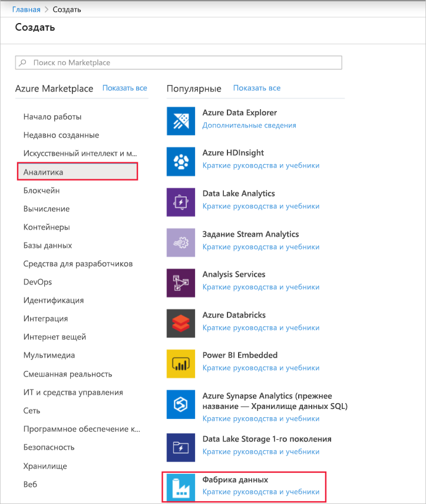
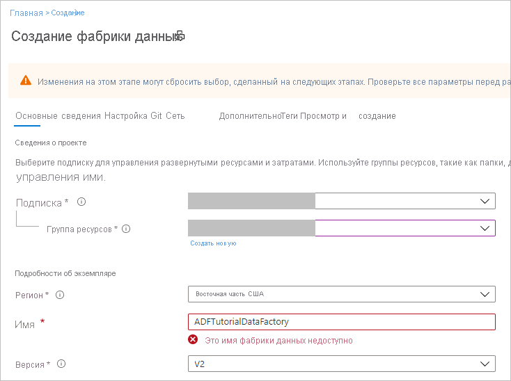
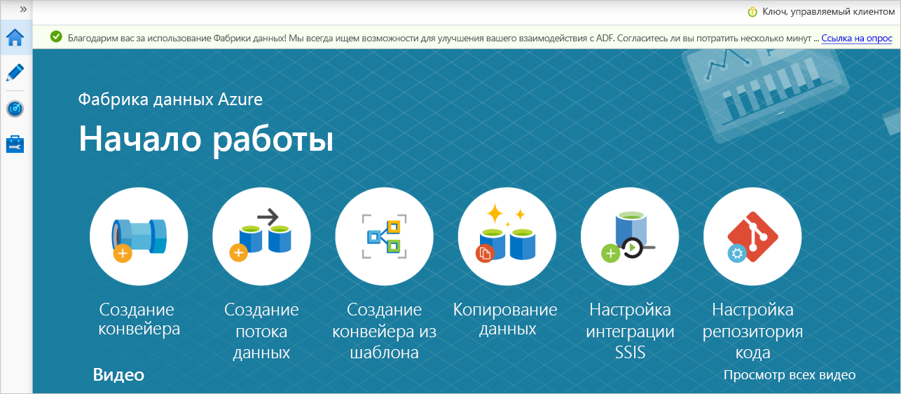

# <a name="transform-data-using-mapping-data-flows"></a>Преобразование данных с помощью сопоставления потоков данных

Если вы еще не работали с фабрикой данных Azure, ознакомьтесь со статьей [Введение в фабрику данных Azure](introduction.md).

В этом руководстве вы будете использовать пользовательский интерфейс фабрики данных Azure (UI) для создания конвейера, который копирует и преобразует данные из источника Azure Data Lake Storage (ADLS) Gen2 в приемник ADLS 2-го поколения с помощью сопоставления потока данных. Шаблон конфигурации в этом руководстве можно расширить при преобразовании данных с помощью потока данных сопоставления

Вот какие шаги выполняются в этом руководстве:

> [!div class="checklist"]
> * Создали фабрику данных.
> * Создание конвейера с действием потока данных.
> * Создание потока данных сопоставления с четырьмя преобразованиями. 
> * тестовый запуск конвейера;
> * Наблюдение за действием потока данных

## <a name="prerequisites"></a>Технические условия
* **Подписка Azure**. Если у вас еще нет подписки Azure, создайте [бесплатную учетную запись](https://azure.microsoft.com/free/) Azure, прежде чем начинать работу.
* **Учетная запись хранения Azure**. Хранилище ADLS используется в качестве хранилища данных *источника* и *приемника* . Если у вас нет учетной записи хранения, создайте ее, следуя действиям в [этом разделе](../storage/common/storage-quickstart-create-account.md).

Файл, который мы преобразовывать в этом учебнике, — Мовиесдб. csv, который можно найти [здесь](https://raw.githubusercontent.com/djpmsft/adf-ready-demo/master/moviesDB.csv). Чтобы получить файл из GitHub, скопируйте его содержимое в текстовый редактор по своему усмотрению, чтобы сохранить его локально в виде CSV-файла. Сведения о передаче файла в учетную запись хранения см. в статье [Отправка больших двоичных объектов с помощью портала Azure](../storage/blobs/storage-quickstart-blobs-portal.md). Примеры будут ссылаться на контейнер с именем Sample-Data.

## <a name="create-a-data-factory"></a>Создание фабрики данных

На этом шаге вы создадите фабрику данных и откроете интерфейс взаимодействия фабрики данных, чтобы создать конвейер в фабрике данных. 

1. Откройте **Microsoft Edge** или **Google Chrome**. В настоящее время пользовательский интерфейс фабрики данных поддерживается только в веб-браузерах Microsoft ребр и Google Chrome.
2. В меню слева выберите **Создать ресурс** > **Аналитика** > **Фабрика данных**. 
  
   

3. На странице **Новая фабрика данных** в поле **Имя** введите **ADFTutorialDataFactory**. 
 
   Имя фабрики данных Azure должно быть *глобально уникальным*. Если вы увидите следующую ошибку касательно значения имени, введите другое имя фабрики данных. (Например, используйте yournameADFTutorialDataFactory.) Дополнительные сведения о правилах именования артефактов фабрики данных см. в статье [Фабрика данных Azure — правила именования](naming-rules.md).
        
     
4. Выберите **подписку** Azure, в рамках которой вы хотите создать фабрику данных. 
5. Для **группы ресурсов** выполните одно из следующих действий:
     
    а) Выберите **Использовать существующую**и укажите существующую группу ресурсов в раскрывающемся списке.

    б) Выберите **Создать новую**и укажите имя группы ресурсов. 
         
    Сведения о группах ресурсов см. в статье [Общие сведения об Azure Resource Manager](../azure-resource-manager/resource-group-overview.md). 
6. В качестве **версии** выберите **V2**.
7. В поле **Расположение** выберите расположение фабрики данных. В раскрывающемся списке отображаются только поддерживаемые расположения. Хранилища данных (например, служба хранилища Azure и база данных SQL) и расчеты (например, Azure HDInsight), используемые фабрикой данных, могут находиться в других регионах.
8. Нажмите кнопку **Создать**. 
9. После завершения создания вы увидите уведомление в центре уведомлений. Нажмите кнопку **Перейти к ресурсу**, чтобы открыть страницу фабрики данных.
10. Выберите **Создание и мониторинг**, чтобы запустить на отдельной вкладке пользовательский интерфейс фабрики данных.

## <a name="create-a-pipeline-with-a-data-flow-activity"></a>Создание конвейера с действием потока данных

На этом шаге вы создадите конвейер, содержащий действие потока данных.

1. На странице **Начало работы** выберите **Create pipeline** (Создать конвейер). 

   

1. На вкладке **Общие** для конвейера введите **Трансформмовиес** в поле **имя** конвейера.
1. На верхней панели фабрики подвиньте ползунок **Отладка потока данных** на. Режим отладки позволяет выполнять интерактивное тестирование логики преобразования в динамическом кластере Spark. Подготовка кластеров потоков данных занимает 5-7 минут, и пользователям рекомендуется включить отладку первыми, если планируется разработка потока данных. Дополнительные сведения см. в разделе [режим отладки](concepts-data-flow-debug-mode.md).

    
1. В области **действия** разверните элемент Гармошка **Перемещение и преобразование** . Перетащите действие **поток данных** из панели на холст конвейера.

    
1. Во всплывающем окне **Добавление потока данных** выберите **создать новый поток данных** и назовите **трансформмовиес**потока данных. По завершении нажмите кнопку Готово.

    

## <a name="build-transformation-logic-in-the-data-flow-canvas"></a>Логика преобразования "сборка" на холсте потока данных

После создания потока данных он будет автоматически отправлен на холст потока данных. На этом шаге вы создадите поток данных, который принимает Мовиесдб. csv в хранилище ADLS и агрегирует среднюю оценку комедиес с 1910 до 2000. Затем вы запишете этот файл обратно в хранилище ADLS.

1. В холсте потока данных добавьте источник, щелкнув поле **Добавить источник** .

    
1. Присвойте имя исходному **мовиесдб**. Щелкните **создать** , чтобы создать новый исходный набор данных.
    
    
1. Выберите **Azure Data Lake Storage 2-го поколения**. Нажмите кнопку "Продолжить".

    
1. Выберите **DelimitedText**. Нажмите кнопку "Продолжить".

    
1. Назовите свой набор данных **мовиесдб**. В раскрывающемся списке связанная служба выберите **создать**.

    
1. На экране создания связанной службы назовите связанную службу ADLS Gen2 **ADLSGen2** и укажите метод проверки подлинности. Затем введите учетные данные подключения. В этом руководстве мы используем ключ учетной записи для подключения к нашей учетной записи хранения. Можно нажать кнопку **проверить подключение** , чтобы проверить правильность ввода учетных данных. По завершении нажмите кнопку Создать.

    
1. Когда вы вернетесь на экран создания набора данных, укажите, где находится файл, в поле **путь к файлу** . В этом руководстве файл Мовиесдб. csv находится в примере Container-Data. Так как файл содержит заголовки, установите флажок **Первая строка в качестве заголовка**. Выберите **из подключения или хранилища** , чтобы импортировать схему заголовка непосредственно из файла в хранилище. По завершении нажмите кнопку ОК.

    
1. Если кластер отладки запущен, перейдите на вкладку **Предварительный просмотр данных** преобразования источник и нажмите кнопку **Обновить** , чтобы получить моментальный снимок данных. Вы можете использовать предварительный просмотр данных, чтобы убедиться, что преобразование настроено правильно.
    
    
1. Рядом с исходным узлом на холсте потока данных щелкните значок "плюс", чтобы добавить новое преобразование. Первое добавляемое преобразование является **фильтром**.
    
    
1. Назовите преобразование фильтра **филтереарс**. Щелкните поле Выражение рядом с полем **Фильтр** , чтобы открыть построитель выражений. Здесь вы укажете условие фильтрации. 
    
    
1. Построитель выражений потока данных позволяет интерактивно создавать выражения для использования в различных преобразованиях. Выражения могут включать встроенные функции, столбцы из входной схемы и определяемые пользователем параметры. Дополнительные сведения о построении выражений см. в разделе [Построитель выражений потока данных](concepts-data-flow-expression-builder.md).
    
    В этом руководстве вы хотите отфильтровать фильмы для жанров комедия, которые поступили между годами 1910 и 2000. Поскольку в настоящее время в качестве года используется строка, ее необходимо преобразовать в целое число, используя функцию ```toInteger()```. Используйте операторы "больше или равно" (> =) и "меньше или равно" (< =) для сравнения значений литерального года 1910 и 200-. Объедините эти выражения вместе с оператором AND (& &). Выражение выйдет следующим образом:

    ```toInteger(year) >= 1910 && toInteger(year) <= 2000```

    Чтобы узнать, какие фильмы являются комедиес, можно использовать функцию ```rlike()```, чтобы найти шаблон "комедия" в столбцах жанров. Объединение выражения рлике с сравнением year для получения:

    ```toInteger(year) >= 1910 && toInteger(year) <= 2000 && rlike(genres, 'Comedy')```

    Если кластер отладки активен, можно проверить логику, нажав кнопку **Обновить** , чтобы увидеть результат выражения по сравнению с используемыми входными данными. Существует более одного правого ответа на то, как можно реализовать эту логику с помощью языка выражений потока данных.
    
    

    После завершения работы с выражением нажмите кнопку **сохранить и завершить** .

1. Получите **Предварительный просмотр данных** , чтобы убедиться, что фильтр работает правильно.
    
    
1. Следующее преобразование, которое вы добавите, является преобразованием « **Статистическая обработка** » в **модификаторе схемы**.
    
    
1. Назовите **аггрегатекомедиратингс**преобразования «Статистическая обработка». На вкладке **Группировать по** выберите **год** из раскрывающегося списка, чтобы сгруппировать агрегаты по году, в котором был получен фильм.
    
    
1. Перейдите на вкладку **статистические выражения** . В левом текстовом поле Назовите столбец Aggregate **аверажекомедиратинг**. Щелкните правой кнопкой мыши поле выражения, чтобы ввести статистическое выражение с помощью построителя выражений.
    
    
1. Чтобы получить среднее значение **рейтинга**столбца, используйте агрегатную функцию ```avg()```. Так как **Оценка** является строкой, а ```avg()``` принимает числовые входные данные, необходимо преобразовать значение в число с помощью функции ```toInteger()```. Это выражение выглядит следующим образом:

    ```avg(toInteger(Rating))```
    
    По завершении нажмите кнопку **сохранить и завершить** . 

    
1. Перейдите на вкладку **Предварительный просмотр данных** , чтобы просмотреть выходные данные преобразования. Обратите внимание, что здесь есть только два столбца: **year** и **аверажекомедиратинг**.
    
    
1. Затем необходимо добавить преобразование « **приемник** » в **место назначения**.
    
    
1. Присвойте имя **приемнику**приемника. Нажмите кнопку **создать** , чтобы создать набор данных приемника.
    
    
1. Выберите **Azure Data Lake Storage 2-го поколения**. Нажмите кнопку "Продолжить".

    
1. Выберите **DelimitedText**. Нажмите кнопку "Продолжить".

    
1. Назовите свой набор данных приемника **мовиессинк**. В поле связанная служба выберите связанную службу ADLS Gen2, созданную на шаге 6. Введите выходную папку для записи данных. В этом руководстве мы выполним запись в папку "Output" в контейнере "Sample-Data". Папка не должна существовать заранее и может быть создана динамически. Задайте для параметра **Первая строка в качестве заголовка** значение true и выберите значение **нет** для параметра **схема импорта**. Нажмите кнопку Готово.
    
    

Теперь вы завершили сборку потока данных. Все готово для запуска в конвейере.

## <a name="running-and-monitoring-the-data-flow"></a>Выполнение и мониторинг потока данных

Вы можете выполнить отладку конвейера перед его публикацией. На этом шаге будет активирован запуск отладки конвейера потока данных. В то время как предварительный просмотр данных не записывает данные, отладочный запуск будет записывать данные в место назначения приемника.

1. Перейдите на холст конвейера. Нажмите кнопку **Отладка** , чтобы запустить отладку.
    
    
1. При отладке конвейера для действий потока данных используется активный кластер отладки, но инициализация по-прежнему займет не менее минуты. Ход выполнения можно отслеживать с помощью вкладки **вывод** . После успешного выполнения щелкните значок очков, чтобы открыть панель "Мониторинг".
    
    
1. На панели "Мониторинг" можно увидеть количество строк и время, потраченное на каждый шаг преобразования.
    
    
1. Щелкните преобразование, чтобы получить подробные сведения о столбцах и секционировании данных.
    
    

Если вы выполнили это руководство правильно, в папку приемника должны быть записаны 83 строк и 2 столбца. Проверить правильность данных можно, проверив хранилище BLOB-объектов.

## <a name="next-steps"></a>Дальнейшие действия

Конвейер в этом руководстве выполняет поток данных, который суммирует среднюю оценку комедиес с 1910 до 2000 и записывает данные в ADLS. Вы научились выполнять следующие задачи:

> [!div class="checklist"]
> * Создали фабрику данных.
> * Создание конвейера с действием потока данных.
> * Создание потока данных сопоставления с четырьмя преобразованиями. 
> * тестовый запуск конвейера;
> * Наблюдение за действием потока данных

Дополнительные сведения о [языке выражений потока данных](data-flow-expression-functions.md).