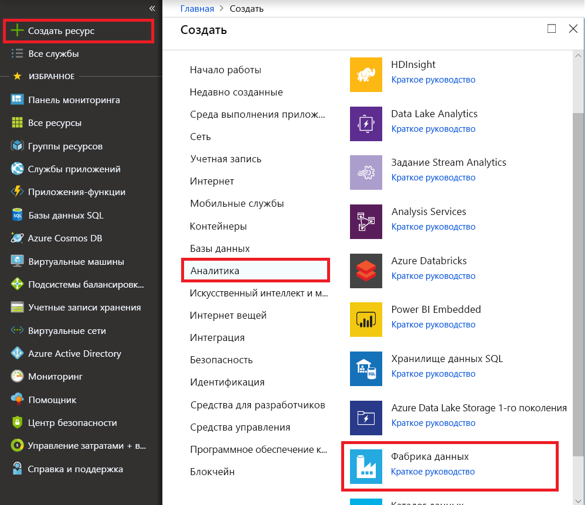

# Добавочное копирование новых и измененных файлов, основанный на Дата последнего изменения с помощью средства копирования данных

В этом руководстве вы используете портал Azure для создания фабрики данных. Затем используем средства копирования данных для создания конвейера добавочного копирования только новые и измененные файлы на основе их **LastModifiedDate** из хранилища BLOB-объектов Azure в хранилище BLOB-объектов Azure.

Таким образом, ADF будет проверять все файлы из исходного хранилища, применить фильтр по их Дата последнего изменения файла и скопируйте новых и обновленных файлов только с момента последнего в целевое хранилище.  Обратите внимание на то, что если позволить ADF сканирования огромные объемы файлы, но только Копировать несколько файлов в место назначения, будет по-прежнему ожидается, что длительные из-за сканирование файлов занимает много времени, а также.   

> [!NOTE]
> Если вы еще не работали с фабрикой данных Azure, ознакомьтесь со статьей [Введение в фабрику данных Azure](introduction.md).

В этом руководстве выполняются следующие задачи:

> [!div class="checklist"]
> * Создали фабрику данных.
> * Создание конвейера с помощью средства копирования данных.
> * Мониторинг конвейера и выполнения действий.

## Технические условия

* **Подписка Azure.** Если у вас еще нет подписки Azure, [создайте бесплатную учетную запись Azure](https://azure.microsoft.com/free/) , прежде чем начинать работу.
* **Учетная запись хранения Azure.** Использование хранилища BLOB-объектов как _источника_ и _приемника_ хранилища данных. Если у вас нет учетной записи хранения Azure, см. инструкции по [ее созданию](../storage/common/storage-quickstart-create-account.md).

### Создание двух контейнеров в хранилище BLOB-объектов

Подготовьте хранилище больших двоичных объектов для работы с руководством, выполнив следующие действия.

1. Создайте контейнер с именем **источника**. Можно использовать различные инструменты для выполнения этой задачи, такие как [обозреватель службы хранилища Azure](https://storageexplorer.com/).

2. Создайте контейнер с именем **назначения**. 

## Создание фабрики данных

1. В меню слева выберите **Создать ресурс** > **Данные и аналитика** > **Фабрика данных**. 
   
   

2. На странице **Новая фабрика данных** в поле **Имя** введите **ADFTutorialDataFactory**. 
      
     
 
   Имя фабрики данных должно быть _глобально уникальным_. Вы можете получить следующее сообщение об ошибке.
   
   

   Если вы увидите следующую ошибку касательно значения имени, введите другое имя фабрики данных. Например, _**ваше_имя**_**ADFTutorialDataFactory**. Правила именования артефактов службы "Фабрика данных" см. в [этой](naming-rules.md) статье.
3. Выберите Azure **подписки** в которой создается новая фабрика данных. 
4. Для **группы ресурсов** выполните одно из следующих действий:
     
    * Выберите **Использовать существующий** и выберите существующую группу ресурсов из раскрывающегося списка.

    * Выберите **Создать** и введите имя группы ресурсов. 
         
    Сведения о группах ресурсов см. в статье [Общие сведения об Azure Resource Manager](../azure-resource-manager/resource-group-overview.md).

5. В разделе **версии**выберите **V2**.
6. В качестве **расположения** выберите расположение фабрики данных. В раскрывающемся списке отображаются только поддерживаемые расположения. Хранилища данных (например, служба хранилища Azure и базы данных SQL) и вычислительные ресурсы (например, Azure HDInsight), используемые фабрикой данных можно в других регионах или расположениях.
7. Кроме того, установите флажок **Закрепить на панели мониторинга**. 
8. Нажмите кнопку **Создать**.
9. На панели мониторинга см. **развертывание фабрики данных** плитку, чтобы просмотреть состояние процесса.

    
10. Когда создание завершится, откроется домашняя страница **Фабрика данных**.
   
    
11. Чтобы открыть пользовательский интерфейс фабрики данных Azure (UI) на отдельной вкладке, выберите **Создание и мониторинг** плитку. 

## Создание конвейера с помощью средства копирования данных

1. На **приступим к работе** выберите **копирования данных** заголовок, чтобы открыть инструмент копирования данных. 

   
   
2. На **свойства** странице, выполните следующие действия:

    a. В разделе **имя задачи**, введите **DeltaCopyFromBlobPipeline**.

    2. В разделе **периодичность задачи** или **расписании задач**выберите **регулярно запускаться по расписанию**.

    c. В разделе **тип триггера**выберите **"переворачивающегося" окна**.
    
    d. В разделе **повторения**, введите **15 мин**. 
    
    д. Щелкните **Далее**. 
    
    Пользовательский интерфейс фабрики данных создаст конвейер с указанным именем задачи. 

    
    
3. На странице **Исходное хранилище данных** сделайте следующее:

    a. Выберите **+ создать новое соединение**, чтобы добавить подключение.
    
    

    2. Выберите **хранилище BLOB-объектов** из коллекции, а затем выберите **Продолжить**.
    
    

    c. На **новая связанная служба** выберите учетную запись хранения из **имя учетной записи хранения** перечисления и выбора **Готово**.
    
    
    
    d. Выберите только что созданную связанную службу, а затем выберите **Далее**. 
    
   

4. На странице **Choose the input file or folder** (Выбор входного файла или папки) выполните следующие действия:
    
    a. Найдите и выберите **источника** папку, а затем выберите **Выбор**.
    
    
    
    2. В разделе **поведения при загрузке файла**выберите **добавочную загрузку: Дата последнего изменения**.
    
    
    
    c. Проверьте **двоичное копирование** и выберите **Далее**.
    
     
     
5. На **целевое хранилище данных** выберите **AzureBlobStorage**. Это той же учетной записи хранения источника данных. Затем нажмите кнопку **Далее**.

    
    
6. На странице **Choose the output file or folder** (Выбор целевого файла или папки) выполните следующие действия:
    
    a. Найдите и выберите **назначения** папку, а затем выберите **Выбор**.
    
    
    
    2. Щелкните **Далее**.
    
     
    
7. На странице **Параметры** выберите **Далее**. 

    
    
8. На **Сводка** странице просмотрите параметры и нажмите кнопку **Далее**.

    
    
9. На **странице развертывания** выберите **Мониторинг**, чтобы отслеживать созданный конвейер (задачу).

    
    
10. Обратите внимание, что слева автоматически выбирается вкладка **Мониторинг**. В столбце **действий** отображаются ссылки для просмотра сведений о запусках действий и (или) повторного выполнения на конвейере. Выберите **обновить** обновите список и выберите **Просмотр выполнений действий** ссылку в **действия** столбца. 

    

11. Есть только одно действие (действие копирования) в конвейере, поэтому вы увидите только одну запись. Чтобы увидеть сведения об операции копирования, щелкните ссылку **Сведения** (значок очков) в столбце **Действия**. 

    
    
    Так как файл отсутствует в **источника** контейнер в вашей учетной записи хранения BLOB-объектов, вы не увидите любой файл, скопировать **назначения** контейнер в вашей учетной записи хранения BLOB-объектов.
    
    
    
12. Создайте пустой текстовый файл и назовите его **file1.txt**. Отправьте этот текстовый файл **источника** контейнер в вашей учетной записи хранения. Это можно сделать при помощи таких средств, как [обозреватель службы хранилища Azure](https://storageexplorer.com/).   

    
    
13. Чтобы вернуться к **запусков конвейера** представление, выберите **все запуски конвейера**и дождитесь одном конвейере активироваться автоматически.  

    

14. Выберите **просмотрите сведения о выполнении действия** для второго конвейера, выполнять, когда вы видите его. Затем просмотрите сведения в так же, как и для первого выполнения конвейера.  

    

    Будут, см. один файл (file1.txt) будет скопирован из **источника** контейнера для **назначения** контейнер учетной записи хранения BLOB-объектов.
    
    
    
15. Создайте еще один пустой текстовый файл и назовите его **file2.txt**. Отправьте этот текстовый файл **источника** контейнер в вашей учетной записи хранения BLOB-объектов.   
    
16. Повторите шаги 13 и 14 для этой второй текстовый файл. Вы увидите, что только новый файл (file2.txt) был скопирован из **источника** контейнера для **назначения** контейнер учетной записи хранения запуска следующего конвейера.  
    
    

    Это также можно проверить с помощью [обозреватель службы хранилища Azure](https://storageexplorer.com/) для проверки файлов.
    
    

    
## Дальнейшие действия
Перейдите к следующему руководству, чтобы узнать о преобразовании данных с помощью кластера Apache Spark в Azure:

> [!div class="nextstepaction"]
>[Преобразование данных в облаке с помощью кластера Apache Spark](tutorial-transform-data-spark-portal.md)