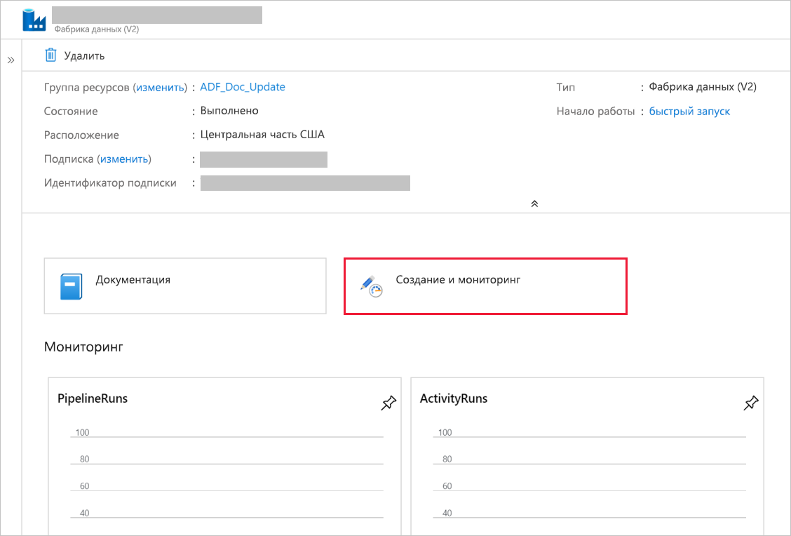

# <a name="incrementally-load-data-from-multiple-tables-in-sql-server-to-an-azure-sql-database"></a>Добавочная загрузка данных из нескольких таблиц в SQL Server в базу данных SQL Azure
В этом руководстве вы создадите фабрику данных Azure с конвейером, который загружает разностные данные из нескольких таблиц локальной базы данных SQL Server в базу данных SQL Azure.    

В этом руководстве вы выполните следующие шаги:

> [!div class="checklist"]
> * подготовите исходное и конечное хранилища данных;
> * Создали фабрику данных.
> * Создайте локальную среду выполнения интеграции.
> * Установка среды выполнения интеграции. 
> * Создали связанные службы. 
> * Создали наборы данных источника, приемника и предела.
> * создадите и запустите конвейер, а также начнете его мониторинг;
> * Просмотрите результаты.
> * Добавление или обновление данных в исходных таблицах.
> * Повторный запуск конвейера и выполнение его мониторинга.
> * Просмотр окончательных результатов.

## <a name="overview"></a>Обзор
Ниже приведены важные действия для создания этого решения. 

1. **Выберите столбец для предела.**
    
    Выберите один столбец из каждой таблицы в исходном хранилище данных, который можно использовать для идентификации новых или обновленных записей при каждом запуске. Как правило, данные в этом выбранном столбце (например, последнее_время_изменения или идентификатор) продолжают увеличиваться по мере создания или обновления строк. В качестве предела используется максимальное значение в этом столбце.

1. **Подготовьте хранилище данных для хранения значений предела.**   
    
    В этом руководстве вы сохраните значение предела в базе данных SQL.

1. **Создайте конвейер, следуя инструкциям ниже**. 
    
    a. Создайте действие ForEach, которое выполняет итерацию по списку имен исходной таблицы. Этот список передается в конвейер в качестве параметра. В каждой исходной таблице этот параметр вызывает следующие действия для загрузки разностных данных для этой таблицы.

    b. Создайте два действия поиска. Используйте первое действие поиска для получения последнего значения предела, а второе для получения нового значения предела. Эти значения передаются в действие копирования.

    c. Создайте действие копирования, копирующее строки из исходного хранилища данных со значениями столбцов предела, которые выше значений старого предела и меньше значений нового. Затем оно копирует разностные данные из исходного хранилища данных в хранилище BLOB-объектов Azure в качестве нового файла.

    d. Создайте действие хранимой процедуры, которое обновляет значение предела для конвейера при последующем выполнении. 

    Ниже приведена общая схема решения. 

    


Если у вас еще нет подписки Azure, создайте [бесплатную](https://azure.microsoft.com/free/) учетную запись Azure, прежде чем начинать работу.

## <a name="prerequisites"></a>Предварительные требования
* **SQL Server.** В этом руководстве используйте локальную базу данных SQL Server в качестве исходного хранилища данных. 
* **База данных SQL Azure**. Базу данных SQL используйте в качестве принимающего хранилища данных. Если у вас нет базы данных SQL, создайте ее, следуя указаниям в статье [Создание базы данных SQL Azure на портале Azure](../sql-database/sql-database-get-started-portal.md). 

### <a name="create-source-tables-in-your-sql-server-database"></a>Создание исходных таблиц в базе данных SQL Server

1. Откройте SQL Server Management Studio и подключитесь к локальной базе данных SQL Server.

1. В **обозревателе сервера** щелкните правой кнопкой мыши базу данных и выберите **Создать запрос**.

1. Выполните следующую команду SQL в базе данных, чтобы создать таблицы с именами `customer_table` и `project_table`.

    ```sql
    create table customer_table
    (
        PersonID int,
        Name varchar(255),
        LastModifytime datetime
    );
    
    create table project_table
    (
        Project varchar(255),
        Creationtime datetime
    );
        
    INSERT INTO customer_table
    (PersonID, Name, LastModifytime)
    VALUES
    (1, 'John','9/1/2017 12:56:00 AM'),
    (2, 'Mike','9/2/2017 5:23:00 AM'),
    (3, 'Alice','9/3/2017 2:36:00 AM'),
    (4, 'Andy','9/4/2017 3:21:00 AM'),
    (5, 'Anny','9/5/2017 8:06:00 AM');
    
    INSERT INTO project_table
    (Project, Creationtime)
    VALUES
    ('project1','1/1/2015 0:00:00 AM'),
    ('project2','2/2/2016 1:23:00 AM'),
    ('project3','3/4/2017 5:16:00 AM');
    
    ```

### <a name="create-destination-tables-in-your-azure-sql-database"></a>Создание целевых таблиц в базе данных SQL Azure
1. Откройте SQL Server Management Studio и подключитесь к базе данных SQL Azure.

1. В **обозревателе сервера** щелкните правой кнопкой мыши базу данных и выберите **Создать запрос**.

1. Выполните следующую команду SQL в базе данных SQL Azure, чтобы создать таблицы с именами `customer_table` и `project_table`.  
    
    ```sql
    create table customer_table
    (
        PersonID int,
        Name varchar(255),
        LastModifytime datetime
    );
    
    create table project_table
    (
        Project varchar(255),
        Creationtime datetime
    );

    ```

### <a name="create-another-table-in-the-azure-sql-database-to-store-the-high-watermark-value"></a>Создание дополнительной таблицы в базе данных SQL Azure для хранения значения верхнего предела
1. Выполните указанную ниже команду SQL для базы данных SQL Azure, чтобы создать таблицу с именем `watermarktable` для хранения значения предела. 
    
    ```sql
    create table watermarktable
    (
    
        TableName varchar(255),
        WatermarkValue datetime,
    );
    ```
1. Вставьте исходные значения предела для обеих исходных таблиц в таблицу значений предела.

    ```sql

    INSERT INTO watermarktable
    VALUES 
    ('customer_table','1/1/2010 12:00:00 AM'),
    ('project_table','1/1/2010 12:00:00 AM');
    
    ```

### <a name="create-a-stored-procedure-in-the-azure-sql-database"></a>Создание хранимой процедуры в базе данных SQL Azure 

Выполните указанную ниже команду, чтобы создать хранимую процедуру в базе данных SQL Azure. Эта хранимая процедура обновляет значение предела после каждого запуска конвейера. 

```sql
CREATE PROCEDURE usp_write_watermark @LastModifiedtime datetime, @TableName varchar(50)
AS

BEGIN

    UPDATE watermarktable
    SET [WatermarkValue] = @LastModifiedtime 
WHERE [TableName] = @TableName

END

```

### <a name="create-data-types-and-additional-stored-procedures-in-azure-sql-database"></a>Создание типов данных и дополнительных хранимых процедур в базе данных Azure SQL
Выполните следующий запрос для создания двух хранимых процедур и двух типов данных в базе данных Azure SQL. Они используются для объединения данных из исходных в целевые таблицы.

Чтобы упростить начало работы, мы непосредственно используем эти хранимые процедуры, передающие разностные данные в табличной переменной, а затем объединяем их в целевое хранилище. Учтите, что для хранения в табличной переменной не ожидается большое число строк разностных данных (более 100).  

Если нужно объединить большое количество строк разностных данных в целевом хранилище, мы рекомендуем с помощью действия копирования сначала скопировать разностные данные во временную "промежуточную" таблицу в целевом хранилище, а затем создать собственную хранимую процедуру, не используя табличную переменную для их объединения из "промежуточной" таблицы в "итоговую". 


```sql
CREATE TYPE DataTypeforCustomerTable AS TABLE(
    PersonID int,
    Name varchar(255),
    LastModifytime datetime
);

GO

CREATE PROCEDURE usp_upsert_customer_table @customer_table DataTypeforCustomerTable READONLY
AS

BEGIN
  MERGE customer_table AS target
  USING @customer_table AS source
  ON (target.PersonID = source.PersonID)
  WHEN MATCHED THEN
      UPDATE SET Name = source.Name,LastModifytime = source.LastModifytime
  WHEN NOT MATCHED THEN
      INSERT (PersonID, Name, LastModifytime)
      VALUES (source.PersonID, source.Name, source.LastModifytime);
END

GO

CREATE TYPE DataTypeforProjectTable AS TABLE(
    Project varchar(255),
    Creationtime datetime
);

GO

CREATE PROCEDURE usp_upsert_project_table @project_table DataTypeforProjectTable READONLY
AS

BEGIN
  MERGE project_table AS target
  USING @project_table AS source
  ON (target.Project = source.Project)
  WHEN MATCHED THEN
      UPDATE SET Creationtime = source.Creationtime
  WHEN NOT MATCHED THEN
      INSERT (Project, Creationtime)
      VALUES (source.Project, source.Creationtime);
END

```

## <a name="create-a-data-factory"></a>Создание фабрики данных

1. Запустите веб-браузер **Microsoft Edge** или **Google Chrome**. Сейчас только эти браузеры поддерживают пользовательский интерфейс фабрики данных.
2. В меню слева выберите **Создать ресурс** > **Аналитика** > **Фабрика данных**. 
   
   

3. На странице **Новая фабрика данных** введите **ADFMultiIncCopyTutorialDF** в поле **Имя**. 
 
   Имя фабрики данных Azure должно быть **глобально уникальным**. Если вы увидите красный восклицательный знак с указанным ниже текстом ошибки, введите другое имя фабрики данных (например, ваше_имя_ADFIncCopyTutorialDF) и попробуйте создать фабрику данных снова. Ознакомьтесь со статьей [Фабрика данных Azure — правила именования](naming-rules.md), чтобы узнать правила именования для артефактов службы "Фабрика данных".
  
   `Data factory name "ADFIncCopyTutorialDF" is not available`

4. Выберите **подписку** Azure, в рамках которой вы хотите создать фабрику данных. 
5. Для **группы ресурсов** выполните одно из следующих действий.
     
    - Выберите **Использовать существующую**и укажите существующую группу ресурсов в раскрывающемся списке. 
    - Выберите **Создать новую**и укажите имя группы ресурсов.   
    Сведения о группах ресурсов см. в статье, где описывается [использование групп ресурсов для управления ресурсами Azure](../azure-resource-manager/resource-group-overview.md).  
6. Укажите **V2** при выборе **версии**.
7. Укажите **расположение** фабрики данных. В раскрывающемся списке отображаются только поддерживаемые расположения. Хранилища данных (служба хранилища Azure, база данных SQL Azure и т. д.) и вычисления (HDInsight и т. д.), используемые фабрикой данных, могут располагаться в других регионах.
8. Нажмите кнопку **Создать**.      
9. Когда завершится создание, откроется страница **Фабрика данных**, как показано на рисунке ниже.
   
   
10. Щелкните плитку **Создание и мониторинг**, чтобы открыть на отдельной вкладке пользовательский интерфейс фабрики данных Azure.

## <a name="create-self-hosted-integration-runtime"></a>Создание и настройка локальной среды выполнения интеграции
При перемещении данных из хранилища данных в частной сети (локальной) в хранилище данных Azure установите в своей локальной среде локальную среду выполнения интеграции (IR). В локальной среде выполнения интеграции данные перемещаются между частной сетью и Azure. 

1. Щелкните вкладку **Подключения** в нижней части левой панели, а затем переключитесь на вкладку **Integration Runtimes** (Среды выполнения интеграции) в окне **подключений**. 

1. На вкладке **Integration Runtimes** (Среды выполнения интеграции) щелкните **+ Создать**. 

1. В окне **Integration Runtime Setup** (Настройка среды выполнения интеграции) выберите вариант **Perform data movement and dispatch activities to external computes** (Выполнить перемещение данных и передать действия на внешние вычислительные ресурсы), затем нажмите кнопку **Продолжить**. 

1. Выберите параметр **Независимый** и щелкните **Продолжить**. 
1. Введите **MySelfHostedIR** для параметра **Имя** и щелкните **Создать**. 

1. Щелкните элемент **Click here to launch the express setup for this computer** (Щелкните здесь, чтобы запустить экспресс-установку для этого компьютера) в разделе **Option 1: Express setup** (Вариант 1. Экспресс-установка). 

   
1. В окне **Экспресс-установка Integration Runtime (Self-hosted)** щелкните **Закрыть**. 

   
1. В окне веб-браузера **Integration Runtime Setup** (Настройка среды выполнения интеграции) нажмите кнопку **Готово**. 

 
1. Проверьте, чтобы в списке сред выполнения интеграции использовалась среда **MySelfHostedIR**.

## <a name="create-linked-services"></a>Создание связанных служб
Связанная служба в фабрике данных связывает хранилища данных и службы вычислений с фабрикой данных. В этом разделе вы создадите связанные службы локальной базы данных SQL Server и базы данных SQL Azure. 

### <a name="create-the-sql-server-linked-service"></a>Создание связанной службы SQL Server
На этом шаге вы свяжете локальную базу данных SQL Server с фабрикой данных.

1. В окне **подключений** перейдите из вкладки **сред выполнения интеграции** на вкладку **Связанные службы**, а затем щелкните **+ Создать**.

1. В окне **New Linked Service** (Новая связанная служба) выберите **SQL Server**, а затем нажмите кнопку **Продолжить**. 

1. В окне **New Linked Service** (Новая связанная служба) выполните следующие действия:

    1. Введите **SqlServerLinkedService** в поле **Имя**. 
    1. Выберите **MySelfHostedIR** для параметра **Connect via integration runtime** (Подключиться через среду выполнения интеграции). Это **важный** шаг. Среда выполнения интеграции по умолчанию не может подключиться к локальному хранилищу данных. Используйте ранее созданную локальную среду выполнения интеграции. 
    1. В поле **Имя сервера** введите имя компьютера, на котором размещена база данных SQL Server.
    1. В поле **Имя базы данных** введите имя базы данных на сервере SQL Server, где содержатся исходные данные. Для работы с этим руководством вы ранее создали таблицу и вставили данные в эту базу данных. 
    1. В поле **Тип проверки подлинности** выберите **соответствующий тип**, который будет использоваться для подключения к базе данных. 
    1. В поле **Имя пользователя** введите имя пользователя, у которого есть доступ к базе данных SQL Server. Если в имени учетной записи пользователя или имени сервера необходимо использовать символ косой черты (`\`), добавьте escape-символ (`\`). Например, `mydomain\\myuser`.
    1. В поле **Пароль** введите **пароль** для этого пользователя. 
    1. Чтобы проверить, может ли фабрика данных подключиться к базе данных SQL Server, нажмите кнопку **Проверить соединение**. Устраните все ошибки для успешного подключения. 
    1. Чтобы сохранить связанную службу, щелкните **Готово**.

### <a name="create-the-azure-sql-database-linked-service"></a>Создание связанной службы Базы данных SQL Azure
На последнем шаге вы создадите связанную службу, которая свяжет исходную базу данных SQL Server с фабрикой данных. На этом шаге вы свяжете базу данных-приемник или целевую базу данных SQL Azure с фабрикой данных. 

1. В окне **подключений** перейдите из вкладки **сред выполнения интеграции** на вкладку **Связанные службы**, а затем щелкните **+ Создать**.
1. В окне **New Linked Service** (Новая связанная служба) выберите **Azure SQL Database** (База данных SQL Microsoft Azure) и щелкните **Continue** (Продолжить). 
1. В окне **New Linked Service** (Новая связанная служба) выполните следующие действия:

    1. Введите **AzureSqlDatabaseLinkedService** в поле **Имя**. 
    1. Для поля **Имя сервера** выберите в раскрывающемся списке имя сервера SQL Azure. 
    1. Для поля **Имя базы данных** выберите базу данных SQL Azure, в которой в рамках этого руководства были созданы таблицы customer_table и project_table. 
    1. В поле **Имя пользователя** введите имя пользователя, у которого есть доступ к базе данных SQL Azure. 
    1. В поле **Пароль** введите **пароль** для этого пользователя. 
    1. Чтобы проверить, может ли фабрика данных подключиться к базе данных SQL Server, нажмите кнопку **Проверить соединение**. Устраните все ошибки для успешного подключения. 
    1. Чтобы сохранить связанную службу, щелкните **Готово**.

1. Вы должны увидеть в списке две связанные службы. 
   
     

## <a name="create-datasets"></a>Создание наборов данных
На этом шаге вы создадите наборы данных для представления источника данных, назначение данных и место для хранения предела.

### <a name="create-a-source-dataset"></a>Создание исходного набора данных

1. На левой панели нажмите кнопку **+ (плюс)** и выберите элемент **Набор данных**.

1. В окне **Новый набор данных** выберите **SQL Server**, а затем нажмите кнопку **Продолжить**. 

1. Для настройки набора данных в веб-браузере откроется новая вкладка. Кроме того, этот набор данных появится в представлении в виде дерева. На вкладке **Общие** окна свойств ниже введите **SourceDataset** в поле **Имя**. 

1. Щелкните вкладку **Подключение** в окне "Свойства", а затем выберите **SqlServerLinkedService** для **связанной службы**. Поле таблицы ниже оставьте пустым. Действие копирования в конвейере использует SQL-запрос для загрузки данных, вместо того чтобы загружать всю таблицу.

   


### <a name="create-a-sink-dataset"></a>Создание набора данных приемника
1. На левой панели нажмите кнопку **+ (плюс)** и выберите элемент **Набор данных**.

1. В окне **Новый набор данных** выберите **База данных SQL Microsoft Azure** и щелкните **Продолжить**. 

1. Для настройки набора данных в веб-браузере откроется новая вкладка. Кроме того, этот набор данных появится в представлении в виде дерева. На вкладке **Общие** окна свойств ниже введите **SinkDataset** (Набор данных приемника) в поле **Имя**.

1. Щелкните вкладку **Параметры** в окне "Свойства" и выполните следующее: 

    1. Нажмите кнопку **+ Создать** в разделе **создания и обновления параметров**. 
    1. Введите **SinkTableName** в поле **Имя**, а для параметра **Тип** выберите значение **Строка**. В этом наборе данных **имя целевой таблицы** используется как параметр. Параметр SinkTableName динамически задается конвейером в среде выполнения. Действие ForEach в конвейере выполняет итерацию по списку имен таблиц и передает имя таблицы для этого набора данных в каждой итерации.
   
    
1. Щелкните вкладку **Подключение** в окне "Свойства", а затем выберите **AzureSqlDatabaseLinkedService** в списке **Связанная служба**. Для свойства **таблицы** щелкните **Добавить динамическое содержимое**.   
    
1. В окне **Добавить динамическое содержимое** в разделе **Параметры** выберите **SinkTableName**. 
 
1. Нажав кнопку **Готово**, вы увидите @dataset().SinkTableName в качестве имени таблицы.

   

### <a name="create-a-dataset-for-a-watermark"></a>Создание набора данных для предела
На этом шаге вы создадите набор данных для хранения значения верхнего предела. 

1. На левой панели нажмите кнопку **+ (плюс)** и выберите элемент **Набор данных**.

1. В окне **Новый набор данных** выберите **База данных SQL Microsoft Azure** и щелкните **Продолжить**. 

1. На вкладке **Общие** окна свойств ниже введите **WatermarkDataset** в поле **Имя**.
1. Перейдите на вкладку **Подключения** и выполните следующие действия: 

    1. Выберите **AzureSqlDatabaseLinkedService** в списке **Связанная служба**.
    1. Выберите **[dbo].[watermarktable]** в списке **Таблица**.

    

## <a name="create-a-pipeline"></a>Создание конвейера
Этот конвейер принимает список имен таблиц в качестве параметра. Действие ForEach выполняет итерацию по списку имен таблиц, а затем выполняет следующие операции. 

1. Использует действие поиска, чтобы получить старое значение предела (начальное значение или значение, используемое в последней итерации).

1. Использует действие поиска, чтобы получить новое значение предела (максимальное значение в столбце предела в исходной таблице).

1. Использует действие копирования, чтобы скопировать данные между двумя значениями пределов из исходной в целевую базу данных.

1. Использует действие хранимой процедуры, чтобы обновить старое значение предела для использования на первом шаге следующей итерации. 

### <a name="create-the-pipeline"></a>Создание конвейера

1. На левой панели нажмите кнопку **+ (плюс)** и выберите пункт **Конвейер**.

1. На вкладке **Общие** введите значение **IncrementalCopyPipeline** в поле **Имя**. 

1. На вкладке **Параметры** сделайте следующее: 

    1. Щелкните **+ Создать**. 
    1. Введите **tableList** в качестве **имени** параметра. 
    1. Для параметра **типа** выберите значение **Массив**.

1. На панели **Действия** разверните элемент **Итерация и условия**, а затем перетащите действие **ForEach** в область конструктора конвейера. На вкладке **Общие** окна **Свойства** введите значение **IterateSQLTables**. 

1. Перейдите на вкладку **Параметры** и введите `@pipeline().parameters.tableList` в качестве значения для параметра **Элементы**. Действие ForEach выполняет итерацию по списку таблиц, а затем выполняет операцию добавочного копирования. 

    

1. Выберите в конвейере действие **ForEach**. Нажмите кнопку **редактирования (значок карандаша)** .

1. На панели **Действия** разверните элемент **Общие**, перетащите действие **Поиск** в область конструктора конвейера, а затем укажите **LookupOldWaterMarkActivity** в качестве **имени**.

1. Перейдите на вкладку **Настройки** в окне **Свойства** и сделайте следующее: 

    1. Выберите **WatermarkDataset** в поле **Source Dataset** (Исходный набор данных).
    1. Выберите **Запрос** в списке **Use Query** (Пользовательский запрос). 
    1. Введите следующий запрос SQL в поле **Запрос**. 

        ```sql
        select * from watermarktable where TableName  =  '@{item().TABLE_NAME}'
        ```

        
1. Перетащите действие **Поиск** с панели элементов **Действия** и введите **LookupNewWaterMarkActivity** в поле **Имя**.
        
1. Переключитесь на вкладку **Параметры** .

    1. Выберите **SourceDataset** в поле **Source Dataset** (Исходный набор данных). 
    1. Выберите **Запрос** в списке **Use Query** (Пользовательский запрос).
    1. Введите следующий запрос SQL в поле **Запрос**.

        ```sql    
        select MAX(@{item().WaterMark_Column}) as NewWatermarkvalue from @{item().TABLE_NAME}
        ```
    
        
1. Перетащите действие **Копирование** с панели элементов **Действия** и введите **IncrementalCopyActivity** в поле **Имя**. 

1. Поочередно подключите действия **поиска** к действию **копирования**. Для этого нужно перетащить **зеленые** квадраты возле полей с действиями **поиска** к действию **копирования**. Когда цвет границы для действия копирования изменится на **синий**, отпустите кнопку мыши.

    
1. Выберите действие **копирования** в конвейере. Перейдите на вкладку **Источник** в окне **Свойства**. 

    1. Выберите **SourceDataset** в поле **Source Dataset** (Исходный набор данных). 
    1. Выберите **Запрос** в списке **Use Query** (Пользовательский запрос). 
    1. Введите следующий запрос SQL в поле **Запрос**.

        ```sql
        select * from @{item().TABLE_NAME} where @{item().WaterMark_Column} > '@{activity('LookupOldWaterMarkActivity').output.firstRow.WatermarkValue}' and @{item().WaterMark_Column} <= '@{activity('LookupNewWaterMarkActivity').output.firstRow.NewWatermarkvalue}'        
        ```

        
1. Перейдите на вкладку **Приемник** и выберите **SinkDataset** в поле **Sink Dataset** (Целевой набор данных). 
        
1. Сделайте следующее:

    1. В области **Свойства набора данных** для параметра **SinkTableName** введите `@{item().TABLE_NAME}`.
    1. В поле свойства **Stored Procedure Name** (Имя хранимой процедуры) введите `@{item().StoredProcedureNameForMergeOperation}`.
    1. В поле свойства **Тип таблицы** введите `@{item().TableType}`.
    1. Для параметра **Table type parameter name** (Имя параметра типа таблицы) введите `@{item().TABLE_NAME}`.

    
1. Перетащите действие **Хранимая процедура** с панели элементов **Действия** в область конструктора конвейера. Подключите действие **копирования** к действию **Хранимая процедура**. 

1. Выберите в конвейере действие **Хранимая процедура** и введите **StoredProceduretoWriteWatermarkActivity** в поле **Имя** на вкладке **Общие** окна **Свойства**. 

1. Перейдите на вкладку **Учетная запись SQL** и выберите **AzureSqlDatabaseLinkedService** в списке **Связанная служба**.

    
1. Перейдите на вкладку **Хранимая процедура** и выполните здесь следующие действия:

    1. В качестве **имени хранимой процедуры** укажите `[dbo].[usp_write_watermark]`. 
    1. Выберите **Параметр импорта**. 
    1. Укажите следующие значения параметров: 

        | ИМЯ | type | Значение | 
        | ---- | ---- | ----- |
        | LastModifiedtime | Дата и время | `@{activity('LookupNewWaterMarkActivity').output.firstRow.NewWatermarkvalue}` |
        | TableName | Строка, | `@{activity('LookupOldWaterMarkActivity').output.firstRow.TableName}` |
    
        
1. Чтобы опубликовать сущности, созданные в службе "Фабрика данных", выберите **Опубликовать все**. 

1. Дождитесь сообщения **Successfully published** (Публикация выполнена). Чтобы просмотреть уведомления, щелкните ссылку **Показать уведомления**. Чтобы закрыть окно уведомлений, щелкните значок **X**.

 
## <a name="run-the-pipeline"></a>Запуск конвейера

1. Щелкните **Добавить триггер** на панели инструментов конвейера, а затем — **Trigger Now** (Активировать сейчас).     

1. В окне **запуска конвейера** для параметра **tableList** введите значение ниже, а затем нажмите кнопку **Готово**. 

    ```
    [
        {
            "TABLE_NAME": "customer_table",
            "WaterMark_Column": "LastModifytime",
            "TableType": "DataTypeforCustomerTable",
            "StoredProcedureNameForMergeOperation": "usp_upsert_customer_table"
        },
        {
            "TABLE_NAME": "project_table",
            "WaterMark_Column": "Creationtime",
            "TableType": "DataTypeforProjectTable",
            "StoredProcedureNameForMergeOperation": "usp_upsert_project_table"
        }
    ]
    ```

    

## <a name="monitor-the-pipeline"></a>Мониторинг конвейера

1. Перейдите на вкладку **Мониторинг** слева. Вы увидите выполнение конвейера, активированное**вручную**. Нажмите кнопку **Обновить**, чтобы обновить этот список. Ссылки в столбце **Действия** дают возможность просмотреть запуски действий, связанные с этим запуском конвейера, а также повторно запустить конвейер. 

    
1. Щелкните ссылку **View Activity Runs** (Просмотр выполнений действий) в столбце **Actions** (Действия). Вы увидите все запуски действия, связанные с выбранным запуском конвейера. 

## <a name="review-the-results"></a>Просмотр результатов
В SQL Server Management Studio выполните следующие запросы в целевой базе данных SQL. Так вы проверите, что данные скопированы из исходных таблиц в целевые. 

**Запрос** 
```sql
select * from customer_table
```

**Выходные данные**
```
===========================================
PersonID    Name    LastModifytime
===========================================
1           John    2017-09-01 00:56:00.000
2           Mike    2017-09-02 05:23:00.000
3           Alice   2017-09-03 02:36:00.000
4           Andy    2017-09-04 03:21:00.000
5           Anny    2017-09-05 08:06:00.000
```

**Запрос**

```sql
select * from project_table
```

**Выходные данные**

```
===================================
Project     Creationtime
===================================
project1    2015-01-01 00:00:00.000
project2    2016-02-02 01:23:00.000
project3    2017-03-04 05:16:00.000
```

**Запрос**

```sql
select * from watermarktable
```

**Выходные данные**

```
======================================
TableName       WatermarkValue
======================================
customer_table  2017-09-05 08:06:00.000
project_table   2017-03-04 05:16:00.000
```

Обратите внимание, что значения предела для обеих таблиц обновились. 

## <a name="add-more-data-to-the-source-tables"></a>Добавление данных в исходные таблицы

Выполните следующий запрос в исходной базе данных SQL Server, чтобы обновить имеющуюся строку в таблице customer_table. Вставьте новую строку в таблицу project_table. 

```sql
UPDATE customer_table
SET [LastModifytime] = '2017-09-08T00:00:00Z', [name]='NewName' where [PersonID] = 3

INSERT INTO project_table
(Project, Creationtime)
VALUES
('NewProject','10/1/2017 0:00:00 AM');
``` 

## <a name="rerun-the-pipeline"></a>Повторный запуск конвейера
1. В окне веб-браузера перейдите на вкладку **редактирования** в области слева. 
1. Щелкните **Добавить триггер** на панели инструментов конвейера, а затем — **Trigger Now** (Активировать сейчас).   
1. В окне **запуска конвейера** для параметра **tableList** введите значение ниже, а затем нажмите кнопку **Готово**. 

    ```
    [
        {
            "TABLE_NAME": "customer_table",
            "WaterMark_Column": "LastModifytime",
            "TableType": "DataTypeforCustomerTable",
            "StoredProcedureNameForMergeOperation": "usp_upsert_customer_table"
        },
        {
            "TABLE_NAME": "project_table",
            "WaterMark_Column": "Creationtime",
            "TableType": "DataTypeforProjectTable",
            "StoredProcedureNameForMergeOperation": "usp_upsert_project_table"
        }
    ]
    ```

## <a name="monitor-the-pipeline-again"></a>Повторный мониторинг конвейера

1. Перейдите на вкладку **Мониторинг** слева. Вы увидите выполнение конвейера, активированное**вручную**. Нажмите кнопку **Обновить**, чтобы обновить этот список. Ссылки в столбце **Действия** дают возможность просмотреть запуски действий, связанные с этим запуском конвейера, а также повторно запустить конвейер. 

1. Щелкните ссылку **View Activity Runs** (Просмотр запусков действий) в столбце **Действия**. Вы увидите все запуски действия, связанные с выбранным запуском конвейера. 

## <a name="review-the-final-results"></a>Просмотр окончательных результатов
В SQL Server Management Studio выполните следующие запросы в целевой базе данных SQL. Так вы проверите, что обновленные и новые данные скопированы из исходных таблиц в целевые. 

**Запрос** 
```sql
select * from customer_table
```

**Выходные данные**
```
===========================================
PersonID    Name    LastModifytime
===========================================
1           John    2017-09-01 00:56:00.000
2           Mike    2017-09-02 05:23:00.000
3           NewName 2017-09-08 00:00:00.000
4           Andy    2017-09-04 03:21:00.000
5           Anny    2017-09-05 08:06:00.000
```

Обратите внимание на новые значения в столбцах **Name** и **LastModifytime** для строки под номером 3 в столбце **PersonID**. 

**Запрос**

```sql
select * from project_table
```

**Выходные данные**

```
===================================
Project     Creationtime
===================================
project1    2015-01-01 00:00:00.000
project2    2016-02-02 01:23:00.000
project3    2017-03-04 05:16:00.000
NewProject  2017-10-01 00:00:00.000
```

Обратите внимание, что запись **NewProject** добавлена в таблицу project_table. 

**Запрос**

```sql
select * from watermarktable
```

**Выходные данные**

```
======================================
TableName       WatermarkValue
======================================
customer_table  2017-09-08 00:00:00.000
project_table   2017-10-01 00:00:00.000
```

Обратите внимание, что значения предела для обеих таблиц обновились.
     
## <a name="next-steps"></a>Дополнительная информация
В этом руководстве вы выполнили следующие шаги: 

> [!div class="checklist"]
> * подготовите исходное и конечное хранилища данных;
> * Создали фабрику данных.
> * Создание локальной среды выполнения интеграции (IR).
> * Установка среды выполнения интеграции.
> * Создали связанные службы. 
> * Создали наборы данных источника, приемника и предела.
> * создадите и запустите конвейер, а также начнете его мониторинг;
> * Просмотрите результаты.
> * Добавление или обновление данных в исходных таблицах.
> * Повторный запуск конвейера и выполнение его мониторинга.
> * Просмотр окончательных результатов.

Перейдите к следующему руководству, чтобы узнать о преобразовании данных с помощью кластера Spark в Azure:

> [!div class="nextstepaction"]
>[Добавочная загрузка данных из базы данных SQL Azure в хранилище BLOB-объектов Azure с использованием сведений об отслеживании изменений](tutorial-incremental-copy-change-tracking-feature-portal.md)


