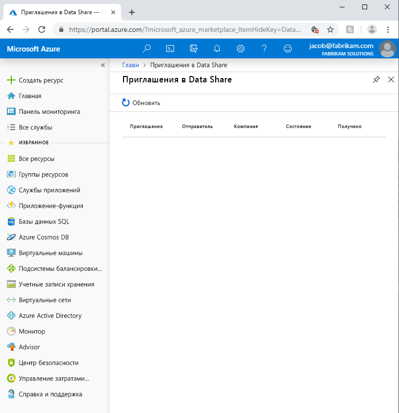
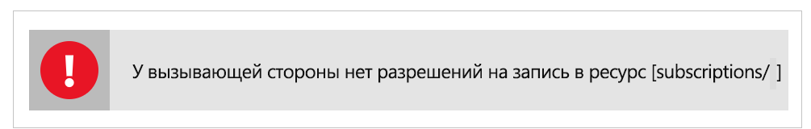

# <a name="troubleshoot-common-issues-in-azure-data-share"></a>Устранение распространенных неполадок в общей папке данных Azure 

В этой статье показано, как устранять распространенные проблемы, связанные с общей папкой данных Azure. 

## <a name="azure-data-share-invitations"></a>Приглашения Azure Data Share 

В некоторых случаях, когда новый пользователь выбирает **Принять приглашение** из отправленного по электронной почте приглашения, ему может быть представлен пустой список приглашений. 



Указанная раннее ошибка является известной проблемой со службой, которая в настоящее время решается. В качестве обходного решения выполните следующие действия. 

1. На портале Azure перейдите к **подпискам**
1. Выберите подписку, которую вы использовали для Azure Data Share
1. Щелкните **Поставщики ресурсов**
1. Поиск Microsoft.DataShare
1. Щелкните **Зарегистрировать**.

Вам потребуется [роль Azure Contributor RBAC](https://docs.microsoft.com/azure/role-based-access-control/built-in-roles#contributor), чтобы выполнить эти действия. 

Если приглашение Azure Data Share все равно не отображается, обратитесь к поставщику данных и убедитесь, что он отправил приглашение на ваш адрес электронной почты для входа в Azure, а *не* на другой адрес. 

> [!IMPORTANT]
> Если вы уже приняли приглашение Azure Data Share и вышли из службы до настройки хранилища, следуйте инструкциям, описанные в руководстве [Как настроить сопоставление набора данных для полученного совместного доступа в предварительной версии Azure Data Share](how-to-configure-mapping.md), чтобы узнать, как завершить настройку полученной общей папки с данными, и начать получать данные. 

## <a name="error-when-creating-or-receiving-a-new-data-share"></a>Ошибка во время создания или получения новой Data Share

"Ошибка: операция вернула недопустимый код состояния" BadRequest ""

"Ошибка: AuthorizationFailed"

"Ошибка: назначение ролей в учетной записи хранения"



Если возникает любая из перечисленных выше ошибок при создании или получении новой общей папки с данными, это происходит из-за недостаточных разрешений для учетной записи хранения. Требуется разрешение *Microsoft.Authorization/role assignments/write*, которое существует в роли владельца хранилища или которое может быть назначено пользовательской роли. Даже если вы создали учетную запись хранения, она НЕ делает вас автоматически владельцем учетной записи хранения. Выполните следующие действия, чтобы назначить себя владельцем учетной записи хранения. Кроме того, пользовательская роль может быть создана с помощью разрешения, которое вы можете себе добавить.  

1. Перейдите в учетную запись хранения на портале Azure
1. Выберите **Управление доступом (IAM)**
1. Щелкните **Добавить**.
1. Добавьте себя в качестве владельца.

## <a name="troubleshooting-sql-based-sharing"></a>Устранение неполадок совместного использования на основе SQL

"Ошибка: наборы данных x не были добавлены, поскольку отсутствуют необходимые разрешения для общего доступа".

Если эта ошибка возникает при добавлении набора данных из источника на основе SQL, это может быть вызвано тем, что вы не создали пользователя для Azure Data Share MSI на SQL Server.  Чтобы устранить эту проблему, выполните следующий скрипт:

```sql
    create user <share_acct_name> from external provider;     
    exec sp_addrolemember db_owner, <share_acct_name>; 
```      
Обратите внимание, что *< share_acc_name >* — это имя учетной записи общего ресурса данных. Если вы еще не создали учетную запись общего ресурса данных, вы можете вернуться к этому предварительному компоненту позже.         

Убедитесь, что выполнены все предварительные требования, перечисленные в руководстве по [совместному использованию данных](share-your-data.md) .

## <a name="next-steps"></a>Дальнейшие действия

Чтобы узнать, как приступить к обмену данными, перейдите к [этому](share-your-data.md) руководству.

