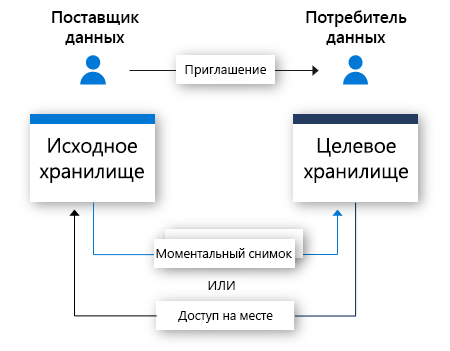

# Что такое Azure Data Share?

В современном мире данные рассматриваются как ключевой стратегический ресурс, которым многие организации должны просто и безопасно делиться со своими клиентами и партнерами. Сегодня есть много способов, которыми клиенты обмениваются данными, в том числе через FTP, электронную почту, API-интерфейсы и т. д. Организации могут легко потерять след того, с кем они поделились своими данными. Совместное использование данных через FTP или через собственную API-инфраструктуру зачастую дорого подготавливать и администрировать. С использованием этих методов совместного доступа в больших масштабах связаны накладные расходы на управление. 

Многие организации несут ответственность за данные, которыми они делятся. В дополнение к подотчетности, многим организациям требуется простой способ контролировать и отслеживать весь свой обмен данными. В современном мире ожидается, что объем данных будет продолжать расти экспоненциальными темпами, поэтому организациям необходим простой способ обмена большими данными. Клиентам требуются самые актуальные данные, чтобы получать своевременную аналитику.

Служба Azure Data Share позволяет организациям просто и безопасно обмениваться данными со множеством клиентов и партнеров. Всего за несколько щелчков мыши вы можете создать учетную запись для обмена данными, добавить наборы данных и пригласить своих клиентов и партнеров использовать общий ресурс с данными. Поставщики данных всегда контролируют данные, которыми они поделились. Служба Azure Data Share упрощает контроль и мониторинг того, когда и кем были переданы определенные данные. 

Поставщик данных может контролировать способ обработки своих данных, определяя условия использования общего ресурса с данными. Потребитель данных должен принять эти условия, прежде чем сможет получить доступ к данным. Поставщики данных могут указать частоту, с которой их потребители данных будут получать обновления. Поставщик данных может отозвать доступ к новым обновлениям в любое время. 

Служба Azure Data Share улучшает возможности получения аналитических данных, упрощая объединение данных третьих сторон для обогащения сценариев аналитики и ИИ. Вы можете с легкостью использовать средства аналитики Azure для подготовки, обработки и анализа данных, размещенных в Azure Data Share. 

Поставщик данных и потребитель данных должны иметь подписку Azure для совместного использования и получения данных. Если у вас еще нет подписки Azure, создайте [бесплатную учетную запись Azure](https://azure.microsoft.com/free/).

## Сценарии использования Azure Data Share

Azure Data Share можно использовать в различных отраслях. Например, розничный продавец хочет поделиться данными о последних точках продаж со своими поставщиками. Используя службу Azure Data Share, он может настроить общий ресурс, содержащий данные о точках продаж, для всех своих поставщиков и делиться сведениями о продажах на почасовой или ежедневной основе. 

Служба Azure Data Share также позволяет создать магазин данных для конкретной отрасли. Например, для правительственного или исследовательского учреждения, которое регулярно делится анонимными данными о росте населения с третьими сторонами. 

Еще один вариант использования Azure Data Share — создание консорциума данных. Например, несколько различных исследовательских учреждений могут обмениваться данными с одним уполномоченным органом. Данные анализируются, агрегируются и обрабатываются с помощью аналитических средств Azure, а затем передаются заинтересованным сторонам. 

## Принцип работы

В настоящее время Azure Data Share предлагает совместное использование, на основе моментальных снимков и на месте. 

В методе совместного использования на основе моментальных снимков данные перемещаются из подписки Azure поставщика данных и попадают в подписку Azure потребителя данных. Как поставщик данных вы предоставляете общий ресурс и приглашаете в него получателей. Потребители данных получают приглашение для доступа к общему ресурсу по электронной почте. Как только потребитель данных примет приглашение, он может активировать полный снимок данных, которым вы поделились. Эти данные поступают в учетную запись хранения потребителей данных. Потребители данных могут получать регулярные добавочные обновления данных, которыми с ними поделились. Так у них всегда будет самая последняя версия данных. 

Поставщики данных могут предлагать своим потребителям добавочные обновления данных с помощью расписания моментальных снимков. Можно настроить расписание, при котором моментальные снимки создаются на почасовой или ежедневной основе. Когда потребитель данных принимает и настраивает свой общий ресурс, он может подписаться на расписание моментальных снимков. Это выгодно в тех случаях, когда общие данные обновляются на регулярной основе, а потребителю данных требуются самые актуальные данные. 

Когда потребитель данных принимает доступ к общему ресурсу, он может получать данные в выбранном хранилище данных. Например, если поставщик данных предоставляет общий доступ к данным с помощью хранилища BLOB-объектов Azure, потребитель данных может получать эти данные в Azure Data Lake Storage. Аналогично, если поставщик данных совместно использует данные из Azure Synapse Analytics (ранее — Хранилище данных SQL), потребитель данных может выбрать, хочет ли он принимать данные в Azure Data Lake Store, Базе данных SQL Azure или Azure Synapse Analytics. В случае совместного использования с источниками на основе SQL потребитель данных также может выбрать, будет ли он принимать данные в Parquet или CSV. 

Благодаря совместному использованию на месте, поставщики данных могут совместно использовать данные в том месте, где они находятся, не копируя их. После установления связи для совместного использования через поток приглашений создается символьная ссылка между хранилищем исходных данных поставщика данных и целевым хранилищем данных потребителя. Потребитель данных может считывать и запрашивать данные в режиме реального времени, используя собственное хранилище данных. Изменения в хранилище исходных данных немедленно становятся доступными потребителю данных. Совместное использование на месте в настоящее время находится на этапе предварительной версии Azure Data Explorer.

## Ключевые возможности

Служба Azure Data Share позволяет поставщикам данных следующее:

* Делиться данными из списка [неподдерживаемых хранилищ данных](supported-data-stores.md) с клиентами и партнерами за пределами вашей организации.

* Следить за тем, с кем они поделились своими данными.

* Выбрать совместное использование на основе моментального снимка или на месте.

* Устанавливать частоту, с которой потребители данных получают обновления данных.

* Разрешить своим клиентам извлекать последнюю версию данных по мере необходимости или предоставить возможность автоматически получать добавочные изменения данных с заданным интервалом.

Azure Data Share позволяет потребителям данных следующее: 

* Просматривать описание типа данных, размещенных для совместного доступа.

* Просматривать условия использования данных.

* Принимать или отклонять приглашение от Azure Data Share.

* Принимайте данные, предоставленные вам, в [поддерживаемых](supported-data-stores.md) хранилищах данных.

* Активировать полные или добавочные моментальные снимки ресурса Data Share, которым организация поделилась с ними.

* Подписаться на общий ресурс данных, чтобы получать последние копии данных с помощью добавочных моментальных снимков.

Все перечисленные выше ключевые функции поддерживаются на портале Azure и в REST API. Дополнительные сведения об использовании данных Azure Data Share в REST API см. в нашей справочной документации. 

## Поддерживаемые регионы

Список регионов Azure, в которых доступна служба Azure Data Share, см. на странице [продуктов, доступных по регионам](https://azure.microsoft.com/global-infrastructure/services/?products=data-share). 

Azure Data Share не хранит копию самих данных. Данные хранятся в хранилищах данных, которые являются общими. Например, если производитель данных хранит свои данные в учетной записи Azure Data Lake Store, расположенной в регионе "западная часть США", данные будут храниться именно там. Если он обменивается данными с учетной записью хранения Azure, расположенной в Западной Европе, через моментальный снимок, данные передаются непосредственно в учетную запись хранения Azure, расположенную в регионе "Западная Европа".

Служба Azure Data Share не обязательно должна быть доступна в вашем регионе, чтобы вы могли ее использовать. Например, если у вас есть данные, хранящиеся в учетной записи хранения Azure, расположенной в регионе, где служба Azure Data Share еще не доступна, вы все равно можете использовать эту службу для обмена данными. 

## Дальнейшие действия

Чтобы узнать, как приступить к обмену данными, перейдите к [этому](share-your-data.md) руководству.
