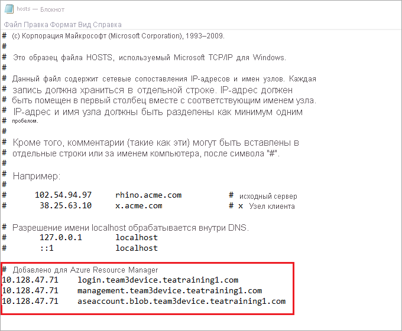

# <a name="deploy-vms-on-your-azure-stack-edge-pro-gpu-device-using-azure-cli-and-python"></a>Развертывание виртуальных машин на устройстве GPU Azure Stack Edge Pro с помощью Azure CLI и Python

<!--[!INCLUDE [applies-to-skus](../../includes/azure-stack-edge-applies-to-all-sku.md)]-->

[!INCLUDE [azure-stack-edge-gateway-deploy-virtual-machine-overview](../../includes/azure-stack-edge-gateway-deploy-virtual-machine-overview.md)]

В этом руководстве показано, как создать виртуальную машину на устройстве Azure Stack Edge Pro и управлять ею с помощью интерфейса командной строки Azure (CLI) и Python.

## <a name="vm-deployment-workflow"></a>Рабочий процесс развертывания виртуальной машины

Выполнение рабочего процесса развертывания показано на схеме ниже.


Общая сводка по рабочему процессу развертывания включает следующие шаги:

1. Подключение к Azure Resource Manager.
2. Создание группы ресурсов
3. Создание учетной записи хранения
4. Добавление URI BLOB-объекта в файл hosts.
5. Установка сертификатов
6. Отправка VHD
7. Создание управляемых дисков из VHD.
8. Создание образа виртуальной машины на основе управляемого диска образа.
9. Создание виртуальной машины с ранее созданными ресурсами.
10. Создание виртуальной сети
11. Создание виртуальной сетевой карты с использованием идентификатора подсети виртуальной сети.

Подробное описание схемы рабочего процесса см. в статье [Развертывание виртуальных машин на устройстве Azure Stack Edge Pro с помощью Azure PowerShell](azure-stack-edge-gpu-deploy-virtual-machine-powershell.md). См. статью [Подключение к Azure Resource Manager на устройстве Azure Stack Edge](azure-stack-edge-j-series-connect-resource-manager.md).

## <a name="prerequisites"></a>Предварительные требования

Прежде чем приступать к созданию виртуальной машины на устройстве Azure Stack Edge Pro и управлению ею с помощью Azure CLI и Python, необходимо выполнить следующие предварительные требования:

1. Настройте параметры сети на устройстве Azure Stack Edge Pro (см. раздел [Шаг 1. Настройка устройства Azure Stack Edge Pro](azure-stack-edge-j-series-connect-resource-manager.md#step-1-configure-azure-stack-edge-pro-device)).

2. Включите сетевой интерфейс для служб вычислений. IP-адрес этого сетевого интерфейса используется для создания виртуального коммутатора для развертывания виртуальной машины. Это можно сделать следующим образом:

    1. Перейдите в раздел **Вычисление**. Выберите сетевой интерфейс, который будет использоваться для создания виртуального коммутатора.

        > [!IMPORTANT] 
        > Для служб вычислений можно настроить только один порт.

    2. Включите службы вычислений на сетевом интерфейсе. Azure Stack Edge Pro создает виртуальный коммутатор, соответствующий этому сетевому интерфейсу, и управляет им.

    <!--If you decide to use another network interface for compute, make sure that you:

    - Delete all the VMs that you have deployed using Azure Resource Manager.

    - Delete all virtual network interfaces and the virtual network associated with this network interface.

    - You can now enable another network interface for compute.-->

3. Создайте и установите все сертификаты на устройстве Azure Stack Edge Pro и в надежном хранилище клиента (см. раздел [Шаг 2. Создание и установка сертификатов](azure-stack-edge-j-series-connect-resource-manager.md#step-2-create-and-install-certificates)).

4. Создайте сертификат с расширением *CER* в кодировке Base-64 (формат PEM) для устройства Azure Stack Edge Pro. Он уже отправлен как цепочка подписывания на устройство и установлен в доверенном корневом хранилище на клиенте. Этот сертификат в формате *PEM* также обеспечивает поддержку Python на этом клиенте.

    Преобразуйте этот сертификат в формат PEM с помощью команды `certutil`. Эту команду необходимо выполнить в каталоге, содержащем сертификат.

    ```powershell
    certutil.exe <SourceCertificateName.cer> <DestinationCertificateName.pem>
    ```
    Ниже показан пример выполнения команды:

    ```powershell
    PS C:\Certificates> certutil.exe -encode aze-root.cer aze-root.pem
    Input Length = 2150
    Output Length = 3014
    CertUtil: -encode command completed successfully.
    PS C:\Certificates>
    ```    
    Этот сертификат в формате PEM позже будет добавлен в хранилище Python.

5. Назначьте IP-адрес устройства на странице **Сеть** в локальном пользовательском веб-интерфейсе. Этот IP-адрес нужно добавить в:

    - файл узла на клиенте ИЛИ
    - конфигурацию DNS-сервера.
    
    > [!IMPORTANT]
    > Рекомендуется изменить конфигурацию DNS-сервера для разрешения имен конечных точек.

    1. Откройте **Блокнот** от имени администратора (для сохранения файла требуются привилегии администратора), а затем откройте файл **hosts**, расположенный в `C:\Windows\System32\Drivers\etc`.
    
        
    
    2. Добавьте следующие записи в файл **hosts**, указав соответствующие значения для вашего устройства:
    
        ```
        <Device IP> login.<appliance name>.<DNS domain>
        <Device IP> management.<appliance name>.<DNS domain>
        <Device IP> <storage name>.blob.<appliance name>.<DNS domain>
        ```
    3. Для справки используйте следующее изображение. Сохраните файл **hosts**.

        

6. [Скачайте скрипт Python](https://aka.ms/ase-vm-python), используемый в этой процедуре.

## <a name="step-1-set-up-azure-clipython-on-the-client"></a>Шаг 1. Настройка Azure CLI и Python на клиенте

### <a name="verify-profile-and-install-azure-cli"></a>Проверка профиля и установка Azure CLI

<!--1. Verify the API profile of the client and identify which version of the modules and libraries to include on your client. In this example, the client system will be running Azure Stack 1904 or later. For more information, see [Azure Resource Manager API profiles](/azure-stack/user/azure-stack-version-profiles?view=azs-1908#azure-resource-manager-api-profiles).-->

1. Установите Azure CLI на клиенте. В этом примере используется Azure CLI 2.0.80. Чтобы проверить версию Azure CLI, выполните команду `az --version`.

    Ниже приведен пример выходных данных этой команды:

    ```output
    PS C:\windows\system32> az --version
    azure-cli                         2.0.80
    
    command-modules-nspkg              2.0.3
    core                              2.0.80
    nspkg                              3.0.4
    telemetry                          1.0.4
    Extensions:
    azure-cli-iot-ext                  0.7.1
    
    Python location 'C:\Program Files (x86)\Microsoft SDKs\Azure\CLI2\python.exe'
    Extensions directory 'C:\.azure\cliextensions'
    
    Python (Windows) 3.6.6 (v3.6.6:4cf1f54eb7, Jun 27 2018, 02:47:15) [MSC v.1900 32 bit (Intel)]
    
    Legal docs and information: aka.ms/AzureCliLegal
    
    Your CLI is up-to-date.
    
    Please let us know how we are doing: https://aka.ms/clihats
    PS C:\windows\system32>
    ```

    Если у вас нет Azure CLI, скачайте и [установите Azure CLI в Windows](/cli/azure/install-azure-cli-windows). Azure CLI можно запускать с помощью командной строки Windows или Windows PowerShell.

2. Запишите расположение Python в интерфейсе командной строки. Оно потребуется для определения расположения хранилища доверенных корневых сертификатов для Azure CLI.

3. Чтобы запустить пример скрипта, используемый в этой статье, вам понадобятся следующие версии библиотеки Python:

    ```powershell
    azure-common==1.1.23
    azure-mgmt-resource==2.1.0
    azure-mgmt-network==2.7.0
    azure-mgmt-compute==5.0.0
    azure-mgmt-storage==1.5.0
    azure-storage-blob==1.2.0rc1
    haikunator
    msrestazure==0.6.2
    ```
    Чтобы установить эти версии, выполните следующую команду:

    ```powershell
    .\python.exe -m pip install haikunator
    ```

    В следующем примере выходных данных показана установка Haikunator:

    ```output
    PS C:\Program Files (x86)\Microsoft SDKs\Azure\CLI2> .\python.exe -m pip install haikunator

    Collecting haikunator
      Downloading https://files.pythonhosted.org/packages/43/fa/130968f1a1bb1461c287b9ff35c630460801783243acda2cbf3a4c5964a5/haikunator-2.1.0-py2.py3-none-any.whl
    
    Installing collected packages: haikunator
    Successfully installed haikunator-2.1.0
    You are using pip version 10.0.1, however version 20.0.1 is available.
    You should consider upgrading using the 'python -m pip install --upgrade pip' command.
    
    PS C:\Program Files (x86)\Microsoft SDKs\Azure\CLI2> 
    ```

    В следующем примере выходных данных показана установка pip для `msrestazure`: 
    
    ```output
    PS C:\Program Files (x86)\Microsoft SDKs\Azure\CLI2> .\python.exe -m pip install msrestazure==0.6.2
    Requirement already satisfied: msrestazure==0.6.2 in c:\program files (x86)\microsoft sdks\azure\cli2\lib\site-packages (0.6.2)
    Requirement already satisfied: msrest<2.0.0,>=0.6.0 in c:\program files (x86)\microsoft sdks\azure\cli2\lib\site-packages (from msrestazure==0.6.2) (0.6.10)
    === CUT ===========================  CUT ==================================
    Requirement already satisfied: cffi!=1.11.3,>=1.8 in c:\program files (x86)\microsoft sdks\azure\cli2\lib\site-packages (from cryptography>=1.1.0->adal<2.0.0,>=0.6.0->msrestazure==0.6.2) (1.13.2)
    Requirement already satisfied: pycparser in c:\program files (x86)\microsoft sdks\azure\cli2\lib\site-packages (from cffi!=1.11.3,>=1.8->cryptography>=1.1.0->adal<2.0.0,>=0.6.0->msrestazure==0.6.2) (2.18)
    You are using pip version 10.0.1, however version 20.0.1 is available.
    You should consider upgrading using the 'python -m pip install --upgrade pip' command.
    PS C:\Program Files (x86)\Microsoft SDKs\Azure\CLI2>
    ```

### <a name="trust-the-azure-stack-edge-pro-ca-root-certificate"></a>Настройка доверия для корневого сертификата ЦС Azure Stack Edge Pro

1. Найдите расположение сертификата на своем компьютере. Это расположение зависит от того, куда вы установили `az cli`. Откройте Windows PowerShell как администратор. Перейдите по пути, куда с помощью `az cli` вы установили Python: `C:\Program Files (x86)\Microsoft SDKs\Azure\CLI2\python.exe`.

    Чтобы получить расположение сертификата, введите следующую команду:

    ```powershell
    .\python -c "import certifi; print(certifi.where())"
    ```
    
    Командлет возвращает расположение сертификата, как показано ниже:  
        
    ```output
    PS C:\Program Files (x86)\Microsoft SDKs\Azure\CLI2> .\python -c "import certifi; print(certifi.where())"
    C:\Program Files (x86)\Microsoft SDKs\Azure\CLI2\lib\site-packages\certifi\cacert.pem
    PS C:\Program Files (x86)\Microsoft SDKs\Azure\CLI2>
    ```
      
    Запишите это расположение, так как оно понадобится вам позже: `C:\Program Files (x86)\Microsoft SDKs\Azure\CLI2\lib\site-packages\certifi\cacert.pem`.

2. Чтобы настроить доверие для корневого сертификата ЦС Azure Stack Edge Pro, добавьте его к существующему сертификату Python. Нужно указать расположение, где сохранен сертификат PEM.

    ```powershell
    $pemFile = "<Path to the pem format certificate>"
    ```
    Пример пути: C:\VM-scripts\rootteam3device.pem.
    
    В окне Windows PowerShell введите следующие команды:

    ```powershell
    $root = New-Object System.Security.Cryptography.X509Certificates.X509Certificate2
        $root.Import($pemFile)
        
    Write-Host "Extracting required information from the cert file"
    $md5Hash    = (Get-FileHash -Path $pemFile -Algorithm MD5).Hash.ToLower()
    $sha1Hash   = (Get-FileHash -Path $pemFile -Algorithm SHA1).Hash.ToLower()
    $sha256Hash = (Get-FileHash -Path $pemFile -Algorithm SHA256).Hash.ToLower()

    $issuerEntry  = [string]::Format("# Issuer: {0}", $root.Issuer)
    $subjectEntry = [string]::Format("# Subject: {0}", $root.Subject)
    $labelEntry   = [string]::Format("# Label: {0}", $root.Subject.Split('=')[-1])
    $serialEntry  = [string]::Format("# Serial: {0}", $root.GetSerialNumberString().ToLower())
    $md5Entry = [string]::Format("# MD5 Fingerprint: {0}", $md5Hash)
    $sha1Entry= [string]::Format("# SHA1 Fingerprint: {0}", $sha1Hash)
    $sha256Entry  = [string]::Format("# SHA256 Fingerprint: {0}", $sha256Hash)
    $certText = (Get-Content -Path $pemFile -Raw).ToString().Replace("`r`n","`n")
    
    $rootCertEntry = "`n" + $issuerEntry + "`n" + $subjectEntry + "`n" + $labelEntry + "`n" + `
    $serialEntry + "`n" + $md5Entry + "`n" + $sha1Entry + "`n" + $sha256Entry + "`n" + $certText
    
    Write-Host "Adding the certificate content to Python Cert store"
    Add-Content "${env:ProgramFiles(x86)}\Microsoft SDKs\Azure\CLI2\Lib\site-packages\certifi\cacert.pem" $rootCertEntry
    
    Write-Host "Python Cert store was updated to allow the Azure Stack Edge Pro CA root certificate"
    ```
    
### <a name="connect-to-azure-stack-edge-pro"></a>Подключение к Azure Stack Edge Pro

1. Зарегистрируйте среду Azure Stack Edge Pro, выполнив команду `az cloud register`.

    В некоторых сценариях прямое исходящее подключение к Интернету маршрутизируется через прокси-сервер или брандмауэр, который принудительно использует перехват SSL. В этих случаях команда az cloud register может вернуть ошибку, например \"Unable to get endpoints from the cloud\" (Не удалось получить конечные точки из облака). Чтобы избежать этой ошибки, задайте следующие переменные среды в Windows PowerShell:

    ```powershell
    $ENV:AZURE_CLI_DISABLE_CONNECTION_VERIFICATION = 1 
    $ENV:ADAL_PYTHON_SSL_NO_VERIFY = 1
    ```

2. Задайте переменные среды для скрипта для конечной точки Azure Resource Manager, расположение, в котором создаются ресурсы, и путь к исходному виртуальному жесткому диску. Расположение ресурсов является общим на всех устройствах Azure Stack Edge Pro: `dbelocal`. Вам также нужно указать префиксы адресов и частный IP-адрес. Все следующие переменные среды представляют значения на основе ваших значений, кроме переменной `AZURE_RESOURCE_LOCATION` со значением `"dbelocal"`, которое нужно прописать в коде.

    ```powershell
    $ENV:ARM_ENDPOINT = "https://management.team3device.teatraining1.com"
    $ENV:AZURE_RESOURCE_LOCATION = "dbelocal"
    $ENV:VHD_FILE_PATH = "C:\Downloads\Ubuntu1604\Ubuntu13.vhd"
    $ENV:ADDRESS_PREFIXES = "5.5.0.0/16"
    $ENV:PRIVATE_IP_ADDRESS = "5.5.174.126"
    ```

3. Зарегистрируйте среду. При выполнении команды az cloud register используйте следующие параметры:

    | Значение | Описание | Пример |
    | --- | --- | --- |
    | Имя среды | Имя среды, к которой вы подключаетесь. | Укажите имя, например `aze-environ`. |
    | Конечная точка Resource Manager | URL-адрес: `https://Management.<appliancename><dnsdomain>`. <br> Чтобы получить этот URL-адрес, перейдите на страницу **Устройства** в локальном пользовательском веб-интерфейсе устройства. |Например, `https://management.team3device.teatraining1.com`.  |
    
    ```powershell
    az cloud register -n <environmentname> --endpoint-resource-manager "https://management.<appliance name>.<DNS domain>"
    ```
    Ниже показан пример выполнения команды:
    
    ```powershell
    PS C:\Program Files (x86)\Microsoft SDKs\Azure\CLI2> az cloud register -n az-new-env --endpoint-resource-manager "https://management.team3device.teatraining1.com"
    ```
    
    
4. Следующие команды позволяют выбрать активную среду:

    ```powershell
    az cloud set -n <EnvironmentName>
    ```
    Ниже показан пример выполнения команды:

    ```powershell
    PS C:\Program Files (x86)\Microsoft SDKs\Azure\CLI2> az cloud set -n az-new-env
    Switched active cloud to 'az-new-env'.
    Use 'az login' to log in to this cloud.
    Use 'az account set' to set the active subscription.
    PS C:\Program Files (x86)\Microsoft SDKs\Azure\CLI2>
    ```

4. Войдите в среду Azure Stack Edge Pro с помощью команды `az login`. Вы можете войти в среду Azure Stack Edge Pro от имени пользователя или [субъекта-службы](../active-directory/develop/app-objects-and-service-principals.md).

   Чтобы войти от имени *пользователя*, сделайте следующее.

   Вы можете указать имя пользователя и пароль непосредственно в команде `az login` или выполнить аутентификацию в браузере. Если для вашей учетной записи включена многофакторная аутентификация, возможным будет только второй вариант.

   Ниже показан пример выполнения команды `az login`:
    
    ```powershell
    PS C:\Certificates> az login -u EdgeARMuser
    ```
   После выполнения команды для входа вам будет предложено ввести пароль. Укажите пароль Azure Resource Manager.

   Ниже приведен пример выходных данных после ввода пароля и входа:  
   
   ```output
   PS C:\Program Files (x86)\Microsoft SDKs\Azure\CLI2> az login -u EdgeARMuser
   Password:
   [
        {
            "cloudName": "az-new-env",
            "id": "A4257FDE-B946-4E01-ADE7-674760B8D1A3",
            "isDefault": true,
            "name": "Default Provider Subscription",
            "state": "Enabled",
            "tenantId": "c0257de7-538f-415c-993a-1b87a031879d",
            "user": {
                "name": "EdgeArmUser@localhost",
                "type": "user"
            }
        }
   ]
   PS C:\Program Files (x86)\Microsoft SDKs\Azure\CLI2>
   ```
   Запишите значения `id` и `tenantId`, так как они соответствуют идентификатору подписки и идентификатору арендатора Azure Resource Manager соответственно и будут использоваться на следующем шаге.
       
   Следующие переменные среды нужно настроить в качестве *субъекта-службы*:

   ```
   $ENV:ARM_TENANT_ID = "c0257de7-538f-415c-993a-1b87a031879d"
   $ENV:ARM_CLIENT_ID = "cbd868c5-7207-431f-8d16-1cb144b50971"
   $ENV:ARM_CLIENT_SECRET - "<Your Azure Resource Manager password>"
   $ENV:ARM_SUBSCRIPTION_ID = "A4257FDE-B946-4E01-ADE7-674760B8D1A3"
   ```

   Идентификатор клиента Azure Resource Manager задан непосредственно в коде. Идентификатор арендатора и идентификатор подписки Azure Resource Manager указаны в выходных данных команды `az login`, которую вы выполнили ранее. Секрет клиента Azure Resource Manager — это указанный пароль Azure Resource Manager.

   Дополнительные сведения см. в статье [Установка пароля Azure Resource Manager на устройстве GPU Azure Stack Edge](azure-stack-edge-j-series-set-azure-resource-manager-password.md).

5. Измените версию профиля на 2019-03-01-hybrid. Чтобы изменить версию профиля, выполните следующую команду:

    ```powershell
    az cloud update --profile 2019-03-01-hybrid
    ```

    Ниже показан пример выполнения команды `az cloud update`:

    ```powershell
    PS C:\Program Files (x86)\Microsoft SDKs\Azure\CLI2> az cloud update --profile 2019-03-01-hybrid
    PS C:\Program Files (x86)\Microsoft SDKs\Azure\CLI2>
    ```

## <a name="step-2-create-a-vm"></a>Шаг 2. Создание виртуальной машины

Для создания виртуальной машины предоставляется скрипт Python. В зависимости от того, как вы выполнили вход (от имени пользователя или субъекта-службы), скрипт принимает соответствующие входные данные и создает виртуальную машину.

1. Выполните скрипт Python из того же каталога, в котором установлен Python.

    `.\python.exe example_dbe_arguments_name_https.py cli`

2. При выполнении скрипта отправка виртуального жесткого диска занимает 20–30 минут. Чтобы просмотреть ход выполнения отправки, можно использовать Обозреватель службы хранилища Azure или AzCopy.

    Ниже показан пример выходных данных после успешного выполнения скрипта. Скрипт создает все ресурсы в группе ресурсов, использует эти ресурсы для создания виртуальной машины и, наконец, удаляет группу ресурсов, включая все созданные ресурсы.

    
    ```powershell
    PS C:\Program Files (x86)\Microsoft SDKs\Azure\CLI2> .\python.exe example_dbe_arguments_name_https.py cli
    
    Create Resource Group
    Create a storage account
    Uploading to Azure Stack Storage as blob:
            ubuntu13.vhd
    
    Listing blobs...
            ubuntu13.vhd
    
    VM image resource id:
                /subscriptions/a4257fde-b946-4e01-ade7-674760b8d1a3/resourceGroups/azure-sample-group-virtual-machines118/providers/Microsoft.Compute/images/UbuntuImage
    
    Create Vnet
    Create Subnet
    Create NIC
    Creating Linux Virtual Machine
    Tag Virtual Machine
    Create (empty) managed Data Disk
    Get Virtual Machine by Name
    Attach Data Disk
    Detach Data Disk
    Deallocating the VM (to prepare for a disk resize)
    Update OS disk size
    Start VM
    Restart VM
    Stop VM
    
    List VMs in subscription
            VM: VmName118
    
    List VMs in resource group
            VM: VmName118
    
    Delete VM
    All example operations completed successfully!
    
    Delete Resource Group
    Deleted: azure-sample-group-virtual-machines118
    PS C:\Program Files (x86)\Microsoft SDKs\Azure\CLI2>
    ``` 


## <a name="next-steps"></a>Дальнейшие действия

[Основные команды Azure CLI для виртуальных машин Linux](../virtual-machines/linux/cli-manage.md)