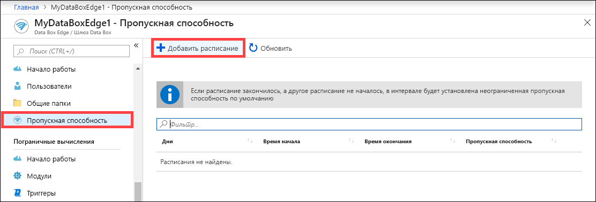
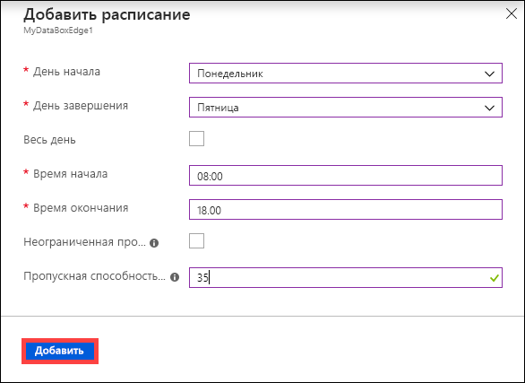
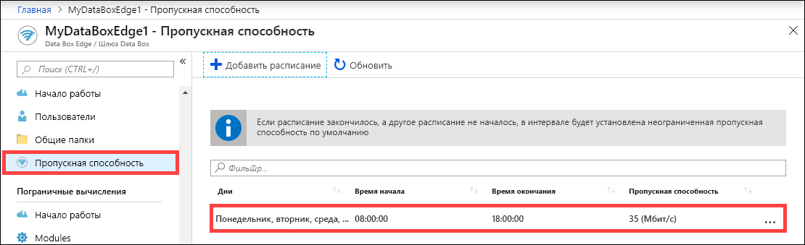
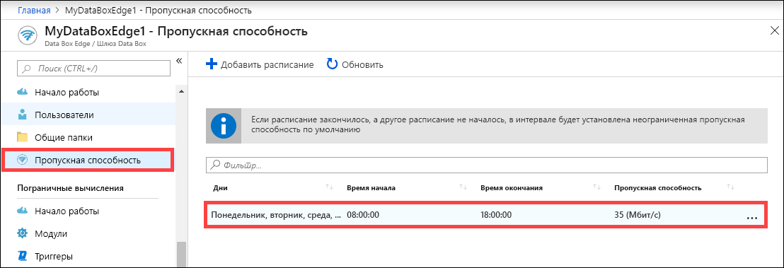
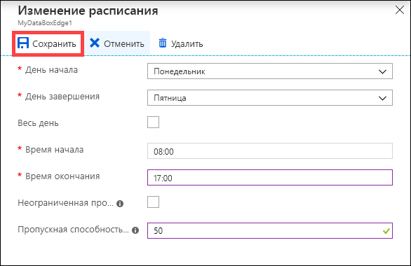
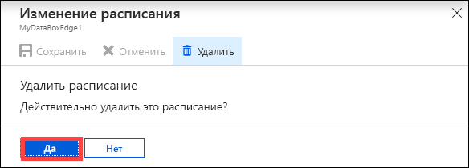

# Управление расписаниями пропускной способности в Azure Data Box Edge с помощью портала Azure  

В этой статье описывается управление пользователями в Azure Data Box Edge. Расписания пропускной способности позволяют настраивать использование пропускной способности сети в разных графиках в разное время дня. Эти расписания можно применить к операциям передачи и загрузки с устройства в облако.

Вы можете добавлять, изменять или удалять расписания пропускной способности в Azure Data Box Edge с помощью портала Azure.

> [!IMPORTANT]
> В данный момент решение Data Box Edge находится в состоянии предварительной версии. Изучите [Дополнительные условия использования Предварительных выпусков Microsoft Azure](https://azure.microsoft.com/support/legal/preview-supplemental-terms/), прежде чем заказывать и развертывать это решение.

В этой статье раскрываются следующие темы:

> [!div class="checklist"]
> * Добавление расписания
> * изменение расписания;
> * удаление расписания.

## Добавление расписания

Чтобы добавить пользователя, выполните на портале Azure приведенные ниже шаги.

1. На портале Azure своего ресурса Data Box Edge перейдите в раздел **Пропускная способность**.
2. В правой области нажмите кнопку **+ Добавить расписание**.

    

3. В разделе **Добавить расписание** выполните действия ниже. 

   1. Укажите **день запуска**, **день окончания**, **время запуска** и **время окончания** расписания.
   2. Если расписание должно выполняться целый день, вы можете выбрать параметр **Весь день**.
   3. **Скорость пропускной способности** — это значение пропускной способности в Мбит/с, которое используется устройством в операциях с облаком (скачивание и передача). Укажите в этом поле число от 20 до 1 000 000 007.
   4. Установите флажок в поле **Неограниченная пропускная способность**, чтобы избежать регулирования передачи и скачивания данных.
   5. Выберите **Добавить**.

      

3. Расписание будет создано с указанными параметрами. Это расписание затем появится в списке расписаний пропускной способности на портале.

    

## Изменение расписания

Выполните следующие действия, чтобы изменить расписание пропускной способности.

1. На портале Azure выберите ресурс Data Box Edge и перейдите в раздел **пропускной способности**. 
2. В списке расписаний пропускной способности выберите расписание, которое требуется изменить.
    

3. Внесите необходимые изменения и сохраните их.

    

4. После изменения расписания список расписаний обновится.

    

## Удаление расписания

Выполните приведенные ниже действия, чтобы удалить расписание пропускной способности, связанное с устройством Data Box Edge.

1. На портале Azure выберите ресурс Data Box Edge и перейдите в раздел **пропускной способности**.  

2. В списке расписаний пропускной способности выберите расписание, которое требуется удалить. В окне **Изменить расписание** выберите **Удалить**. При появлении запроса на подтверждение нажмите кнопку **Да**.

   

3. После удаления расписания список расписаний обновится.

## Дополнительная информация

- Сведения об управлении общими папками см. [здесь](data-box-edge-manage-shares.md).
