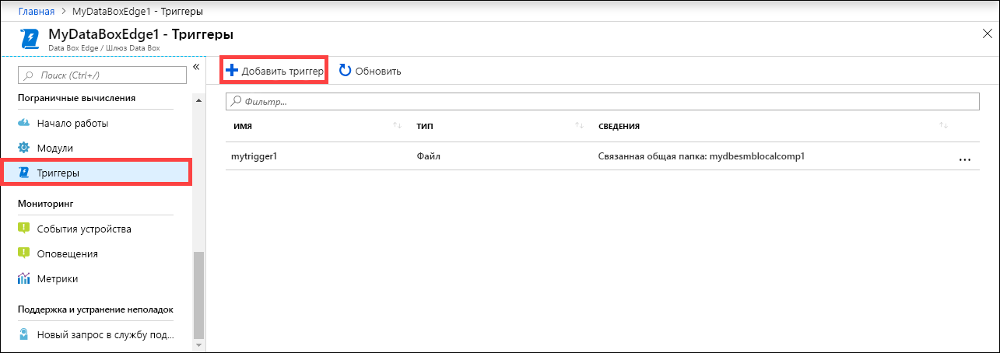
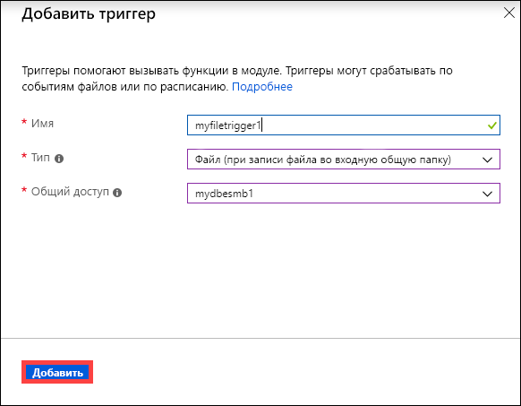
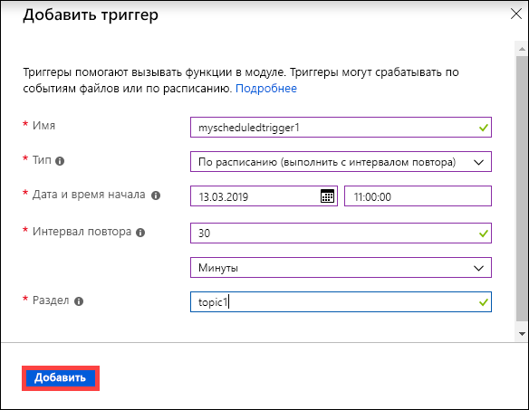
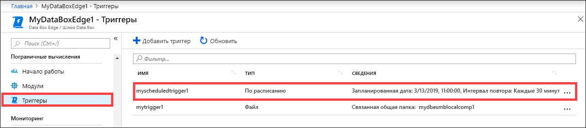
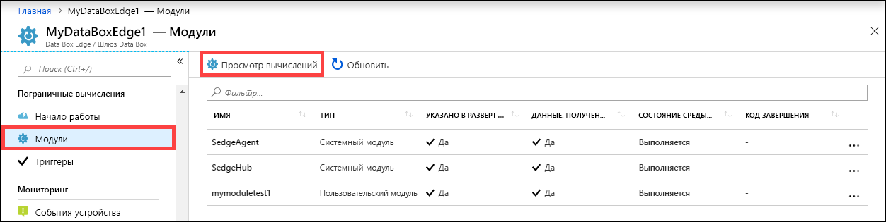
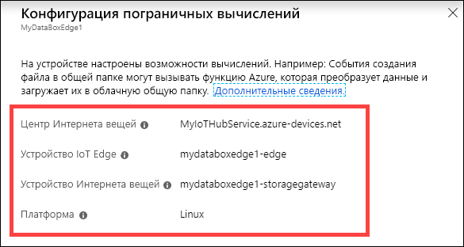
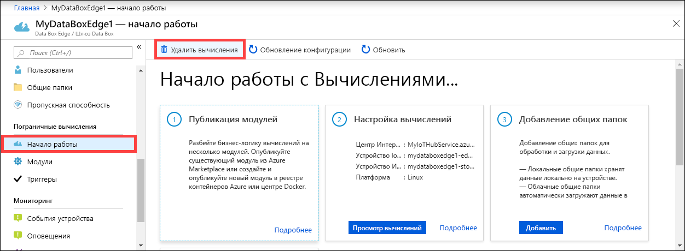
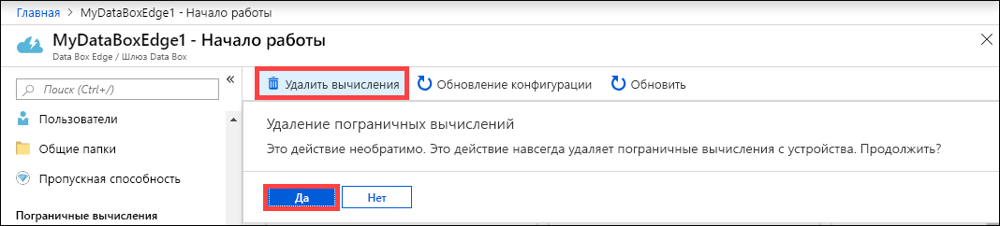
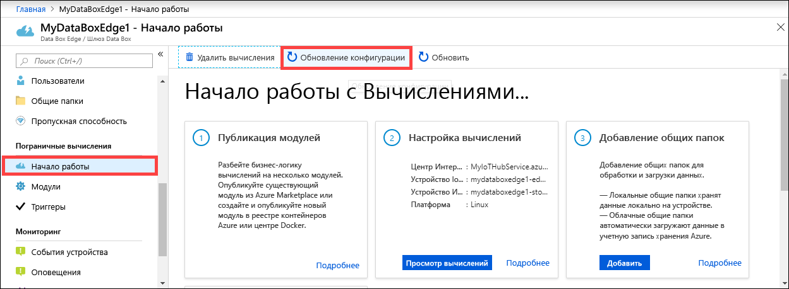
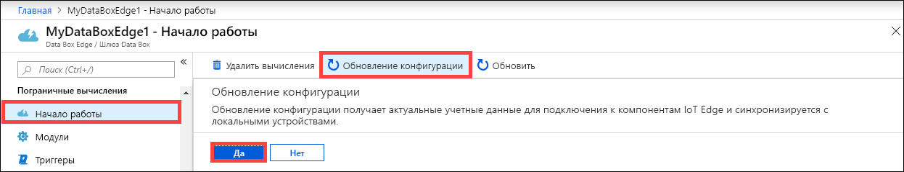

# Управление вычислениями в Azure Data Box Edge

В этой статье описывается управление вычислениями в Azure Data Box Edge. Вы можете управлять вычислениями на портале Azure или с помощью локального пользовательского веб-интерфейса. Используйте портал Azure для управления модулями, триггерами и конфигурацией вычислений, а также локальный пользовательский веб-интерфейс для управления параметрами вычислений.

В этой статье раскрываются следующие темы:

> [!div class="checklist"]
> * управление триггерами;
> * управление конфигурацией пограничных вычислений.

## управление триггерами;

События — это то, что происходит в облачной среде или на вашем устройстве и может требовать выполнения действий. Например, создание файла в общей папке является событием. Триггеры вызывают события. Триггеры в вашем Data Box Edge могут срабатывать в ответ на файловые события или расписание.

- **Файл**. Эти триггеры являются ответом на файловые события, такие как создание или изменение файла.
- **Scheduled**: Эти триггеры являются ответом на расписание, где вы можете указать дату или время начала и интервал повторения.

### Добавление триггера

Чтобы создать триггер, выполните следующие действия на портале Azure.

1. На портале Azure выберите ресурс Data Box Edge, а затем — **Пограничные вычисления > Триггер**. На панели команд выберите **+ Добавить триггер**.

    

2. В колонке **Добавить триггер** укажите уникальное имя для своего триггера.
    
    <!--Trigger names can only contain numbers, lowercase letters, and hyphens. The share name must be between 3 and 63 characters long and begin with a letter or a number. Each hyphen must be preceded and followed by a non-hyphen character.-->

3. Выберите **Тип** для триггера. Выберите **Файл**, если триггер отвечает на событие файла. Выберите **Запланировано**, если хотите, чтобы триггер запускался в определенное время и срабатывал с заданным интервалом повторения. В зависимости от вашего выбора представлен другой набор параметров.

    - **Триггер файлов**. Выберите подключенную общую папку из раскрывающегося списка. Когда в этой общей папке запускается файловое событие, триггер вызывает функцию Azure.

        

    - **Запланированный триггер**. Укажите дату или время начала и интервал повторения в часах, минутах или секундах. Также введите имя темы. Тема обеспечит гибкость для направления триггера на модуль, развернутый на устройстве.

        Пример строки маршрута: `"route3": "FROM /* WHERE topic = 'topicname' INTO BrokeredEndpoint("modules/modulename/inputs/input1")"`.

        

4. Чтобы создать триггер, выберите **Добавить**. Уведомление показывает, что триггер создается. После создания триггера колонка обновляется, чтобы отобразить новый триггер.
 
    

### Удаление триггера

Чтобы удалить триггер, выполните следующие действия на портале Azure.

1. В списке триггеров выберите тот, который нужно удалить.

    

2. Щелкните правой кнопкой мыши и выберите **Удалить**.

    

3. При появлении запроса на подтверждение нажмите кнопку **Да**.

    

Список триггеров также будет обновлен с учетом удаления.

## Управление конфигурацией пограничных вычислений

Чтобы синхронизировать ключи доступа для устройств IoT и IoT Edge в Data Box Edge, используйте портал Azure для просмотра, удаления или обновления конфигурации вычислений.

### Просмотр конфигурации пограничных вычислений

Чтобы просмотреть конфигурацию вычислений для вашего устройства, выполните следующие действия на портале Azure.

1. На портале Azure выберите ресурс Data Box Edge, а затем — **Пограничные вычисления > Модули**. Выберите **Просмотреть вычисления** на панели команд.

    

2. Запишите настройки вычислений на своем устройстве. После настройки вычисления вы создали ресурс Центра Интернета вещей. В этом ресурсе настраиваются устройства IoT и IoT Edge. На устройстве IoT Edge поддерживается запуск модулей Linux.

    

### Удаление конфигурации пограничных вычислений

Чтобы удалить существующую конфигурацию пограничных вычислений для вашего устройства, выполните следующие действия на портале Azure.

1. На портале Azure выберите ресурс Data Box Edge, а затем — **Пограничные вычисления > Начало работы**. Выберите **Удалить вычисления** на панели команд.

    

2. Если вы удалите конфигурацию вычислений, вам потребуется перенастроить устройство на случай, если понадобится снова использовать вычисления. При появлении запроса на подтверждение нажмите кнопку **Да**.

    

### Синхронизация ключей доступа для устройств IoT и IoT Edge

При настройке вычислений на вашем Data Box Edge создаются устройства IoT и IoT Edge. Этим устройствам автоматически назначаются симметричные ключи доступа. В целях обеспечения безопасности эти ключи регулярно меняются службой Центра Интернета вещей.

Чтобы повернуть эти ключи, вы можете перейти в созданную вами службу Центра Интернета вещей и выбрать устройство IoT или IoT Edge. Каждое устройство имеет первичный и вторичный ключ доступа. Назначьте первичный ключ доступа вторичному, а затем повторно создайте первичный ключ доступа.

Если ключи устройств IoT и IoT Edge изменены, то вам необходимо обновить конфигурацию вашего Data Box Edge, чтобы получить последние ключи доступа. Путем выполнения синхронизации можно получить последние ключи для устройств IoT и IoT Edge. Data Box Edge использует только первичные ключи доступа.

Выполните следующие действия на портале Azure, чтобы синхронизировать ключи доступа для вашего устройства.

1. На портале Azure выберите ресурс Data Box Edge, а затем — **Пограничные вычисления > Начало работы**. Выберите **Обновление конфигурации** на панели команд.

    

2. Выберите **Да** при запросе на подтверждение.

     

3. После синхронизации закройте диалоговое окно.

## Дальнейшие действия

- Узнайте, как [управление Edge вычислений сети с помощью портала Azure](data-box-edge-extend-compute-access-modules.md).
