# Управление общими папками в Azure Data Box Edge с помощью портала Azure

В этой статье описывается управление общими папками в Azure Data Box Edge. Вы можете управлять Azure Data Box Edge на портале Azure или с помощью локального пользовательского веб-интерфейса. С помощью портала Azure можно добавлять, удалять и обновлять общие папки или синхронизировать ключ хранилища для учетной записи хранения, связанной с общими папками.

## Сведения об общих папках

Для передачи данных в Azure необходимо создать общие папки в Azure Data Box Edge. Общие папки, добавляемые на устройство Data Box Edge, могут быть локальными или общими папками, которые отправляют данные в облако.

 - **Локальные общие папки**. Если требуется обрабатывать данные локально на устройстве, используйте эти общие папки.
 - **Общие папки**. Если требуется, чтобы данные устройства автоматически помещались в учетную запись хранения в облаке, используйте эти общие папки. К этим общим папкам применяются все облачные функции, такие как **Обновление** и **Синхронизация ключей хранилища**.

В этой статье раскрываются следующие темы:

> [!div class="checklist"]
> * Добавление общей папки
> * Удаление общей папки
> * Обновление общих папок
> * Синхронизация ключа хранилища

## Добавление общей папки

Чтобы создать общую папку, выполните следующие действия на портале Azure.

1. На портале Azure выберите ресурс Data Box Edge и перейдите в раздел **Шлюз > Общие папки**. На панели команд щелкните **+ Добавление общего файлового ресурса**.

    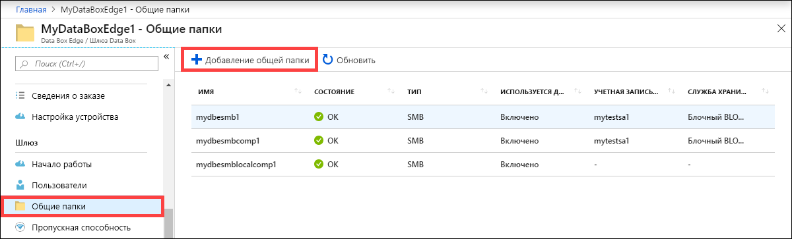

2. В разделе **Добавление общего файлового ресурса** укажите параметры общей папки. Укажите уникальное имя для общей папки.
    
    Имена общих папок могут содержать только цифры, строчные буквы и дефисы. Имя общей папки может содержать от 3 до 63 знаков и начинаться с буквы или цифры. Перед каждым дефисом должен быть знак без дефиса.

3. Выберите **тип** для общей папки. Вы можете выбрать тип **SMB** или **NFS** (тип SMB задан по умолчанию). SMB является стандартным для клиентов Windows, а NFS используется для клиентов Linux. В зависимости от того, выбраны ли общие папки типа SMB или NFS, предложенные варианты могут немного отличаться.

4. Предоставьте **учетную запись хранения**, в которой будет храниться общая папка. При отсутствии контейнера он создается в учетной записи хранения с именем общей папки. Если контейнер уже существует, используется имеющийся контейнер.

5. В раскрывающем списке из блочного BLOB-объекта, страничного BLOB-объекта или файлов выберите **Служба хранилища**. Тип выбранной службы зависит от того, в каком формате необходимо хранить данные в Azure. Например, в этом экземпляре необходимо, чтобы данные хранились в Azure как блочные BLOB-объекты, поэтому мы выбираем **Блочный BLOB-объект**. При выборе **страничного BLOB-объекта** необходимо убедиться, что данные выровнены по размеру 512 байт. Используйте **страничный BLOB-объект** для VHD или VHDX, которые всегда выровнены по размеру 512 байт.

6. Этот шаг зависит от того, создается ли общая папка типа SMB или NFS.
    - **При создании общей папки SMB** в поле **Все привилегированные локальные пользователи** выберите **Создать** или **Использовать существующий**. При создании локального пользователя укажите **имя пользователя** и **пароль**, а затем подтвердите пароль. Таким образом вы предоставите разрешения локальному пользователю. Назначив разрешения здесь, вы сможете изменять их в проводнике.

        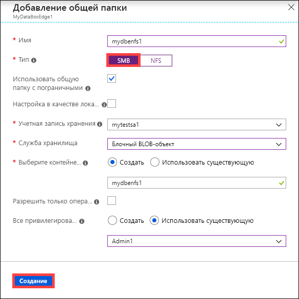

        Если разрешить только операции чтения для данных этой общей папки, можно указать пользователей с правами только для чтения.
    - **При создании общей папки типа NFS** необходимо предоставить **IP-адреса разрешенных клиентов**, которые могут получать доступ к ресурсу.

        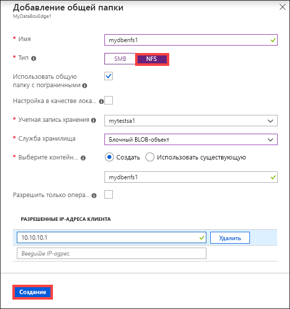

7. Для получения легкого доступа к общим папкам из модулей вычислений Edge используйте локальную точку подключения. Выберите **Использовать общую папку с пограничными вычислениями**, чтобы общая папка автоматически подключалась после создания. Этот параметр позволяет модулю Edge использовать вычисления с локальной точкой подключения.

8. Щелкните **Создать**, чтобы создать общую папку. Вы получите уведомление о том, что общая папка создается. После создания общей папки с указанными параметрами колонка **Общие папки** обновится, и в ней появится новая общая папка.

## Добавление локальной общей папки

1. На портале Azure выберите ресурс Data Box Edge и перейдите в раздел **Шлюз > Общие папки**. На панели команд щелкните **+ Добавление общего файлового ресурса**.

    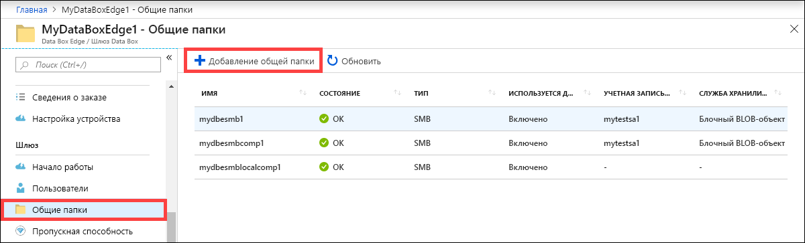

2. В разделе **Добавление общего файлового ресурса** укажите параметры общей папки. Укажите уникальное имя для общей папки.
    
    Имена общих папок могут содержать только цифры, строчные буквы и дефисы. Имя общей папки может содержать от 3 до 63 знаков и начинаться с буквы или цифры. Перед каждым дефисом должен быть знак без дефиса.

3. Выберите **тип** для общей папки. Вы можете выбрать тип **SMB** или **NFS** (тип SMB задан по умолчанию). SMB является стандартным для клиентов Windows, а NFS используется для клиентов Linux. В зависимости от того, выбраны ли общие папки типа SMB или NFS, предложенные варианты могут немного отличаться.

4. Для получения легкого доступа к общим папкам из модулей вычислений Edge используйте локальную точку подключения. Чтобы модуль Edge мог использовать вычисление с локальной точкой подключения, выберите **Use the share with Edge compute** (Использование общей папки с вычислениями Edge).

5. Выберите **Configure as Edge local shares** (Настройка в качестве локальных общих папок Edge). Данные в локальных общих папках останутся локально на устройстве. Вы можете обрабатывать эти данные локально.

6. В поле **Все привилегированные локальные пользователи** выберите либо **Создать**, либо **Использовать существующую**.

7. Нажмите кнопку **Создать**. 

    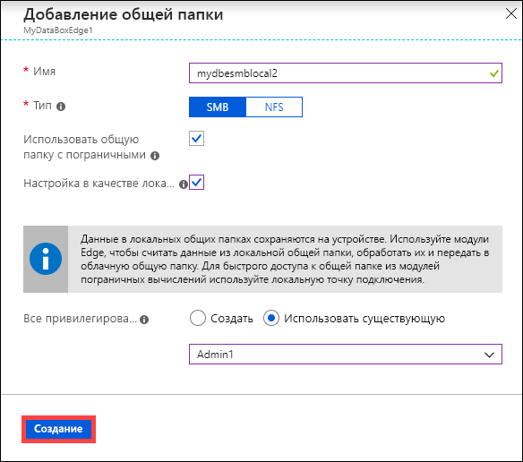

    Вы получите уведомление о том, что создается общая папка. После создания общей папки с указанными параметрами колонка **Общие папки** обновится, и в ней появится новая общая папка.

    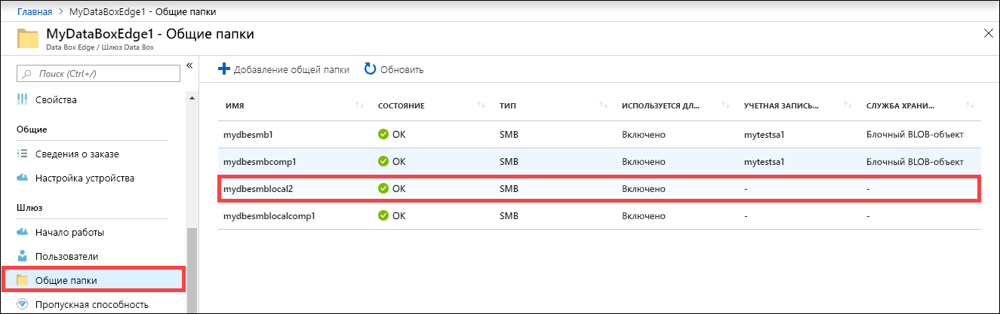
    
    Выберите локальную общую папку, чтобы просмотреть локальную точку подключения для модулей вычислений Edge для этого общего ресурса.

    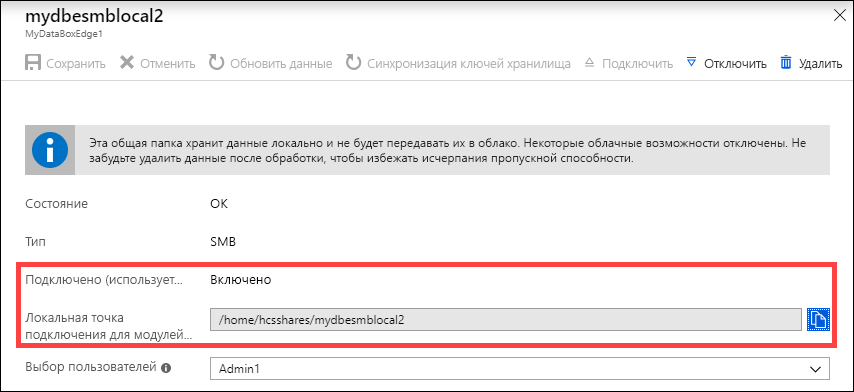

## Подключение общей папки

Общую папку нужно подключить, если вы создали ее до настройки вычислений на устройстве Data Box Edge. Для этого выполните следующие шаги.

1. На портале Azure выберите ресурс Data Box Edge и перейдите в раздел **Шлюз > Общие папки**. В списке общих папок выберите ту, которую необходимо подключить. Для выбранной общей папки в столбце **Используется для вычислений** отобразится состояние **Отключено**.

    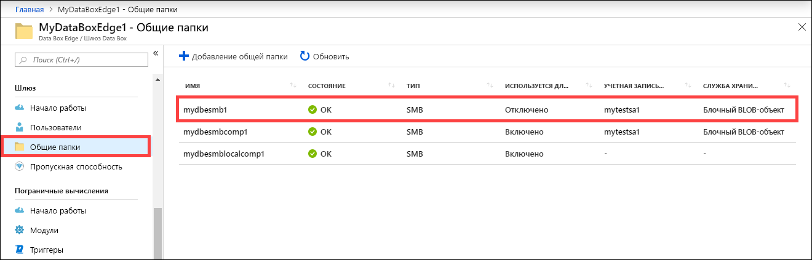

2. Выберите **Подключить**.

    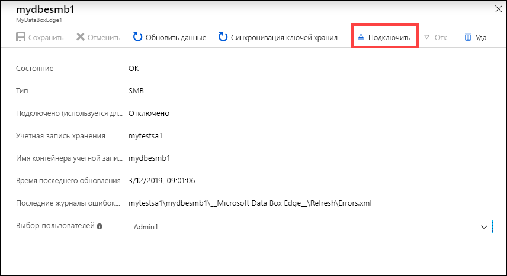

3. При появлении запроса на подтверждение нажмите кнопку **Да**. В этом случае общая папка будет подключена.

    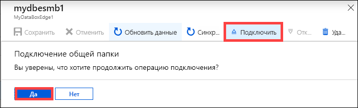

4. После подключения перейдите к списку общих папок. Вы увидите, что в столбце **Используется для вычислений** в качестве состояния общей папки отображается **Включено**.

    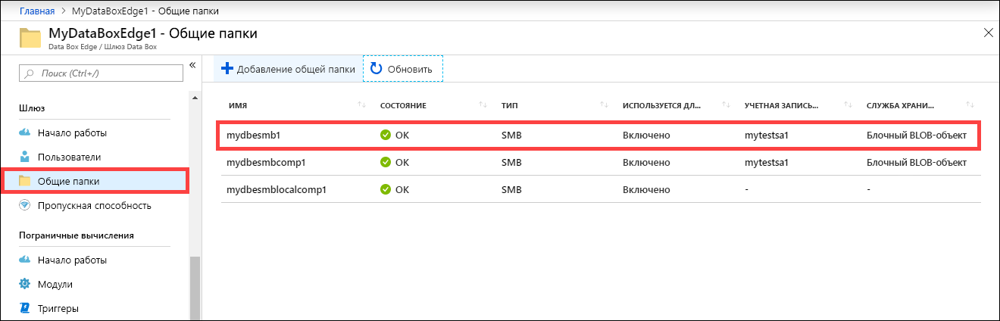

5. Снова выберите общую папку, чтобы просмотреть ее локальную точку подключения. Модуль пограничных вычислений использует эту локальную точку подключения для общей папки.

    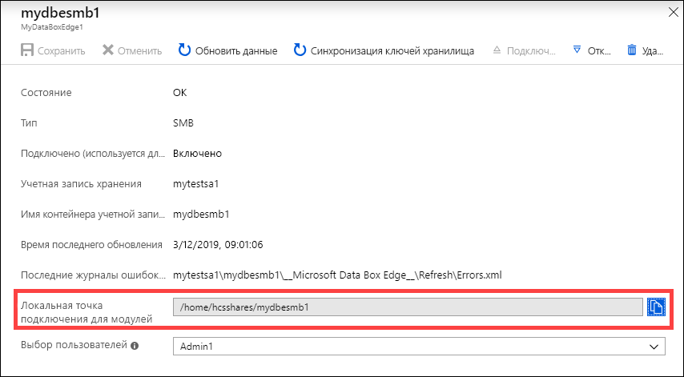

## Отключение общей папки

Чтобы отключить общую папку, выполните следующие действия на портале Azure.

1. На портале Azure выберите ресурс Data Box Edge и перейдите в раздел **Шлюз > Общие папки**.

    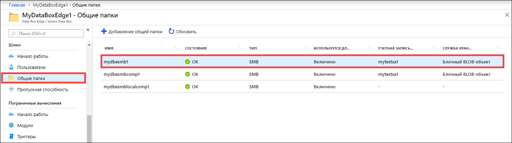

2. В списке общих папок выберите папку, которую требуется отключить. Убедитесь, что она не используется модулем. Если же общая папка используется модулем, это приведет к возникновению проблем с модулем. Выберите **Отключить**.

    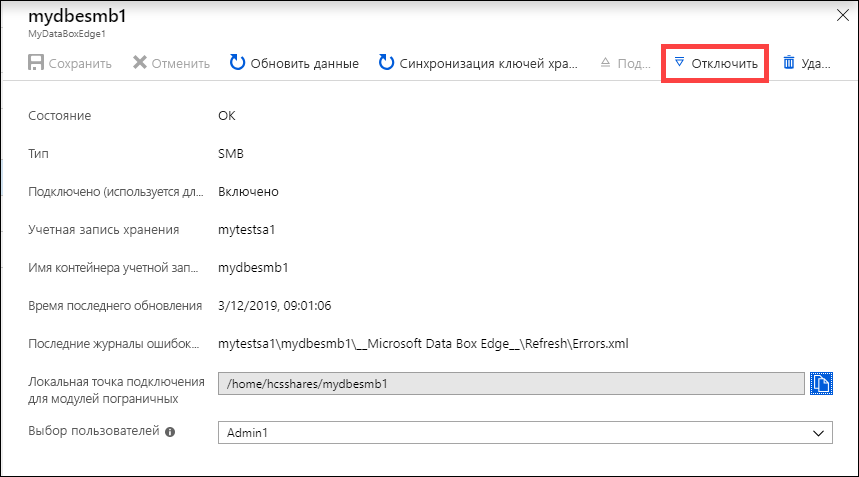

3. При появлении запроса на подтверждение нажмите кнопку **Да**. В этом случае общая папка будет отключена.

    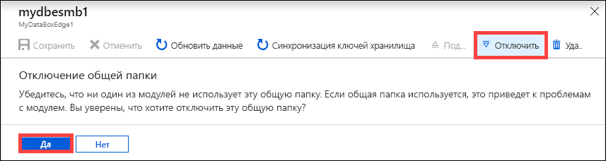

4. После отключения перейдите к списку общих папок. Вы увидите, что в столбце **Используется для вычислений** в качестве состояния общей папки отображается **Отключено**.

    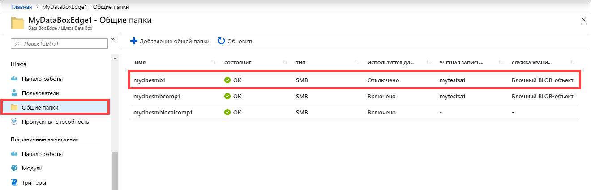

## Удаление общей папки

Чтобы удалить общую папку, выполните следующие действия на портале Azure.

1. В списке общих папок выберите и щелкните папку, которую требуется удалить.

    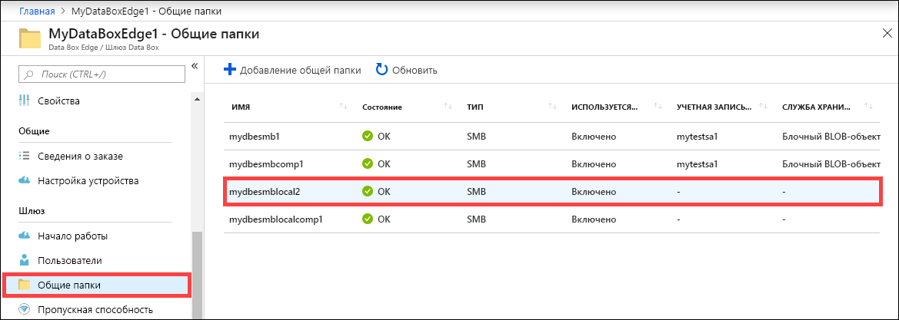

2. Нажмите кнопку **Delete**(Удалить).

    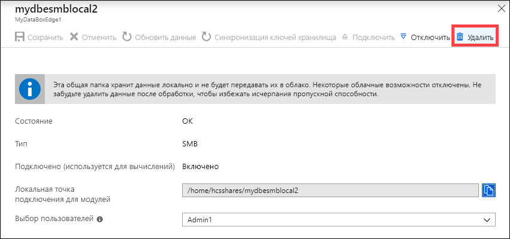

3. При появлении запроса на подтверждение нажмите кнопку **Да**.

    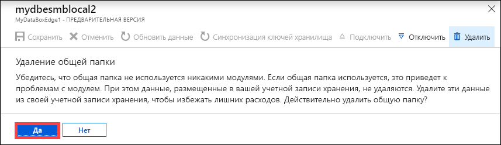

Список общих папок обновляется с учетом удаления.

## Обновление общих папок

Возможность обновления позволяет обновить содержимое общей папки. При обновлении общей папки будет инициирован поиск всех объектов Azure, включая большие двоичные объекты и файлы, добавленные в облако с момента последнего обновления. Затем эти дополнительные файлы скачиваются для обновления содержимого общей папки на устройстве.

> [!IMPORTANT]
> - Вы не можете обновить локальные общие папки.
> - Разрешения и списки управления доступом (ACL) не сохраняются при операции обновления. 

Чтобы обновить общую папку, выполните следующие действия на портале Azure.

1.  На портале Azure перейдите к разделу **Общие папки**. Выберите и щелкните общую папку, которую требуется обновить.

    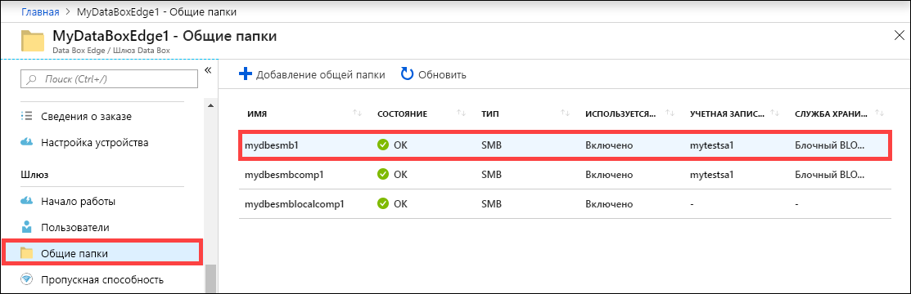

2.  Щелкните **Refresh** (Обновить). 

    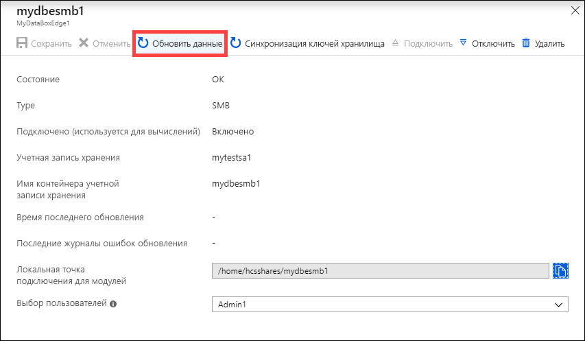
 
3.  При появлении запроса на подтверждение нажмите кнопку **Да**. Запустится задание обновления содержимого локальной общей папки.

    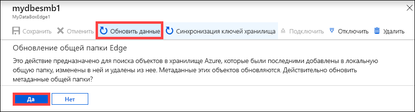
 
4.  Во время обновления в контекстном меню недоступна функция обновления. Щелкните уведомление задания, чтобы просмотреть состояние задания обновления.

5.  Время обновления зависит от количества файлов в контейнере Azure и на устройстве. После успешного обновления общей папки обновляется ее метка времени. Даже если во время обновления произошли частичные сбои, операция считается успешной и метка времени обновляется. Последние версии журналов ошибок также обновляются.

    
 
Если возникает сбой, создается предупреждение. В этом предупреждении подробно описываются причина его возникновения и рекомендации для устранения проблем. Предупреждение также содержит ссылки на файл, содержащий всю сводку сбоев, включая файлы, которые не удалось обновить или удалить.

## Синхронизация ключей хранилища

Если ключи учетной записи хранения изменены, необходимо синхронизировать ключи доступа к хранилищу. Путем выполнения синхронизации можно получить последние ключи для учетной записи устройства.

Выполните следующие действия на портале Azure, чтобы синхронизировать ключ доступа к хранилищу.

1. В своем ресурсе перейдите к разделу **Обзор**. Из списка общих папок выберите и щелкните ту, которая связана с учетной записью хранения и которую необходимо синхронизировать.

    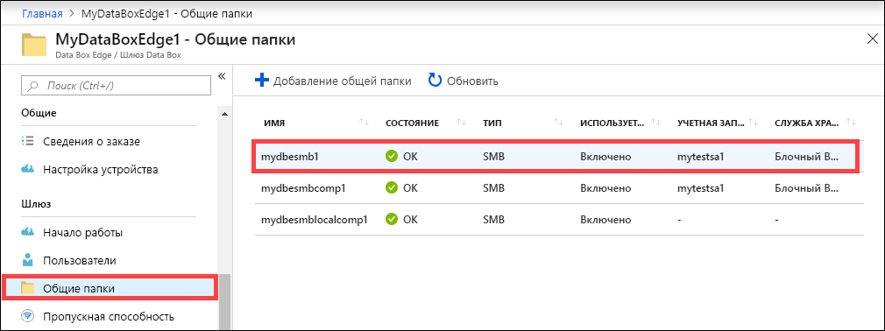

2. Щелкните **Sync storage key** (Синхронизация ключа хранилища). Щелкните **Да** при запросе на подтверждение.

     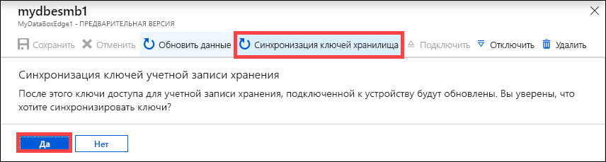

3. После синхронизации закройте диалоговое окно.

>[!NOTE]
> Это действие достаточно выполнить один раз для каждой учетной записи хранения. Не нужно повторять это действие для всех общих папок, связанных с одной учетной записью.

## Дополнительная информация

- Узнайте, как [управлять пользователями с помощью портала Azure](data-box-edge-manage-users.md).
