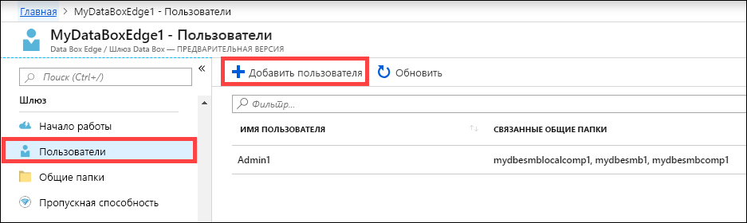
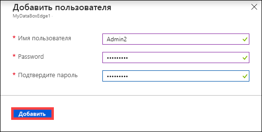
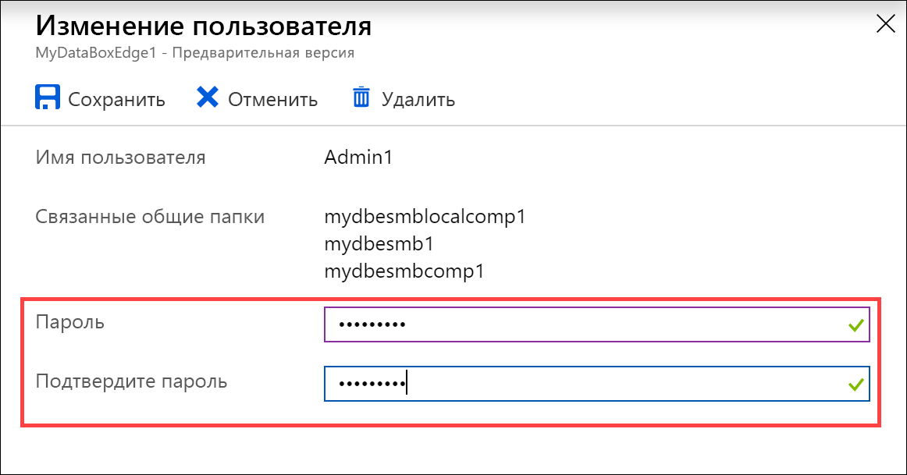
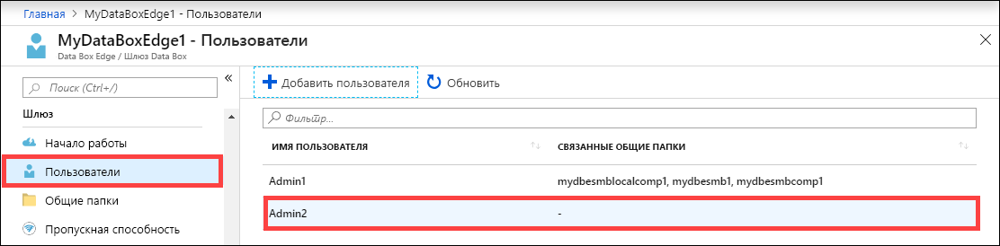
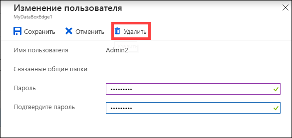
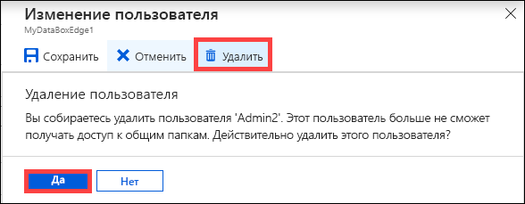
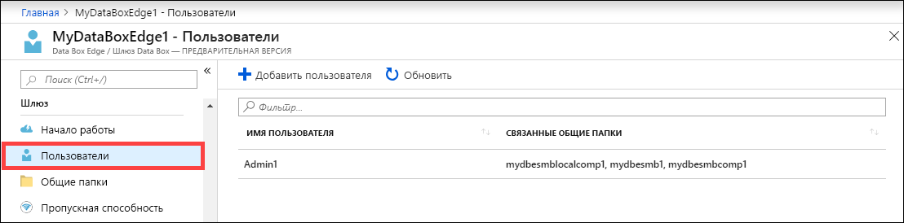

# Управление пользователями в Azure Data Box Edge с помощью портала Azure

В этой статье описывается управление пользователями в Azure Data Box Edge. Вы можете управлять Azure Data Box Edge на портале Azure или с помощью локального пользовательского веб-интерфейса. Используйте портал Azure, чтобы добавлять, изменять или удалять пользователей.

> [!IMPORTANT]
> В данный момент решение Data Box Edge находится в состоянии предварительной версии. Изучите [Дополнительные условия использования Предварительных выпусков Microsoft Azure](https://azure.microsoft.com/support/legal/preview-supplemental-terms/), прежде чем заказывать и развертывать это решение.

В этой статье раскрываются следующие темы:

> [!div class="checklist"]
> * Добавление пользователей
> * Изменение пользователя
> * Удаление пользователя

## Сведения о пользователях

У пользователей может быть доступ только для чтения или полный доступ. Как указано в определении, пользователи с доступом только для чтения могут только просматривать данные в общем файловом ресурсе. Пользователи с полным доступом могут просматривать данные в общем файловом ресурсе, выполнять запись в общие папки, а также изменять или удалять данные из общей папки.

 - **Пользователь с правами полного доступа** — это локальный пользователь, у которого есть полный доступ.
 - **Пользователь с правами только для чтения** — это локальный пользователь, у которого есть доступ только для чтения. Эти пользователи связаны с общими папками, которые позволяют выполнять операции только для чтения.

Сначала разрешения пользователя определяются при его создании во время создания общей папки. После определения разрешений, связанных с пользователем, их можно изменить с помощью проводника. 

## Добавление пользователей

Выполните на портале Azure шаги ниже, чтобы добавить пользователя.

1. На портале Azure выберите ресурс Data Box Edge, а затем — **Обзор > Пользователи**. На панели команд выберите **+ Добавить пользователя**.

    

2. Укажите имя и пароль для пользователя, которого вы хотите добавить. Подтвердите пароль и щелкните **Добавить**.

    

    > [!IMPORTANT] 
    > Эти пользователи зарезервированы системой и не должны использоваться: Administrator, EdgeUser, EdgeSupport, HcsSetupUser, WDAGUtilityAccount, CLIUSR, DefaultAccount, Guest.  

3. Вы получите уведомление о начале и завершении создания пользователя. После создания пользователя выберите **Обновить** на панели команд, чтобы просмотреть обновленный список пользователей.

## Изменение пользователя

Вы можете изменить пароль, связанный с пользователем, после создания пользователя. Выберите пользователя из списка. Введите и подтвердите новый пароль. Сохраните изменения.
 

## Удаление пользователя

Чтобы удалить пользователя, выполните следующие действия на портале Azure.

1. На портале Azure выберите ресурс Data Box Edge, а затем — **Обзор > Пользователи**.

    

2. Выберите пользователя из списка, а затем щелкните **Удалить**.  

   

3. При появлении запроса подтвердите удаление. 

   

Список пользователей обновляется с учетом удаления.

## Дополнительная информация

- Узнайте об [управлении пропускной способностью](data-box-edge-manage-bandwidth-schedules.md).
