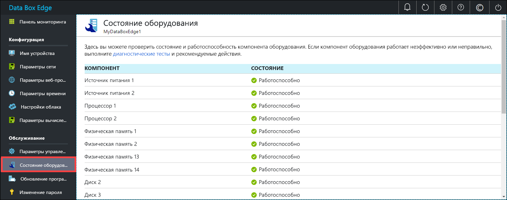

# Мониторинг Azure Data Box Edge

В этой статье описывается, как выполнять мониторинг Azure Data Box Edge. Для мониторинга устройства можно использовать портал Azure или локальный пользовательский веб-интерфейс. Используйте портал Azure для просмотра событий устройства и метрик, а также настройки метрик и управления ими. Используйте локальный пользовательский веб-интерфейс на физическом устройстве для просмотра состояния оборудования различных компонентов устройства.

В этой статье раскрываются следующие темы:

> [!div class="checklist"]
> * Просмотр событий устройства и соответствующих оповещений.
> * Просмотр состояния оборудования компонентов устройства.
> * Просмотр метрик емкости и транзакций устройства.
> * Настройка оповещений и управление ими.

## Просмотр событий устройства.

[!INCLUDE [Supported OS for clients connected to device](../../includes/data-box-edge-gateway-view-device-events.md)]

## Просмотр состояния оборудования

Выполните следующие действия в локальном пользовательском веб-интерфейсе, чтобы просмотреть состояние оборудования компонентов устройства.

1. Подключитесь к локальному пользовательскому веб-интерфейсу устройства.
2. Выберите **Maintenance > Hardware status** (Обслуживание > Состояние оборудования). Можно просмотреть состояние работоспособности различных компонентов устройства.

    

## Показать метрики

[!INCLUDE [Supported OS for clients connected to device](../../includes/data-box-edge-gateway-view-metrics.md)]

## Управление оповещениями

[!INCLUDE [Supported OS for clients connected to device](../../includes/data-box-edge-gateway-manage-alerts.md)]

## Дальнейшие действия 

Узнайте об [управлении пропускной способностью](data-box-edge-manage-bandwidth-schedules.md).