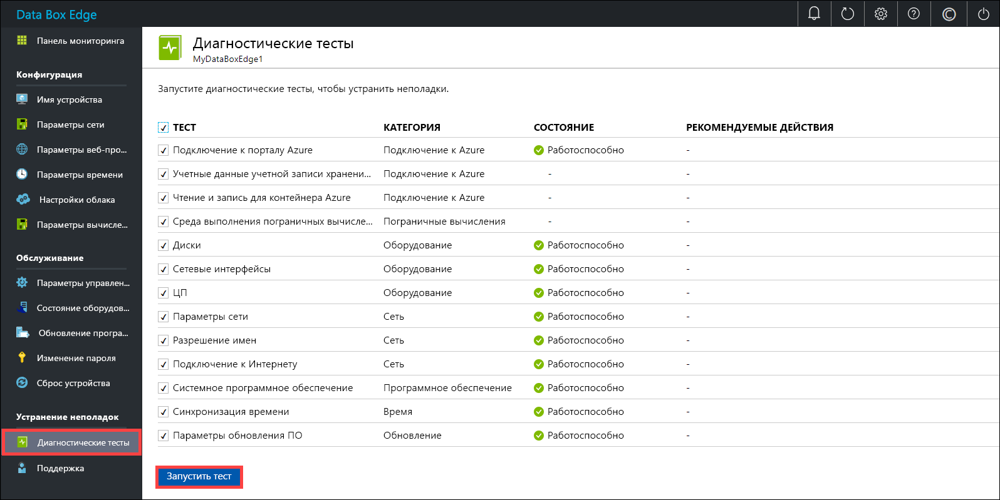
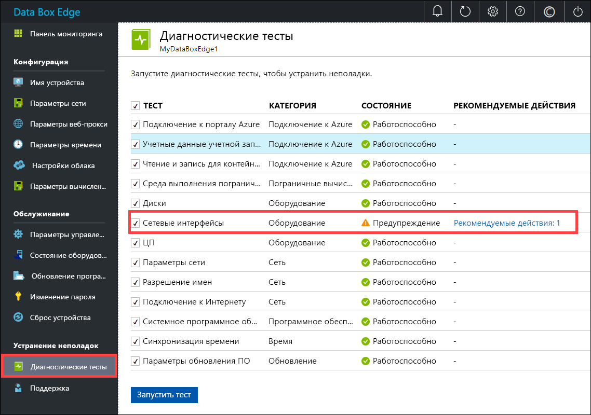
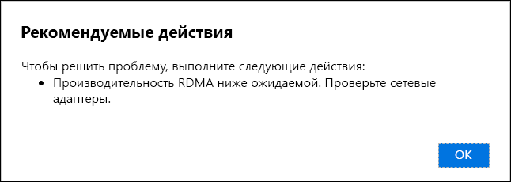
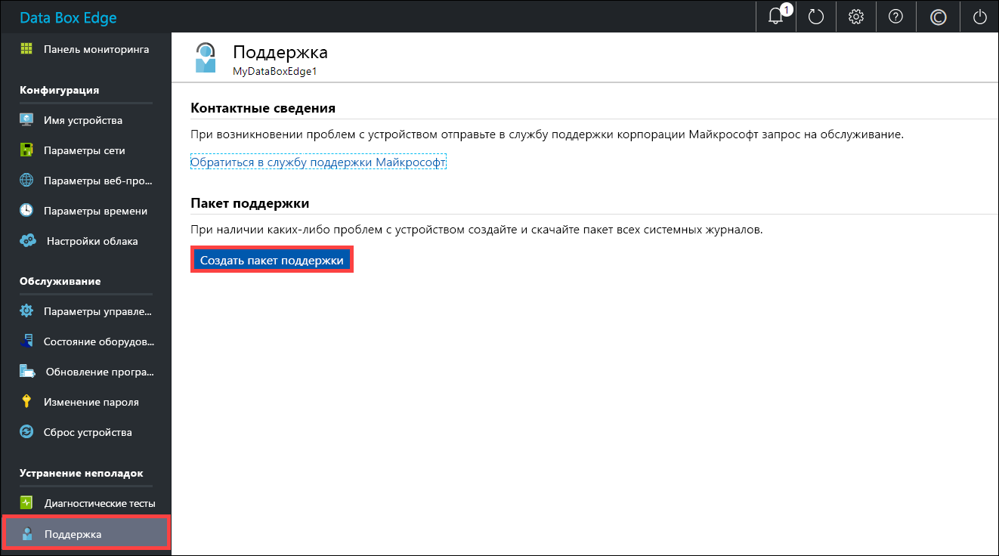
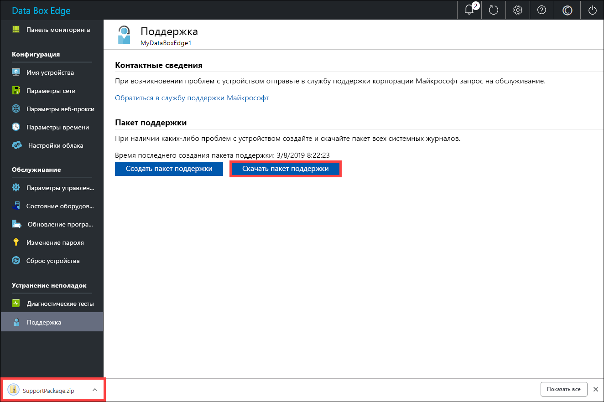

# <a name="troubleshoot-your-azure-data-box-edge-issues"></a>Устранение неполадок в Azure Data Box Edge 

В этой статье описывается устранение неполадок в Azure Data Box Edge. 

В этой статье раскрываются следующие темы:

> [!div class="checklist"]
> * Запуск диагностики
> * Сбор пакета поддержки.
> * Использование журналов для устранения неполадок.


## <a name="run-diagnostics"></a>Запуск диагностики

Чтобы диагностировать и устранить любые ошибки устройства, можно запустить диагностические тесты. Чтобы запустить диагностические тесты, сделайте следующее в локальном веб-интерфейсе устройства.

1. В локальном веб-интерфейсе выберите **Устранение неполадок > Diagnostic tests** (Диагностические тесты). Выберите тест, который необходимо запустить, и нажмите кнопку **Запустить тест**. Это действие запускает тесты для выявления возможных проблем с настройками сети, устройства, веб-прокси, времени или облака. Вы получаете уведомление о том, что устройство тестируется.

    
 
2. По завершении тестов отобразятся результаты. 

    

    Если тест завершается сбоем, отобразится URL-адрес для рекомендуемого действия. Вы можете щелкнуть URL-адрес, чтобы просмотреть рекомендуемое действие.
 
    


## <a name="collect-support-package"></a>Сбор пакета поддержки

Пакет журналов содержит все журналы, которые могут помочь сотрудникам службы поддержки Майкрософт в устранении неполадок на любом устройстве. Создать пакет журналов можно с помощью локального веб-интерфейса.

Чтобы собрать пакет поддержки, сделайте следующее. 

1. В локальном пользовательском веб-интерфейсе выберите **Устранение неполадок > Поддержка**. Щелкните **Создать пакет поддержки**. Система начнет собирать пакет поддержки. Сбор пакета может занять несколько минут.

    
 
2. После создания пакета поддержки щелкните **Скачать пакет поддержки**. ZIP-пакет загружается по выбранному пути. Пакет можно распаковать и просмотреть файлы системных журналов.

    

## <a name="use-logs-to-troubleshoot"></a>Использование журналов для устранения неполадок

Все ошибки, возникшие во время передачи и обновления, добавляются в соответствующие файлы с ошибками.

1. Чтобы просмотреть файлы с ошибками, перейдите в общую папку и щелкните ее. 

      

2. Щелкните _папку Microsoft Data Box Edge_. Эта папка содержит две вложенные папки:

    - Отправьте папку, содержащую файлы журнала для ошибок отправки.
    - Обновите папку для ошибок во время обновления.

    Ниже приведен пример файла журнала для обновления.

    ```
    <root container="test1" machine="VM15BS020663" timestamp="03/18/2019 00:11:10" />
    <file item="test.txt" local="False" remote="True" error="16001" />
    <summary runtime="00:00:00.0945320" errors="1" creates="2" deletes="0" insync="3" replaces="0" pending="9" />
    ``` 

3. Когда появится сообщение об ошибке в этом файле (выделено в примере), запишите код ошибки, в данном случае это 16001. Найдите описание этого кода ошибки, используя следующий справочник по ошибкам.

    [!INCLUDE [data-box-edge-edge-upload-error-reference](../../includes/data-box-edge-gateway-upload-error-reference.md)]


## <a name="next-steps"></a>Дополнительная информация

- Дополнительные сведения об [известных проблемах в этом выпуске](data-box-gateway-release-notes.md).
