# Управление общими папками в Шлюзе Azure Data Box с помощью портала Azure 

В этой статье описывается управление общими папками в Шлюзе Azure Data Box. Вы можете управлять Шлюзом Azure Data Box на портале Azure или с помощью локального пользовательского веб-интерфейса. С помощью портала Azure можно добавлять, удалять и обновлять общие папки или синхронизировать ключ хранилища для учетной записи хранения, связанной с общими папками.

## Сведения об общих папках

Для передачи данных в Azure необходимо создать общие папки в Шлюзе Azure Data Box. Общие папки, добавляемые на устройство Шлюза Data Box, являются облачными. Данные из этих общих папок автоматически отправляются в облако. К этим общим папкам применяются все облачные функции, такие как обновление и синхронизация ключей хранилища. Если требуется, чтобы данные устройства автоматически помещались в учетную запись хранения в облаке, используйте облачные общие папки.

В этой статье раскрываются следующие темы:

> [!div class="checklist"]
> * Добавление общей папки
> * Удаление общей папки
> * Обновление общих папок
> * Синхронизация ключа хранилища

## Добавление общей папки

Чтобы создать общую папку, выполните следующие действия на портале Azure.

1. На портале Azure выберите ресурс Шлюза Data Box и перейдите к разделу **Обзор**. На панели команд щелкните **+ Add share** (+ Добавление общего файлового ресурса).
2. В разделе **Добавление общего файлового ресурса** укажите параметры общей папки. Укажите уникальное имя для общей папки.

    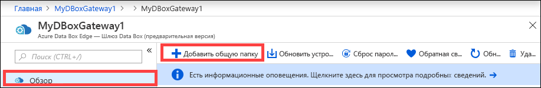

    Имена общих папок могут содержать только цифры, строчные буквы и дефисы. Имя общей папки может содержать от 3 до 63 знаков и начинаться с буквы или цифры. Перед каждым дефисом должен быть знак без дефиса.

3. Выберите **тип** для общей папки. Вы можете выбрать тип **SMB** или **NFS** (тип SMB задан по умолчанию). SMB является стандартным для клиентов Windows, а NFS используется для клиентов Linux. В зависимости от того, выбраны ли общие папки типа SMB или NFS, предложенные варианты могут немного отличаться.

4. Предоставьте **учетную запись хранения**, в которой будет храниться общая папка. При отсутствии контейнера он создается в учетной записи хранения с именем общей папки. Если контейнер уже существует, используется имеющийся контейнер.

5. В блочном BLOB-объекте, страничном BLOB-объекте или файлах выберите **Служба хранилища**. Тип выбранной службы зависит от того, в каком формате необходимо хранить данные в Azure. Например, в данном экземпляре необходимо, чтобы данные хранились как блочные BLOB-объекты в Azure, поэтому мы выбираем **Блочный BLOB-объект**. При выборе варианта **Страничный BLOB-объект** необходимо убедиться, что данные выровнены по размеру 512 байт. Например, VHDX всегда выравнивается по размеру 512 байт.

6. Этот шаг зависит от того, создается ли общая папка типа SMB или NFS.
    - **При создании общей папки SMB** в поле **Все привилегированные локальные пользователи** выберите **Создать** или **Использовать существующий**. При создании локального пользователя укажите **имя пользователя** и **пароль**, а затем подтвердите пароль. Таким образом вы предоставите разрешения локальному пользователю. Назначив разрешения здесь, вы сможете изменять их в проводнике.

        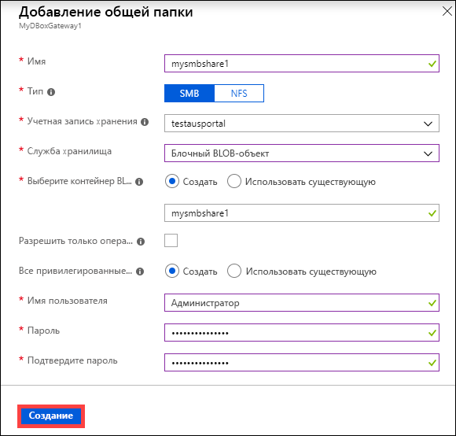

        Если разрешить только операции чтения для данных этой общей папки, можно указать пользователей с правами только для чтения.
    - **При создании общей папки типа NFS** необходимо предоставить **IP-адреса разрешенных клиентов**, которые могут получать доступ к ресурсу.

        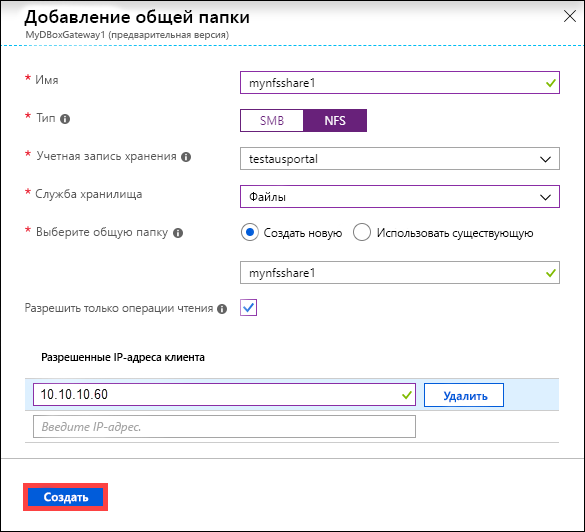

7. Щелкните **Создать**, чтобы создать общую папку. Вы получите уведомление о том, что общая папка создается. После создания общей папки с указанными параметрами колонка **Общие папки** обновится, и в ней появится новая общая папка.
 
## Удаление общей папки

Чтобы удалить общую папку, выполните следующие действия на портале Azure.

1. В списке общих папок выберите и щелкните папку, которую требуется удалить.

    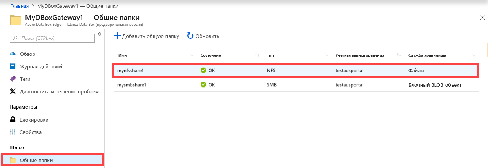

2. Нажмите кнопку **Delete**(Удалить). 

    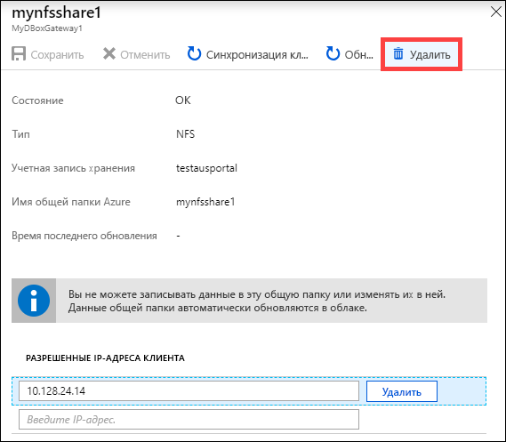

3. При появлении запроса на подтверждение нажмите кнопку **Да**.

    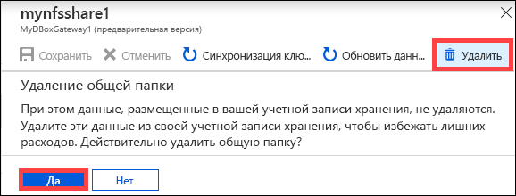

Таблица общих папок обновляется с учетом удаления.

## Обновление общих папок

Возможность обновления позволяет обновить содержимое локальной общей папки. При обновлении общей папки будет инициирован поиск всех объектов Azure, включая большие двоичные объекты и файлы, добавленные в облако с момента последнего обновления. Затем эти дополнительные файлы используются для обновления содержимого локальной общей папки на устройстве. 

> [!NOTE]
> Разрешения и списки управления доступом (ACL) не сохраняются при операции обновления. 

Чтобы обновить общую папку, выполните следующие действия на портале Azure.

1.  На портале Azure перейдите к разделу **Общие папки**. Выберите и щелкните общую папку, которую требуется обновить.

    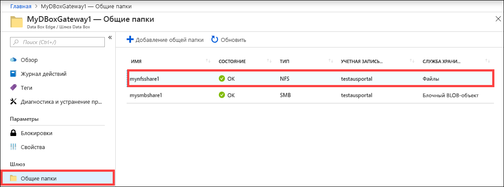

2.  Щелкните **Refresh** (Обновить). 

    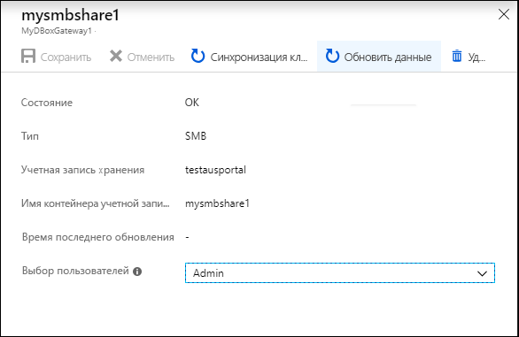
 
3.  При появлении запроса на подтверждение нажмите кнопку **Да**. Запустится задание обновления содержимого локальной общей папки. 

    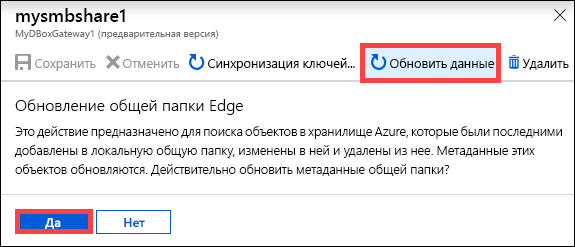
 
4.  Во время обновления в контекстном меню недоступна функция обновления. Щелкните уведомление задания, чтобы просмотреть состояние задания обновления.

5.  Время обновления зависит от количества файлов в контейнере Azure и на устройстве. После успешного обновления общей папки обновляется ее метка времени. Даже если во время обновления произошли частичные сбои, операция считается успешной и метка времени обновляется. 

    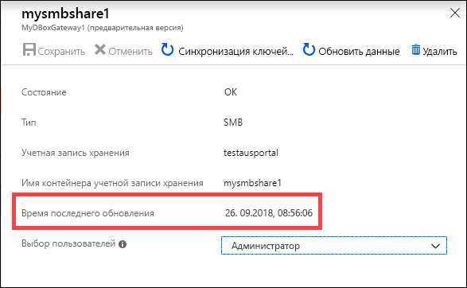
 
Если возникает сбой, создается предупреждение. В этом предупреждении подробно описываются причина его возникновения и рекомендации для устранения проблем. Предупреждение также содержит ссылки на файл, содержащий всю сводку сбоев, включая файлы, которые не удалось обновить или удалить.

>[!IMPORTANT]
> В этом выпуске не следует одновременно обновлять несколько общих папок.

## Синхронизация ключей хранилища

Если ключи учетной записи хранения изменены, необходимо синхронизировать ключи доступа к хранилищу. Путем выполнения синхронизации можно получить последние ключи для учетной записи устройства.

Выполните следующие действия на портале Azure, чтобы синхронизировать ключ доступа к хранилищу.

1. В своем ресурсе перейдите к разделу **Обзор**. 
2. Из списка общих папок выберите и щелкните ту, которая связана с учетной записью хранения и которую необходимо синхронизировать. Щелкните **Sync storage key** (Синхронизация ключа хранилища). 

     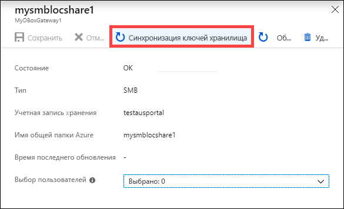

3. Щелкните **Да** при запросе на подтверждение. После синхронизации закройте диалоговое окно.

     

>[!NOTE]
> Это действие достаточно выполнить один раз для каждой учетной записи хранения. Не нужно повторять это действие для всех общих папок, связанных с одной учетной записью.

## Дальнейшие действия

- Узнайте, как [управлять пользователями с помощью портала Azure](data-box-gateway-manage-users.md).
