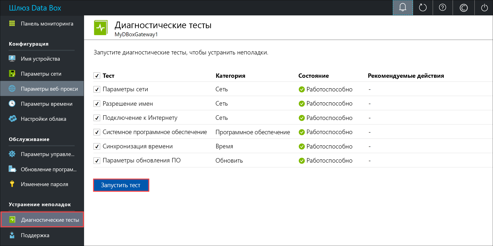
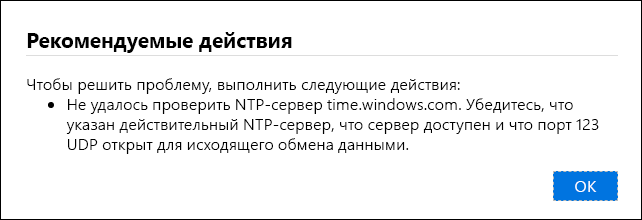
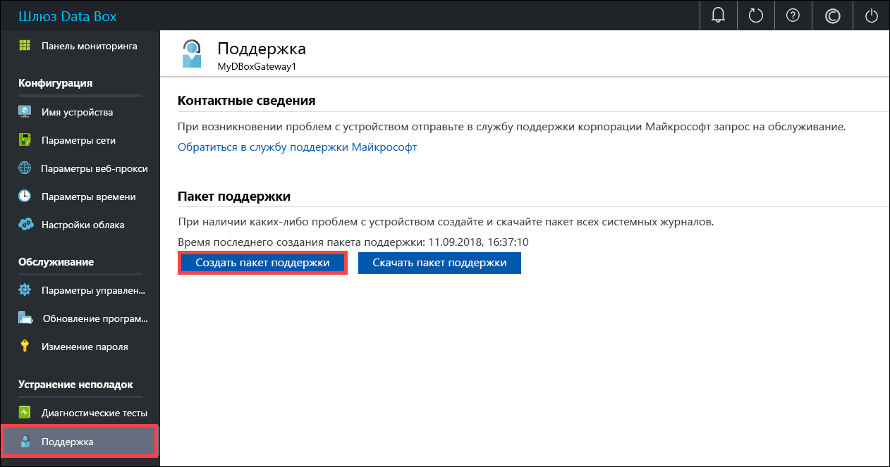
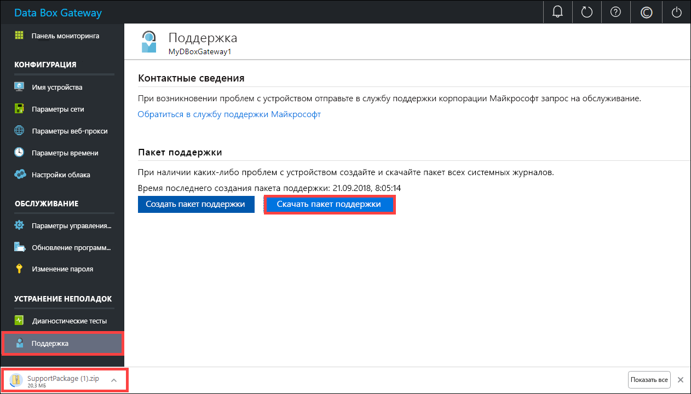
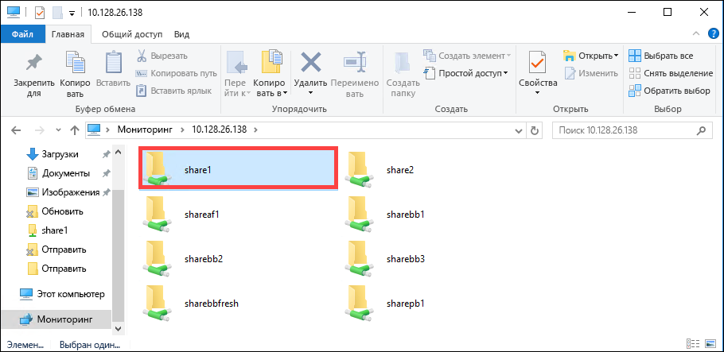

# <a name="troubleshoot-your-azure-data-box-gateway-issues"></a>Устранение неполадок в Шлюзе Azure Data Box 

В этой статье описывается устранение неполадок в Шлюзе Azure Data Box. 

> [!IMPORTANT]
> - Шлюз Data Box доступен в качестве предварительной версии. Изучите [Дополнительные условия использования Предварительных выпусков Microsoft Azure](https://azure.microsoft.com/support/legal/preview-supplemental-terms/), прежде чем заказывать и развертывать это решение.

В этой статье раскрываются следующие темы:

> [!div class="checklist"]
> * Запуск диагностики
> * Сбор пакета поддержки.
> * Использование журналов для устранения неполадок.


## <a name="run-diagnostics"></a>Запуск диагностики

Чтобы диагностировать и устранить любые ошибки устройства, можно запустить диагностические тесты. Чтобы запустить диагностические тесты, сделайте следующее в локальном веб-интерфейсе устройства.

1. В локальном веб-интерфейсе выберите **Устранение неполадок > Diagnostic tests** (Диагностические тесты). Выберите тест, который необходимо запустить, и нажмите кнопку **Запустить тест**. Это действие запускает тесты для выявления возможных проблем с настройками сети, устройства, веб-прокси, времени или облака. Вы получаете уведомление о том, что устройство тестируется.

    
 
2. По завершении тестов отобразятся результаты. Если тест завершается сбоем, отобразится URL-адрес для рекомендуемого действия. Вы можете щелкнуть URL-адрес, чтобы просмотреть рекомендуемое действие. 
 
    


## <a name="collect-support-package"></a>Сбор пакета поддержки

Пакет журналов содержит все журналы, которые могут помочь сотрудникам службы поддержки Майкрософт в устранении неполадок на любом устройстве. Создать пакет журналов можно с помощью локального веб-интерфейса.

Чтобы собрать пакет поддержки, сделайте следующее. 

1. В локальном пользовательском веб-интерфейсе выберите **Устранение неполадок > Поддержка**. Щелкните **Создать пакет поддержки**. Система начнет собирать пакет поддержки. Сбор пакета может занять несколько минут.

    
 
2. После создания пакета поддержки щелкните **Скачать пакет поддержки**. ZIP-пакет загружается по выбранному пути. Пакет можно распаковать и просмотреть файлы системных журналов.

    

## <a name="use-logs-to-troubleshoot"></a>Использование журналов для устранения неполадок

Все ошибки, возникшие во время передачи и обновления, добавляются в соответствующие файлы с ошибками.

1. Чтобы просмотреть файлы с ошибками, перейдите в общую папку и щелкните ее. 

      

2. Щелкните _папку Шлюза Azure Data Box_. Эта папка содержит две вложенные папки:

    - Отправьте папку, содержащую файлы журнала для ошибок отправки.
    - Обновите папку для ошибок во время обновления.

    Ниже приведен пример файла журнала для обновления.

    ```
    <root container="brownbag1" machine="VM15BS020663" timestamp="07/18/2018 00:11:10" />
    <file item="test.txt" local="False" remote="True" error="16001" />
    <summary runtime="00:00:00.0945320" errors="1" creates="2" deletes="0" insync="3" replaces="0" pending="9" />
    ``` 

3. Когда появится сообщение об ошибке в этом файле (выделено в примере), запишите код ошибки, в данном случае это 16001. Найдите описание этого кода ошибки, используя следующий справочник по ошибкам.

    |     Код ошибки     |     Имя исключения                                         |     Описание ошибки                                                                                                                                                                                                                     |
    |--------------------|------------------------------------------------------------|-------------------------------------------------------------------------------------------------------------------------------------------------------------------------------------------------------------------------------------------|
    |    100             |    ERROR_CONTAINER_OR_SHARE_NAME_LENGTH                    |    Имя контейнера или общей папки должно содержать от 3 до 63 знаков.                                                                                                                                                                     |
    |    101             |    ERROR_CONTAINER_OR_SHARE_NAME_ALPHA_NUMERIC_DASH        |    Имя контейнера или общей папки должно состоять только из букв, цифр или дефисов.                                                                                                                                                       |
    |    102             |    ERROR_CONTAINER_OR_SHARE_NAME_IMPROPER_DASH             |    Имя контейнера или общей папки должно состоять только из букв, цифр или дефисов.                                                                                                                                                       |
    |    103             |    ERROR_BLOB_OR_FILE_NAME_CHARACTER_CONTROL               |    Имя большого двоичного объекта или файла содержит неподдерживаемые символы управления.                                                                                                                                                                       |
    |    104             |    ERROR_BLOB_OR_FILE_NAME_CHARACTER_ILLEGAL               |    Имя большого двоичного объекта или файла содержит недопустимые символы.                                                                                                                                                                                   |
    |    105             |    ERROR_BLOB_OR_FILE_NAME_SEGMENT_COUNT                   |    Имя большого двоичного объекта или файла содержит слишком много сегментов (каждый сегмент разделен косой чертой — /).                                                                                                                                              |
    |    106             |    ERROR_BLOB_OR_FILE_NAME_AGGREGATE_LENGTH                |    Имя большого двоичного объекта файла слишком длинное.                                                                                                                                                                                                     |
    |    107             |    ERROR_BLOB_OR_FILE_NAME_COMPONENT_LENGTH                |    Один из сегментов в большом двоичном объекте или имени файла слишком длинный.                                                                                                                                                                            |
    |    108             |    ERROR_BLOB_OR_FILE_SIZE_LIMIT                           |    Размер файла превышает максимальный размер файла для отправки.                                                                                                                                                                              |
    |    109             |    ERROR_BLOB_OR_FILE_SIZE_ALIGNMENT                       |    Большой двоичный объект или файл неправильно выровнен.                                                                                                                                                                                               |
    |    110             |    ERROR_NAME_NOT_VALID_UNICODE                            |    Имя файла или большой двоичный объект в кодировке Юникод является недопустимым.                                                                                                                                                                                  |
    |    111             |    ERROR_RESERVED_NAME_NOT_ALLOWED                         |    Имя или префикс файла или большого двоичного объекта — это зарезервированное имя, которое не поддерживается (например, COM1).                                                                                                                             |
    |    2000            |    ERROR_ETAG_MISMATCH                                     |    Несовпадение ETag указывает на наличие конфликта между большими двоичными объектом в облаке и на устройстве. Чтобы устранить этот конфликт, удалите один из этих файлов – версию в облаке или на устройстве.    |
    |    2001            |    ERROR_UNEXPECTED_FINALIZE_FAILURE                       |    Непредвиденная ошибка при обработке файла после его отправки.    Если эта ошибка отображается и сохраняется более 24 часов, обратитесь в службу поддержки.                                                      |
    |    2002            |    ERROR_ALREADY_OPEN                                      |    Файл уже открыт в другом процессе и его нельзя отправить, пока не будет закрыта обработка.                                                                                                                                       |
    |    2003            |    ERROR_UNABLE_TO_OPEN                                    |    Не удалось открыть файл для отправки. Если вы видите эту ошибку, обратитесь в службу поддержки Майкрософт.                                                                                                                                                |
    |    2004            |    ERROR_UNABLE_TO_CONNECT                                 |    Не удалось подключиться к контейнеру, чтобы отправить в него данные.                                                                                                                                                                             |
    |    2005            |    ERROR_INVALID_CLOUD_CREDENTIALS                         |    Не удалось подключиться к контейнеру, так как разрешения учетной записи неправильные или устаревшие. Проверьте доступ.                                                                                                               |
    |    2006            |    ERROR_CLOUD_ACCOUNT_DISABLED                            |    Не удалось отправить данные в учетную запись, так как учетная запись или общая папка отключена.                                                                                                                                                            |
    |    2007            |    ERROR_CLOUD_ACCOUNT_PERMISSIONS                         |    Не удалось подключиться к контейнеру, так как разрешения учетной записи неправильные или устаревшие. Проверьте доступ.                                                                                                               |
    |    2008            |    ERROR_CLOUD_CONTAINER_SIZE_LIMIT_REACHED                |    Не удалось добавить новые данные, так как контейнер заполнен. Проверьте спецификации Azure для поддерживаемых размеров контейнера в зависимости от типа. Например, максимальный размер файла, который поддерживает файл Azure, составляет всего 5 ТБ.                                     |
    |    2998            |    ERROR_UNMAPPED_FAILURE                                  |    Произошла непредвиденная ошибка. Ошибка может устранится самостоятельно, но если она не исчезает более 24 часов, обратитесь в службу поддержки Майкрософт.                                                                                                     |
    |    16000           |    RefreshException                                        |    Не удалось закрыть этот файл.                                                                                                                                                                                                        |
    |    16001           |    RefreshAlreadyExistsException                           |    Не удалось закрыть этот файл, так как он уже существует в локальной системе.                                                                                                                                                         |
    |    16002           |    RefreshWorkNeededException                              |    Не удалось обновить этот файл, так как он отправлен не полностью.                                                                                                                                                                          | 


## <a name="next-steps"></a>Дополнительная информация

- Дополнительные сведения об [известных проблемах в этом выпуске](data-box-gateway-release-notes.md).
