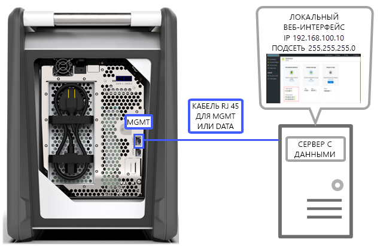
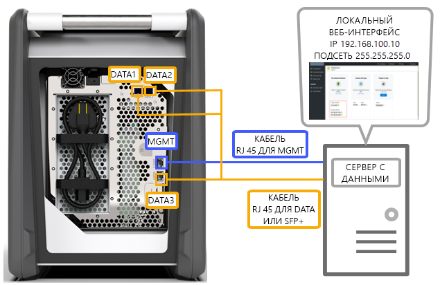
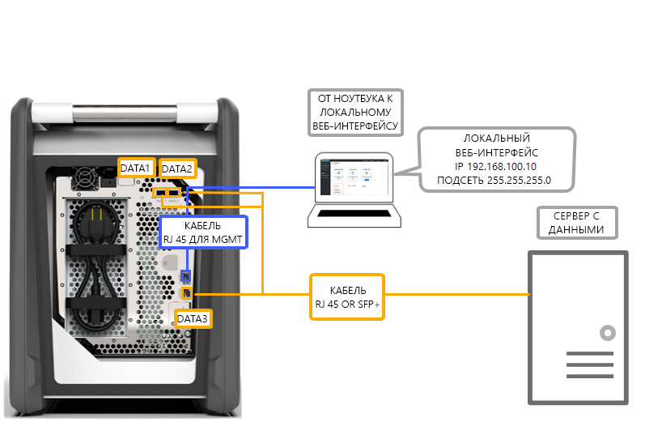
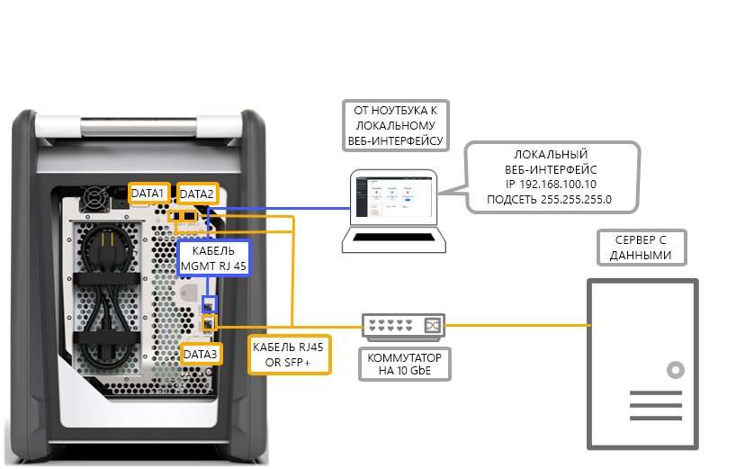
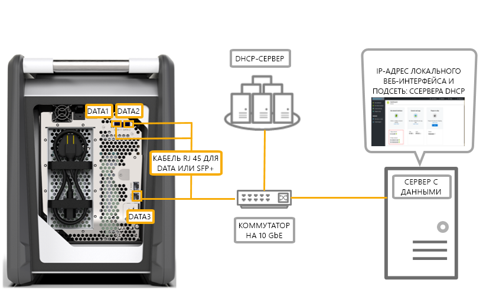

# Варианты подключения кабелей к устройству Azure Data Box

В этой статье описываются различные способы подключения Azure Data Box для передачи данных.

## Передача через порт MGMT

Этот вариант является абсолютной минимальной конфигурацией для Data Box. Вы можете настроить только порт MGMT и для управления данными, и для их передачи.

Перед началом работы убедитесь, что у вас есть следующие ресурсы:

- Кабель Ethernet RJ45 для MGMT.
- Источник данных под управлением [поддерживаемой ОС](data-box-system-requirements.md#supported-operating-systems-for-clients).

Выполните следующие действия, чтобы подключить кабель к устройству.

1. Используйте кабель RJ45 для подключения порта MGMT к серверу с данными.

    

2. На сервере задайте следующие значения:

    - **IP-адрес**: 192.168.100.5.
    - **Подсеть**: 255.255.255.0.

3. Перейдите к локальному пользовательскому веб-интерфейсу на устройстве по адресу: 192.168.100.10. Войдите в систему и разблокируйте Data Box, используя пароль разблокировки с портала Azure.

## Передача через порт DATA с использованием статических IP-адресов

Вы можете настроить два порта для Data Box: порт MGMT для управления трафиком и один из портов данных для передачи данных. Порты данных могут быть следующими: DATA 1, DATA 2 или DATA 3.

При настройке только одного порта данных мы настоятельно рекомендуем настроить порт 10 GbE, такой как DATA 1 или DATA 2. Порт 1 GbE значительно увеличит время, необходимое для передачи данных.

Перед началом работы убедитесь, что у вас есть следующие ресурсы:

- Кабель Ethernet RJ45 для MGMT.
- Медный кабель 10 GbE SFP+ Twinax для каждого порта данных 10 GbE, который необходимо подключить.
- Один или несколько источников данных под управлением [поддерживаемой ОС](data-box-system-requirements.md#supported-operating-systems-for-clients).

### Вариант 1. Начальная настройка через сервер

Выполните следующие действия, чтобы подключить кабель к устройству.

1. Для конфигурации используйте кабель Ethernet RJ45, подключенный с сервера непосредственно к порту MGMT.
2. Используйте кабели RJ45 для DATA 3 или SFP+ для подключения DATA 1 или DATA 2 к серверу, выступающему в качестве источника данных. Мы рекомендуем использовать порты 10 GbE DATA 1 или DATA 2 для обеспечения высокой производительности.
3. На сервере задайте следующие значения:

   - **IP-адрес**: 192.168.100.5.
   - **Подсеть**: 255.255.255.0.

     

3. Перейдите к локальному пользовательскому веб-интерфейсу на устройстве по адресу: 192.168.100.10. Войдите в систему и разблокируйте Data Box, используя пароль разблокировки с портала Azure.
4. Назначьте статические IP-адреса для настроенных портов данных.

### Вариант 2. Начальная настройка с помощью отдельного компьютера

Выполните следующие действия, чтобы подключить кабель к устройству.

1. Для конфигурации используйте кабель Ethernet RJ45, подключенный с сервера непосредственно к порту MGMT.
2. Используйте кабели RJ45 для DATA 3 или SFP+ для подключения DATA 1 или DATA 2 к серверу. Мы рекомендуем использовать порты 10 GbE DATA 1 или DATA 2 для обеспечения высокой производительности. Порты данных подключаются через коммутатор 10 GbE к серверу с данными.
3. Настройте адаптер Ethernet на ноутбуке, который используется для подключения к устройству, указав следующие значения:

   - **IP-адрес**: 192.168.100.5.
   - **Подсеть**: 255.255.255.0.

     

3. Перейдите к локальному пользовательскому веб-интерфейсу на устройстве по адресу: 192.168.100.10. Войдите в систему и разблокируйте Data Box, используя пароль разблокировки с портала Azure.
4. Определите IP-адреса, назначенные сервером DHCP.

## Передача через порт DATA с использованием статических IP-адресов и коммутатора 

Используйте эту конфигурацию для нескольких источников данных в сетях 1 и 10 GbE.

Перед началом работы убедитесь, что у вас есть следующие ресурсы:

- Кабель Ethernet RJ45 для MGMT.
- Медный кабель 10 GbE SFP+ Twinax для каждого порта данных 10 GbE, который необходимо подключить.
- Один или несколько источников данных под управлением [поддерживаемой ОС](data-box-system-requirements.md#supported-operating-systems-for-clients). Эти источники данных могут находиться в разных сетях, например 1 или 10 GbE.

Выполните следующие действия, чтобы подключить кабель к устройству.

1. Для конфигурации используйте кабель Ethernet RJ45, подключенный с сервера непосредственно к порту MGMT.
2. Используйте кабели RJ45 для DATA 3 или SFP+ для подключения DATA 1 или DATA 2 к серверу. Мы рекомендуем использовать порты 10 GbE DATA 1 или DATA 2 для обеспечения высокой производительности.
3. Настройте адаптер Ethernet на ноутбуке, который используется для подключения к устройству, указав следующие значения:

   - **IP-адрес**: 192.168.100.5.
   - **Подсеть**: 255.255.255.0.

     

3. Перейдите к локальному пользовательскому веб-интерфейсу на устройстве по адресу: 192.168.100.10. Войдите в систему и разблокируйте Data Box, используя пароль разблокировки с портала Azure.
4. Назначьте статические IP-адреса для настроенных портов данных.

## Передача через порт DATA в среде DHCP

Используйте эту конфигурацию, если ваше устройство будет находиться в среде DHCP.

Перед началом работы убедитесь, что у вас есть следующие ресурсы:

- Кабель RJ45, если вы хотите подключить DATA 1.
- Медный кабель 10 GbE SFP+ Twinax для каждого порта данных 10 GbE, который необходимо подключить.
- Один или несколько источников данных под управлением [поддерживаемой ОС](data-box-system-requirements.md#supported-operating-systems-for-clients). Эти источники данных могут находиться в разных сетях, например 1 или 10 GbE.

Выполните следующие действия, чтобы подключить кабель к устройству.

1. Используйте кабель RJ45 или SFP+ для подключения к серверу с помощью коммутатора (где доступен DHCP-сервер).

    
2. Для определения IP-адреса используйте DHCP-сервер или DNS-сервер.
3. С сервера в той же сети обратитесь к локальному веб-интерфейсу устройства, используя IP-адрес, назначенный сервером DHCP. Войдите в систему и разблокируйте Data Box, используя пароль разблокировки с портала Azure.

## Дополнительная информация

- После подключения устройства ознакомьтесь со статьей [Руководство: копирование данных в Azure Data Box](data-box-deploy-copy-data.md).
