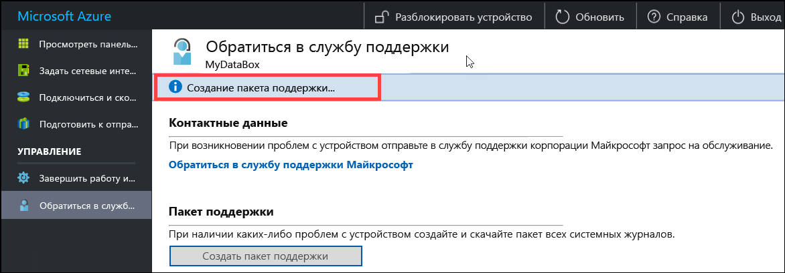
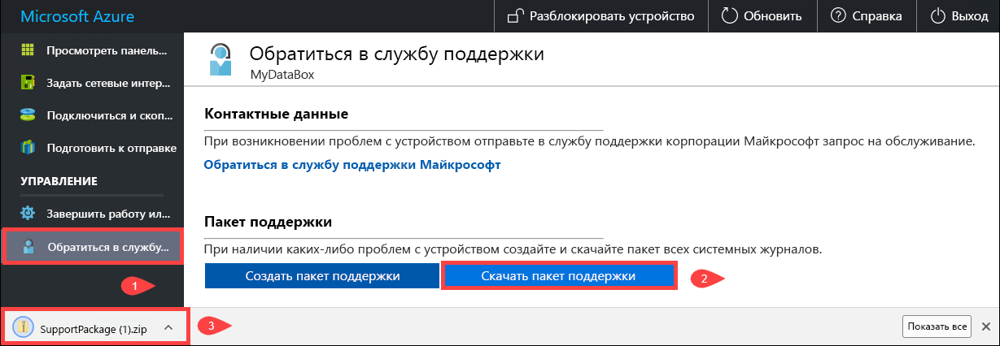
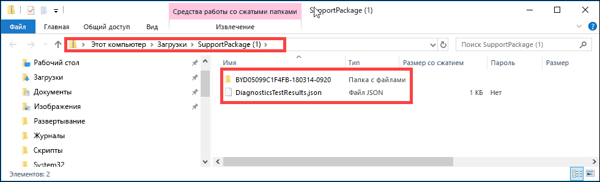
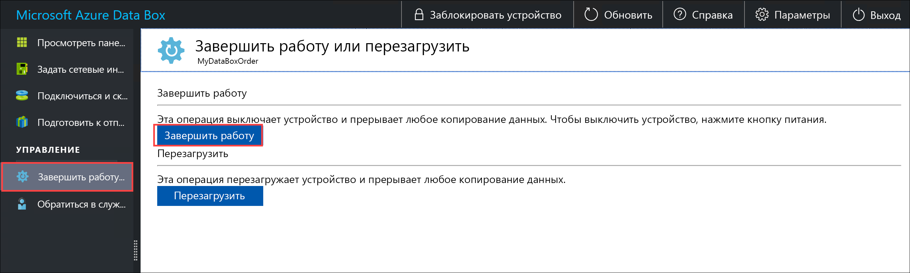
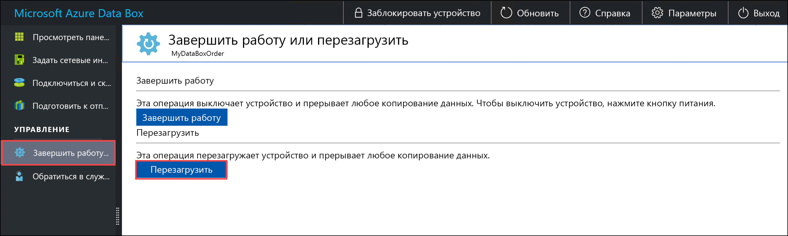
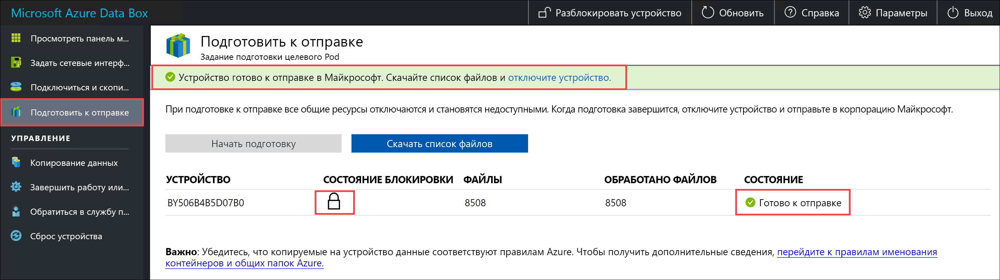
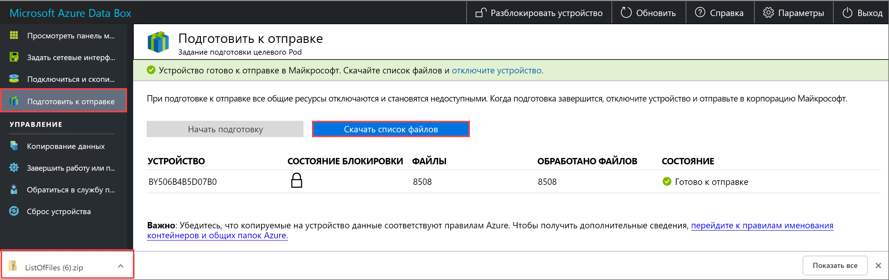
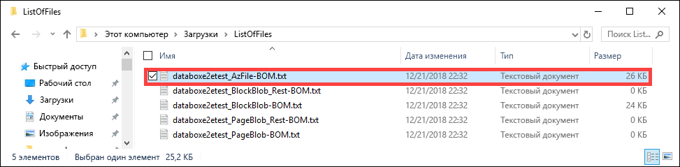
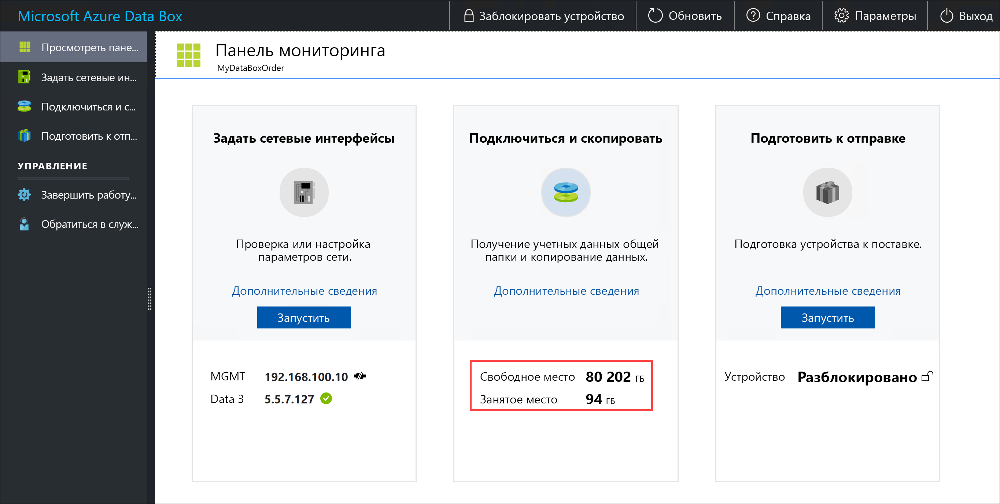
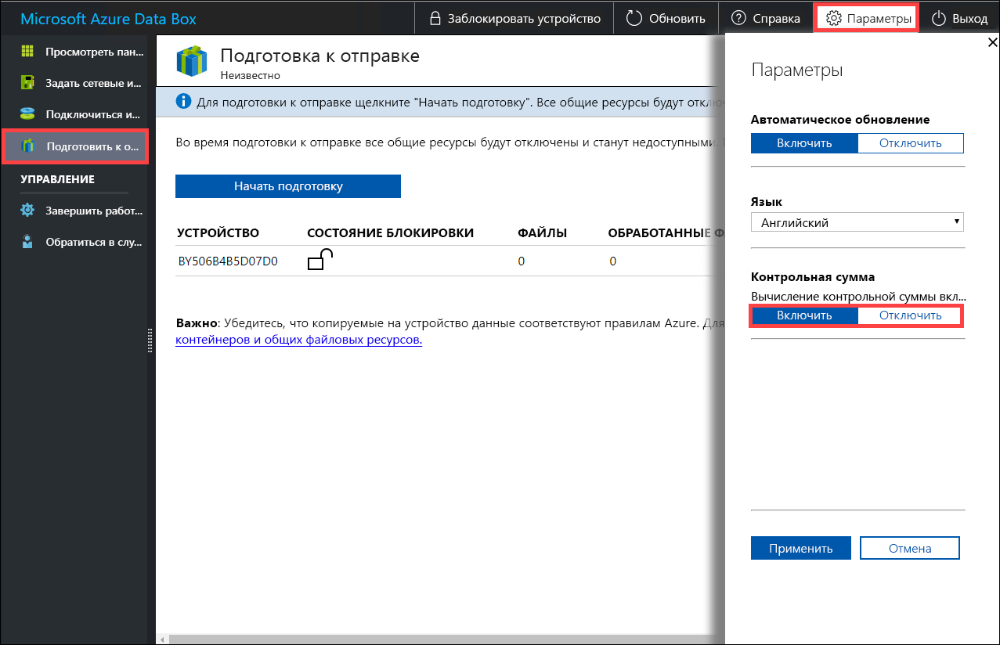

# <a name="use-the-local-web-ui-to-administer-your-data-box-and-data-box-heavy"></a>Использовать локальный веб-Интерфейс для администрирования Data Box и интенсивной поле данных

В этой статье описываются некоторые задачи конфигурации и управления, которые могут выполняться на устройствах Data Box и интенсивной поле данных. Вы можете управлять устройствами Data Box и интенсивной поле данных через пользовательский Интерфейс портала Azure и локального веб-интерфейса для устройства. В этой статье речь идет о задачах, выполняемых с использованием локального пользовательского веб-интерфейса.

Локальный веб-Интерфейс для Data Box и интенсивной поле данных используется для выполнения начальной настройки устройства. Чтобы завершить работу или перезагрузить устройство, запустите диагностические тесты, обновления программного обеспечения, просмотреть журналы копирования и создание пакета журналов для поддержки Майкрософт также можно локального веб-интерфейса. На устройстве большой поле данных с двумя узлами, независимым доступны два пользовательских отдельный локальный веб-интерфейсов, соответствующий на каждый узел устройства.

В этой статье содержатся руководства, позволяющие выполнить следующие задачи:

- Создание пакета поддержки
- завершение работы или перезапуск устройства.
- Скачивание файла метки порядка байтов или манифеста
- Просмотр доступной емкости устройства
- Пропуск проверки контрольной суммы

## <a name="generate-support-package"></a>Создание пакета поддержки

Если возникают проблемы с устройством, из системных журналов можно создать пакет поддержки. Служба поддержки Майкрософт использует этот пакет для устранения неполадок. Чтобы создать пакет поддержки, выполните следующие действия:

1. В локальном пользовательском веб-интерфейсе перейдите в раздел **Связаться со службой поддержки** и щелкните **Создать пакет поддержки**.

    

2. Создание пакета поддержки. Эта операция занимает несколько минут.

    

3. По завершении создания пакета поддержки щелкните **Скачать пакет поддержки**. 

    

4. Просмотрите и выберите расположение загрузки. Откройте папку, чтобы просмотреть содержимое.

    


## <a name="shut-down-or-restart-your-device"></a>завершение работы или перезапуск устройства.

Можно выключить или перезагрузить устройство с помощью локального веб-интерфейса. Перед тем как перезапустить устройство, рекомендуется отключить автономный доступ к ресурсам на хосте, а затем на устройстве. Это уменьшает возможность повреждения данных. Убедитесь, что при завершении работы устройства не выполняется копирование данных.

Чтобы завершить работу устройства, выполните следующие действия.

1. В локальном пользовательском веб-интерфейсе перейдите в раздел **Завершение работы или перезагрузка**.
2. Щелкните **Завершение работы**.

    

3. Когда появится запрос на подтверждение, нажмите кнопку **OK**.

    

Если устройство выключено, включите его, воспользовавшись кнопкой питания на передней панели.

Чтобы перезагрузить Data Box, выполните следующие действия.

1. В локальном пользовательском веб-интерфейсе перейдите в раздел **Завершение работы или перезагрузка**.
2. Щелкните **Перезапустить**.

    

3. Когда появится запрос на подтверждение, нажмите кнопку **OK**.

   Устройство завершит работу, а затем перезагрузится.

## <a name="download-bom-or-manifest-files"></a>Скачивание файла метки порядка байтов или манифеста

Билл материалов (BOM) или файлы манифеста содержит список файлов, которые копируются на Data Box или большой поле данных. Эти файлы создаются в том случае, когда Подготовка устройства для отправки.

Перед началом работы убедитесь, что устройство завершено **Подготовка к отправке** шаг. Чтобы скачать файл метки порядка байтов или манифеста, сделайте следующее:

1. Перейдите к локального веб-интерфейса для вашего устройства. Вы увидите, что устройство завершена Подготовка к отправке. По завершении подготовки состояние устройства отобразится как **Все готово к поставке**.

    

2. Нажмите кнопку **Скачать список файлов**, чтобы скачать список файлов, которые были скопированы на устройство Data Box.

    

3. В проводнике будет создан отдельный список файлов, имена которых зависят от применяемого для подключения к устройству протокола и используемого типа службы хранилища Azure.

    

   В следующей таблице имена файлов сопоставлены с типом службы хранилища Azure и используемым протоколом подключения.

    |Имя файла  |Тип службы хранилища Azure  |Используемый протокол подключения |
    |---------|---------|---------|
    |databoxe2etest_BlockBlob.txt     |Блочные BLOB-объекты         |SMB/NFS         |
    |databoxe2etest_PageBlob.txt     |Blob-страницы         |SMB/NFS         |
    |databoxe2etest_AzFile-BOM.txt    |Файлы Azure         |SMB/NFS         |
    |databoxe2etest_PageBlock_Rest-BOM.txt     |Blob-страницы         |REST        |
    |databoxe2etest_BlockBlock_Rest-BOM.txt    |Блочные BLOB-объекты         |REST         |
    |mydbmdrg1_MDisk-BOM.txt    |Управляемые диски         |SMB/NFS         |
    |mydbmdrg2_MDisk-BOM.txt     |Управляемые диски         |SMB/NFS         |

Используйте этот список, чтобы проверить файлы, отправленные в учетную запись хранения Azure, после возврата устройства Data Box в центр обработки данных Azure. Ниже приведен пример файла манифеста.

> [!NOTE]
> В условиях большой поле данных два набора список файлов (BOM) присутствуют соответствующие двумя узлами на устройстве.

```xml
<file size="52689" crc64="0x95a62e3f2095181e">\databox\media\data-box-deploy-copy-data\prepare-to-ship2.png</file>
<file size="22117" crc64="0x9b160c2c43ab6869">\databox\media\data-box-deploy-copy-data\connect-shares-file-explorer2.png</file>
<file size="57159" crc64="0x1caa82004e0053a4">\databox\media\data-box-deploy-copy-data\verify-used-space-dashboard.png</file>
<file size="24777" crc64="0x3e0db0cd1ad438e0">\databox\media\data-box-deploy-copy-data\prepare-to-ship5.png</file>
<file size="162006" crc64="0x9ceacb612ecb59d6">\databox\media\data-box-cable-options\cabling-dhcp-data-only.png</file>
<file size="155066" crc64="0x051a08d36980f5bc">\databox\media\data-box-cable-options\cabling-2-port-setup.png</file>
<file size="150399" crc64="0x66c5894ff328c0b1">\databox\media\data-box-cable-options\cabling-with-switch-static-ip.png</file>
<file size="158082" crc64="0xbd4b4c5103a783ea">\databox\media\data-box-cable-options\cabling-mgmt-only.png</file>
<file size="148456" crc64="0xa461ad24c8e4344a">\databox\media\data-box-cable-options\cabling-with-static-ip.png</file>
<file size="40417" crc64="0x637f59dd10d032b3">\databox\media\data-box-portal-admin\delete-order1.png</file>
<file size="33704" crc64="0x388546569ea9a29f">\databox\media\data-box-portal-admin\clone-order1.png</file>
<file size="5757" crc64="0x9979df75ee9be91e">\databox\media\data-box-safety\japan.png</file>
<file size="998" crc64="0xc10c5a1863c5f88f">\databox\media\data-box-safety\overload_tip_hazard_icon.png</file>
<file size="5870" crc64="0x4aec2377bb16136d">\databox\media\data-box-safety\south-korea.png</file>
<file size="16572" crc64="0x05b13500a1385a87">\databox\media\data-box-safety\taiwan.png</file>
<file size="999" crc64="0x3f3f1c5c596a4920">\databox\media\data-box-safety\warning_icon.png</file>
<file size="1054" crc64="0x24911140d7487311">\databox\media\data-box-safety\read_safety_and_health_information_icon.png</file>
<file size="1258" crc64="0xc00a2d5480f4fcec">\databox\media\data-box-safety\heavy_weight_hazard_icon.png</file>
<file size="1672" crc64="0x4ae5cfa67c0e895a">\databox\media\data-box-safety\no_user_serviceable_parts_icon.png</file>
<file size="3577" crc64="0x99e3d9df341b62eb">\databox\media\data-box-safety\battery_disposal_icon.png</file>
<file size="993" crc64="0x5a1a78a399840a17">\databox\media\data-box-safety\tip_hazard_icon.png</file>
<file size="1028" crc64="0xffe332400278f013">\databox\media\data-box-safety\electrical_shock_hazard_icon.png</file>
<file size="58699" crc64="0x2c411d5202c78a95">\databox\media\data-box-deploy-ordered\data-box-ordered.png</file>
<file size="46816" crc64="0x31e48aa9ca76bd05">\databox\media\data-box-deploy-ordered\search-azure-data-box1.png</file>
<file size="24160" crc64="0x978fc0c6e0c4c16d">\databox\media\data-box-deploy-ordered\select-data-box-option1.png</file>
<file size="115954" crc64="0x0b42449312086227">\databox\media\data-box-disk-deploy-copy-data\data-box-disk-validation-tool-output.png</file>
<file size="6093" crc64="0xadb61d0d7c6d4deb">\databox\data-box-cable-options.md</file>
<file size="6499" crc64="0x080add29add367d9">\databox\data-box-deploy-copy-data-via-nfs.md</file>
<file size="11089" crc64="0xc3ce6b13a4fe3001">\databox\data-box-deploy-copy-data-via-rest.md</file>
<file size="9126" crc64="0x820856b5a54321ad">\databox\data-box-overview.md</file>
<file size="10963" crc64="0x5e9a14f9f4784fd8">\databox\data-box-safety.md</file>
<file size="5941" crc64="0x8631d62fbc038760">\databox\data-box-security.md</file>
<file size="12536" crc64="0x8c8ff93e73d665ec">\databox\data-box-system-requirements-rest.md</file>
<file size="3220" crc64="0x7257a263c434839a">\databox\data-box-system-requirements.md</file>
<file size="2823" crc64="0x63db1ada6fcdc672">\databox\index.yml</file>
<file size="4364" crc64="0x62b5710f58f00b8b">\databox\data-box-local-web-ui-admin.md</file>
<file size="3603" crc64="0x7e34c25d5606693f">\databox\TOC.yml</file>
```

Этот файл содержит список всех файлов, которые были скопированы на Data Box или большой поле данных. В этом файле значение *crc64* соотносится с контрольной суммой, созданной для соответствующего файла.

## <a name="view-available-capacity-of-the-device"></a>Просмотр доступной емкости устройства

Чтобы просмотреть доступную и используемую емкость устройства, используйте панель мониторинга устройства.

1. В локальном пользовательском веб-интерфейсе перейдите в раздел **Просмотреть панель мониторинга**.
2. В разделе **Подключиться и копировать** отображается свободное и используемое пространство на устройстве.

    

## <a name="skip-checksum-validation"></a>Пропуск проверки контрольной суммы

Контрольные суммы для данных создаются по умолчанию при подготовке к отправке. В некоторых редких случаях в зависимости от типа данных (файлы небольшого размера) производительность может быть медленной. В таких случаях вы можете пропустить создание контрольных сумм.

Настоятельно рекомендуется не отключать контрольные суммы, если это не оказывает сильное влияние на производительность.

1. В правом верхнем углу локальном веб-Интерфейсе устройства, перейдите в раздел **параметры**.

    

2. **Отключение** проверки контрольных сумм
3. Нажмите кнопку **Применить**.

## <a name="next-steps"></a>Дальнейшие действия

- Узнайте, как [управление через портал Azure Data Box и поле данных в большой](data-box-portal-admin.md).

