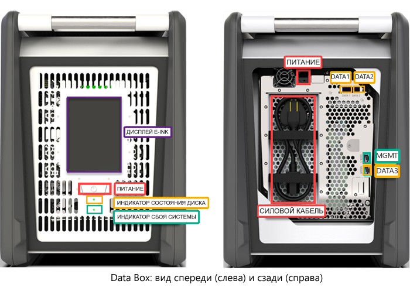
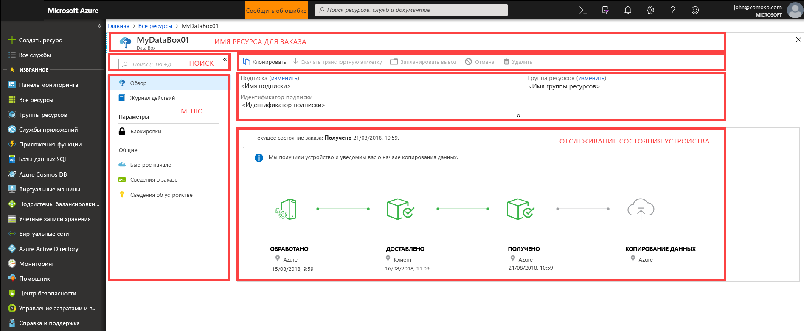
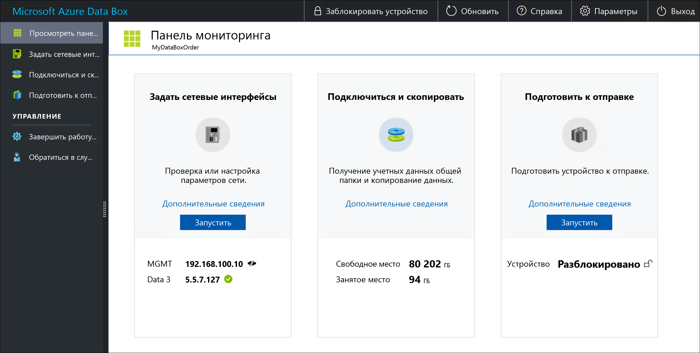

# Что такое Azure Data Box?

Облачное решение Microsoft Azure Data Box позволяет быстро, недорого и надежно передавать терабайты данных в Azure и обратно. Защищенное устройство хранения Azure Data Box обеспечивает безопасную передачу данных. Каждое устройство рассчитано на максимальный объем хранения 80 ТБ. Устройства поставляются в ваш центр обработки данных через регионального оператора. Прочный корпус защищает устройство и хранящиеся на нем данные во время передачи.

Устройство Data Box можно заказать на портале Azure, чтобы импортировать и экспортировать данные в Azure и обратно. Когда устройство поступит в ваш центр обработки данных, вы можете быстро установить его, используя локальный пользовательский веб-интерфейс. В зависимости от того, что вам нужно — импортировать или экспортировать данные, — скопируйте данные с серверов на устройство или наоборот и отправьте устройство обратно в Azure. При импорте данных в Azure данные автоматически передаются с устройства в Azure в центре обработки данных Azure. Весь процесс от начала и до конца контролируется службой Data Box на портале Azure.

[!INCLUDE [Data Box feature is in preview](../../includes/data-box-feature-is-preview-info.md)]

## Варианты использования

Data Box идеально подходит для передачи данных, объем которых превышает 40 ТБ, если сетевое подключение ограничено или отсутствует. Перемещение данных может быть одноразовой, периодической или начальной массовой операцией передачи данных, за которой следуют периодические передачи. 

Ниже перечислены примеры сценариев, в которых Data Box можно использовать для импорта данных в Azure.

 - **Одноразовая миграция** — перенос большого количества локальных данных в Azure. 
     - Перемещение библиотеки мультимедиа из автономных лент в Azure для создания онлайн-библиотеки мультимедиа.
     - Перемещение группы виртуальных машин, сервера SQL Server и приложений в Azure.
     - Перемещение исторических данных в Azure для глубокого анализа и создания отчетов с помощью HDInsight.

 - **Начальная массовая передача** — начальная массовая передача данных с помощью Data Box (начальное значение), за которой выполняются добавочные передачи по сети. 
     - Например, для переноса начального большого журнала резервного копирования в Azure используются решения для резервного копирования партнеров, такие как Commvault и Data Box. После завершения добавочные данные передаются по сети в хранилище Azure.

- **Периодические передачи** — когда периодически создается большое количество данных, которые необходимо переместить в Azure. Например, в сфере анализа энергоресурсов, где видеоматериалы создаются на нефтяных платформах и ветряных фермах. 

Ниже перечислены примеры сценариев, в которых Data Box можно использовать для экспорта данных из Azure.

- **Аварийное восстановление** — при восстановлении копии данных из Azure в локальную сеть. Обычно это происходит в случае аварийного восстановления, когда на устройство Data Box экспортируется большой объем данных Azure. Затем Майкрософт доставляет это устройство Data Box, и данные восстанавливаются в локальной среде в течение короткого времени. 

- **Требования безопасности** — если необходимо иметь возможность экспортировать данные из Azure в связи с требованиями законодательства или безопасности. Например, служба хранилища Azure доступна в облаках US Secret и Top Secret, и вы можете использовать Data Box для экспорта данных из Azure. 

- **Переход обратно в локальную сеть или к другому поставщику облачных служб** — если вам нужно переместить все данные обратно в локальную сеть или в сеть другого поставщика облачных служб, экспортируйте данные с помощью Data Box для переноса рабочих нагрузок.

## Преимущества

Устройство Data Box предназначено для перемещения больших объемов данных в Azure практически без влияния на сеть. Это решение имеет следующие преимущества:

- **Скорость.** Для перемещения максимум 80 ТБ данных в Azure или обратно Data Box использует сетевой интерфейс со скоростью 1 Гбит/с или 10 Гбит/с.

- **Безопасность.** В Data Box встроены средства защиты самого устройства, данных и службы.
  - Устройство защищено прочным корпусом с винтами против несанкционированного доступа и наклейками контроля вскрытия. 
  - Данные на устройстве постоянно защищены с помощью 256-разрядного шифрования AES.
  - Устройство можно разблокировать только паролем, предоставленным на портале Azure.
  - Служба защищена функциями безопасности Azure.
  - Как только ваши данные будут переданы в Azure для выполнения заказа на импорт, диски на устройстве будут очищены в соответствии со стандартами NIST 800-88r1. Для выполнения заказа на экспорт диски очищаются после доставки устройства в центр обработки данных Azure.
    
    Дополнительные сведения см. в статье [Azure Data Box security and data protection](data-box-security.md) (Безопасность Azure Data Box и защита данных).

## Функции и спецификации

В этом выпуске Data Box представлены следующие особенности.

| Спецификации                                          | Описание              |
|---------------------------------------------------------|--------------------------|
| Вес                                                  | до 22,7 кг (50 фунтов)                |
| Измерения                                              | Ширина устройства 309,0 мм, высота 430,4 мм, длина 502,0 мм |            
| Место, занимаемое в стойке                                              | 7 U при помещении в стойку сбоку (нельзя установить в стойку)|
| Необходимые кабели                                         | 1 кабель питания (входит в комплект)   2 кабеля RJ45   2 медных двуосных кабеля SFP+|
| Емкость хранилища                                        | Полезная емкость 100-терабайтного устройства после защиты RAID 5 составляет 80 ТБ|
| Потребляемая мощность                                            | Блок питания обеспечивает 700 Вт.   Устройство потребляет порядка 375 Вт.|
| Сетевые интерфейсы                                      | 2 интерфейса 1 GbE: MGMT, DATA 3   MGMT используется для управления и первоначальной настройки, не поддерживает настройку пользователем   DATA3 используется для данных, является динамическим по умолчанию и может быть настроен пользователем   MGMT и DATA 3 могут работать как интерфейсы 10 GbE   2 интерфейса 10 GbE: DATA 1, DATA 2   Оба интерфейса используются для данных и могут быть настроены как динамические (по умолчанию) или статические |
| Передача данных                                      | Поддерживаются импорт и экспорт.  |
| Средства передачи данных                                     | Кабели RJ45, медный SFP+, интерфейс Ethernet 10 GbE  |
| Безопасность                                                | Прочный корпус с винтами против несанкционированного доступа   В нижней части устройства расположены наклейки контроля вскрытия|
| Частота передачи данных                                      | До 80 ТБ в сутки через сетевой интерфейс 10 GbE        |
| Управление                                              | Локальный пользовательский интерфейс для однократной начальной настройки и конфигурации   Портал Azure для ежедневного управления        |

## Компоненты Data Box

В комплект поставки Data Box входят следующие компоненты:

* **Устройство Data Box** — физическое устройство, которое выполняет функции основного хранилища, управляет взаимодействием с облачным хранилищем, а также обеспечивает безопасность и конфиденциальность всех данных, хранящихся на устройстве. Рабочий объем устройства Data Box составляет 80 ТБ. 

    

    
* **Служба Data Box** — расширение портала Azure, которое позволяет управлять устройством Data Box с помощью веб-интерфейса, где бы вы ни находились. Используйте службу Data Box для повседневного управления вашим устройством Data Box. Служба позволяет создавать заказы и управлять ими, просматривать оповещения и управлять ими, а также администрировать общие ресурсы.  

    

    Дополнительные сведения см. в статье об [администрировании устройства Data Box с помощью службы Data Box](data-box-portal-ui-admin.md).

* **Локальный пользовательский веб-интерфейс** — пользовательский веб-интерфейс, который используется для настройки устройства при подключении к локальной сети и регистрации в службе Data Box. Кроме того, с его помощью можно выключать и перезагружать Data Box, просматривать журналы копирования, а также обращаться в службу поддержки Майкрософт, чтобы подать запрос на обслуживание.

    

    См. дополнительные сведения о том, как [администрировать Data Box с помощью пользовательского веб-интерфейса](data-box-portal-ui-admin.md).

## Рабочий процесс

Стандартная процедура импорта включает следующие этапы:

1. **Заказ**. Создайте заказ на портале Azure, укажите данные о доставке и учетную запись Azure для хранения ваших данных. Если устройство доступно, Azure подготавливает и отправляет его, назначив идентификатор отслеживания доставки.

2. **Получение.** Получив устройство, подключите его к сети и электропитанию с помощью специальных кабелей. Включите устройство и подключитесь к нему. Настройте сеть и подключите общие данные, которые хотите скопировать, на главном компьютере.

3. **Копирование данных.** Скопируйте данные в общую папку Data Box.

4. **Возврат.** Отключите, подготовьте и отправьте устройство обратно в центр обработки данных Azure.

5. **Передача.** Данные будут автоматически скопированы с устройства в хранилище Azure. Диски будут очищены с поддержкой высокого уровня безопасности в соответствии с рекомендациями Национального института стандартов и технологий (NIST).

Во время всего этого процесса вы будете получать электронные уведомления обо всех изменениях состояния. Дополнительные сведения о процессе работы см. в руководстве по [развертыванию Data Box на портале Azure](data-box-deploy-ordered.md).

Стандартная процедура экспорта включает следующие этапы:

1. **Заказ.** Создайте заказ экспорт на портале Azure, укажите данные для доставки и учетную запись хранения Azure с вашими данными в качестве источника. Если устройство доступно, сотрудники Azure подготавливают его. Данные копируются из учетной записи хранения Azure на устройство Data Box. После завершения копирования данных Майкрософт отправляет устройство, назначив идентификатор отслеживания доставки.

2. **Получение.** Получив устройство, подключите его к сети и электропитанию с помощью специальных кабелей. Включите устройство и подключитесь к нему. Настройте сеть устройства и подключите общие папки на главном компьютере, на который нужно скопировать данные.

3. **Копирование данных.** Копирование данных из общих папок Data Box на локальные серверы данных.

4. **Возврат.** Отключите, подготовьте и отправьте устройство обратно в центр обработки данных Azure.

5. **Удаление данных.** Диски устройства безопасно очищаются в соответствии с рекомендациями Национального института стандартов и технологий (NIST).

Во время всего процесса экспорта вы будете получать электронные уведомления обо всех изменениях состояния. Дополнительные сведения о процессе работы см. в руководстве по [развертыванию Data Box на портале Azure](data-box-deploy-export-ordered.md).

## Доступность по регионам

Data Box передает данные на основе региона, в котором развернута служба, страны или области, в которую отправлено устройство, а также целевой учетной записи хранения, куда вы переносите данные. 

### Для импорта

- **Доступность служб.** При использовании Data Box для выполнения заказов на импорт или экспорт сведения о доступности по регионам можно просматривать на [этой странице](https://azure.microsoft.com/global-infrastructure/services/?products=databox&regions=all). Функция экспорта в Data Box сейчас доступна в предварительной версии. 

    Для выполнения заказов на импорт Data Box можно также развернуть в облаке Azure для государственных организаций. Дополнительные сведения см. в обзорной статье об [Azure для государственных организаций](https://docs.microsoft.com/azure/azure-government/documentation-government-welcome). 

- **Целевые учетные записи хранения.** Учетные записи хранения данных доступны во всех регионах Azure, где предоставляется служба.

## Дальнейшие действия

- Ознакомьтесь с [системными требованиями Data Box](data-box-system-requirements.md).
- Изучите [ограничения Data Box](data-box-limits.md).
- Оперативно разверните [Azure Data Box](data-box-quickstart-portal.md) на портале Azure.

