# <a name="use-the-azure-portal-to-administer-your-azure-data-box-and-azure-data-box-heavy"></a>Используйте портал Azure для администрирования Azure Data Box и Azure Data Box Heavy

Эта статья относится как к Azure Data Box, так и к Azure Data Box Heavy. В этой статье описываются некоторые сложные рабочие процессы и задачи управления, которые можно выполнять на Azure Data Box устройстве. Вы можете управлять Data Box устройством через портал Azure или через локальный веб-интерфейс.

В этой статье речь идет о задачах, выполняемых с использованием портала Azure. Используйте портал Azure для управления заказами, управления Data Box устройством и наблюдения за состоянием заказа по мере его завершения.


## <a name="cancel-an-order"></a>Отмена заказа

Возможно, после размещения заказа вам нужно будем отменить его по различным причинам. Можно отменить заказ только перед его обработкой. После обработки заказа и подготовки Data Box устройства отменить заказ невозможно.

Для отмены заказа выполните следующие действия.

1.  Перейдите на вкладку **Обзор > Отмена**.

    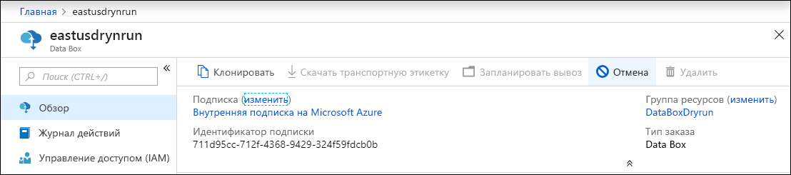

2.  Введите причину для отмены заказа.  

    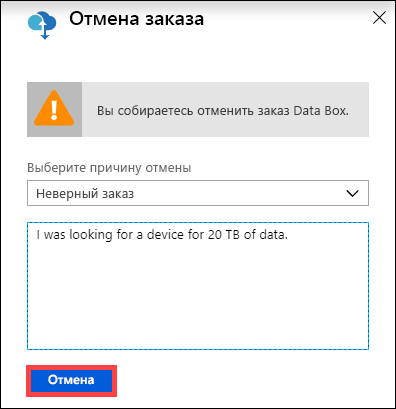

3.  После отмены заказа на портале обновляется состояние заказа и отображается значение **Отменено**.

## <a name="clone-an-order"></a>Клонирование заказа

Клонирование полезно в определенных ситуациях. Например, пользователь использовал Data Box для передачи данных. По мере создания данных требуется другое устройство Data Box для перемещения этих данных в Azure. В этом случае заказ можно просто клонировать.

Выполните следующие действия для клонирования заказа.

1.  Перейдите на вкладку **Обзор > Клонировать**. 

    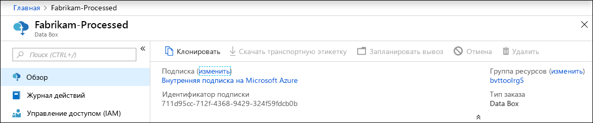

2.  Все сведения о заказе остаются теми же. Имя заказа — это первоначальное имя с добавлением *-Clone*. Установите флажок, чтобы подтвердить, что вы просмотрели сведения о конфиденциальности. Нажмите кнопку **Создать**.

Клон создается в течение нескольких минут, после чего портал обновляется и отображается новый заказ.


## <a name="delete-order"></a>Удаление заказа

Вы можете удалить заказ после его обработки. Заказ содержит ваши личные сведения, такие как имя, адрес и контактные данные. При удалении заказа удаляются и личные данные.

Можно удалить только завершенные или отмененные заказы. Чтобы удалить заказ, выполните указанные ниже действия.

1. Щелкните **Все ресурсы**. Найдите свой заказ.

2. Щелкните заказ, который необходимо удалить, и перейдите на вкладку **Обзор**. На панели команд нажмите кнопку **Удалить**.

    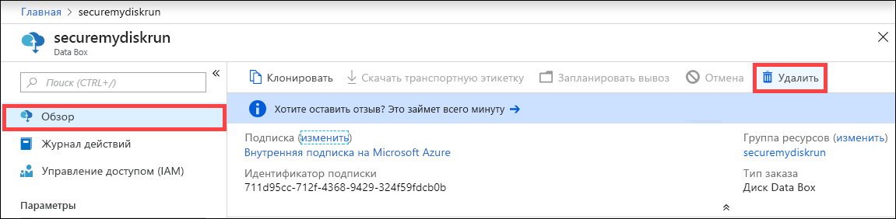

3. Когда будет предложено подтвердить удаление, введите имя заказа. Нажмите кнопку **Delete**(Удалить).

## <a name="download-shipping-label"></a>Скачать транспортную этикетку

Если отображение дисплея E-ink вашего Data Box не работает и не отображается транспортная этикетка для возврата, необходимо ее загрузить. На Data Box Heavy не отображаются электронные рукописные данные, поэтому этот рабочий процесс не применяется к Data Box Heavy.

Выполните следующие действия, чтобы скачать транспортную этикетку.

1.  Выберите **Обзор > Скачать транспортную этикетку**. Этот параметр доступен только после отправки устройства. 

    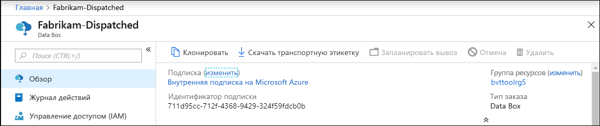

2.  Загрузится новая транспортная этикетка для возврата, которая выглядит следующим образом. Сохраните и распечатайте этикетку. Сложите и вставьте этикетку в прозрачную обложку на устройстве. Убедитесь, что этикетка является видимой. Удалите все наклейки, которые находятся на устройстве от предыдущей доставки.

    

## <a name="edit-shipping-address"></a>Изменение адреса поставки

Вам может понадобиться изменить адрес поставки после размещения заказа. Эта возможность доступна только до отправки устройства. После отправки устройства этот параметр больше недоступен.

Выполните следующие действия для изменения адреса доставки.

1. Выберите **Сведения о заказе > Изменить адрес поставки**.

    

2. Отредактируйте и подтвердите адрес доставки, а затем сохраните изменения.

    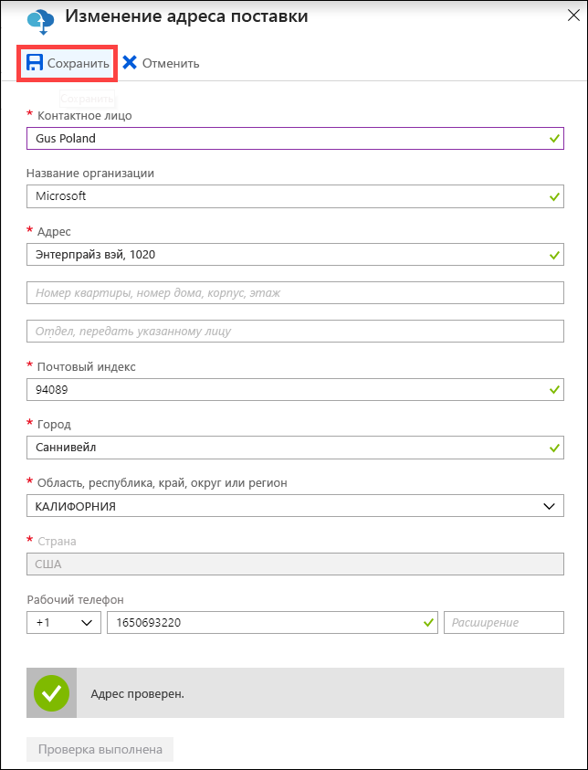

## <a name="edit-notification-details"></a>Изменить сведения об уведомлении

Вам может понадобиться изменить пользователей, которым необходимо отправлять сообщения о состоянии заказа. Например, пользователя нужно уведомить о доставке или получении устройства. Другого пользователя, возможно, понадобиться уведомить о завершении копирования данных, чтобы он проверил, что данные находятся в учетной записи хранения Azure, перед удалением их из источника. В таких случаях можно изменить сведения об уведомлении.

Выполните следующие действия, чтобы изменить сведения об уведомлении.

1. Перейдите к **Сведения о заказе > Изменить сведения об уведомлении**.

    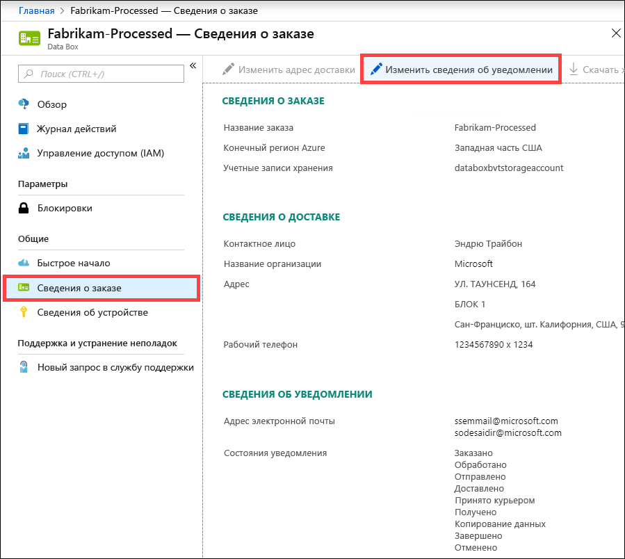

2. Теперь можно изменить сведения об уведомлении, а затем сохранить изменения.
 
    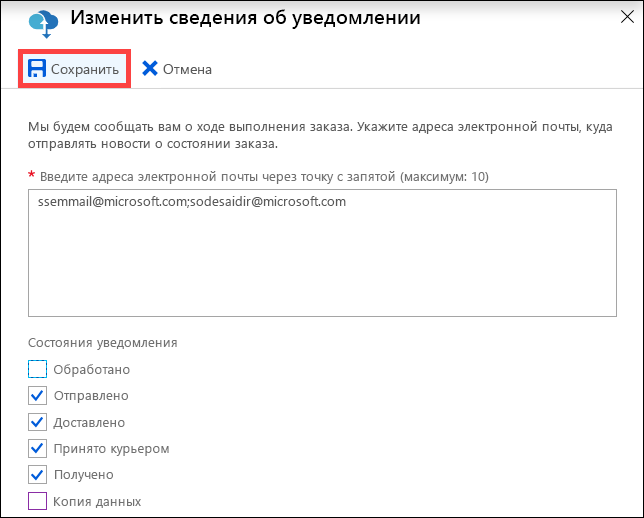


## <a name="download-order-history"></a>Скачать журнал заказов

Как только заказ Data Box будет завершен, данные на дисках устройства будут удалены. После очистки устройства вы сможете скачать журнал заказов на портале Azure.

Чтобы скачать журнал заказов, сделайте следующее.

1. В заказе Data Box выберите **Обзор**. Убедитесь, что заказ выполнен. Если заказ и очистка устройства выполнены, выберите **Сведения о заказе**. Доступен параметр **Скачать журнал заказов**.

    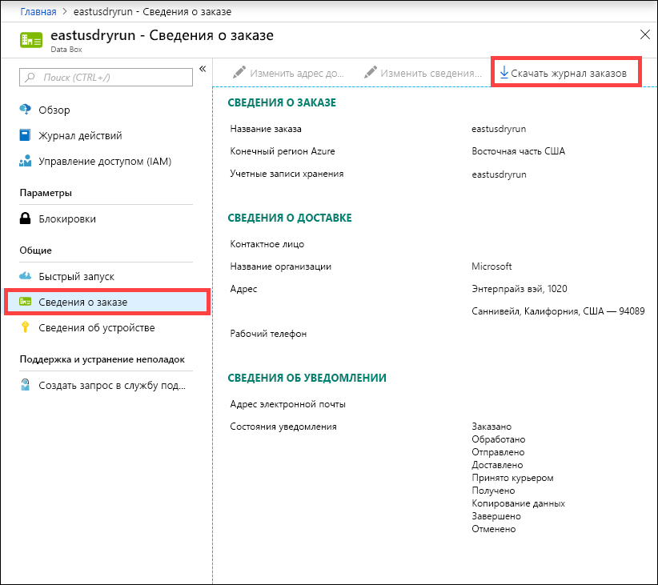

2. Щелкните **Скачать журнал заказов**. В скачанном журнале вы увидите запись журналов отслеживания от перевозчика. В Data Box Heavy будут содержаться два набора журналов, соответствующих двум узлам. Если вы прокрутите страницу этого журнала до конца, то увидите ссылки на такие элементы:
    
   - **Журналы копирования** — содержат список файлов с ошибками, возникшими при копировании данных из Data Box в учетную запись хранения Azure.
   - **Журналы аудита** — содержат сведения о включении и доступе к общим папкам на Data Box, если они находятся за пределами центра обработки данных Azure.
   - **Файлы спецификации** — содержат список файлов (также известный как манифест файла), который можно скачать во время **подготовки к отправке**, а также имена, размеры и контрольные суммы файла.

       ```
       -------------------------------
       Microsoft Data Box Order Report
       -------------------------------
       Name                                               : DataBoxTestOrder                              
       StartTime(UTC)                                     : 10/31/2018 8:49:23 AM +00:00                       
       DeviceType                                         : DataBox                                           
       -------------------
       Data Box Activities
       -------------------
       Time(UTC)                 | Activity                       | Status          | Description  
       
       10/31/2018 8:49:26 AM     | OrderCreated                   | Completed       |                                                   
       11/2/2018 7:32:53 AM      | DevicePrepared                 | Completed       |                                                   
       11/3/2018 1:36:43 PM      | ShippingToCustomer             | InProgress      | Shipment picked up. Local Time : 11/3/2018 1:36:43        PM at AMSTERDAM-NLD                                                                                
       11/4/2018 8:23:30 PM      | ShippingToCustomer             | InProgress      | Processed at AMSTERDAM-NLD. Local Time : 11/4/2018        8:23:30 PM at AMSTERDAM-NLD                                                                        
       11/4/2018 11:43:34 PM     | ShippingToCustomer             | InProgress      | Departed Facility in AMSTERDAM-NLD. Local Time :          11/4/2018 11:43:34 PM at AMSTERDAM-NLD                                                               
       11/5/2018 1:38:20 AM      | ShippingToCustomer             | InProgress      | Arrived at Sort Facility LEIPZIG-DEU. Local Time :        11/5/2018 1:38:20 AM at LEIPZIG-DEU                                                                
       11/5/2018 2:31:07 AM      | ShippingToCustomer             | InProgress      | Processed at LEIPZIG-DEU. Local Time : 11/5/2018          2:31:07 AM at LEIPZIG-DEU                                                                            
       11/5/2018 4:05:58 AM      | ShippingToCustomer             | InProgress      | Departed Facility in LEIPZIG-DEU. Local Time :            11/5/2018 4:05:58 AM at LEIPZIG-DEU                                                                    
       11/5/2018 4:35:43 AM      | ShippingToCustomer             | InProgress      | Transferred through LUTON-GBR. Local Time :              11/5/2018 4:35:43 AM at LUTON-GBR                                                                         
       11/5/2018 4:52:15 AM      | ShippingToCustomer             | InProgress      | Departed Facility in LUTON-GBR. Local Time :              11/5/2018 4:52:15 AM at LUTON-GBR                                                                        
       11/5/2018 5:47:58 AM      | ShippingToCustomer             | InProgress      | Arrived at Sort Facility LONDON-HEATHROW-GBR.            Local Time : 10/5/2018 5:47:58 AM at LONDON-HEATHROW-GBR                                                
       11/5/2018 6:27:37 AM      | ShippingToCustomer             | InProgress      | Processed at LONDON-HEATHROW-GBR. Local Time :            11/5/2018 6:27:37 AM at LONDON-HEATHROW-GBR                                                            
       11/5/2018 6:39:40 AM      | ShippingToCustomer             | InProgress      | Departed Facility in LONDON-HEATHROW-GBR. Local          Time : 11/5/2018 6:39:40 AM at LONDON-HEATHROW-GBR                                                    
       11/5/2018 8:13:49 AM      | ShippingToCustomer             | InProgress      | Arrived at Delivery Facility in LAMBETH-GBR. Local        Time : 11/5/2018 8:13:49 AM at LAMBETH-GBR                                                         
       11/5/2018 9:13:24 AM      | ShippingToCustomer             | InProgress      | With delivery courier. Local Time : 11/5/2018            9:13:24 AM at LAMBETH-GBR                                                                               
       11/5/2018 12:03:04 PM     | ShippingToCustomer             | Completed       | Delivered - Signed for by. Local Time : 11/5/2018        12:03:04 PM at LAMBETH-GBR                                                                          
       1/25/2019 3:19:25 PM      | ShippingToDataCenter           | InProgress      | Shipment picked up. Local Time : 1/25/2019 3:19:25        PM at LAMBETH-GBR                                                                                       
       1/25/2019 8:03:55 PM      | ShippingToDataCenter           | InProgress      | Processed at LAMBETH-GBR. Local Time : 1/25/2019          8:03:55 PM at LAMBETH-GBR                                                                            
       1/25/2019 8:04:58 PM      | ShippingToDataCenter           | InProgress      | Departed Facility in LAMBETH-GBR. Local Time :            1/25/2019 8:04:58 PM at LAMBETH-GBR                                                                    
       1/25/2019 9:06:09 PM      | ShippingToDataCenter           | InProgress      | Arrived at Sort Facility LONDON-HEATHROW-GBR.            Local Time : 1/25/2019 9:06:09 PM at LONDON-HEATHROW-GBR                                                
       1/25/2019 9:48:54 PM      | ShippingToDataCenter           | InProgress      | Processed at LONDON-HEATHROW-GBR. Local Time :            1/25/2019 9:48:54 PM at LONDON-HEATHROW-GBR                                                            
       1/25/2019 10:30:20 PM     | ShippingToDataCenter           | InProgress      | Departed Facility in LONDON-HEATHROW-GBR. Local          Time : 1/25/2019 10:30:20 PM at LONDON-HEATHROW-GBR                                                   
       1/26/2019 2:17:10 PM      | ShippingToDataCenter           | InProgress      | Arrived at Sort Facility BRUSSELS-BEL. Local Time        : 1/26/2019 2:17:10 PM at BRUSSELS-BEL                                                              
       1/26/2019 2:31:57 PM      | ShippingToDataCenter           | InProgress      | Processed at BRUSSELS-BEL. Local Time : 1/26/2019        2:31:57 PM at BRUSSELS-BEL                                                                          
       1/26/2019 3:37:53 PM      | ShippingToDataCenter           | InProgress      | Processed at BRUSSELS-BEL. Local Time : 1/26/2019        3:37:53 PM at BRUSSELS-BEL                                                                          
       1/27/2019 11:01:45 AM     | ShippingToDataCenter           | InProgress      | Departed Facility in BRUSSELS-BEL. Local Time :          1/27/2019 11:01:45 AM at BRUSSELS-BEL                                                                 
       1/28/2019 7:11:35 AM      | ShippingToDataCenter           | InProgress      | Arrived at Delivery Facility in AMSTERDAM-NLD.            Local Time : 1/28/2019 7:11:35 AM at AMSTERDAM-NLD                                                     
       1/28/2019 9:07:57 AM      | ShippingToDataCenter           | InProgress      | With delivery courier. Local Time : 1/28/2019            9:07:57 AM at AMSTERDAM-NLD                                                                             
       1/28/2019 1:35:56 PM      | ShippingToDataCenter           | InProgress      | Scheduled for delivery. Local Time : 1/28/2019            1:35:56 PM at AMSTERDAM-NLD                                                                            
       1/28/2019 2:57:48 PM      | ShippingToDataCenter           | Completed       | Delivered - Signed for by. Local Time : 1/28/2019        2:57:48 PM at AMSTERDAM-NLD                                                                         
       1/29/2019 2:18:43 PM      | PhysicalVerification           | Completed       |                                              
       1/29/2019 3:49:50 PM      | DeviceBoot                     | Completed       | Appliance booted up successfully                  
       1/29/2019 3:49:51 PM      | AnomalyDetection               | Completed       | No anomaly detected.                               
       1/29/2019 4:55:00 PM      | DataCopy                       | Started         |                                                 
       2/2/2019 7:07:34 PM       | DataCopy                       | Completed       | Copy Completed.                                   
       2/4/2019 7:47:32 PM       | SecureErase                    | Started         |                                                  
       2/4/2019 8:01:10 PM      | SecureErase                    | Completed       | Azure Data Box:DEVICESERIALNO has been sanitized          according to NIST 800-88 Rev 1.                                                                       

       ------------------
       Data Box Log Links
       ------------------

       Account Name         : Gus                                                       
       Copy Logs Path       : databoxcopylog/DataBoxTestOrder_CHC533180024_CopyLog_73a81b2d613547a28ecb7b1612fe93ca.xml
       Audit Logs Path      : azuredatabox-chainofcustodylogs\7fc6cac9-9cd6-4dd8-ae22-1ce479666282\chc533180024
       BOM Files Path       : azuredatabox-chainofcustodylogs\7fc6cac9-9cd6-4dd8-ae22-1ce479666282\chc533180024      
       ```
     Затем вы можете войти в свою учетную запись хранения и просмотреть журналы копирования.

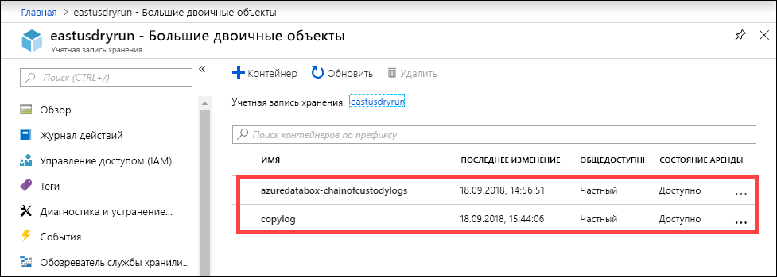

Вы также можете просмотреть журналы обеспечения сохранности, которые включают журналы аудита и файлы спецификации.

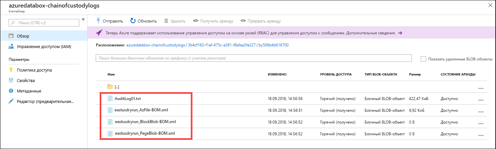

## <a name="view-order-status"></a>Просмотр состояния заказа

При изменении состояния устройства на портале вы получите уведомление по электронной почте.

|Состояние заказа |Описание |
|---------|---------|
|Заказано     | Заказ успешно размещен. <br>Если устройство доступно, корпорация Майкрософт определяет устройство для отправки и подготавливает его. <br> Если устройство не доступно сразу, заказ будет обработан, когда оно станет доступным. Для обработки заказа может потребоваться от нескольких дней до нескольких месяцев. Если заказ не может быть выполнен за 90 дней, он отменяется, и вы получаете уведомление.         |
|Обработано     | Обработка заказа завершена. В соответствии с вашим заказом устройство готово к отправке в центре обработки данных.         |
|Отправлено     | Заказ отправлен. Используйте идентификатор отслеживания, отображаемый в вашем заказе на портале, чтобы отслеживать отправку.        |
|Доставлено     | Отправка была доставлена ​​по адресу, указанному в заказе.        |
|Принято курьером     |Ваша обратная отправка была получена и проверена оператором.         |
|Получено     | Ваше устройство получено и отсканировано в центре данных Azure. <br> Как только отправка будет проверена, начнется передача устройства.      |
|Копирование данных     | Выполняется копирование данных. Отслеживайте ход копирования вашего заказа на портале Azure. <br> Дождитесь завершения копирования данных. |
|Завершено       |Заказ успешно выполнен.<br> Прежде чем удалять локальные данные с серверов, убедитесь, что данные находятся в Azure.         |
|Завершено с ошибками| Копирование данных завершено, но во время процесса произошли ошибки. <br> Просмотрите журналы копирования, используя путь, указанный на портале Azure. См. [примеры журналов копирования при завершении передачи с ошибками](https://docs.microsoft.com/azure/databox/data-box-logs#upload-completed-with-errors).   |
|Завершено с предупреждениями| Копирование данных завершено, но данные были изменены. В данных были обнаружены некритические ошибки в большом двоичном объекте или имени файла, которые были исправлены путем изменения имен файлов или BLOB-объектов. <br> Просмотрите журналы копирования, используя путь, указанный на портале Azure. Запишите изменения, внесенные в данные. См. [примеры журналов копирования при завершении передачи с предупреждениями](https://docs.microsoft.com/azure/databox/data-box-logs#upload-completed-with-warnings).   |
|Отменено            |Ваш заказ отменен. <br> Либо вы отменили заказ, либо произошла ошибка и служба отменила заказ. Если заказ не может быть выполнен за 90 дней, он также отменяется, и вы получаете уведомление.     |
|Очистка | Данные на дисках устройства стираются. Очистка устройства считается завершенной, когда журнал заказов доступен для скачивания на портале Azure.|


## <a name="next-steps"></a>Следующие шаги

- Узнайте, как устранять неполадки [Data Box и Data Box Heavy](data-box-troubleshoot.md).
