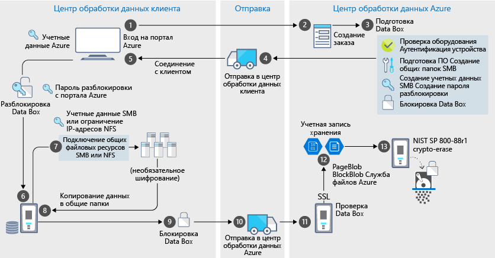

# Безопасность и защита данных в Azure Data Box

Data Box предоставляет безопасное решение для защиты данных, гарантируя, что только авторизованные субъекты могут просматривать, изменять или удалять данные. В этой статье описываются функции безопасности Azure Data Box, которые помогают защитить каждый компонент решения Data Box и хранимые на нем данные. 

[!INCLUDE [GDPR-related guidance](../../includes/gdpr-intro-sentence.md)]

## Поток данных через компоненты

Решение Microsoft Azure Data Box состоит из четырех основных компонентов, которые взаимодействуют друг с другом.

- **Служба Azure Data Box, размещенная в Azure** — это служба управления, с помощью которой можно заказывать и настраивать устройства, а затем отслеживать заказы до их завершения.
- **Устройство Data Box** — это устройство передачи, которое доставляется к вам с целью импорта локальных данных в Azure. 
- **Клиенты или серверы, подключенные к устройству** — это клиенты инфраструктуры, которые подключаются к устройству Data Box и содержат данные, которые необходимо защитить.
- **Облачное хранилище** — место хранения данных в облаке Azure. Обычно это учетная запись хранения, связанная с созданным ресурсом Azure Data Box.

На следующей схеме показан поток данных через решение Azure Data Box из локального компьютера в хранилище Azure. Этот поток предназначен для импорта Data Box.

По мере передачи данных в этом решении фиксируются события и создаются журналы. Дополнительную информацию см. в разделе

- [Отслеживание и ведение журнала событий для Azure Data Box заказов на импорт](data-box-logs.md).
- [Отслеживание и ведение журнала событий для Azure Data Box экспортных заказов](data-box-export-logs.md)

## Функции безопасности

Data Box предоставляет безопасное решение для защиты данных, гарантируя, что только авторизованные субъекты могут просматривать, изменять или удалять данные. Функции безопасности этого решения предназначены для диска и для связанной службы, обеспечивающих безопасность хранимых на них данных. 

### Защита устройства Data Box

Устройство Data Box защищено с помощью следующих функций:

- износоустойчивый корпус устройства, который выдерживает удары, неблагоприятную транспортировку и условия окружающей среды; 
- обнаружение незаконного изменения оборудования и программного обеспечения, которое предотвращает дальнейшие операции с устройством;
- запуск только программного обеспечения, предназначенного специально для Data Box;
- загрузка в заблокированном состоянии;
- контроль доступа к устройству с помощью пароля разблокировки устройства;
- доступ к учетным данным для копирования данных на устройство и из него. Все события осуществления доступа к странице **учетных данных устройства** на портале Azure фиксируются в [журналах действий](data-box-logs.md#query-activity-logs-during-setup).

### Защита данных Data Box

Входные и выходные данные Data Box защищены следующими функциями:

- 256-битное шифрование AES для неактивных данных;
- зашифрованные протоколы могут использоваться для данных в процессе использования; Мы рекомендуем использовать SMB 3,0 с шифрованием для защиты данных при их копировании с серверов данных.
- безопасное удаление данных с устройства после завершения передачи данных в Azure. Удаление данных осуществляется в соответствии с рекомендациями, приведенными в [Приложении А для жестких дисков ATA из стандарта NIST 800-88r1](https://nvlpubs.nist.gov/nistpubs/SpecialPublications/NIST.SP.800-88r1.pdf). Событие удаления данных фиксируется в [журнале заказов](data-box-logs.md#download-order-history).

### Защита службы Data Box

Служба Data Box защищена с помощью следующих функций.

- Для доступа к службе Data Box необходимо, чтобы у организации была подписка Azure, включающая Data Box. Подписка обеспечивает доступ к функциям, предоставляемым на портале Azure.
- Так как служба Data Box размещается в Azure, она защищена средствами безопасности Azure. Дополнительные сведения о функциях безопасности, предоставляемых Microsoft Azure, см. в [центре управления безопасностью Microsoft Azure](https://www.microsoft.com/TrustCenter/Security/default.aspx).
- Доступ к Data Boxму заказу можно контролировать с помощью ролей Azure. Дополнительные сведения см. в разделе о [настройке управления доступом для заказа Data Box](data-box-logs.md#set-up-access-control-on-the-order).
- Служба Data Box хранит пароль разблокировки, который используется для разблокирования устройства в службе.
- Служба Data Box хранит сведения о заказе и его состояние в службе. Эта информация удаляется при удалении самого заказа.

## Управление персональными данными

Azure Data Box собирает и отображает личные сведения в следующих ключевых экземплярах службы.

- **Параметры уведомлений**. Когда создается заказ, адреса электронной почты пользователей настраиваются в параметрах уведомлений. Эти сведения может просматривать администратор. Эта информация удаляется службой, когда задание выполнено или когда заказ удаляется.

- **Сведения о заказе**. После создания заказа адрес доставки, электронная почта, контактная информация пользователей хранятся на портале Azure. Сохраненная информация включает следующее.

  - Имя контактного лица
  - номер телефона.
  - Адрес электронной почты
  - Адрес по улице
  - Город
  - почтовый индекс;
  - Состояние
  - страна, область, край, округ, регион;
  - номер счета перевозчика;
  - номер отслеживания доставки.

    Сведения о заказе удаляются службой Data Box после завершения задания или при удалении заказа.

- **Адрес доставки**. После размещения заказа служба Data Box предоставляет адрес доставки сторонним операторам, таким как UPS или DHL. 

Дополнительные сведения см. в политике конфиденциальности Майкрософт в [центре управления безопасностью](https://www.microsoft.com/trustcenter).

## Ссылка на рекомендации по безопасности

В Data Box реализованы следующие рекомендации по безопасности. 

|Рекомендация   |Описание   |
|---------|---------|
|[IEC 60529 IP52](https://www.iec.ch/)    | Для защиты от пыли и воды         |
|[ISTA 2A](https://ista.org/docs/2Aoverview.pdf)     | Для стойкости к неблагоприятным условиям транспортировки          |
|[NIST SP 800-147](https://nvlpubs.nist.gov/nistpubs/Legacy/SP/nistspecialpublication800-147.pdf)      | Для безопасного обновления встроенного ПО         |
|[FIPS 140-2 уровня 2](https://csrc.nist.gov/csrc/media/publications/fips/140/2/final/documents/fips1402.pdf)      | Для защиты данных         |
|Приложение A для жестких дисков ATA из стандарта [NIST SP 800-88r1](https://nvlpubs.nist.gov/nistpubs/SpecialPublications/NIST.SP.800-88r1.pdf)      | Для очистки данных         |

## Дальнейшие действия

- Ознакомьтесь с разделом [Azure Data Box system requirements](data-box-system-requirements.md) (Системные требования Azure Data Box).
- Изучите [ограничения Data Box](data-box-limits.md).
- Оперативно разверните [Azure Data Box](data-box-quickstart-portal.md) на портале Azure.
