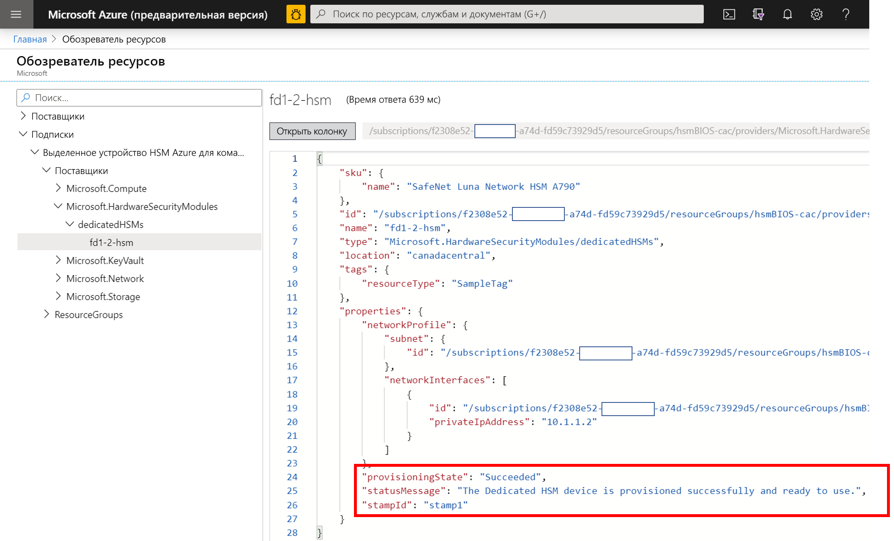
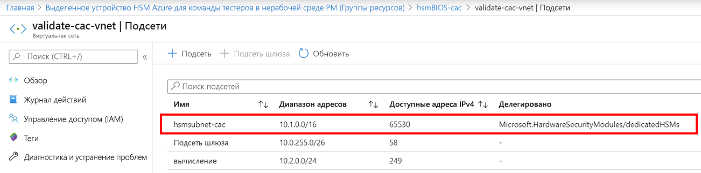
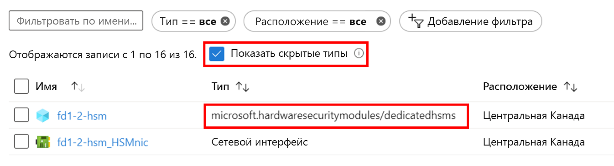

# <a name="troubleshooting"></a>Устранение неполадок

У службы "Выделенное устройство HSM" Azure есть два различных аспекта работы. Первый — регистрация и развертывание в Azure устройств HSM с их базовыми сетевыми компонентами. Второй — настройка устройств HSM при подготовке к использованию или интеграции с заданной рабочей нагрузкой или приложением. Хотя сетевые устройства HSM Luna Thales в Azure ничем не отличаются от приобретаемых напрямую у Thales, тот факт, что они являются ресурсом в Azure, подразумевает некоторые уникальные рекомендации. В этой статье приводятся рекомендации и соответствующие полезные сведения об устранении неполадок, а также лучшие методики для обеспечения широкой видимости и доступа к важной информации. При использовании службы можно получить доступ к наиболее подробным сведениям через запросы в службу поддержки Майкрософт или Thales напрямую. 

> [!NOTE]
> Следует отметить, что перед любой настройкой развернутого устройства HSM его следует обновить, внеся все необходимые исправления. Конкретное требуемое исправление — [KB0019789](https://supportportal.gemalto.com/csm?id=kb_article_view&sys_kb_id=19a81c8bdb9a1fc8d298728dae96197d&sysparm_article=KB0019789) на портале поддержки Thales, которое устраняет проблему зависания перезагрузки.

## <a name="hsm-registration"></a>Регистрация HSM

Выделенное устройство HSM не является свободно доступным для использования, так как оно предоставляет аппаратные ресурсы в облаке и, следовательно, является ценным ресурсом, который необходимо защитить. Поэтому мы используем список разрешений, в котором следует регистрироваться по электронной почте HSMrequest@microsoft.com. 

### <a name="getting-access-to-dedicated-hsm"></a>Получение доступа к выделенному устройству HSM

Если вы считаете, что выделенное устройство HSM будет соответствовать требованиям для хранилища ключей, то, чтобы запросить доступ, отправьте запрос на электронный адрес HSMrequest@microsoft.com. Опишите свое приложение, укажите регионы, в которых вы хотели бы использовать устройства HSM, и требуемые объемы ресурсов HSM. Если вы работаете с представителями корпорации Майкрософт, например с менеджером по работе с клиентами или архитектором облачных решений, вы можете включить их в запрос.

## <a name="hsm-provisioning"></a>Подготовка устройств HSM

Подготовка устройства HSM в Azure осуществляется с помощью интерфейса командной строки (CLI) или PowerShell. При регистрации в службе будет предоставлен пример шаблона Resource Manager, который будет предоставляться для начальной настройки. 

### <a name="hsm-deployment-failure-information"></a>Сведения о сбоях развертывания устройств HSM

Поддерживается развертывание выделенных устройств HSM с помощью CLI и PowerShell, поэтому сведения об ошибках развертывания с помощью портала ограничены и не являются подробными. Более подробные сведения можно найти с помощью обозревателя ресурсов. Для этого на домашней странице портала есть значок, щелкнув который можно получить подробную информацию об ошибке. Эту информацию можно вставить в создаваемый запрос на поддержку, связанный с проблемами развертывания.



### <a name="hsm-subnet-delegation"></a>Делегирование подсети устройств HSM
Самая распространенная причина сбоев развертывания заключается в том, что специалисты забывают настроить соответствующее делегирование для определенной клиентом подсети, в которой будут подготовлены устройства HSM. Настройка такого делегирования относится к предварительным требованиям для развертывания виртуальной сети и подсети. Более подробную информацию можно найти в учебниках.



### <a name="hsm-deployment-race-condition"></a>Состояние гонки развертывания устройств HSM

Стандартный шаблон Resource Manager, предоставляемый для развертывания, содержит ресурсы, связанные с устройством HSM и шлюзом ExpressRoute. Успех развертывания устройства HSM зависит от сетевых ресурсов, и время может иметь ключевое значение.  Иногда возникают проблемы развертывания, связанные с проблемами зависимостей, и повторный запуск развертывания часто устраняет проблему. В противном случае следует удалить и повторно развернуть ресурсы. Если это не устранит проблему, создайте запрос поддержки на портале Azure и выберите тип проблемы Issues configuring the Azure setup (Проблемы настройки установки Azure).

### <a name="hsm-deployment-using-terraform"></a>Развертывание устройств HSM с помощью Terraform

Некоторые клиенты использовали Terraform в качестве среды автоматизации вместо шаблонов Resource Manager, предоставляемых при регистрации на эту услугу. Устройства HSM нельзя развертывать таким образом, но зависимые сетевые ресурсы — можно. В Terraform есть модуль для вызова минимального шаблона Resource Manager только для развертывания HSM.  В этой ситуации следует позаботиться о том, чтобы сетевые ресурсы, такие как требуемый шлюз ExpressRoute, были полностью развернуты перед развертыванием устройств HSM. Следующую команду CLI можно использовать для проверки готовности развертывания и выполнения интеграции в соответствии с требованиями. Замените заполнители в угловых скобках конкретными значениями. В результате вы должны увидеть сообщение о том, что у свойства ProvisioningState значение Succeeded.

```azurecli
az resource show --ids /subscriptions/<subid>/resourceGroups/<myresourcegroup>/providers/Microsoft.Network/virtualNetworkGateways/<myergateway>
```

### <a name="deployment-failure-based-on-quota"></a>Сбой развертывания, связанный с квотой
Сбой развертывания может произойти, если на единицу масштабирования приходится больше 2 устройств HSM и 4 устройств HSM на регион. Чтобы избежать такой ситуации, перед повторным развертыванием убедитесь, что вы удалили ресурсы неудавшихся развертываний, выполненных ранее. Сведения о проверке ресурсов см. в разделе "Как просмотреть подготовленные устройства HSM" ниже. Если вы считаете, что нужно превысить эту квоту, которая указывается здесь в целях предосторожности, отправьте сообщение электронной почты с подробными сведениями на адрес HSMrequest@microsoft.com.

### <a name="deployment-failure-based-on-capacity"></a>Сбой развертывания, связанный с емкостью
Когда определенная единица масштабирования или регион заполнены, т. е. почти все свободные устройства HSM подготовлены, это может приводить к сбоям развертывания. Каждая единица масштабирования предусматривает 11 устройств HSM, доступных для клиентов, что означает 22 устройства на каждый регион. На каждую единицу масштабирования также есть 1 тестовое и 3 запасных устройства. Если вы считаете, что предел достигнут, то отправьте письмо по этому адресу HSMrequest@microsoft.com, чтобы получить информацию об уровне заполненности конкретных единиц масштабирования.

###  <a name="how-do-i-see-hsms-when-provisioned"></a>Как просмотреть подготовленные устройства HSM
Служба "Выделенное устройство HSM" работает по списку разрешений, поэтому относится к скрытому типу на портале Azure. Чтобы просмотреть ресурсы HSM, необходимо установить флажок "Показывать скрытые типы", как показано ниже. Ресурс сетевого адаптера указывается после устройства HSM, что позволяет узнать IP-адрес устройства HSM до использования протокола SSH для подключения.



## <a name="networking-resources"></a>Сетевые ресурсы

Развертывание выделенного устройства HSM зависит от сетевых ресурсов и некоторых сопутствующих ограничений, которые необходимо учитывать.

### <a name="provisioning-expressroute"></a>Подготовка ExpressRoute

Выделенное устройство HSM использует шлюз ExpressRoute в качестве "туннеля" для связи между пространством частных IP-адресов клиента и физическим устройством HSM в центре обработки данных Azure.  Учитывая, что существует ограничение в один шлюз на виртуальную сеть, клиенты, которым требуется подключение к локальным ресурсам через ExpressRoute, должны использовать для этого подключения другую виртуальную сеть.  

### <a name="hsm-private-ip-address"></a>Частный IP-адрес устройства HSM

В примерах шаблонов, предоставляемых для выделенного устройства HSM, предполагается, что IP-адрес HSM будет автоматически взят из заданного диапазона подсети. Вы можете указать явный IP-адрес устройства HSM с помощью атрибута NetworkInterfaces в шаблоне Resource Manager. 


## <a name="hsm-initialization"></a>Инициализация устройства HSM

Инициализация подготавливает новое устройство HSM для использования или существующее устройство HSM для повторного использования. Чтобы можно было создавать или хранить объекты, разрешать клиентам подключаться или выполнять криптографические операции, необходимо инициализировать устройства HSM.

### <a name="lost-credentials"></a>Утраченные учетные данные

Утрата пароля администратора оболочки влечет утрату материала ключа для устройства HSM. Для сброса пароля устройства HSM необходимо сделать запрос на поддержку.
При инициализации устройства HSM обеспечьте безопасное хранение учетных данных. Учетные данные оболочки и HSM следует хранить в соответствии с политикой вашей компании.

### <a name="failed-logins"></a>Неудавшиеся входы в систему

Предоставление неправильных учетных данных устройства HSM может иметь необратимые последствия. Ниже приведены модели поведения по умолчанию для ролей HSM.

| Роль | Пороговое значение (число попыток) | Результат слишком большого числа неудачных попыток входа | Восстановление |
|--|--|--|--|
| Специалист по защите данных HSM | 3 |  HSM обнуляется (все идентификаторы объектов HSM и все разделы удаляются).  |  Необходимо повторно инициализировать устройство HSM. Содержимое можно восстановить из резервных копий. | 
| Специалист по защите данных раздела | 10 |  Раздел обнуляется. |  Необходимо повторно инициализировать раздел. Содержимое можно восстановить из резервных копий. |  
| Аудит | 10 | Блокирование | Разблокировывается автоматически через 10 минут. |  
| Администратор системы шифрования | 10 (может быть уменьшено) | Если политика устройства HSM предусматривает 15 попыток: для параметра Enable SO reset of partition PIN (Включить сброс ПИН-кода раздела специалистом по защите данных) устанавливается значение 1 (включено), роли администратора и пользователя системы шифрования блокируются.<br>Если политика устройства HSM предусматривает 15 попыток: для параметра Enable SO reset of partition PIN (Включить сброс ПИН-кода раздела специалистом по защите данных) устанавливается значение 0 (отключено), роли администратора и пользователя системы шифрования окончательно блокируются и содержимое раздела становится недоступным. Это параметр по умолчанию. | Роль администратора системы шифрования должна быть разблокирована, а специалист по защите данных раздела должен сбросить учетные данные, используя `role resetpw -name co`.<br>Необходимо повторно инициализировать раздел и восстановить материал ключа с устройства резервного копирования. |  

## <a name="hsm-configuration"></a>Конфигурация устройства HSM 

Ниже перечислены случаи, в которых ошибки конфигурации являются общими или имеют влияние, которое стоит учитывать.

### <a name="hsm-documentation-and-software"></a>Документация и программное обеспечение для устройств HSM
Программное обеспечение и документация для устройств HSM Thales SafeNet Luna 7 недоступны на сайте Майкрософт. Их необходимо скачивать напрямую с сайта Thales. Требуется выполнить регистрацию с использованием идентификатора клиента Thales, полученного при регистрации. Устройства, предоставляемые корпорацией Майкрософт, имеют программное обеспечение версии 7.2 и встроенное ПО версии 7.0.3. В начале 2020 года компания Thales опубликовала документацию, которую можно найти [здесь](https://thalesdocs.com/gphsm/luna/7.2/docs/network/Content/Home_network.htm).  

### <a name="hsm-networking-configuration"></a>Конфигурация сети в HSM

Будьте осторожны при настройке сетевых параметров на устройстве HSM.  Подключение к устройству HSM выполняется через шлюз ExpressRoute из пространства частных IP-адресов клиента.  Этот коммуникационный канал предназначен только для взаимодействия с клиентами, и корпорация Майкрософт не имеет к нему доступа. Если устройство HSM настроено таким образом, что затронут этот сетевой путь, это означает, что вся связь с HSM удалена.  В этом случае единственным вариантом является отправка запроса на сброс устройства в службу поддержки Майкрософт на портале Azure. Эта процедура сброса возвращает HSM в исходное состояние, а вся конфигурация и материал ключа утрачиваются.  Конфигурацию необходимо создать повторно, и когда устройство присоединится к группе высокой доступности, будет реплицирован материал ключа.  

### <a name="hsm-device-reboot"></a>Перезагрузка устройств HSM

Чтобы внести некоторые изменения в конфигурацию, необходимо выключить и включить или перезагрузить устройство HSM. Тестирование устройств HSM в Azure корпорацией Майкрософт показало, что в некоторых случаях перезагрузка может зависнуть. Предусматривается, что необходимо отправить запрос на обязательную перезагрузку в службу поддержки на портале Azure. Перезагрузка может занять до 48 часов с учетом того, что это выполняемый вручную процесс в центре обработки данных Azure.  Чтобы избежать этой ситуации, убедитесь, что вы развернули обновление для исправления перезагрузки, доступное напрямую на сайте Thales. Рекомендуемое исправление для проблемы с зависанием при перезагрузке — [KB0019789](https://supportportal.gemalto.com/csm?sys_kb_id=d66911e2db4ffbc0d298728dae9619b0&id=kb_article_view&sysparm_rank=1&sysparm_tsqueryId=d568c35bdb9a4850d6b31f3b4b96199e&sysparm_article=KB0019789), которое доступно в загружаемых файлах Thales Luna Network HSM 7.2. (Примечание. Чтобы скачать исправление, необходимо зарегистрироваться на портале поддержки Thales.)

### <a name="ntls-certificates-out-of-sync"></a>Несинхронизированные сертификаты NTLS
Клиент может утратить подключение к устройству HSM, если срок действия сертификата истекает или он перезаписан в результате обновлений конфигурации. Клиентскую конфигурацию обмена сертификатами следует повторно применить к каждому устройству HSM.
Пример ведения журнала NTLS с недопустимым сертификатом:

> NTLS[8508]: info : 0 : Incoming connection request... (Входящий запрос на подключение...): 192.168.50.2/59415 NTLS[8508]: Error message from SSLAccept is : error:14094418:SSL routines:ssl3_read_bytes:tlsv1 alert unknown ca NTLS[8508]: (Сообщение об ошибке от SSLAccept : error:14094418: SSL routines:ssl3_read_bytes:TLSv1 неизвестный центр сертификатов TLS[8508]:) Error during SSL accept ( RC_SSL_ERROR ) NTLS[8508]: info : (Ошибка во время приема SSL (RC_SSL_ERROR ) NTLS[8508]: info :) 0xc0000711 : Fail to establish a secure channel with client : (Не удалось установить безопасный канал с клиентом :) 192.168.50.2/59415 : RC_SSL_FAILED_HANDSHAKE NTLS[8508]: info : 0 : NTLS Client "Unknown host name" Connection instance removed : (Экземпляр подключения клиента NTLS "Неизвестное имя узла" удален :) 192.168.50.2/59415

### <a name="failed-tcp-communication"></a>Сбой подключения по протоколу TCP

Для обмена данными между установкой клиента Luna и устройством HSM требуется по крайней мере TCP-порт 1792. Учитывайте это при изменении любых конфигураций сети в среде.

### <a name="failed-ha-group-member-doesnt-recover"></a>Участник группы высокой доступности, для которого произошел сбой, не восстановлен

Если произошел сбой участника группы высокой доступности (HA) и он не восстановлен, участника следует восстановить вручную из клиента Luna с помощью команды hagroup recover.
Необходимо настроить число повторных попыток для группы HA, чтобы включить автоматическое восстановление. По умолчанию группа HA не будет пытаться восстановить участника в группе при восстановлении.

### <a name="ha-group-doesnt-sync"></a>Группа HA не синхронизируется

Если у разделов элементов нет одного и того же домена клонирования, после выполнения команды ha synchronize отображается следующее: Предупреждение. Синхронизация может завершиться сбоем.  Элементы в слоте 0 и слоте 1 содержат конфликтующие параметры для клонирования закрытого ключа.
В группу HA необходимо добавить новый раздел с правильным доменом клонирования, а затем удалить неправильно настроенный раздел.

## <a name="hsm-deprovisioning"></a>Отзыв HSM 

Только после полного завершения работы с HSM устройство можно отозвать, после чего корпорация Майкрософт выполняет его сброс и возвращает его в свободный пул. 

### <a name="how-to-delete-an-hsm-resource"></a>Как удалить ресурс HSM

Ресурс Azure для HSM невозможно удалить, если HSM не пребывает в обнуленном состоянии.  Таким образом, весь материал ключа должен быть удален до попытки удалить HSM как ресурс. Самый быстрый способ обнуления — это 3 раза неправильно ввести пароль администратора HSM. (Примечание. Это относится к администратору архитектуры HSM, а не к администратору уровня устройства.) В оболочке Luna есть команда `hsm -factoryreset`, которая обнуляет значение, но ее можно выполнить только через консоль на последовательном порту, к которому у клиентов нет доступа.

## <a name="next-steps"></a>Дальнейшие действия

В этой статье приводятся сведения о тех частях жизненного цикла развертывания устройств HSM, в которых могут возникать проблемы или в которых требуется устранить неполадки. Эта статья поможет вам избежать ненужных задержек и трудностей. Если вам требуются соответствующие дополнения или изменения, то обратитесь в службу поддержки Майкрософт и сообщите нам об этом. 
