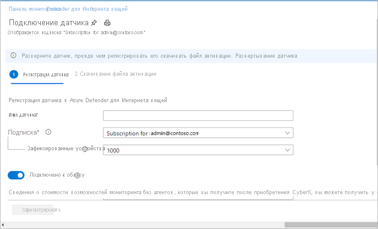
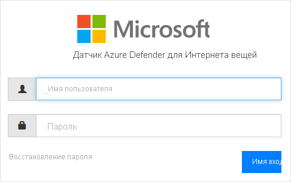

# Краткое руководство. Развертывание и подключение датчика

В этой статье показано, как выполнить развертывание датчика. Все датчики нужно подключить к порталу Azure Defender для Интернета вещей.

Для этого процесса нужно приобрести заранее настроенный датчик или сертифицированное устройство с датчиком, а затем самостоятельно установить программное обеспечение для датчика.

Если вы используете сертифицированное устройство с датчиком, перед началом работы ознакомьтесь с [руководством по спецификациям оборудования для Azure Defender для Интернета вещей](https://aka.ms/AzureDefenderforIoTBareMetalAppliance).

> [!NOTE]
> Локальную консоль управления Azure Defender для Интернета вещей отдельно подключать не нужно.

Подключение датчика предоставит следующие возможности:

|||
|------ | ----------- |
| **Определение имени датчика** | Присвойте подключаемому датчику имя и свяжите его с определенным Центром Интернета вещей или определенной подпиской.  Дополнительные сведения см. в статье **Подключение датчиков** .|
|**Выбор подписки и количества устройств в ней**|Выберите подписку и число устройств, которые она охватывает. Это значение задается с шагом в 1000.|
| **Определение режима управления датчиком** | Определите, где будет отображаться информация об активах, оповещениях и других данных от датчика. Это будет зависеть от выбранного вами **режима управления датчиком** .  **Режим локального управления.** Обнаруженные датчиком сведения отображаются в консоли датчика. Сведения об обнаружении также передаются в локальную консоль управления, если к ней подключен датчик.  **Режим управления в облаке.** Обнаруженные датчиком сведения отображаются в консоли датчика. Кроме того, сведения о предупреждениях доставляются через Центр Интернета вещей и могут передаваться в другие службы Azure, например Azure Sentinel. Дополнительные сведения см. в статье **Подключение датчиков** . |
| **Получение файла активации датчика** | Для **локально управляемых** датчиков используется файл активации, который задает разрешенные периоды активации датчика.  Для **управляемых в облаке** датчиков файл активации используется для подключения датчика к Центру Интернета вещей. Дополнительные сведения см. в статье **Подключение датчиков** . |
| **Отправка файла активации в датчик** | Файлы активации нужно передать во все корпоративные датчики. Без передачи файла активации будут недоступны возможности мониторинга сети и доступ к функциям консоли датчика. Дополнительные сведения см. в инструкциях по **загрузке файлов активации датчика** . |
| **Обновление сетевых параметров датчика перед активацией** | Измените параметры, определенные во время установки датчика. Дополнительные сведения см. в описании ошибки  **Reference source not found** (Источник ссылки не найден).|

**Чтобы развернуть датчик, сделайте следующее:**

1. Перейдите на страницу Azure Defender для Интернета вещей на портале Azure.

2. Щелкните **Начало работы** .

3. В разделе **Обнаружение сети** выберите **Настроить** .

   

4. Выберите вариант приобретения датчика.

   

  - **Приобретение предварительно настроенного датчика.** Корпорация Майкрософт и Arrow совместно предоставляют предварительно настроенные датчики. Чтобы приобрести предварительно настроенный датчик, обратитесь в компанию Arrow: <hardware.sales@arrow.com>. Датчик будет отправлен вам. Устанавливается самая свежая версия.

  - **Использование собственного устройства (ISO).** Решение выполняется на сертифицированных устройствах. Сведения в [руководстве по спецификациям оборудования для Azure Defender для Интернета вещей](https://aka.ms/AzureDefenderforIoTBareMetalAppliance) помогут вам при приобретении сертифицированного устройства.

    - Выберите версию в меню **Выбор версии** .

    - Щелкните **Скачать** и сохраните файл. Дополнительные сведения о скачивании ISO-образа и установке программного обеспечения датчика см. в **руководстве по установке Azure Defender для Интернета вещей** .

5. Завершив установку программного обеспечения на собственном датчике или получив предварительно настроенный датчик, переходите к задачам по настройке сети. Дополнительные сведения см. в [руководстве по настройке сети](https://aka.ms/AzureDefenderForIoTNetworkSetup).

## Подключение датчика

Все датчики нужно подключить к порталу Azure Defender для Интернета вещей. Это подключение выполняется в два этапа:

1. регистрация датчика на портале Azure Defender для Интернета вещей;

2. скачивание файла активации для датчика. Позже этот файл будет отправлен в датчик.

**Чтобы открыть страницу подключения, сделайте следующее:**

1. Перейдите на страницу **Начало работы** портала Azure Defender для Интернета вещей.

2. Выберите действие **2) Подключить датчик** для Azure Defender для Интернета вещей.

   

3. Откроется страница **Подключение датчика** . Здесь можно зарегистрировать датчик и скачать файл активации.

   

**Чтобы зарегистрировать датчик, сделайте следующее:**

1. Выберите имя датчика. Для управляемых в облаке датчиков заданное здесь имя будет отображаться в консоли датчика; его нельзя изменить из консоли. Для локально управляемых датчиков заданное здесь имя будет храниться в Azure; его можно изменить из консоли датчика. Мы рекомендуем включить в это имя IP-адрес датчика, указанный при его установке, или выбрать легко узнаваемое имя. Это поможет вам отслеживать имена и поддерживать их согласованность между порталом Azure Defender для Интернета вещей и IP-адресами развертывания датчиков, которые отображаются в консоли датчика.

2. Выберите подписку в раскрывающемся списке.
3. В поле **Подключенные устройства** введите число устройств, охватываемых этой подпиской. Это значение нужно вводить повторно для каждого подключенного датчика, связанного с этой подпиской.  Например, если с подпиской A связаны 6000 устройств, укажите значение 6000 для каждого датчика, связанного с подпиской A.   
4. Выберите режим управления датчиком с помощью переключателя **Подключение к облаку** . Если этот переключатель включен, датчик **управляется в облаке** . Если этот переключатель выключен, датчик **управляется локально** .

| Режим управления датчиком | Описание                                                |
| ---------------------- | ---------------------------------------------------------  |
| **Управление в облаке**          | Обнаруженные датчиком сведения отображаются в консоли датчика. Кроме того, сведения о предупреждениях доставляются через Центр Интернета вещей и могут передаваться в другие службы Azure, например Azure Sentinel.  Выберите Центр Интернета вещей, который вы хотите связать с этим датчиком.  Также потребуется передать файл активации для управления в облаке во все управляемые в облаке датчики.  Дополнительные сведения см. в инструкциях по **загрузке файлов активации датчика** . |
| **Локальное управление**        | Обнаруженные локально управляемыми датчиками сведения отображаются в консоли датчика. Если вы работаете в сети без подключения к Интернету и хотите получить единое представление всей информации, обнаруживаемой несколькими локально управляемыми датчиками, используйте локальную консоль управления.  Датчики в режиме *локального управления* связаны с подпиской Azure и содержат сведения о сроке действия активации датчика.  Выберите подписку, связываемую с датчиком.  Также потребуется передать файл активации для локального управления в каждый датчик. Дополнительные сведения см. в инструкциях по **загрузке файлов активации датчика** . |

5. Выберите **Зарегистрировать** .

6. На странице "Скачивание файла активации" щелкните **Скачать файл активации** .

   

7. Сохраните файл. Имя файла имеет формат `<hub_name>_<sensor_name>`. Здесь используется имя датчика, которое вы определили выше.

8. Нажмите кнопку **Готово** .

9. Чтобы завершить процесс подключения датчика, отправьте этот файл в датчик с помощью консоли Azure Defender для Интернета вещей.
 
## Отправка файла активации датчика

В этой статье показано, как отправить файл активации в датчик. Этот файл вы должны были получить при подключении датчика.

**Файлы активации для локального управления**

Локально управляемые датчики связываются с подпиской Azure.  Файл активации для локально управляемых датчиков содержит дату окончания срока действия. За один месяц до этой даты в верхней части консоли датчика появится предупреждающее сообщение. Это предупреждение будет отображаться, пока вы не обновите файл активации.

После истечения срока действия файла активации вы можете по-прежнему использовать функции Azure Defender для Интернета вещей.

**Файлы активации для управления в облаке**

Управляемые в облаке датчики связываются с Центром Интернета вещей Azure. Эти датчики не ограничиваются периодами действия файла активации. Файл активации для управляемых в облаке датчиков используется только для подключения к Центру Интернета вещей.

См. сведения о [Центре Интернета вещей](../iot-hub/about-iot-hub.md).

**Чтобы отправить файл активации, сделайте следующее:**

1. Убедитесь что у вас есть следующее:

   - IP-адрес датчика, определенный во время установки;

   - данные для входа пользователя, требуемые для датчика.

2. Откройте консоль Azure Defender для Интернета вещей в любом браузере, указав IP-адрес этого датчика.

3. Войдите в консоль датчика Azure Defender для Интернета вещей.

   

4. После успешного входа откроется экран Activation (Активация). Щелкните Upload (Отправить) и выберите сохраненный файл активации.

   

5. Подтвердите согласие с условиями использования.

6. Выберите **Активировать** . Параметры конфигурации сети датчика определяются при установке программного обеспечения или приобретении предварительно настроенного датчика. Можно определить следующие параметры:
   - IP-адрес
   - DNS  
   - Шлюз по умолчанию
   - Маска подсети
   - Имя узла
 
   Возможно, перед активацией датчика вы захотите изменить эти сведения, так как:
   - вам нужно изменить предварительно настроенные параметры;  
   - вы хотите изменить параметры сети после установки или определить параметры прокси-сервера перед активацией датчика.

7. В диалоговом окне Activation (Активация) выберите ссылку **Sensor Network Configuration** (Конфигурация сети для датчика).  

   

8. Отобразятся параметры, определенные во время установки. Также здесь можно определить прокси-сервер. Измените данные и щелкните **Save** (Сохранить).
 
 
## Дальнейшие шаги

Из этой статьи вы узнали, как развертывать и подключать датчики. Дополнительные сведения о работе с ними см. в следующих статьях:

- [Начало работы](getting-started.md)