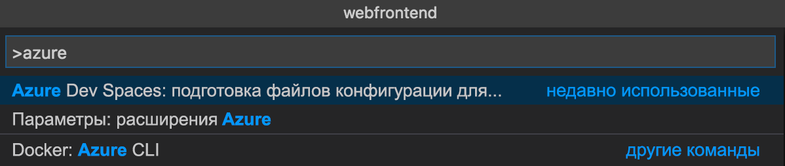
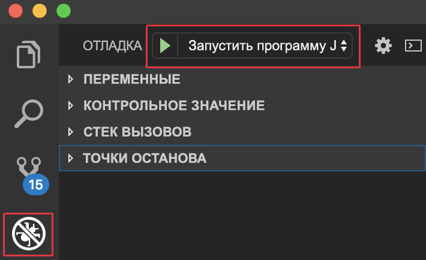
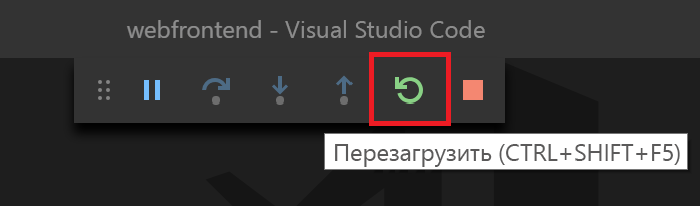

# <a name="create-a-kubernetes-dev-space-visual-studio-code-and-java-with-azure-dev-spaces"></a>Создание пространства разработки Kubernetes: Использование Visual Studio Code и Java в Azure Dev Spaces

Из этого руководства вы узнаете, как выполнить следующие задачи:

- создание в Azure оптимизированной для разработки среды на основе Kubernetes — _пространства разработки_;
- итеративная разработка кода в контейнерах с помощью VS Code и командной строки;
- эффективная разработка и тестирование кода в среде командной работы.

> [!Note]
> **Если на каком-то этапе у вас возникли трудности**, см. статью об [устранении неполадок](troubleshooting.md).

## <a name="install-the-azure-cli"></a>Установка Azure CLI
Для Azure Dev Spaces требуется минимальная настройка локального компьютера. Большая часть конфигурации среды разработки хранится в облаке и доступна для других пользователей. Начните со скачивания и запуска [Azure CLI](/cli/azure/install-azure-cli?view=azure-cli-latest).

### <a name="sign-in-to-azure-cli"></a>Вход в Azure CLI
Войдите в Azure. В окне терминала введите следующую команду:

```cmd
az login
```

> [!Note]
> Если у вас нет подписки Azure, создайте [бесплатную учетную запись](https://azure.microsoft.com/free).

#### <a name="if-you-have-multiple-azure-subscriptions"></a>Если у вас несколько подписок Azure...
Можно просматривать свои подписки, выполнив следующую команду: 

```cmd
az account list --output table
```

Найдите подписку со значением *True* для параметра *IsDefault*.
Если это не та подписка, которую нужно использовать, вы можете изменить подписку по умолчанию:

```cmd
az account set --subscription <subscription ID>
```

## <a name="create-a-kubernetes-cluster-enabled-for-azure-dev-spaces"></a>Создание и включение кластера Kubernetes для Azure Dev Spaces

В командной строке создайте группу ресурсов в [регионе, который поддерживает Azure Dev Spaces][supported-regions].

```cmd
az group create --name MyResourceGroup --location <region>
```

Чтобы создать кластер Kubernetes, выполните следующую команду:

```cmd
az aks create -g MyResourceGroup -n MyAKS --location <region> --disable-rbac --generate-ssh-keys
```

Создание кластера занимает несколько минут.

### <a name="configure-your-aks-cluster-to-use-azure-dev-spaces"></a>Настройка кластера AKS для использования Azure Dev Spaces

В окне командной строки Azure CLI введите приведенную ниже команду, используя группу ресурсов, в которую входит кластер AKS, и имя кластера AKS. Эта команда настраивает в кластере поддержку Azure Dev Spaces.

   ```cmd
   az aks use-dev-spaces -g MyResourceGroup -n MyAKS
   ```

> [!IMPORTANT]
> Процесс настройки Azure Dev Spaces удалит пространство имен `azds` в кластере, если оно существует.

## <a name="get-kubernetes-debugging-for-vs-code"></a>Получение функции отладки Kubernetes для VS Code
Для разработчиков .NET Core и Node.js, которые используют VS Code, доступны широкие возможности, такие как функция отладки Kubernetes.

1. Если у вас не установлен язык [VS Code](https://code.visualstudio.com/Download), установите его.
1. Скачайте и установите [ расширение VS Azure Dev Spaces](https://marketplace.visualstudio.com/items?itemName=azuredevspaces.azds). Один раз щелкните "Установить" на странице расширения в Marketplace и еще раз — в VS Code. 

Для отладки приложений на Java с использованием Azure Dev Spaces скачайте и установите расширение [Java Debugger for Azure Dev Spaces](https://marketplace.visualstudio.com/items?itemName=vscjava.vscode-java-debugger-azds) для VS Code. Один раз щелкните "Установить" на странице расширения в Marketplace и еще раз — в VS Code.

## <a name="create-a-web-app-running-in-a-container"></a>Создание веб-приложения для работы в контейнере

В этом разделе вы создадите веб-приложение на Java и запустите его в контейнере в Kubernetes.

### <a name="create-a-java-web-app"></a>Создание веб-приложения Java
Скачайте код из GitHub, перейдя по ссылке https://github.com/Azure/dev-spaces, и выберите **Clone or Download** (Клонировать или скачать), чтобы скачать репозиторий GitHub в локальную среду. Код для этого руководства находится в папке `samples/java/getting-started/webfrontend`.

## <a name="preparing-code-for-docker-and-kubernetes-development"></a>Подготовка кода для разработки Docker и Kubernetes
На данный момент у вас есть базовое веб-приложение, которое можно запустить локально. Теперь вы упакуете его в контейнер, создав ресурсы, определяющие контейнер приложения и способ его развертывания в Kubernetes. Эту задачу легко выполнить с помощью Azure Dev Spaces: 

1. Запустите VS Code и откройте папку `webfrontend`. (Вы можете игнорировать любые запросы по умолчанию на добавление ресурсов отладки или восстановления проекта.)
1. Откройте встроенный терминал в VS Code (выберите **Представление > Интегрированный терминал**).
1. Запустите эту команду (убедитесь, что ваша текущая папка — **webfrontend**):

    ```cmd
    azds prep --public
    ```

Команда `azds prep` Azure CLI создает ресурсы Docker и Kubernetes с параметрами по умолчанию:
* `./Dockerfile` описывает образ контейнера приложения и способ создания и запуска исходного кода в контейнере.
* В [диаграмме Helm](https://docs.helm.sh) в разделе `./charts/webfrontend` описано, как развернуть контейнер в Kubernetes.

Сейчас изучать все содержимое этих файлов не требуется. Однако стоит отметить, что **те же ресурсы Kubernetes и Docker конфигурации как кода, могут использоваться для разработки и производства, обеспечивая тем самым лучшую согласованность в разных средах.**
 
С помощью команды `prep` также создается файл `./azds.yaml`. Он является файлом конфигурации для Azure Dev Spaces. Он предоставляет артефактам Docker и Kubernetes дополнительную конфигурацию, которая обеспечивает последовательную разработку в Azure.

## <a name="build-and-run-code-in-kubernetes"></a>Сборка и запуск кода в Kubernetes
Давайте запустим код! В окне терминала запустите следующую команду из **корневой папки кода**, webfrontend:

```cmd
azds up
```

Следите за выходными данными команды, и по мере ее выполнения вы заметите следующее:
- Исходный код синхронизируется в пространство разработки в Azure.
- Образ контейнера создается в Azure, как указано в ресурсах Docker в вашей папке кода.
- Создаются объекты Kubernetes, использующие образ контейнера в соответствии с диаграммой Helm в вашей папке кода.
- Отображаются сведения о конечной точке контейнера. В нашем случае нам необходим общедоступный URL-адрес HTTP.
- Если приведенные выше этапы выполнены успешно, после запуска контейнера должны отобразиться выходные данные `stdout` (и `stderr`).

> [!Note]
> При первом запуске команды `up` на выполнение этих шагов потребуется больше времени, но последующие запуски должны выполняться быстрее.

### <a name="test-the-web-app"></a>Тестирование веб-приложения
Просмотрите выходные данные консоли, чтобы найти сведения об общедоступном URL-адресе, который был создан командой `up`. Он будет выглядеть следующим образом: 

```
(pending registration) Service 'webfrontend' port 'http' will be available at <url>
Service 'webfrontend' port 'http' is available at http://webfrontend.1234567890abcdef1234.eus.azds.io/
Service 'webfrontend' port 80 (TCP) is available at 'http://localhost:<port>'
```

Определите общедоступный URL-адрес для службы в выходных данных команды `up`. Он заканчивается на `.azds.io`. В нашем примере используется такой общедоступный URL-адрес: `http://webfrontend.1234567890abcdef1234.eus.azds.io/`.

Чтобы просмотреть веб-приложение, откройте общедоступный URL-адрес в браузере. Кроме того, обратите внимание, что выходные данные `stdout` и `stderr` передаются потоком в окно терминала *azds trace* при взаимодействии с веб-приложением. Вы также увидите сведения об отслеживании HTTP-запросов при их прохождении в системе. Это упрощает отслеживание сложных вызовов к нескольким службам во время разработки. Инструментарий, добавленный в Dev Spaces, предоставляет эту возможность отслеживания запросов.

> [!Note]
> Кроме общедоступного URL-адреса можно использовать альтернативный URL-адрес `http://localhost:<portnumber>`, который отображается в выходных данных консоли. Если вы используете URL-адрес localhost, может показаться, что контейнер выполняется локально, но на самом деле он выполняется в AKS. В Azure Dev Spaces используется *перенаправление портов* Kubernetes для сопоставления порта localhost с контейнером, запущенным в AKS. Это облегчает работу со службой на локальном компьютере.

### <a name="update-a-content-file"></a>Обновление файла содержимого
Azure Dev Spaces — это не просто среда выполнения кода в Kubernetes. Она позволяет быстро и итеративно видеть, как изменения вашего кода вступают в силу в среде Kubernetes в облаке.

1. В окне терминала нажмите клавишу `Ctrl+C` (чтобы остановить `azds up`).
1. Откройте `src/main/java/com/ms/sample/webfrontend/Application.java` и измените сообщение приветствие на [строку 19](https://github.com/Azure/dev-spaces/blob/master/samples/java/getting-started/webfrontend/src/main/java/com/ms/sample/webfrontend/Application.java#L19):

    ```java
    return "Hello from webfrontend in Azure!";
    ```

1. Сохраните файл.
1. Запустите `azds up` в окне терминала.

Эта команда перестроит образ контейнера и повторно развернет диаграмму Helm. Чтобы увидеть изменения в работающем приложении, просто обновите страницу браузера.

Но есть еще один *более быстрый метод* разработки кода, который вы рассмотрите в следующем разделе. 

## <a name="debug-a-container-in-kubernetes"></a>Отладка контейнера в Kubernetes

В этом разделе используется VS Code для прямой отладки контейнера, работающего в Azure. Также вы узнаете, как быстрее вносить изменения, выполнять тестирование и запуск.


> [!Note]
> **Если на каком-то этапе у вас возникли трудности**, см. статью [Устранение неполадок](troubleshooting.md) или оставьте комментарий на этой странице.

### <a name="initialize-debug-assets-with-the-vs-code-extension"></a>Инициализация ресурсов отладки с помощью расширения VS Code
Сначала необходимо настроить проект кода, чтобы редактор VS Code мог взаимодействовать со средой разработки в Azure. Расширение VS Code для Azure Dev Spaces содержит вспомогательную команду для настройки конфигурации отладки. 

Откройте **палитру команд** (с помощью меню **Вид | Палитра команд**), включите автоматическое завершение ввода и выберите эту команду: `Azure Dev Spaces: Prepare configuration files for Azure Dev Spaces`. 

В папку `.vscode` будет добавлена конфигурация отладки для Azure Dev Spaces. Не следует путать эту команду с командой `azds prep`, которая позволяет настроить проект для развертывания.



### <a name="select-the-azds-debug-configuration"></a>Выбор конфигурации отладки AZDS
1. Чтобы открыть представление отладки, щелкните значок "Отладка" на **панели действия** сбоку VS Code.
1. Выберите **Launch Java Program (AZDS)** (Запустить программу на Java (AZDS)) как активную конфигурацию отладки.



> [!Note]
> Если вы не видите никаких команд Azure Dev Spaces на палитре команд, убедитесь, что вы установили расширение VS Code для Azure Dev Spaces. Убедитесь, что рабочая область, которую вы открыли в VS Code, — это папка, содержащая файл `azds.yaml`.

### <a name="debug-the-container-in-kubernetes"></a>Отладка контейнера в Kubernetes
Нажмите клавишу **F5**, чтобы отладить свой код в Kubernetes.

Как и команда `up`, код синхронизируется со средой разработки, а контейнер создается и развертывается в Kubernetes. На этот раз, конечно, отладчик подключен к удаленному контейнеру.

> [!Tip]
> Строка состояния VS Code станет оранжевой. Это указывает на то, что отладчик подключен. Кроме того, появится интерактивный URL-адрес, который можно использовать для открытия приложения.


Установите точку останова в файле кода на стороне сервера, например в функции `greeting()` в исходном файле `src/main/java/com/ms/sample/webfrontend/Application.java`. Обновление страницы браузера инициирует срабатывание точки останова.

У вас есть полный доступ к отладочной информации, как если бы код выполнялся локально, например к стеку вызовов, локальным переменным, информации об исключениях и т. д.

### <a name="edit-code-and-refresh"></a>Изменение и обновление кода
С помощью активного отладчика отредактируйте код. Например, измените приветствие в файле `src/main/java/com/ms/sample/webfrontend/Application.java`. 

```java
public String greeting()
{
    return "I'm debugging Java code in Azure!";
}
```

Сохраните файл и в области **действий отладки** нажмите кнопку **Restart** (Обновить).



Вместо того, чтобы перестраивать и повторно развертывать новый образ контейнера при каждой правке кода, что часто занимает много времени, Azure Dev Spaces пошагово перекомпилирует код в существующем контейнере, чтобы ускорить цикл редактирования и отладки.

Обновите веб-приложение в браузере. Вы должны увидеть настраиваемое сообщение в пользовательском интерфейсе.

**Теперь у вас есть метод быстрой итерации кода и отладки непосредственно в Kubernetes**. Далее вы узнаете, как создать и вызвать второй контейнер.

## <a name="next-steps"></a>Дополнительная информация

> [!div class="nextstepaction"]
> [Узнайте больше о разработке с использованием нескольких служб](multi-service-java.md)


[supported-regions]: about.md#supported-regions-and-configurations
