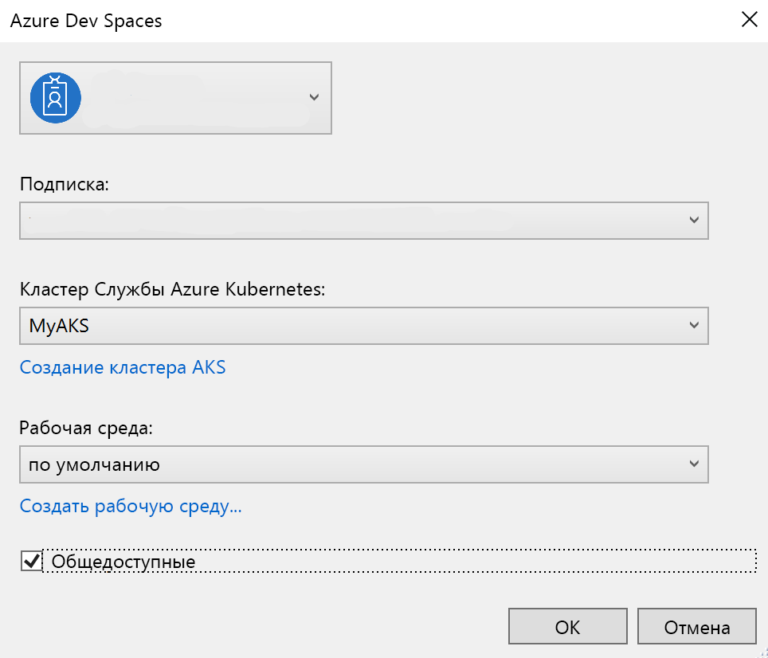

# <a name="create-a-kubernetes-dev-space-visual-studio-and-net-core-with-azure-dev-spaces"></a>Создание пространства разработки Kubernetes: Visual Studio и .NET Core в Azure Dev Spaces

[!INCLUDE [Azure Dev Spaces deprecation](../../includes/dev-spaces-deprecation.md)]

Из этого руководства вы узнаете, как выполнить следующие задачи:

- Настройка Azure Dev Spaces с помощью управляемого кластера Kubernetes в Azure.
- итеративно разрабатывать код в контейнерах с помощью Visual Studio.
- независимая разработка двух отдельных служб и вызов другой службы с помощью обнаружения службы DNS Kubernetes;
- эффективная разработка и тестирование кода в среде командной работы.

> [!NOTE]
> **Если на каком-то этапе у вас возникли трудности**, см. раздел об [устранении неполадок](troubleshooting.md).

## <a name="install-the-azure-cli"></a>Установка Azure CLI
Для Azure Dev Spaces требуется минимальная настройка локального компьютера. Большая часть конфигурации среды разработки хранится в облаке и доступна для других пользователей. Начните со скачивания и запуска [Azure CLI](/cli/azure/install-azure-cli?view=azure-cli-latest).

### <a name="sign-in-to-azure-cli"></a>Вход в Azure CLI
Войдите в Azure. В окне терминала введите следующую команду:

```azurecli
az login
```

> [!NOTE]
> Если у вас нет подписки Azure, создайте [бесплатную учетную запись](https://azure.microsoft.com/free).

#### <a name="if-you-have-multiple-azure-subscriptions"></a>Если у вас несколько подписок Azure...
Можно просматривать свои подписки, выполнив следующую команду: 

```azurecli
az account list --output table
```

Найдите подписку со значением *True* для параметра *IsDefault*.
Если это не та подписка, которую нужно использовать, вы можете изменить подписку по умолчанию:

```azurecli
az account set --subscription <subscription ID>
```

## <a name="create-a-kubernetes-cluster-enabled-for-azure-dev-spaces"></a>Создание и включение кластера Kubernetes для Azure Dev Spaces

В командной строке создайте группу ресурсов в [регионе, который поддерживает Azure Dev Spaces][supported-regions].

```azurecli
az group create --name MyResourceGroup --location <region>
```

Чтобы создать кластер Kubernetes, выполните следующую команду:

```azurecli
az aks create -g MyResourceGroup -n MyAKS --location <region> --generate-ssh-keys
```

Создание кластера занимает несколько минут.

### <a name="configure-your-aks-cluster-to-use-azure-dev-spaces"></a>Настройка кластера AKS для использования Azure Dev Spaces

В окне командной строки Azure CLI введите приведенную ниже команду, используя группу ресурсов, в которую входит кластер AKS, и имя кластера AKS. Эта команда настраивает в кластере поддержку Azure Dev Spaces.

   ```azurecli
   az aks use-dev-spaces -g MyResourceGroup -n MyAKS
   ```
   
> [!IMPORTANT]
> Процесс настройки Azure Dev Spaces удалит пространство имен `azds` в кластере, если оно существует.

## <a name="get-the-visual-studio-tools"></a>Получение средств Visual Studio
Установите в Windows последнюю версию [Visual Studio 2019](https://www.visualstudio.com/vs/) с рабочей нагрузкой для разработки в Azure.

## <a name="create-a-web-app-running-in-a-container"></a>Создание веб-приложения для работы в контейнере

В этом разделе вы создадите веб-приложение ASP.NET Core и запустите его в контейнере в Kubernetes.

### <a name="create-an-aspnet-web-app"></a>Создание веб-приложения ASP.NET

Создайте новый проект в Visual Studio. В настоящее время проект должен быть **веб-приложением ASP.NET Core**. Присвойте проекту имя **webfrontend**.


Выберите шаблон **Веб-приложение (модель-представление-контроллер)** и выберите **.NET Core** и **ASP.NET Core 2.0** в двух раскрывающихся списках в верхней части диалогового окна. Чтобы создать проект, нажмите кнопку **ОК** .


### <a name="enable-dev-spaces-for-an-aks-cluster"></a>Включение Dev Spaces для кластера AKS

В только что созданном проекте в раскрывающемся списке параметров запуска выберите **Azure Dev Spaces**, как показано ниже.


В появившемся диалоговом окне убедитесь, что вы вошли в систему с соответствующей учетной записью, а затем выберите существующий кластер Kubernetes.



В раскрывающемся списке **Пространство** оставьте пока значение по умолчанию (`default`). Позже вы узнаете больше об этом параметре. Установите флажок **Publicly Accessible** (Общедоступное), чтобы веб-приложение было доступно через общедоступную конечную точку. Этот параметр не является обязательным, но он будет полезен для демонстрации некоторых концепций далее в этом пошаговом руководстве. Но не волнуйтесь, вы в любом случае сможете выполнить отладку веб-сайта с помощью Visual Studio.


Нажмите кнопку **ОК**, чтобы выбрать или создать кластер.

Если выбран кластер, который еще не был настроен для работы с Azure Dev Spaces, вы увидите сообщение с вопросом, хотите ли вы настроить его.


Нажмите кнопку **ОК**.

> [!IMPORTANT]
> Процесс настройки Azure Dev Spaces удалит пространство имен `azds` в кластере, если оно существует.

 Эта задача запустится в фоновом режиме. Выполнение может занять несколько минут. Чтобы увидеть, находится ли кластер в процессе создания, наведите указатель мыши на значок **фоновые задачи** в левом нижнем углу строки состояния, как показано на следующем изображении.


> [!NOTE]
> Пока не будет создано пространство разработки, выполнить отладку приложения нельзя.

### <a name="look-at-the-files-added-to-project"></a>Просмотр файлов, добавленных в проект
Пока вы ожидаете завершения создания пространства разработки, просмотрите файлы, которые были добавлены в ваш проект при выборе пространства разработки.

Во-первых, вы можете увидеть, что была добавлена папка с именем `charts`, в которой создана [диаграмма Helm](https://docs.helm.sh) для вашего приложения. Эти файлы используются для развертывания приложения в пространство разработки.

Вы увидите добавленный файл с именем `Dockerfile`. Этот файл содержит сведения, необходимые для упаковки приложения в стандартном формате Docker.

Наконец вы увидите файл с именем `azds.yaml`, содержащий конфигурацию, которая использовалась при разработке и требуется для пространства разработки.


## <a name="debug-a-container-in-kubernetes"></a>Отладка контейнера в Kubernetes
После успешного создания пространства разработки вы можете приступить к отладке приложения. Установите точку останова в коде, например, в строке 20 в файле `HomeController.cs`, где установлена ​​переменная `Message`. Нажмите клавишу **F5**, чтобы запустить отладку. 

Visual Studio будет взаимодействовать с пространством разработки для создания и развертывания приложения, а затем откроет браузер с работающим веб-приложением. Может показаться, что контейнер работает локально, но на самом деле он выполняется в пространстве разработки в Azure. В адресе указано localhost, так как Azure Dev Spaces создает временный туннель SSH к контейнеру, работающему в AKS.

Перейдите по ссылке **About** (Сведения) в верхней части страницы, чтобы вызвать точку останова. У вас есть полный доступ к отладочной информации, как если бы код выполнялся локально, например к стеку вызовов, локальным переменным, информации об исключениях и т. д.

## <a name="iteratively-develop-code"></a>Итерационная разработка кода

Azure Dev Spaces — это не просто среда выполнения кода в Kubernetes. Она позволяет быстро и итеративно видеть, как изменения вашего кода вступают в силу в среде Kubernetes в облаке.

### <a name="update-a-content-file"></a>Обновление файла содержимого


1. Найдите файл `./Views/Home/Index.cshtml` и внесите изменения в HTML. Например, измените [строку 73 `<h2>Application uses</h2>`](https://github.com/Azure/dev-spaces/blob/master/samples/dotnetcore/getting-started/webfrontend/Views/Home/Index.cshtml#L73) строкой примерно такого содержания: 
  
    ```html
    <h2>Hello k8s in Azure!</h2>`
    ```

2. Сохраните файл.
3. Вернитесь в браузер и обновите страницу. Должна отобразиться веб-страница с обновленным HTML.

Что произошло? Изменения файлов содержимого, таких как HTML и CSS, не требуют повторной компиляции в веб-приложении .NET Core, поэтому активный сеанс F5 автоматически синхронизирует любые измененные файлы содержимого в запущенный контейнер в AKS, чтобы можно было сразу же видеть изменения содержимого.

### <a name="update-a-code-file"></a>Обновление файла кода
Для обновления файлов кода требуется немного больше работы, так как приложение .NET Core должно перестроить и создать обновленные двоичные файлы приложений.

1. Остановите отладчик в Visual Studio.
1. Откройте файл кода с именем `Controllers/HomeController.cs` и измените сообщение, которое будет отображаться на странице About (Сведения): `ViewData["Message"] = "Your application description page.";`
1. Сохраните файл.
1. Нажмите клавишу **F5**, чтобы снова запустить отладку. 

Вместо того, чтобы перестраивать и повторно развертывать новый образ контейнера при каждой правке кода, что часто занимает много времени, Azure Dev Spaces пошагово перекомпилирует код в существующем контейнере, чтобы ускорить цикл редактирования и отладки.

В браузере обновите веб-приложение и перейдите на страницу About (Сведения). Вы должны увидеть настраиваемое сообщение в пользовательском интерфейсе.

## <a name="next-steps"></a>Дальнейшие действия

Узнайте больше о принципах работы Azure Dev Spaces.

> [!div class="nextstepaction"]
> [Принцип работы Azure Dev Spaces](how-dev-spaces-works.md)


[supported-regions]: https://azure.microsoft.com/global-infrastructure/services/?products=kubernetes-service
