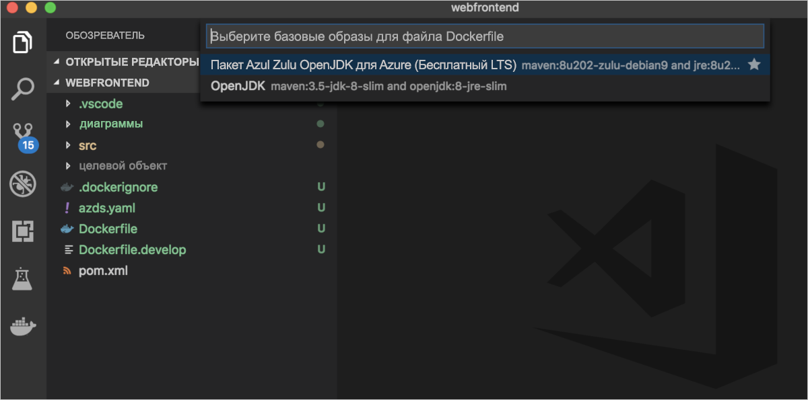
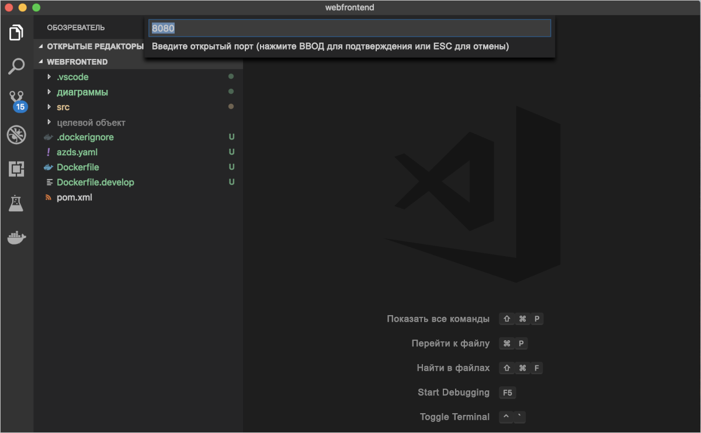
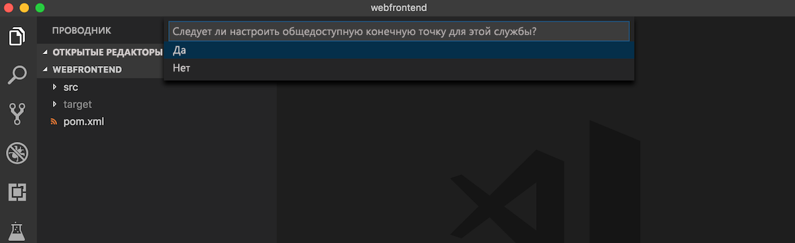

# <a name="quickstart-develop-with-java-on-kubernetes-using-azure-dev-spaces"></a>Краткое руководство. Разработка с помощью Java в Kubernetes с использованием Azure Dev Spaces

Из этого руководства вы узнаете, как выполнить следующие задачи:

- Настройка Azure Dev Spaces с помощью управляемого кластера Kubernetes в Azure.
- Итеративная разработка кода в контейнерах с помощью Visual Studio Code.
- Отладка кода в среде разработки с помощью Visual Studio Code.


## <a name="prerequisites"></a>Предварительные требования

- Подписка Azure. Если ее нет, можно создать [бесплатную учетную запись](https://azure.microsoft.com/free).
- [Средство Visual Studio Code](https://code.visualstudio.com/download).
- Расширения [Azure Dev Spaces](https://marketplace.visualstudio.com/items?itemName=azuredevspaces.azds) и [отладчик Java для Azure Dev Spaces](https://marketplace.visualstudio.com/items?itemName=vscjava.vscode-java-debugger-azds) для Visual Studio Code установлены.
- [Установленный Azure CLI](/cli/azure/install-azure-cli?view=azure-cli-latest).
- [Инструмент Maven установлен и настроен](https://maven.apache.org).

## <a name="create-an-azure-kubernetes-service-cluster"></a>Создание кластера Службы Azure Kubernetes

Вам нужно создать кластер AKS в [поддерживаемом регионе][supported-regions]. Следующие команды создают группу ресурсов *MyResourceGroup* и кластер AKS *MyAKS*.

```cmd
az group create --name MyResourceGroup --location eastus
az aks create -g MyResourceGroup -n MyAKS --location eastus --node-vm-size Standard_DS2_v2 --node-count 1 --disable-rbac --generate-ssh-keys
```

## <a name="enable-azure-dev-spaces-on-your-aks-cluster"></a>Включение Azure Dev Spaces в кластере AKS

С помощью команды `use-dev-spaces` включите Dev Spaces в кластере AKS и следуйте инструкциям на экране. Следующая команда включает Dev Spaces в кластере *MyAKS* в группе *MyResourceGroup* и создает пространство разработки *по умолчанию*.

```cmd
$ az aks use-dev-spaces -g MyResourceGroup -n MyAKS

'An Azure Dev Spaces Controller' will be created that targets resource 'MyAKS' in resource group 'MyResourceGroup'. Continue? (y/N): y

Creating and selecting Azure Dev Spaces Controller 'MyAKS' in resource group 'MyResourceGroup' that targets resource 'MyAKS' in resource group 'MyResourceGroup'...2m 24s

Select a dev space or Kubernetes namespace to use as a dev space.
 [1] default
Type a number or a new name: 1

Kubernetes namespace 'default' will be configured as a dev space. This will enable Azure Dev Spaces instrumentation for new workloads in the namespace. Continue? (Y/n): Y

Configuring and selecting dev space 'default'...3s

Managed Kubernetes cluster 'MyAKS' in resource group 'MyResourceGroup' is ready for development in dev space 'default'. Type `azds prep` to prepare a source directory for use with Azure Dev Spaces and `azds up` to run.
```

## <a name="get-sample-application-code"></a>Получение примера кода приложения

В этой статье описано, как использовать [пример приложения Azure Dev Spaces](https://github.com/Azure/dev-spaces), чтобы продемонстрировать применение Azure Dev Spaces.

Клонируйте приложение из GitHub.

```cmd
git clone https://github.com/Azure/dev-spaces
```

## <a name="prepare-the-sample-application-in-visual-studio-code"></a>Подготовка примера приложения в Visual Studio Code

Откройте Visual Studio Code, щелкните *Файл*, *Открыть...* , а затем перейдите в каталог *dev-spaces/samples/java/getting-started/webfrontend* и щелкните *Открыть*.

Теперь проект *webfrontend* открыт в Visual Studio Code. Для запуска приложения в области разработки сгенерируйте активные диаграммы Docker и Helm, используя расширение Azure Dev Spaces в палитре команд.

Чтобы открыть палитру команд в Visual Studio Code, щелкните *Представление*, а затем — *Палитра команд*. Начните вводить `Azure Dev Spaces` и щелкните `Azure Dev Spaces: Prepare configuration files for Azure Dev Spaces`.


Когда Visual Studio Code предложит вам настроить базовые образы, открытый порт и общедоступную конечную точку, выберите `Azul Zulu OpenJDK for Azure (Free LTS)` для базового образа, `8080` для открытого порта и `Yes`, чтобы активировать общедоступную конечную точку.







Эта команда подготавливает проект для запуска в Azure Dev Spaces, создавая диаграмму Helm и Dockerfile. Она также создает каталог *.vscode* с конфигурацией отладки в корне проекта.

## <a name="build-and-run-code-in-kubernetes-from-visual-studio"></a>Сборка и запуск кода в Kubernetes из Visual Studio

Щелкните значок *Отладка* слева, а затем *Launch Java Program (AZDS)* (Запустить программу на Java (AZDS)) сверху.


Эта команда создает службы в Azure Dev Spaces. Окно *Терминал* внизу показывает выходные данные сборки и URL-адрес для службы, запущенной в Azure Dev Spaces. В *консоли отладки* показаны выходные данные журнала.

> [!Note]
> Если вы не видите никаких команд Azure Dev Spaces в *палитре команд*, убедитесь, что вы установили расширение [Visual Studio Code для Azure Dev Spaces](https://marketplace.visualstudio.com/items?itemName=azuredevspaces.azds). Кроме того, убедитесь, что вы открыли каталог *dev-spaces/samples/java/getting-started/webfrontend* в Visual Studio Code.

Вы увидите, что служба запущена, перейдя по общедоступному URL-адресу.

Щелкните *Отладка*, а затем выберите *Остановить отладку*, чтобы остановить отладчик.

## <a name="update-code"></a>Обновление кода

Чтобы развернуть обновленную версию службы, обновите любой файл в проекте и повторно выполните *Запуск Java Program (AZDS)* . Например:

1. Если ваше приложение по-прежнему работает, нажмите кнопку *Debug* (Отладка), а затем — *Stop Debugging* (Остановить отладку), чтобы остановить ее.
1. Измените [строку 19 в `src/main/java/com/ms/sample/webfrontend/Application.java`](https://github.com/Azure/dev-spaces/blob/master/samples/java/getting-started/webfrontend/src/main/java/com/ms/sample/webfrontend/Application.java#L19):
    
    ```java
    return "Hello from webfrontend in Azure!";
    ```

1. Сохраните изменения.
1. Повторите *Запуск Java Program (AZDS)* .
1. Перейдите к запущенной службе и просмотрите внесенные изменения.
1. Нажмите кнопку *Debug* (Отладка), а затем — *Stop Debugging* (Остановить отладку), чтобы остановить приложение.

## <a name="setting-and-using-breakpoints-for-debugging"></a>Настройка и использование точек останова для отладки

Запуск службы осуществляется с помощью *Launch Java Program (AZDS)* (Запуск программы Java (AZDS)). Таким образом служба также будет запущена в режиме отладки.

Вернитесь в представление *Explorer*, щелкнув *Представление*, а затем — *Explorer*. Откройте `src/main/java/com/ms/sample/webfrontend/Application.java` и щелкните строку 19, чтобы расположить в ней курсор. Чтобы задать точку останова, нажмите клавишу *F9* или щелкните *Отладка* и *Переключить точку останова*.

Откройте службу в браузере. Вы увидите, что сообщение не отображается. Вернитесь в Visual Studio Code. Вы увидите, что строка 19 выделена. Заданная вами точка останова приостановила выполнение службы на строке 19. Чтобы возобновить работу службы, нажмите клавишу *F5* или щелкните *Отладка*, а затем *Продолжить*. Вернитесь в браузер. Вы увидите, что сообщение теперь отображается.

Во время выполнения службы в Kubernetes с присоединенным отладчиком у вас есть полный доступ к отладочным сведениям, включая стек вызовов, локальные переменные и данные об исключениях.

Удалите точку останова, поместив курсор в строке 19 в `src/main/java/com/ms/sample/webfrontend/Application.java` и нажав клавишу *F9*.

## <a name="update-code-from-visual-studio-code"></a>Обновление кода из Visual Studio Code

Пока служба выполняется в режиме отладки, обновите строку 19 в `src/main/java/com/ms/sample/webfrontend/Application.java`. Например:
```java
return "Hello from webfrontend in Azure while debugging!";
```

Сохраните файл. Выберите *Отладка*, а затем — *Restart Debugging* (Перезапустить отладку) или на *панели инструментов отладки* нажмите кнопку *Restart Debugging* (Перезапустить отладку).


Откройте службу в браузере и обратите внимание, что отображается обновленное сообщение.

Вместо того, чтобы повторно выполнять сборку и развертывание нового образа контейнера при каждой правке кода, Azure Dev Spaces пошагово перекомпилирует код в существующем контейнере для ускорения цикла редактирования и отладки.

## <a name="clean-up-your-azure-resources"></a>Очистка ресурсов Azure

```cmd
az group delete --name MyResourceGroup --yes --no-wait
```

## <a name="next-steps"></a>Дополнительная информация

Узнайте, как в Azure Dev Spaces можно разрабатывать более сложные приложения в нескольких контейнерах и как упростить совместную разработку, используя разные версии и ветви кода в разных средах.

> [!div class="nextstepaction"]
> [Работа с несколькими контейнерами и командной разработкой](multi-service-java.md)


[supported-regions]: about.md#supported-regions-and-configurations