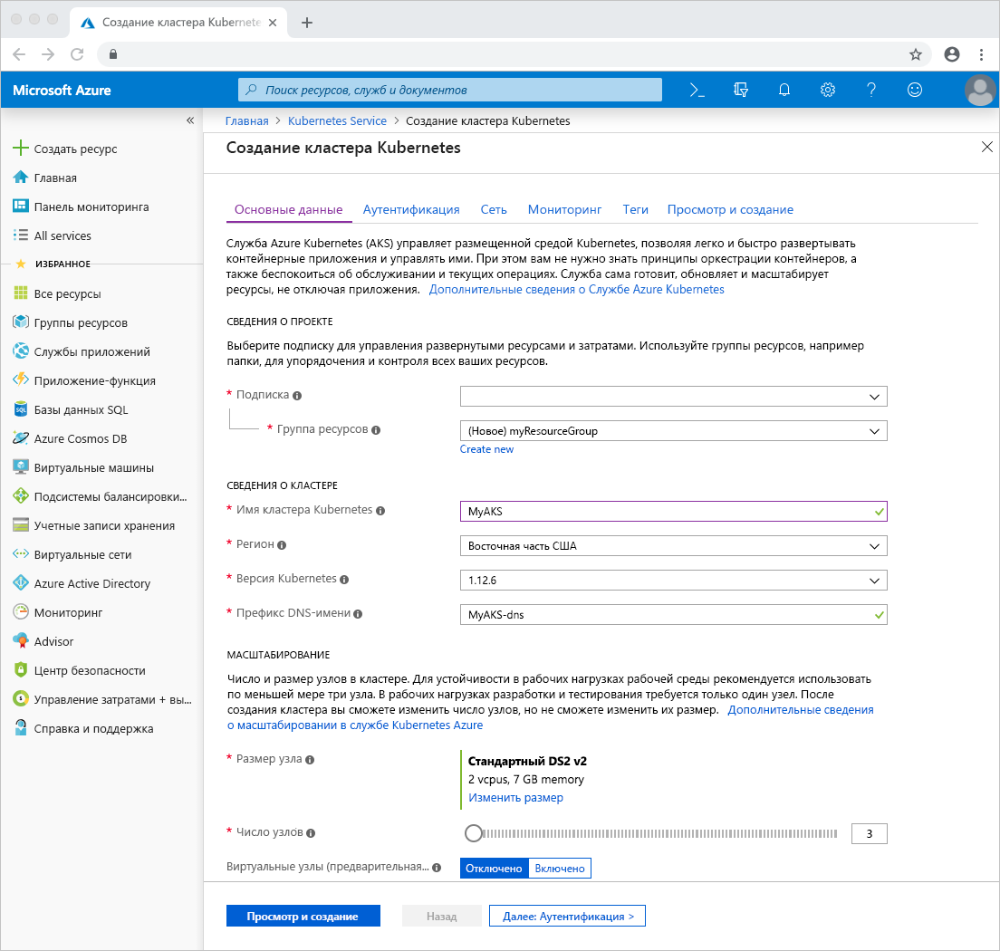
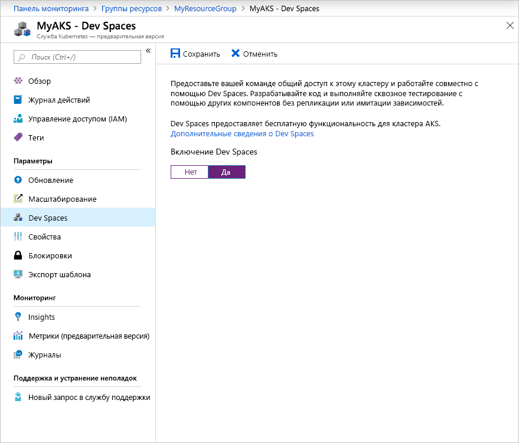

# <a name="quickstart-debug-and-iterate-with-visual-studio-and-net-core-on-kubernetes-with-azure-dev-spaces"></a>Краткое руководство. Отладка и итерация с помощью Visual Studio, .NET Core и Azure Dev Spaces в Kubernetes

Из этого руководства вы узнаете, как выполнить следующие задачи:

- Настройка Azure Dev Spaces с помощью управляемого кластера Kubernetes в Azure.
- итеративно разрабатывать код в контейнерах с помощью Visual Studio.
- Отладка кода, запущенного в кластере, с помощью Visual Studio.

Azure Dev Spaces также позволяет выполнять отладку и итерацию с помощью:
- [Java и Visual Studio Code](quickstart-java.md);
- [Node.js и Visual Studio Code](quickstart-nodejs.md);
- [.NET Core и Visual Studio Code](quickstart-netcore.md);

## <a name="prerequisites"></a>Предварительные требования

- Подписка Azure. Если ее нет, можно создать [бесплатную учетную запись](https://azure.microsoft.com/free).
- Visual Studio 2019 в Windows с установленной рабочей нагрузкой для разработки в Azure. Можно также использовать Visual Studio 2017 в Windows с установленной рабочей нагрузкой для веб-разработки и [Средствами Visual Studio для Kubernetes](https://aka.ms/get-vsk8stools). Если среда Visual Studio не установлена, скачайте ее [отсюда](https://aka.ms/vsdownload?utm_source=mscom&utm_campaign=msdocs).

## <a name="create-an-azure-kubernetes-service-cluster"></a>Создание кластера Службы Azure Kubernetes

Вам нужно создать кластер AKS в [поддерживаемом регионе][supported-regions]. Чтобы создать кластер, сделайте следующее:

1. Войдите на [портал Azure](https://portal.azure.com)
1. Выберите *+ Создать ресурс > Служба Kubernetes*. 
1. Задайте значения в полях _Подписка_, _Группа ресурсов_, _Имя кластера Kubernetes_, _Регион_, _Версия Kubernetes_ и _Префикс DNS-имени_.

    

1. Щелкните *Review + create* (Просмотреть и создать).
1. Нажмите кнопку *Создать*.

## <a name="enable-azure-dev-spaces-on-your-aks-cluster"></a>Включение Azure Dev Spaces в кластере AKS

Перейдите к своему кластеру AKS на портале Azure и щелкните *Dev Spaces*. Под надписью *Enable Dev Spaces* (Включить Dev Spaces) нажмите *Да* и щелкните *Сохранить*.



## <a name="create-a-new-aspnet-web-app"></a>Создание веб-приложения ASP.NET

1. Откройте Visual Studio.
1. создание проекта;
1. Выберите *Веб-приложение ASP.NET Core* и присвойте проекту имя *webfrontend*.
1. Последовательно выберите *ОК*.
1. При появлении запроса выберите *Веб-приложение (модель-представление-контроллер)* в качестве шаблона.
1. Выберите *.NET Core* и *ASP.NET Core 2.0* вверху.
1. Последовательно выберите *ОК*.

## <a name="connect-your-project-to-your-dev-space"></a>Подключение проекта к пространству разработки

В проекте в раскрывающемся списке параметров запуска выберите **Azure Dev Spaces**, как показано ниже.


В диалоговом окне Azure Dev Spaces выберите соответствующие значения в полях *Подписка* и *Кластер AKS*. Параметр *Space* (Пространство) оставьте значение *по умолчанию* и установите флажок *Общедоступные*. Последовательно выберите *ОК*.


При этом ваша служба будет развернута в пространстве разработки *по умолчанию* с общедоступным URL-адресом. Если выбран кластер, который еще не был настроен для работы с Azure Dev Spaces, вы увидите сообщение с вопросом, хотите ли вы настроить его. Последовательно выберите *ОК*.


Общедоступный URL-адрес для службы, запущенной в пространстве разработки *по умолчанию*, отображается в окне *Вывод*.

```cmd
Starting warmup for project 'webfrontend'.
Waiting for namespace to be provisioned.
Using dev space 'default' with target 'MyAKS'
...
Successfully built 1234567890ab
Successfully tagged webfrontend:devspaces-11122233344455566
Built container image in 39s
Waiting for container...
36s

Service 'webfrontend' port 'http' is available at http://webfrontend.1234567890abcdef1234.eus.azds.io/
Service 'webfrontend' port 80 (http) is available at http://localhost:62266
Completed warmup for project 'webfrontend' in 125 seconds.
```

В нашем примере используется такой общедоступный URL-адрес: http://webfrontend.1234567890abcdef1234.eus.azds.io/. Перейдите по общедоступному URL-адресу службы, запущенной в вашем пространстве разработки, и проверьте ее работу.

Возможно, из-за этого процесса отключился общий доступ к вашей службе. Чтобы включить общий доступ, обновите [значение входящего трафика в *values.yaml*][ingress-update].

## <a name="update-code"></a>Обновление кода

Если пространство разработки еще подключено к Visual Studio, нажмите кнопку остановки. В файле `Controllers/HomeController.cs` замените строку 20 такими данными:
    
```csharp
ViewData["Message"] = "Your application description page in Azure.";
```

Сохраните изменения и запустите службу, выбрав **Azure Dev Spaces** в раскрывающемся списке параметров запуска. Перейдите в браузере по общедоступному URL-адресу службы и щелкните *About* (О службе). При этом отобразится обновленное сообщение.

Вместо того, чтобы повторно выполнять сборку и развертывание нового образа контейнера при каждой правке кода, Azure Dev Spaces пошагово перекомпилирует код в существующем контейнере для ускорения цикла редактирования и отладки.

## <a name="setting-and-using-breakpoints-for-debugging"></a>Настройка и использование точек останова для отладки

Если пространство разработки еще подключено к Visual Studio, нажмите кнопку остановки. Откройте `Controllers/HomeController.cs` и щелкните строку 20, чтобы расположить в ней курсор. Чтобы задать точку останова, нажмите клавишу *F9* или щелкните *Отладка* и *Переключить точку останова*. Чтобы запустить службу в режиме отладки в пространстве разработки, нажмите клавишу *F5* или щелкните *Отладка* и *Начать отладку*.

Откройте службу в браузере. Вы увидите, что сообщение не отображается. Вернувшись в Visual Studio, вы увидите, что строка 20 выделена. Заданная вами точка останова приостановила выполнение службы на строке 20. Чтобы возобновить работу службы, нажмите клавишу *F5* или щелкните *Отладка*, а затем *Продолжить*. Вернитесь в браузер. Вы увидите, что сообщение теперь отображается.

Во время выполнения службы в Kubernetes с присоединенным отладчиком у вас есть полный доступ к отладочным сведениям, включая стек вызовов, локальные переменные и данные об исключениях.

Удалите точку останова, поместив курсор в строке 20 в `Controllers/HomeController.cs` и нажав клавишу *F9*.

## <a name="clean-up-your-azure-resources"></a>Очистка ресурсов Azure

Перейдите к группе ресурсов на портале Azure и щелкните *Удалить группу ресурсов*. Вы также можете воспользоваться командой [az aks delete](/cli/azure/aks#az-aks-delete).

```cmd
az group delete --name MyResourceGroup --yes --no-wait
```

## <a name="next-steps"></a>Дополнительная информация

> [!div class="nextstepaction"]
> [Работа с несколькими контейнерами и командной разработкой](multi-service-netcore-visualstudio.md)

[ingress-update]: how-dev-spaces-works.md#how-running-your-code-is-configured
[supported-regions]: about.md#supported-regions-and-configurations
