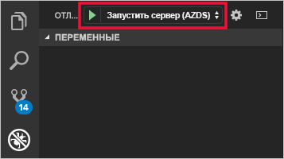
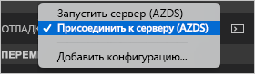

# <a name="quickstart-develop-with-nodejs-on-kubernetes-using-azure-dev-spaces"></a>Краткое руководство. Разработка с помощью Node.js в Kubernetes с помощью Azure Dev Spaces

Из этого руководства вы узнаете, как выполнить следующие задачи:

- Настройка Azure Dev Spaces с помощью управляемого кластера Kubernetes в Azure.
- Итеративная разработка кода в контейнерах с помощью Visual Studio Code и командной строки.
- Отладка кода в среде разработки с помощью Visual Studio Code.

## <a name="prerequisites"></a>Предварительные требования

- Подписка Azure. Если у вас нет подписки Azure, создайте [бесплатную учетную запись](https://azure.microsoft.com/free).
- [Средство Visual Studio Code](https://code.visualstudio.com/download).
- Расширение [Azure Dev Spaces](https://marketplace.visualstudio.com/items?itemName=azuredevspaces.azds) для Visual Studio Code.
- [Azure CLI](/cli/azure/install-azure-cli?view=azure-cli-latest).

## <a name="create-an-azure-kubernetes-service-cluster"></a>Создание кластера Службы Azure Kubernetes

Вам нужно создать кластер AKS в [поддерживаемом регионе](https://docs.microsoft.com/azure/dev-spaces/#a-rapid,-iterative-kubernetes-development-experience-for-teams). Следующие команды создают группу ресурсов *MyResourceGroup* и кластер AKS *MyAKS*.

```cmd
az group create --name MyResourceGroup --location eastus
az aks create -g MyResourceGroup -n MyAKS --location eastus --node-count 1 --generate-ssh-keys
```

## <a name="enable-azure-dev-spaces-on-your-aks-cluster"></a>Включение Azure Dev Spaces в кластере AKS

С помощью команды `use-dev-spaces` включите Dev Spaces в кластере AKS и следуйте инструкциям на экране. Следующая команда включает Dev Spaces в кластере *MyAKS* в группе *MyResourceGroup* и создает пространство разработки *по умолчанию*.

```cmd
$ az aks use-dev-spaces -g MyResourceGroup -n MyAKS

'An Azure Dev Spaces Controller' will be created that targets resource 'MyAKS' in resource group 'MyResourceGroup'. Continue? (y/N): y

Creating and selecting Azure Dev Spaces Controller 'MyAKS' in resource group 'MyResourceGroup' that targets resource 'MyAKS' in resource group 'MyResourceGroup'...2m 24s

Select a dev space or Kubernetes namespace to use as a dev space.
 [1] default
Type a number or a new name: 1

Kubernetes namespace 'default' will be configured as a dev space. This will enable Azure Dev Spaces instrumentation for new workloads in the namespace. Continue? (Y/n): Y

Configuring and selecting dev space 'default'...3s

Managed Kubernetes cluster 'MyAKS' in resource group 'MyResourceGroup' is ready for development in dev space 'default'. Type `azds prep` to prepare a source directory for use with Azure Dev Spaces and `azds up` to run.
```

## <a name="get-sample-application-code"></a>Получение примера кода приложения

В этой статье описано, как использовать [пример приложения Azure Dev Spaces](https://github.com/Azure/dev-spaces), чтобы продемонстрировать применение Azure Dev Spaces.

Клонируйте приложение из GitHub и перейдите в каталог *dev-spaces/samples/nodejs/getting-started/webfrontend*:

```cmd
git clone https://github.com/Azure/dev-spaces
cd dev-spaces/samples/nodejs/getting-started/webfrontend
```

## <a name="prepare-the-application"></a>Подготовка приложения

Создайте ресурсы диаграмм Docker и Helm для выполнения приложения в Kubernetes с помощью команды `azds prep`:

```cmd
azds prep --public
```

Вам нужно выполнить команду `prep` из каталога *dev-spaces/samples/nodejs/getting-started/webfrontend*, чтобы правильно создать ресурсы диаграмм Docker и Helm.

## <a name="build-and-run-code-in-kubernetes"></a>Сборка и запуск кода в Kubernetes

Создайте код в AKS с помощью команды `azds up` и выполните его:

```cmd
$ azds up
Using dev space 'default' with target 'MyAKS'
Synchronizing files...2s
Installing Helm chart...2s
Waiting for container image build...2m 25s
Building container image...
Step 1/8 : FROM node
Step 2/8 : ENV PORT 80
Step 3/8 : EXPOSE 80
Step 4/8 : WORKDIR /app
Step 5/8 : COPY package.json .
Step 6/8 : RUN npm install
Step 7/8 : COPY . .
Step 8/8 : CMD ["npm", "start"]
Built container image in 6m 17s
Waiting for container...13s
Service 'webfrontend' port 'http' is available at http://webfrontend.1234567890abcdef1234.eus.azds.io/
Service 'webfrontend' port 80 (http) is available at http://localhost:54256
...
```

Вы можете увидеть выполнение службы, открыв общедоступный URL-адрес, который отображается в выходных данных команды `azds up`. В этом примере общедоступный URL-адрес — *http://webfrontend.1234567890abcdef1234.eus.azds.io/*.

Если остановить команду `azds up` с помощью сочетания клавиш *CTRL+C*, служба продолжит выполнятся в AKS, а общедоступный URL-адрес останется доступным.

## <a name="update-code"></a>Обновление кода

Чтобы развернуть обновленную версию службы, обновите любой файл в проекте и повторно выполните команду `azds up`. Например: 

1. Если `azds up` по-прежнему выполняется, нажмите клавиши *CTRL+C*.
1. Измените [строку 10 в `server.js`](https://github.com/Azure/dev-spaces/blob/master/samples/nodejs/getting-started/webfrontend/server.js#L10):
    
    ```javascript
        res.send('Hello from webfrontend in Azure');
    ```

1. Сохраните изменения.
1. Повторно выполните команду `azds up`:

    ```cmd
    $ azds up
    Using dev space 'default' with target 'MyAKS'
    Synchronizing files...1s
    Installing Helm chart...3s
    Waiting for container image build...
    ...    
    ```

1. Перейдите к запущенной службе и просмотрите внесенные изменения.
1. Чтобы остановить команду `azds up`, нажмите клавиши *CTRL+C*.

## <a name="initialize-code-for-debugging-in-kubernetes-with-visual-studio-code"></a>Инициализация кода для отладки в Kubernetes с помощью Visual Studio Code

Откройте Visual Studio Code, выберите *Файл*, *Открыть*, а затем перейдите в каталог *dev-spaces/samples/nodejs/getting-started/webfrontend* и щелкните *Открыть*.

Теперь у вас есть проект *webfrontend*, открытый в Visual Studio Code. Это та же служба, которая запускается с помощью команды `azds up`. Для отладки этой службы в AKS используйте Visual Studio Code, а не `azds up`. При этом нужно подготовить этот проект, чтобы использовать Visual Studio Code для взаимодействия с вашим рабочим пространством.

Чтобы открыть палитру команд в Visual Studio Code, щелкните *Представление*, а затем — *Палитра команд*. Начните вводить `Azure Dev Spaces` и щелкните `Azure Dev Spaces: Prepare configuration files for Azure Dev Spaces`.


Эта команда подготавливает проект для выполнения в Azure Dev Spaces напрямую из Visual Studio Code. Она также создает каталог *.vscode* с конфигурацией отладки в корне проекта.

## <a name="build-and-run-code-in-kubernetes-from-visual-studio-code"></a>Сборка и запуск кода в Kubernetes из Visual Studio Code

Щелкните значок *Отладка* слева, а затем *Запустить сервер (AZDS)* вверху.



Эта команда создает службы в Azure Dev Spaces и запускает их в режиме отладки. Окно *Терминал* внизу показывает выходные данные сборки и URL-адрес для службы, запущенной в Azure Dev Spaces. В *консоли отладки* показаны выходные данные журнала.

> [!Note]
> Если вы не видите никаких команд Azure Dev Spaces в *палитре команд*, убедитесь, что вы установили расширение [Visual Studio Code для Azure Dev Spaces](https://marketplace.visualstudio.com/items?itemName=azuredevspaces.azds). Кроме того убедитесь, что вы открыли каталог *dev-spaces/samples/nodejs/getting-started/webfrontend* в Visual Studio Code.

Щелкните *Отладка*, а затем выберите *Остановить отладку*, чтобы остановить отладчик.

## <a name="setting-and-using-breakpoints-for-debugging"></a>Настройка и использование точек останова для отладки

Запуск службы осуществляется с помощью пункта *Запустить сервер (AZDS)*.

Вернитесь в представление *Explorer*, щелкнув *Представление*, а затем — *Explorer*. Откройте `server.js` и щелкните где-нибудь в строке 10, чтобы навести на нее курсор. Чтобы задать точку останова, нажмите клавишу *F9* или щелкните *Отладка* и *Переключить точку останова*.

Откройте службу в браузере. Вы увидите, что сообщение не отображается. Вернитесь в Visual Studio Code. Вы увидите, что строка 10 выделена. Точка останова, которую вы задали, приостановила выполнение службы в строке 10. Чтобы возобновить работу службы, нажмите клавишу *F5* или щелкните *Отладка*, а затем *Продолжить*. Вернитесь в браузер. Вы увидите, что сообщение теперь отображается.

Во время выполнения службы в Kubernetes с присоединенным отладчиком у вас есть полный доступ к отладочным сведениям, включая стек вызовов, локальные переменные и данные об исключениях.

Удалите точку останова, поместив курсор в строке 10 в `server.js` и нажав клавишу *F9*.

Щелкните *Отладка*, а затем выберите *Остановить отладку*, чтобы остановить отладчик.

## <a name="update-code-from-visual-studio-code"></a>Обновление кода из Visual Studio Code

Измените режим отладки на *Подключить к серверу (AZDS)* и запустите службу:



Эта команда создает службы в Azure Dev Spaces. Он также запускает процесс [nodemon](https://nodemon.io) в контейнере службы и присоединяет VS Code. Процесс *nodemon* осуществляет автоматический перезапуск при внесении изменений в исходный код, ускоряя внутренний цикл разработки так, как это происходит на локальном компьютере.

Перейдите к запущенной службе с помощью браузера и поработайте с ней.

Пока служба выполняется, вернитесь в VS Code и обновите строку 10 в `server.js`. Например: 
```javascript
    res.send('Hello from webfrontend in Azure while debugging!');
```

Сохраните файл и вернитесь к службе в браузере. Поработайте со службой и проверьте, отображается ли обновленное сообщение.

Во время выполнения *nodemon* процесс Node автоматически перезапускается сразу же после обнаружения изменений в коде. Этот автоматический процесс перезапуска аналогичен действиям редактирования и перезапуска службы на локальном компьютере. При этом предоставляются возможности внутреннего цикла разработки.

## <a name="clean-up-your-azure-resources"></a>Очистка ресурсов Azure

```cmd
az group delete --name MyResourceGroup --yes --no-wait
```

## <a name="next-steps"></a>Дополнительная информация

Узнайте, как в Azure Dev Spaces можно разрабатывать более сложные приложения в нескольких контейнерах и как упростить совместную разработку, используя разные версии и ветви кода в разных средах.

> [!div class="nextstepaction"]
> [Работа с несколькими контейнерами и командной разработкой](multi-service-nodejs.md)