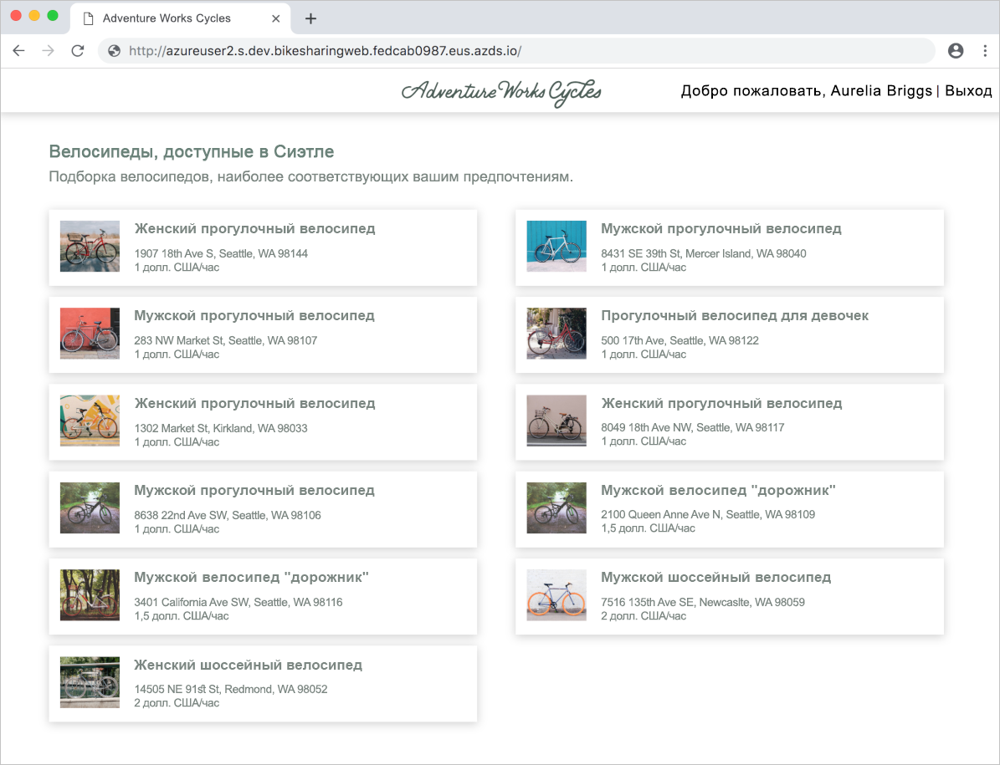

# <a name="quickstart-team-development-on-kubernetes-using-azure-dev-spaces"></a>Краткое руководство. Коллективная разработка в Kubernetes с использованием Azure Dev Spaces

Из этого руководства вы узнаете, как выполнить следующие задачи:

- настройка Azure Dev Spaces в управляемом кластере Kubernetes в Azure;
- развертывание большого приложения с несколькими микрослужбами в пространстве разработки;
- тестирование отдельных микрослужб в изолированном пространстве разработки в контексте всего приложения.


## <a name="prerequisites"></a>Предварительные требования

- Подписка Azure. Если у вас нет подписки Azure, создайте [бесплатную учетную запись](https://azure.microsoft.com/free).
- [Установленный Azure CLI](/cli/azure/install-azure-cli?view=azure-cli-latest).
- [Установленный Helm 2.13 или более поздней версии](https://github.com/helm/helm/blob/master/docs/install.md).

## <a name="create-an-azure-kubernetes-service-cluster"></a>Создание кластера Службы Azure Kubernetes

Вам нужно создать кластер AKS в [поддерживаемом регионе][supported-regions]. Следующие команды создают группу ресурсов *MyResourceGroup* и кластер AKS *MyAKS*.

```cmd
az group create --name MyResourceGroup --location eastus
az aks create -g MyResourceGroup -n MyAKS --location eastus --disable-rbac --generate-ssh-keys
```

## <a name="enable-azure-dev-spaces-on-your-aks-cluster"></a>Включение Azure Dev Spaces в кластере AKS

С помощью команды `use-dev-spaces` включите Dev Spaces в кластере AKS и следуйте инструкциям на экране. Следующая команда включает Dev Spaces для кластера *MyAKS* в группе *MyResourceGroup* и создает пространство разработки с именем *dev*.

> [!NOTE]
> Команда `use-dev-spaces` также установит интерфейс командной строки Azure Dev Spaces, если он еще не установлен. Интерфейс командной строки Azure Dev Spaces невозможно установить в Azure Cloud Shell.

```cmd
az aks use-dev-spaces -g MyResourceGroup -n MyAKS --space dev --yes
```

## <a name="get-sample-application-code"></a>Получение примера кода приложения

В этой статье на примере [приложения Azure Dev Spaces для аренды велосипедов](https://github.com/Azure/dev-spaces/tree/master/samples/BikeSharingApp) вы изучите применение Azure Dev Spaces.

Клонируйте приложение с GitHub и перейдите в его каталог:

```cmd
git clone https://github.com/Azure/dev-spaces
cd dev-spaces/samples/BikeSharingApp/
```

## <a name="retrieve-the-hostsuffix-for-dev"></a>Получение HostSuffix для *dev*

Используйте команду `azds show-context`, чтобы показать HostSuffix для *dev*.

```cmd
$ azds show-context

Name                ResourceGroup     DevSpace  HostSuffix
------------------  ----------------  --------  -----------------------
MyAKS               MyResourceGroup   dev       fedcab0987.eus.azds.io
```

## <a name="update-the-helm-chart-with-your-hostsuffix"></a>Внесение данных о HostSuffix в чарт Helm

Откройте файл [charts/values.yaml](https://github.com/Azure/dev-spaces/blob/master/samples/BikeSharingApp/charts/values.yaml) и замените все вхождения `<REPLACE_ME_WITH_HOST_SUFFIX>` полученным ранее значением HostSuffix. Сохраните изменения и закройте файл.

## <a name="run-the-sample-application-in-kubernetes"></a>Запуск примера приложения в Kubernetes

Команды, используемые для запуска примера приложения в Kubernetes, являются частью существующего процесса и не зависят от средств Azure Dev Spaces. В нашем примере для запуска примера приложения используется Helm, но вы можете выбрать и другие средства для выполнения всего приложения в пространстве имен в кластере. Команды Helm используют пространство разработки с именем *dev*, которое вы создали ранее. Это пространство разработки одновременно является и пространством имен Kubernetes. Это означает, что любые средства могут использовать пространство разработки точно так же, как любые другие пространства имен.

Вы можете использовать Azure Dev Spaces для коллективной разработки приложений, запущенных в кластере, независимо от использованных для его развертывания средств.

Используйте команды `helm init` и `helm install` для настройки и установки примера приложения в кластере.

```cmd
cd charts/
helm init --wait
helm install -n bikesharing . --dep-up --namespace dev --atomic 
```
> [!Note]
> **Если вы используете кластер с поддержкой RBAC**, обязательно настройте [учетную запись службы для Tiller](https://helm.sh/docs/using_helm/#role-based-access-control). В противном случае выполнение команды `helm` завершится ошибкой.

Выполнение команды `helm install` может занять несколько минут. Выходные данные команды отобразят состояние всех служб, которые она развернула в кластере:

```cmd
$ cd charts/
$ helm init --wait
...
Happy Helming!

$ helm install -n bikesharing . --dep-up --namespace dev --atomic

Hang tight while we grab the latest from your chart repositories...
...
NAME               READY  UP-TO-DATE  AVAILABLE  AGE
bikes              1/1    1           1          4m32s
bikesharingweb     1/1    1           1          4m32s
billing            1/1    1           1          4m32s
gateway            1/1    1           1          4m32s
reservation        1/1    1           1          4m32s
reservationengine  1/1    1           1          4m32s
users              1/1    1           1          4m32s
```

По завершении установки примера приложения в кластере, для которого включена служба Dev Spaces, вы можете с помощью команды `azds list-uris` отобразить URL-адреса примера приложения в пространстве разработки *dev*, которое выбрано в данный момент.

```cmd
$ azds list-uris
Uri                                                 Status
--------------------------------------------------  ---------
http://dev.bikesharingweb.fedcab0987.eus.azds.io/  Available
http://dev.gateway.fedcab0987.eus.azds.io/         Available
```

Перейдите к службе *bikesharingweb* по общедоступному URL-адресу, который вам предоставила команда `azds list-uris`. В примере выше для службы *bikesharingweb* используется общедоступный URL-адрес `http://dev.bikesharingweb.fedcab0987.eus.azds.io/`. Выберите пользователя *Aurelia Briggs (customer)* . Убедитесь, что вверху отображается текст *Hi Aurelia Briggs | Sign Out* (Добро пожаловать, Аурелия Бриггс | Выход).



## <a name="create-child-dev-spaces"></a>Создание дочерних пространств разработки

Используйте команду `azds space select`, чтобы создать два дочерних пространства в *dev*:

```cmd
azds space select -n dev/azureuser1 -y
azds space select -n dev/azureuser2 -y
```

Представленная выше команда создает в *dev* два дочерних пространства разработки с именами *azureuser1* и *azureuser2*. Эти два дочерних пространства предназначены для разработчиков *azureuser1* и *azureuser2*, которые будут вносить через них изменения в пример приложения.

Команда `azds space list` позволяет получить полный список пространств разработки и убедиться, что выбрано пространство *dev/azureuser2*.

```cmd
$ azds space list
   Name            DevSpacesEnabled
-  --------------  ----------------
   default         False
   dev             True
   dev/azureuser1  True
*  dev/azureuser2  True
```

Команда `azds list-uris` отображает URL-адреса для примера приложения в выбранном пространстве разработки, то есть в *dev/azureuser2*.

```cmd
$ azds list-uris
Uri                                                             Status
--------------------------------------------------              ---------
http://azureuser2.s.dev.bikesharingweb.fedcab0987.eus.azds.io/  Available
http://azureuser2.s.dev.gateway.fedcab0987.eus.azds.io/         Available
```

Убедитесь, что отображаемые командой `azds list-uris` URL-адреса имеют префикс *azureuser2.s.dev*. Этот префикс подтверждает, что сейчас выбрано пространство *azureuser2*, которое является дочерним для *dev*.

Перейдите к службе *bikesharingweb* из пространства разработки *dev/azureuser2* по общедоступному URL-адресу, который вам предоставила команда `azds list-uris`. В примере выше для службы *bikesharingweb* используется общедоступный URL-адрес `http://azureuser2.s.dev.bikesharingweb.fedcab0987.eus.azds.io/`. Выберите пользователя *Aurelia Briggs (customer)* . Убедитесь, что вверху отображается текст *Hi Aurelia Briggs | Sign Out* (Добро пожаловать, Аурелия Бриггс | Выход).

## <a name="update-code"></a>Обновление кода

Откройте файл *BikeSharingWeb/components/Header.js* в текстовом редакторе и измените текст элемента [span на `userSignOut`className](https://github.com/Azure/dev-spaces/blob/master/samples/BikeSharingApp/BikeSharingWeb/components/Header.js#L16).

```html
<span className="userSignOut">
    <Link href="/devsignin"><span tabIndex="0">Welcome {props.userName} | Sign out</span></Link>
</span>
```

Сохраните изменения и закройте файл.

## <a name="build-and-run-the-updated-bikesharingweb-service-in-the-devazureuser2-dev-space"></a>Сборка и запуск обновленной службы bikesharingweb в пространстве разработки *dev/azureuser2*

Перейдите к каталогу *BikeSharingWeb/* и выполните команду `azds up`.

```cmd
$ cd ../BikeSharingWeb/
$ azds up

Using dev space 'dev/azureuser2' with target 'MyAKS'
Synchronizing files...2s
...
Service 'bikesharingweb' port 'http' is available at http://azureuser2.s.dev.bikesharingweb.fedcab0987.eus.azds.io/
Service 'bikesharingweb' port 80 (http) is available at http://localhost:54256
...
```

Эта команда компилирует и запускает службу *bikesharingweb* в пространстве разработки *dev/azureuser2*. Эта служба работает параллельно со службой *bikesharingweb* в пространстве *dev* и принимает только запросы с префиксом URL-адреса *azureuser2.s*. Дополнительные сведения о маршрутизации между родительскими и дочерними пространствами разработки см. в статье о [принципах работы и настройки Azure Dev Spaces](how-dev-spaces-works.md).

Перейдите к службе *bikesharingweb* из пространства разработки *dev/azureuser2* по общедоступному URL-адресу, который отображается в выходных данных команды `azds up`. Выберите пользователя *Aurelia Briggs (customer)* . Убедитесь, что в верхнем правом углу отображается обновленный текст. Возможно, потребуется обновить страницу или очистить кэш браузера, если вы не увидите изменения сразу.


> [!NOTE]
> При переходе к службе во время выполнения `azds up` сведения о трассировке HTTP-запросов также отображаются в выходных данных команды `azds up`. Такая трассировка поможет вам в устранении проблем и отладке службы. Ее можно отключить с помощью команды `--disable-http-traces` при запуске `azds up`.

## <a name="verify-other-dev-spaces-are-unchanged"></a>Проверка неизменности остальных пространств разработки

Если команда `azds up` еще выполняется, нажмите сочетание клавиш *CTRL+C*.

```cmd
$ azds list-uris --all
Uri                                                             Status
--------------------------------------------------              ---------
http://azureuser1.s.dev.bikesharingweb.fedcab0987.eus.azds.io/  Available
http://azureuser1.s.dev.gateway.fedcab0987.eus.azds.io/         Available
http://azureuser2.s.dev.bikesharingweb.fedcab0987.eus.azds.io/  Available
http://azureuser2.s.dev.gateway.fedcab0987.eus.azds.io/         Available
http://dev.bikesharingweb.fedcab0987.eus.azds.io/               Available
http://dev.gateway.fedcab0987.eus.azds.io/                      Available
```

Откройте в браузере версию *dev* службы *bikesharingweb*, выберите имя пользователя *Aurelia Briggs (customer)* и проверьте, отображается ли исходный текст в правом верхнем углу. Повторите эти действия с URL-адресом *dev/azureuser1*. Обратите внимание, что изменения были применены только к версии *dev/azureuser2* службы *bikesharingweb*. Такая изоляция изменений в *dev/azureuser2* позволяет пользователю *azureuser2* вносить любые изменения, не влияя на работу *azureuser1*.

Чтобы внесенные изменения отобразились в пространствах *dev* и *dev/azureuser1*, следуйте процедурам рабочего процесса своей команды разработчиков или конвейера CI/CD. Этот рабочий процесс может предусматривать фиксацию изменения в систему управления версиями и развертывание обновления с помощью конвейера CI/CD, Helm или другого средства.

## <a name="clean-up-your-azure-resources"></a>Очистка ресурсов Azure

```cmd
az group delete --name MyResourceGroup --yes --no-wait
```

## <a name="next-steps"></a>Дополнительная информация

Узнайте, каким образом в Azure Dev Spaces можно разрабатывать более сложные приложения в нескольких контейнерах и как упростить совместную разработку, работая с разными версиями или ветвями кода в разных средах.

> [!div class="nextstepaction"]
> [Работа с несколькими контейнерами и командной разработкой](multi-service-nodejs.md)


[supported-regions]: about.md#supported-regions-and-configurations
