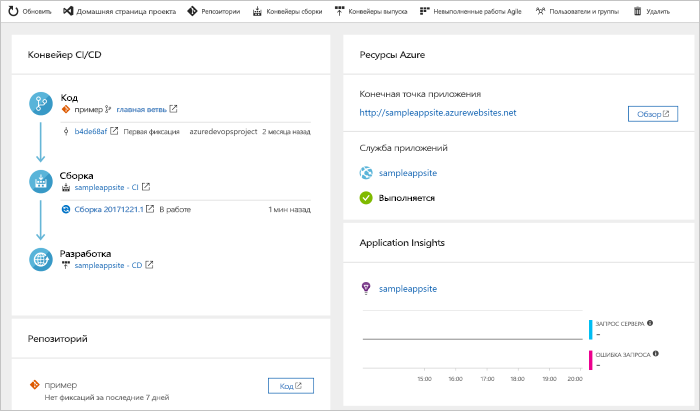

# Настройка конвейера CI/CD для приложения Java с помощью Azure DevOps Starter

В этом кратком руководстве объясняется, как с помощью простого интерфейса Azure DevOps Starter настроить конвейер непрерывной интеграции (CI) и непрерывной поставки (CD) для приложения Java в Azure Pipelines. С помощью Azure DevOps Starter вы можете установить все компоненты, необходимые для разработки, развертывания и мониторинга приложения. 

## Предварительные требования

- Учетная запись Azure с активной подпиской. [Создайте учетную запись](https://azure.microsoft.com/free/?ref=microsoft.com&utm_source=microsoft.com&utm_medium=docs&utm_campaign=visualstudio) бесплатно. 
- Организация и учетная запись [Azure DevOps](https://azure.microsoft.com/services/devops/).

## Вход на портал Azure

DevOps Starter позволяет создать конвейер CI/CD в Azure Pipelines. Вы можете создать новую организацию Azure DevOps или использовать существующую. DevOps Starter также создает ресурсы Azure в требуемой подписке Azure.

1. Войдите на [портал Azure](https://portal.azure.com).

1. В поле поиска введите **DevOps Starter**, а затем выберите ресурс. Щелкните **Добавить**, чтобы создать новый ресурс.

    

## Выбор примера приложения и службы Azure

1. Выберите пример приложения Java. Примеры Java включают в себя выбор нескольких платформ приложений.

1. В примере используется платформа Spring. Оставьте значение по умолчанию и нажмите кнопку **Далее**.  Веб-приложение для контейнеров является целевым объектом развертывания по умолчанию. Исполняющая среда, которую вы выбрали ранее, определяет доступный тип целевого объекта развертывания в службе Azure. 

2. Оставьте службу по умолчанию и нажмите кнопку **Далее**.
 
## настройка Azure DevOps и подписки Azure; 

1. Создайте новую организацию Azure DevOps или выберите существующую. 
   
   1. Выберите имя для проекта. 
   
   1. Выберите подписку Azure и расположение, задайте имя приложения и нажмите кнопку **Готово**.  
   Через несколько минут панель мониторинга DevOps Starter отобразится на портале Azure. Пример приложения настраивается в репозитории в организации Azure DevOps, после чего выполняется сборка и развертывание приложения в Azure. Эта панель мониторинга позволяет просматривать репозиторий кода, конвейер CI/CD и приложение в Azure.
   
2. Выберите **Обзор**, чтобы просмотреть выполняющееся приложение.
   
    

DevOps Starter автоматически настраивает триггер сборки и выпуска CI.  Теперь вы готовы сотрудничать с командой в приложении Java с процессом CI/CD, который автоматически развертывает данные последней работы на вашем веб-сайте.

## Фиксация изменений, внесенных в код, и выполнение CI/CD

DevOps Starter создает репозиторий Git в Azure Repos или на сайте GitHub. Выполните описанные ниже действия, чтобы просмотреть репозиторий и внести изменения в код приложения.

1. В левой части панели мониторинга DevOps Starter выберите ссылку главной ветви. Эта ссылка открывает представление созданного репозитория Git.

1. Чтобы просмотреть URL-адрес клона репозитория, щелкните **Клонировать** в правом верхнем углу браузера. Вы можете клонировать свой репозиторий Git в предпочитаемую интегрированную среду разработки. В следующих нескольких шагах вы можете использовать веб-браузер для создания и фиксации изменений кода непосредственно в главной ветви.

1. В левой части браузера перейдите к файлу **src/main/webapp/index.html**.

1. Выберите **Изменить** и внесите изменения в текст.
    Например, измените часть текста для одного из тегов div.

1. Выберите **Зафиксировать** и сохраните изменения.

1. В браузере откройте панель мониторинга DevOps Starter.   
Теперь вы должны увидеть, что сборка выполняется. С помощью конвейера CI/CD выполняется автоматическая сборка и развертывание внесенных изменений.

## Изучение конвейера CI/CD

 На предыдущем этапе весь конвейер CI/CD был автоматически настроен с помощью DevOps Starter. При необходимости изучите и настройте конвейер. Чтобы ознакомиться с конвейерами сборки и выпуска, сделайте следующее.

1. В верхней части панели мониторинга DevOps Starter выберите **Конвейеры сборки**. На вкладке браузера отобразится конвейер сборки для нового проекта.

1. Выберите поле **Состояние** и щелкните значок многоточия (…). После этого откроется меню, в котором можно начать выполнение нескольких действий, таких как постановка новой сборки в очередь, приостановка создания и изменение конвейера сборки.

1. Выберите команду **Изменить**.

1. В этой области можно просмотреть различные задачи для конвейера сборки. При сборке выполняются различные задачи, такие как получение исходного кода из репозитория Git, восстановление зависимостей и публикация результатов, используемых для развертывания.

1. Выберите имя конвейера сборки в верхней части соответствующей области.

1. Замените имя конвейера сборки более понятным для себя, выберите **Сохранить и поместить в очередь** и нажмите кнопку **Сохранить**.

1. Под именем конвейера сборки щелкните **Журнал**.   
В области **Журнал** можно просмотреть журнал аудита последних изменений сборки.  Azure Pipelines отслеживает все изменения, внесенные в конвейер сборки, и позволяет сравнивать версии.

1. Выберите **Триггеры**.  DevOps Starter автоматически создает триггер CI, а при каждой фиксации в репозитории запускается новая сборка.  При желании выберите включение или исключение ветвей из процесса непрерывной интеграции.

1. Щелкните **Период удержания**. В зависимости от сценария можно указать политики для хранения или удаления определенного количества сборок.

1. Выберите **Сборка и выпуск**, а затем — **Выпуски**.  
 DevOps Starter создаст конвейер выпуска для управления развертываниями в Azure.

1. Щелкните многоточие (...) рядом с конвейером выпуска и выберите **Изменить**. Конвейер выпуска содержит конвейер, определяющий процесс выпуска.  
    
12. В разделе **Артефакты** выберите **Удалить**. Конвейер сборки, который вы изучали на предыдущих этапах, создаст выходные данные для артефакта. 

1. Рядом со значком **Удалить** выберите **Триггер непрерывного развертывания**. В этом конвейере выпуска активирован триггер непрерывного развертывания, выполняющий развертывание каждый раз, когда становится доступным новый артефакт сборки. При желании можно отключить триггер, чтобы выполнить развертывание вручную. 

1. В области слева выберите **Задачи**. Задачи — это действия, выполняемые при развертывании. В этом примере задача заключается в развертывании в Службе приложений Azure.

1. В области справа выберите **Просмотреть выпуски**. В этом представлении можно просмотреть журнал выпусков.

1. Щелкните многоточие (...) рядом с одним из выпусков и выберите **Открыть**. В этом представлении доступно несколько меню, например меню сводки по выпуску, меню связанных рабочих элементов и тестов.

1. Щелкните **Фиксации**. В этом представлении отображаются фиксации кода, связанные с определенным развертыванием. 

1. Выберите **Журналы**. Журналы содержат полезную информацию о процессе развертывания. Их можно просматривать как во время, так и после развертывания.

## Очистка ресурсов

Если Служба приложений Azure и другие связанные с ней ресурсы вам больше не нужны, их можно удалить. Воспользуйтесь функцией **Удалить** на панели мониторинга DevOps Starter.

## Дальнейшие действия

После настройки процесса CI/CD конвейеры сборки и выпуска создаются автоматически. Вы можете изменить эти конвейеры сборки и выпуска в соответствии с потребностями вашей команды. См. дополнительные сведения о конвейере CI/CD:

> [!div class="nextstepaction"]
> [Define your multi-stage continuous deployment (CD) process](https://docs.microsoft.com/azure/devops/pipelines/release/define-multistage-release-process?view=vsts) (Определение многоэтапного процесса непрерывного развертывания)
