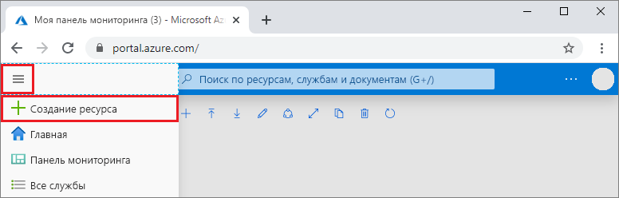
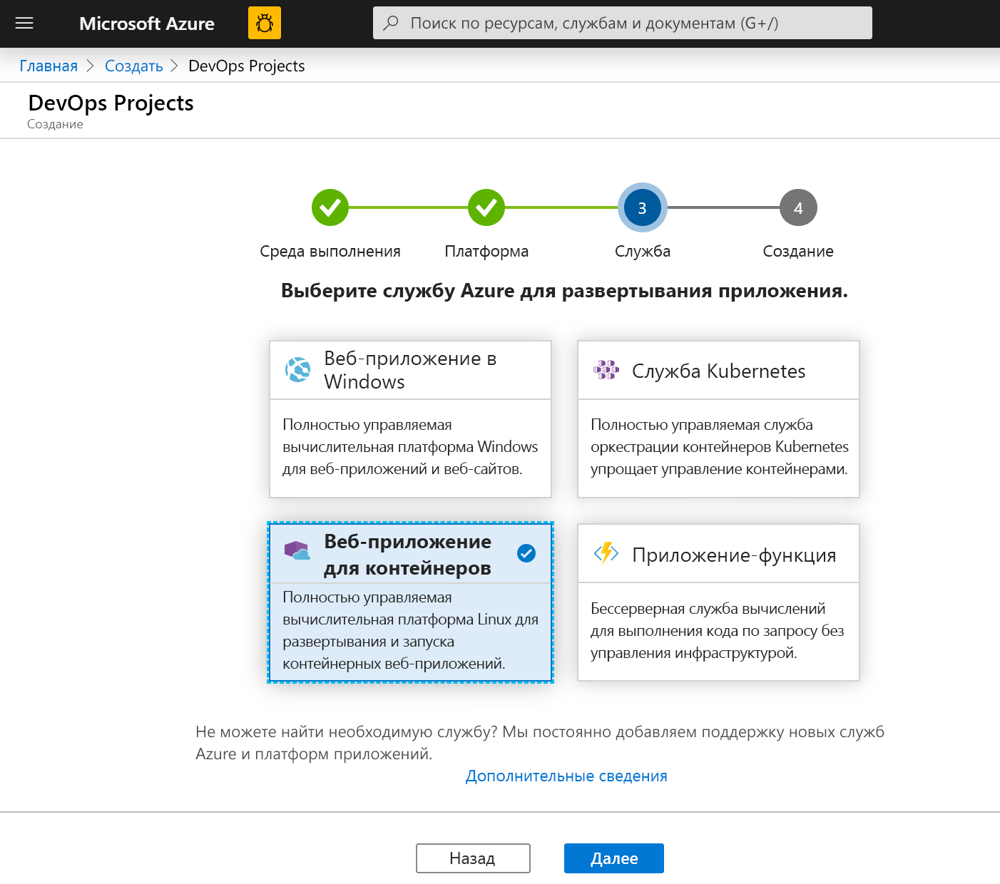
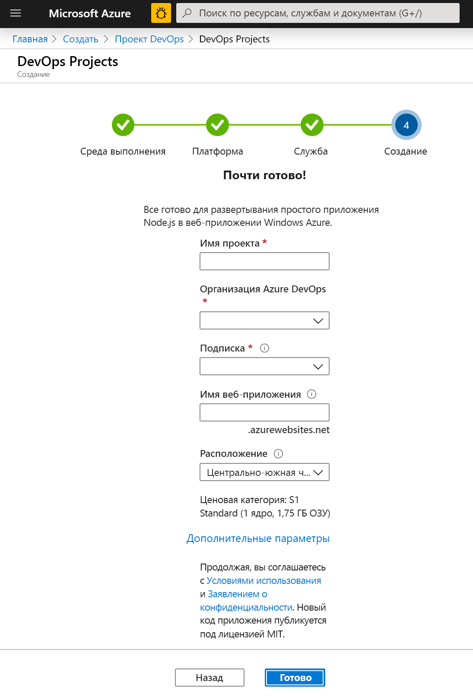
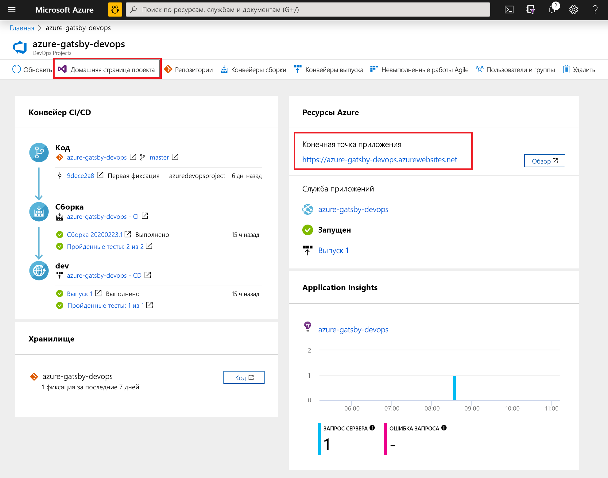
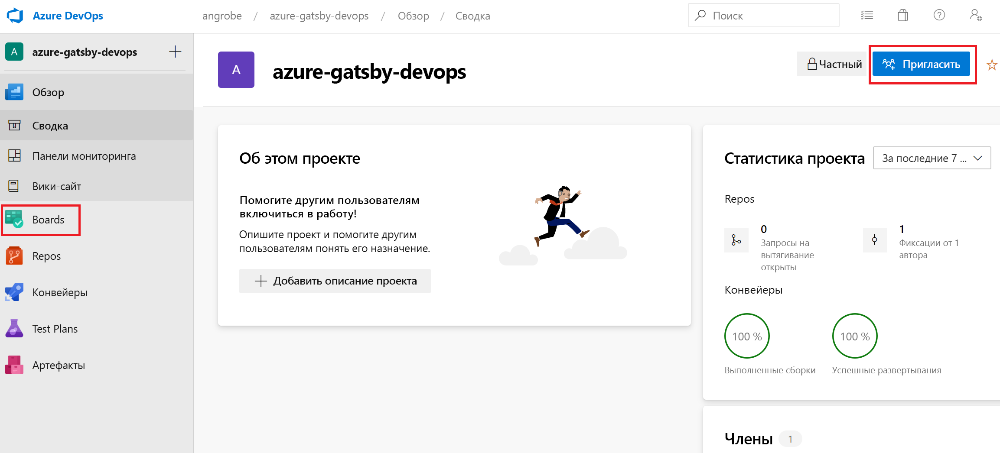
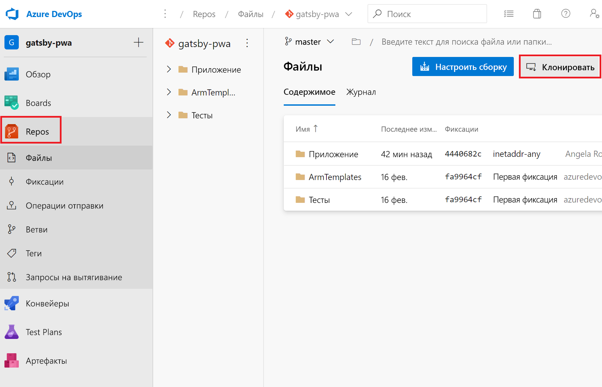
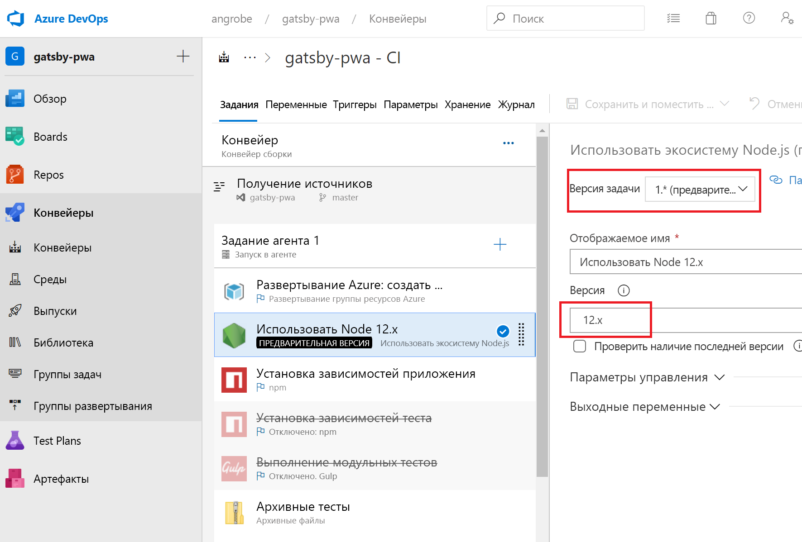
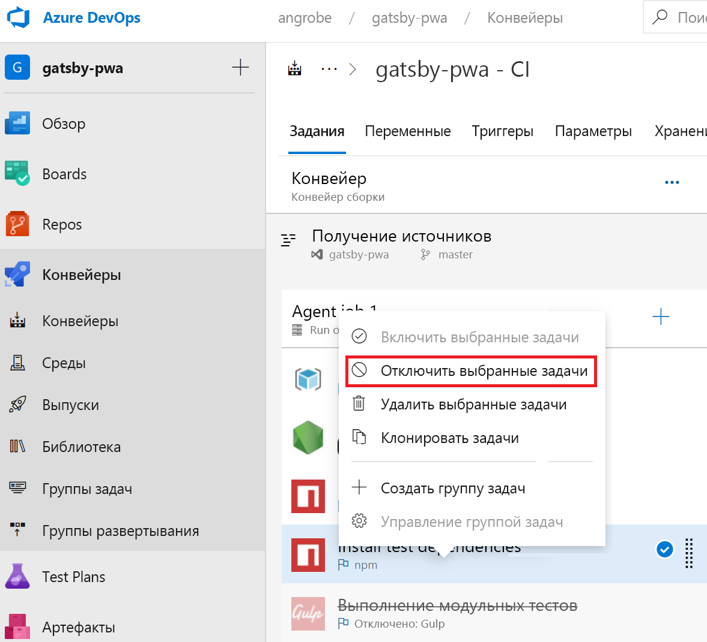
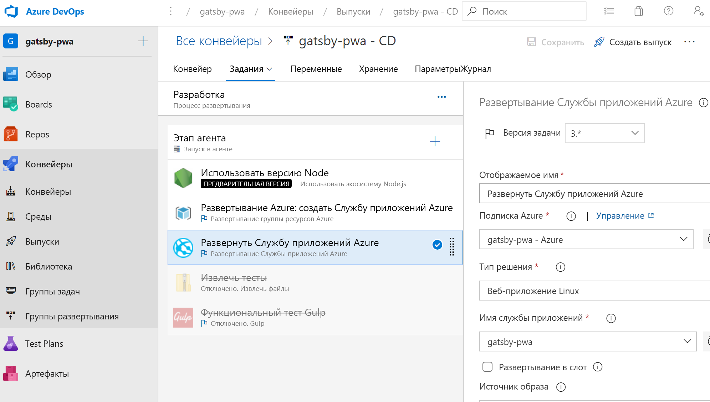

# <a name="create-a-cicd-pipeline-in-azure-pipelines-for-nodejs-with-azure-devops-starter"></a>Создание конвейера CI/CD в Azure Pipelines для Node.js с помощью Azure DevOps Starter

В этом кратком руководстве объясняется, как создать прогрессивное веб-приложение (PWA) NodeJS с помощью [GatsbyJS](https://www.gatsbyjs.org/) и упрощенного интерфейса создания Azure DevOps Starter. По завершении вы получите полнофункциональный конвейер непрерывной интеграции (CI) и непрерывной доставки (CD) для прогрессивного веб-приложения в Azure Pipelines. Azure DevOps Starter устанавливает все компоненты, необходимые для разработки, развертывания и мониторинга.

## <a name="prerequisites"></a>Предварительные требования

- Учетная запись Azure с активной подпиской. [Создайте учетную запись](https://azure.microsoft.com/free/?ref=microsoft.com&utm_source=microsoft.com&utm_medium=docs&utm_campaign=visualstudio) бесплатно. 
- Организация [Azure DevOps](https://azure.microsoft.com/services/devops/).

## <a name="sign-in-to-the-azure-portal"></a>Вход на портал Azure

DevOps Starter позволяет создать конвейер CI/CD в Azure Pipelines. Вы можете создать новую организацию Azure DevOps или использовать существующую. DevOps Starter также создает ресурсы Azure в требуемой подписке Azure.

1. Войдите на [портал Azure](https://portal.azure.com) и на панели слева выберите элемент **Создать ресурс**. 

   

1. В поле поиска введите **DevOps Starter**, а затем выберите ресурс. Щелкните **Добавить**, чтобы создать новый ресурс.

    

## <a name="select-a-sample-application-and-azure-service"></a>Выбор примера приложения и службы Azure

1. Выберите пример приложения Node.js.   

     

1. Платформа примера по умолчанию — **Express.js**. Измените это значение, выбрав вариант **Простое приложение Node.js** и щелкните **Далее**. 

     

1. Целевые объекты развертывания, доступные на этом шаге, зависят от выбора платформы приложений на шаге 2. В нашем примере целевым объектом развертывания по умолчанию является **Веб-приложение в Windows**. Оставьте значение **Веб-приложение для контейнеров** и щелкните **Далее**.

    

## <a name="configure-a-project-name-and-an-azure-subscription"></a>Присвоение проекту имени и выбор подписки Azure

1. На последнем шаге рабочего процесса создания DevOps Starter назначьте проекту имя, выберите подписку Azure и щелкните **Готово**.  

    

1. Во время сборки проекта и развертывания приложения в Azure отображается страница сводных данных. Через некоторое время в [организации Azure DevOps](https://dev.azure.com/) появится новый проект, который содержит репозиторий Git, канбан-доску, конвейер развертывания, планы тестирования и все необходимые приложению артефакты.  

## <a name="managing-your-project"></a>Управление проектом

1. Перейдите к разделу **Все ресурсы** и найдите свой экземпляр DevOps Starter. Выберите **DevOps Starter**.

    

1. Откроется панель мониторинга со сведениями о главной странице приложения, репозитории кода, конвейере CI/CD и ссылкой на работающее приложение. Щелкните ссылку **Домашняя страница проекта**, чтобы открыть приложение в **Azure DevOps**, а в другой вкладке браузера щелкните ссылку **Конечная точка приложения**, чтобы просмотреть пример работающего приложения. Позже мы добавим в этот пример использование PWA, созданного в GatsbyJS.

     

1. На странице проекта Azure DevOps вы можете пригласить сотрудников для участия в проекте, а также создать канбан-доску для отслеживания выполняемых действий. Дополнительные сведения см. [здесь](https://docs.microsoft.com/azure/devops/user-guide/what-is-azure-devops?view=azure-devops).



## <a name="clone-the-repo-and-install-your-gatsby-pwa"></a>Клонирование репозитория и установка Gatsby PWA

DevOps Starter создает репозиторий git в Azure Repos или на сайте GitHub. В нашем примере создается репозиторий Azure Repos. На следующем шаге мы клонируем этот репозиторий и внесем изменения в приложение.

1. На панели **Проект DevOps** щелкните **Репозитории** и выберите **Клонировать**.  Есть несколько способов, позволяющих клонировать репозиторий Git на рабочий стол.  Выберите любой из них в соответствии со сценарием разработки.  

    

1. Завершив клонирование репозитория на рабочий стол, внесите некоторые изменения в начальный шаблон. Прежде всего установите GatsbyJS CLI из окна терминала.

   ```powershell
    npm install -g gatsby
   ```

1. В окне терминала перейдите к корневой папке репозитория. Здесь должны располагаться следующие три папки:

    ```powershell
    Mode                LastWriteTime         Length Name
    ----                -------------         ------ ----
    d-----        2/23/2020  10:42 PM                Application
    d-----        2/23/2020   3:05 PM                ArmTemplates
    d-----        2/23/2020   3:05 PM                Tests
    ```
    
1. Нам не нужны все файлы из папки Application, так как мы намерены вместо них использовать начальный пример Gatsby. Последовательно выполните следующие команды, чтобы усечь лишнее.
    
    ```powershell
    cp .\Application\Dockerfile .
    rmdir Application
    ```

1. С помощью Gatsby CLI создайте пример PWA. Выполните `gatsby new` в окне терминала, чтобы открыть мастер создания PWA, и выберите начальный шаблон `gatsby-starter-blog`. Он должен выглядеть примерно так:

    ```powershell
    c:\myproject> gatsby new
    √ What is your project called? ... my-gatsby-project
    ? What starter would you like to use? » - Use arrow-keys. Return to submit.
        gatsby-starter-default
        gatsby-starter-hello-world
    >   gatsby-starter-blog
        (Use a different starter)
    ```
    
1. Теперь у вас есть папка с именем `my-gatsby-project`. Присвойте ей новое имя `Application` и скопируйте в нее `Dockerfile`.
    
    ```powershell
    mv my-gatsby-project Application
    mv Dockerfile Application
    ```
    
1. В любом удобном редакторе откройте файл Dockerfile и замените первую строку `FROM node:8` на `FROM node:12`. Это изменение означает, что контейнер будет использовать Node.js версии 12.x вместо версии 8.x. Для GatsbyJS требуется более новая версия Node.js.

1. После этого откройте файл package.json из папки Application и измените [поле scripts](https://docs.npmjs.com/files/package.json#scripts) так, чтобы сервер разработки и рабочий сервер прослушивали все доступные сетевые интерфейсы (например, 0.0.0.0) на порту 80. Без этих настроек контейнерная служба приложения не сможет передавать трафик в приложение Node.js, работающее внутри контейнера. Значение поля `scripts` должно выглядеть примерно так, как показано ниже. В частности, вам нужно изменить значения по умолчанию для `develop`, `serve` и `start`.

    ```json
      "scripts": {
        "build": "gatsby build",
        "develop": "gatsby develop  -H 0.0.0.0 -p 80",
        "format": "prettier --write \"**/*.{js,jsx,json,md}\"",
        "start": "npm run serve",
        "serve": "npm run build && gatsby serve -H 0.0.0.0 -p 80",
        "clean": "gatsby clean",
        "test": "echo \"Write tests! -> https://gatsby.dev/unit-testing\" && exit 1"
      }
    ```
    
## <a name="edit-your-cicd-pipelines"></a>Изменение конвейеров CI/CD

1. Прежде чем фиксировать код, созданный в предыдущем разделе, внесите несколько изменений в конвейеры сборки и выпуска. Измените конвейер сборки так, чтобы задача Node использовала версию Node.js 12.x. В поле **Версия задачи** укажите значение 1.x, а в поле **Версия** — значение 12.x.

    

1. В этом кратком руководстве не рассматривается создание модульных тестов, поэтому эти шаги в конвейере сборки следует отключить. Когда вы напишете эти тесты, снова включите соответствующие шаги. Щелкните правой кнопкой мыши задачи **Install test dependencies** (Установка зависимостей тестов) и **Run unit tests** (Выполнение модульных тестов), чтобы выбрать их, а затем отключите.

    

1. Изменение конвейера выпуска.

    

1. Как и для конвейера сборки, для задачи Node укажите версию 12.x и отключите две задачи тестирования. Теперь конвейер выпуска должен выглядеть примерно так:

    

1. В области слева в браузере перейдите к файлу **views/index.pug**.

1. Выберите **Изменить** и внесите изменения в заголовок h2.  Например, введите **Начало работы с Azure DevOps Starter** или внесите другие изменения.

1. Выберите **Зафиксировать** и сохраните изменения.

1. В браузере откройте панель мониторинга DevOps Starter.   
Теперь вы должны увидеть, что сборка выполняется. Через конвейер CI/CD выполняется автоматическая сборка и развертывание внесенных изменений.

## <a name="commit-your-changes-and-examine-the-azure-cicd-pipeline"></a>Фиксация изменений и проверка конвейера Azure CI/CD

На двух предыдущих шагах вы добавили приложение PWA, созданное в Gatsby, в репозиторий Git, а также изменили конвейеры сборки и развертывания кода. Теперь мы можем зафиксировать изменения кода и проверить его прохождение через конвейер сборки и выпуска.

1. В корневой репозитории проекта выполните из окна терминала следующие команды для отправки кода в проект Azure DevOps.

    ```powershell
    git add .
    git commit -m "My first Gatsby PWA"
    git push
    ```
    
1. Сборка начинается сразу после завершения команды `git push`. Вы можете следить за ходом ее выполнения на **панели мониторинга Azure DevOps**.

3. Через несколько минут завершится работа конвейеров сборки и выпуска, и PWA будет развернуто в конвейере. Щелкните ссылку **Конечная точка приложения** на панели мониторинга, и вы увидите готовый начальный проект Gatsby для блогов.

## <a name="clean-up-resources"></a>Очистка ресурсов

Ненужную Службу приложений Azure и связанные ресурсы можно удалить. Воспользуйтесь функцией **Удалить** на панели мониторинга DevOps Starter.

## <a name="next-steps"></a>Дальнейшие действия

После настройки процесса CI/CD конвейеры сборки и выпуска создаются автоматически. Вы можете изменить эти конвейеры сборки и выпуска в соответствии с требованиями вашей команды. См. дополнительные сведения о конвейере CI/CD:

> [!div class="nextstepaction"]
> [Define your multi-stage continuous deployment (CD) process](https://docs.microsoft.com/azure/devops/pipelines/release/define-multistage-release-process?view=vsts) (Определение многоэтапного процесса непрерывного развертывания)

