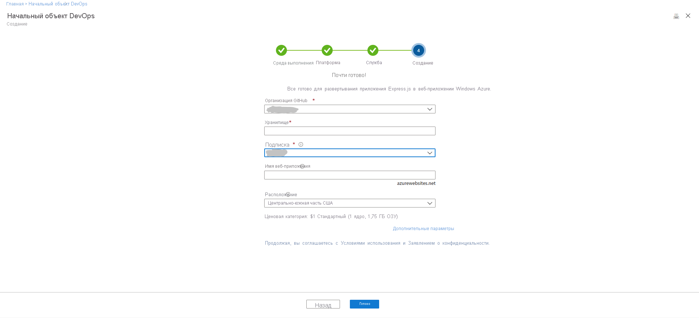

# Руководство по развертывание приложения Node.js в веб-приложении Azure с помощью DevOps Starter для GitHub Actions

DevOps Starter для GitHub Actions — это упрощенный интерфейс, который позволяет выбрать пример приложения, чтобы создать конвейер непрерывной интеграции (CI) и рабочий процесс непрерывной поставки (CD) для развертывания в Azure. 

Кроме того, DevOps Starter может выполнять следующие задачи:
* автоматически создавать ресурсы Azure, например веб-приложение Azure;
* создать и настроить рабочий процесс в GitHub, включающий задание сборки для CI;
* создать рабочий процесс, содержащий также задание развертывания для CD; 
* создавать ресурс Azure Application Insights для мониторинга.

Выполняя данное руководство, вы сделаете следующее:

> [!div class="checklist"]
> * Использование DevOps Starter для развертывания приложения Node.js
> * Настройка GitHub и подписки Azure 
> * Проверка рабочего процесса GitHub
> * фиксация изменений в GitHub и их автоматическое развертывание в Azure;
> * Настройка мониторинга Azure Application Insights
> * Очистка ресурсов

## Предварительные требования

* Учетная запись Azure с активной подпиской. [Создайте учетную запись](https://azure.microsoft.com/free/) бесплатно.

## Использование DevOps Starter для развертывания приложения Node.js

DevOps Starter создает рабочий процесс в GitHub. Вы можете выбрать существующую организацию GitHub. DevOps Starter также создает ресурсы Azure, такие как веб-приложение, в нужной подписке Azure.

1. Войдите на [портал Azure](https://portal.azure.com).

1. В поле поиска введите **DevOps Starter** , а затем выберите ресурс. Щелкните **Добавить** , чтобы создать новый ресурс.

    

1. Убедитесь, что в качестве поставщика CI/CD указано **GitHub Actions** .

    

1. Выберите **Node.js** , а затем **Далее** .

1. В поле **Выберите платформу приложений** щелкните **Express.js** , а затем выберите **Далее** . Платформа приложений, выбранная ранее, определяет доступный тип целевого объекта развертывания службы Azure. 

1. Выберите пример приложения **Веб-приложение (Windows)** и щелкните **Далее** .

## Настройка GitHub и подписки Azure

1. **Авторизуйте** GitHub и выберите существующую организацию GitHub. 

1. Введите имя для **репозитория GitHub** . 

1. Выберите службы подписки Azure. Дополнительно можно щелкнуть **Изменить** и ввести дополнительные сведения о конфигурации, например расположение ресурсов Azure.
 
1. Введите имя веб-приложения и нажмите **Готово** . Через несколько минут веб-приложение Azure будет готово. Пример приложения Node.js будет настроен в репозитории GitHub вашей организации. Затем будет запущен рабочий процесс, после чего приложение будет развернуто в созданное веб-приложение Azure.

       

   После завершения всех операций панель мониторинга DevOps Starter отобразится на портале Azure. К панели мониторинга также можно перейти непосредственно из представления **Все ресурсы** на портале Azure. 

   Панель мониторинга позволяет просматривать репозиторий кода GitHub, рабочий процесс CI/CD и приложение, запущенное в Azure.   

   

Служба DevOps Starter автоматически настраивает триггер, который развертывает изменения кода в вашем репозитории.
    
## Проверка рабочего процесса GitHub

На предыдущем этапе с помощью DevOps Starter был автоматически настроен полный рабочий процесс GitHub. Изучите этот рабочий процесс и измените его, если потребуется. Чтобы ознакомиться с рабочим процессом, сделайте следующее.

1. На панели мониторинга DevOps Starter слева выберите элемент **GitHub workflow** (Рабочий процесс GitHub). Откроется новая вкладка браузера с информацией о рабочем процессе GitHub для нового проекта.
    > [!NOTE]
    > Не изменяйте имя файла рабочего процесса. Чтобы панель мониторинга правильно отображала изменения, имя файла должно быть таким: **devops-starter-workflow.yml** .

1. YAML-файл рабочего процесса содержит все компоненты GitHub Actions, требуемые для сборки и развертывания приложения. Щелкните действие **edit file** (Редактировать файл), чтобы настроить этот файл рабочего процесса.

1. В репозитории на вкладке **Code** (Код) щелкните элемент **commits** (Фиксации). В этом представлении отображаются фиксации кода, связанные с определенным развертыванием.

1. В репозитории на вкладке **Actions** (Действия) отображается история всех выполнений рабочего процесса в этом репозитории.

1. Щелкните **latest run** (Последнее выполнение), чтобы просмотреть все задания, выполненные в этом рабочем процессе.

1. Щелкните **jobs** (Задания), чтобы просмотреть подробные журналы выполнения рабочего процесса. Журналы содержат полезную информацию о процессе развертывания. Их можно просматривать как во время, так и после развертывания.

1. Щелкните вкладку **Pull request** (Запрос на вытягивание), чтобы просмотреть все запросы на вытягивание, выполненные для этого репозитория.

## Фиксация изменений, внесенных в код, и выполнение CI/CD

DevOps Starter создает репозиторий в GitHub. Выполните описанные ниже действия, чтобы просмотреть репозиторий и внести изменения в код приложения.

1. В левой части панели мониторинга DevOps Starter выберите ссылку главной ветви. Эта ссылка открывает представление созданного репозитория GitHub.

1. Чтобы просмотреть URL-адрес клона репозитория, щелкните **Клонировать** в правом верхнем углу браузера. Вы можете клонировать свой репозиторий Git в предпочитаемую интегрированную среду разработки. В следующих нескольких шагах вы можете использовать веб-браузер для создания и фиксации изменений кода непосредственно в главной ветви.

1. В области слева в браузере перейдите к файлу **/Application/views/index.pug** .

1. Выберите **Изменить** и внесите изменения в текст.
    Например, измените часть текста для одного из тегов.

1. Выберите **Зафиксировать** и сохраните изменения.

1. В браузере откройте панель мониторинга DevOps Starter.   
Здесь вы увидите, что в рабочем процессе GitHub выполняется задание сборки. С помощью созданного рабочего процесса GitHub выполняется автоматическая сборка и развертывание внесенных изменений.

1. После завершения развертывания обновите приложение, чтобы проверить внесенные изменения.

## Настройка мониторинга Azure Application Insights

С помощью Azure Application Insights можно легко отслеживать производительность и использование своего приложения. Azure DevOps Starter автоматически настраивает ресурс Application Insights для вашего приложения. Вы можете дополнительно настроить различные предупреждения и возможности мониторинга по мере необходимости.

1. На портале Azure перейдите к панели мониторинга DevOps Starter. 

1. В правом нижнем углу щелкните ссылку **Application Insights** для вашего приложения. Откроется панель **Application Insights** . Это представление содержит информацию об использовании, производительности и доступности приложения.

    

1. Щелкните **Диапазон времени** , а затем выберите **За последний час** . Щелкните **Обновить** , чтобы отфильтровать результаты. Теперь вы можете просмотреть все действия за последние 60 минут. 
    
1. Чтобы закрыть представление диапазона времени, щелкните **x** .

1. Выберите **Оповещения** и щелкните **Добавить оповещение метрики** . 

1. Введите имя оповещения.

1. В раскрывающемся списке **Метрика** просмотрите различные оповещения метрик. По умолчанию оповещение отображается, если **время отклика сервера превышает 1 секунду** . Различные оповещения можно легко настроить, чтобы улучшить возможности мониторинга приложения.

1. Установите флажок **Notify via Email owners, contributors, and readers** (Уведомлять по электронной почте владельцев, участников и читателей). При желании вы можете выполнять дополнительные действия, когда срабатывает оповещение, реализовав приложение логики в Azure.

1. Нажмите кнопку **ОК** , чтобы создать оповещение. Через несколько секунд предупреждение появится на панели мониторинга как активное. 

1. Выйдите из области **оповещений** и вернитесь на панель **Application Insights** .

1. Выберите **Доступность** , а затем щелкните **Добавить тест** . 

1. Введите имя теста и нажмите кнопку **Создать** . Создается простой тест проверки связи для проверки доступности вашего приложения. Через несколько минут результаты тестирования будут доступны, а на панели мониторинга Application Insights отобразится состояние доступности.

## Очистка ресурсов

Если вы выполняете тестирование, можно очистить ресурсы, чтобы избежать дополнительных расходов. Ненужную виртуальную машину Azure и связанные ресурсы, созданные в рамках этого руководства, можно удалить. Для этого воспользуйтесь функцией **Удалить** на панели мониторинга DevOps Starter. 

> [!IMPORTANT]
> Следующая процедура безвозвратно удаляет ресурсы. Функция *Удалить* безвозвратно удаляет в Azure данные, созданные в проекте DevOps Starter. Выполняйте эту процедуру только после того, как прочли предупреждение.

1. На портале Azure перейдите к панели мониторинга DevOps Starter.
1. В правом верхнем углу выберите **Удалить** . 
1. В окне предупреждения выберите **Да** , чтобы *удалить ресурсы без возможности восстановления* .

При необходимости вы можете изменить рабочий процесс, если это потребуется для вашей команды. Вы также можете использовать этот шаблон CI/CD в качестве шаблона для других репозиториев. 

## Дальнейшие действия

В этом руководстве вы узнали, как выполнять следующие задачи:

> [!div class="checklist"]
> * Использование DevOps Starter для развертывания приложения Node.js
> * Настройка GitHub и подписки Azure 
> * Проверка рабочего процесса GitHub
> * фиксация изменений в GitHub и их автоматическое развертывание в Azure;
> * Настройка мониторинга Azure Application Insights
> * Очистка ресурсов

См. дополнительные сведения о GitHub Actions и рабочих процессах:

> [!div class="nextstepaction"]
> [Настройка рабочего процесса GitHub](https://docs.github.com/actions/configuring-and-managing-workflows/configuring-and-managing-workflow-files-and-runs)
