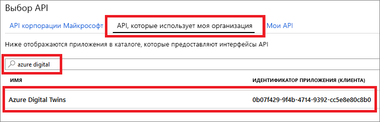
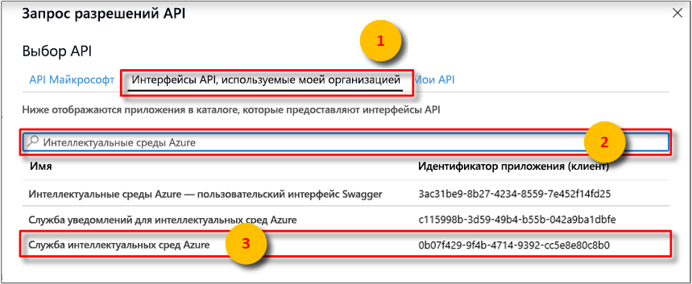
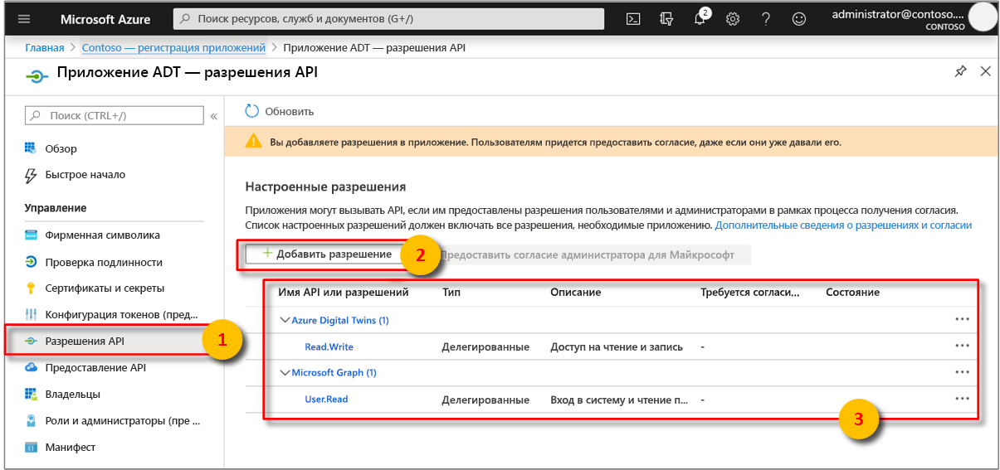
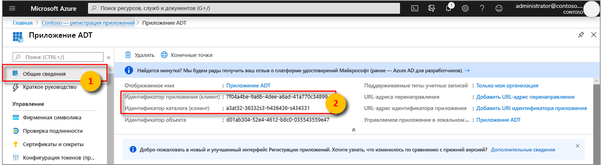

# <a name="how-to-configure-postman-for-azure-digital-twins"></a>Настройка Postman для Azure Digital Twins

В этой статье описана настройка клиента REST Postman для взаимодействия и тестирования API управления Azure Digital Twins. В частности, рассматриваются следующие операции:

* Настройка приложения Azure Active Directory для использования потока неявного предоставления разрешений OAuth 2.0;
* Использование клиента REST Postman для выполнения HTTP-запросов, содержащих токены, к вашим API управления.
* Использование Postman для составления составных запросов POST в API управлении.

## <a name="postman-summary"></a>Сведения о Postman

Начните работу в Azure Digital Twins с помощью клиентского средства REST, например [Postman](https://www.getpostman.com/), чтобы подготовить локальную среду тестирования. Клиент Postman помогает быстро создавать сложные HTTP-запросы. Скачайте версию клиента Postman для рабочего стола, перейдя по адресу [www.getpostman.com/apps](https://www.getpostman.com/apps).

[Postman](https://www.getpostman.com/) — это средство тестирования REST, которое размещает ключевые возможности HTTP-запроса в полезном графическом пользовательском интерфейсе на основе плагина для настольных систем.

С помощью клиента Postman разработчики решений могут указать тип HTTP-запроса (*POST*, *GET*, *UPDATE*, *PATCH* и *DELETE*), конечную точку API, которую нужно вызвать, и использование SSL. Postman также поддерживает добавление заголовков, параметров, данных форм и текста HTTP-запросов.

## <a name="configure-azure-active-directory-to-use-the-oauth-20-implicit-grant-flow"></a>Настройка Azure Active Directory для использования потока неявного предоставления разрешений OAuth 2.0

Настройте приложение Azure AD на использование потока неявного предоставления разрешений OAuth 2.0.

1. Откройте область **Разрешения API** для регистрации приложения. Нажмите кнопку **Add a permission** (Добавить разрешение). В области **Запрос разрешений API** щелкните вкладку **Интерфейсы API, используемые моей организацией**, а затем выполните поиск по запросу
    
    1. `Azure Digital Twins`. Выберите API **Azure Digital Twins**.

        [](../../includes/media/digital-twins-permissions/aad-aap-search-api-dt.png#lightbox)

    1. Кроме того, можно выполнить поиск по `Azure Smart Spaces Service`. Выберите API **Azure Smart Spaces Service**.

        [](../../includes/media/digital-twins-permissions/aad-app-search-api.png#lightbox)

    > [!IMPORTANT]
    > Имя и идентификатор API Azure AD, которые будут отображаться, зависят от вашего клиента:
    > * Тестовый клиент и учетные записи клиентов должны искать `Azure Digital Twins`.
    > * Другие учетные записи Майкрософт должны искать `Azure Smart Spaces Service`.

1. Выбранный API появится как **Azure Digital Twins** в той же области **Запрос разрешений API**. Выберите раскрывающийся список **Read (1)** (Чтение (1)), а затем установите флажок **Read.Write**. Нажмите кнопку **Add permissions** (Добавить разрешения).

    [](../../includes/media/digital-twins-permissions/aad-app-req-permissions.png#lightbox)

1. В зависимости от параметров вашей организации вам может потребоваться предпринять дополнительные шаги для предоставления доступа администратора к этому API. Для получения дополнительной информации обратитесь к администратору. Как только доступ администратора будет утвержден, столбец **ADMIN CONSENT REQUIRED** (Требуется согласие администратора) в области **Разрешения API** будет отображать примерно следующее для интерфейсов API:

    [](../../includes/media/digital-twins-permissions/aad-app-admin-consent.png#lightbox)


1. Выберите **Манифест** , чтобы открыть манифест приложения для приложения. Для *oauth2AllowImplicitFlow* задайте значение `true`.

    [неявный поток ](media/how-to-configure-postman/implicit-flow.png#lightbox)

1. В качестве **URL-адреса ответа** укажите `https://www.getpostman.com/oauth2/callback`.

    [URL-адрес ответа @no__t 1Azure Active Directory](media/how-to-configure-postman/reply-url.png)](media/how-to-configure-postman/reply-url.png#lightbox)

1. Скопируйте и сохраните **идентификатор приложения** Azure AD. Он используется в последующих шагах.

   [](../../includes/media//digital-twins-permissions/aad-app-reg-app-id.png#lightbox)


## <a name="obtain-an-oauth-20-token"></a>Получение маркера OAuth 2.0

[!INCLUDE [digital-twins-management-api](../../includes/digital-twins-management-api.md)]

Настройте и настройте POST, чтобы получить маркер Azure Active Directory. После этого выполните HTTP-запрос с проверкой подлинности к Azure Digital Twins, используя полученный токен:

1. Скачайте приложение, перейдя по адресу [www.getpostman.com](https://www.getpostman.com/).
1. Убедитесь, что ваш **URL-адрес авторизации** указан правильно. Его формат должен быть следующим:

    ```plaintext
    https://login.microsoftonline.com/YOUR_AZURE_TENANT.onmicrosoft.com/oauth2/authorize?resource=0b07f429-9f4b-4714-9392-cc5e8e80c8b0
    ```

    | Название  | Заменить на | Пример |
    |---------|---------|---------|
    | YOUR_AZURE_TENANT | Имя вашего клиента или название организации | `microsoft` |

1. Последовательно выберите вкладку **Авторизация**, затем **OAuth 2.0** и **Get New Access Token** (Получить новый маркер доступа).

    | Поле  | Значение |
    |---------|---------|
    | Тип предоставления разрешения | `Implicit` |
    | URL-адрес обратного вызова | `https://www.getpostman.com/oauth2/callback` |
    | URL-адрес аутентификации | Используйте **URL-адрес авторизации** из **шага 2** . |
    | Идентификатор клиента | Используйте **идентификатор приложения** для Azure Active Directoryного приложения, созданного или повторно используемого из предыдущего раздела. |
    | `Scope` | Не указывайте |
    | State | Не указывайте |
    | Проверка подлинности клиента | `Send as Basic Auth header` |

1. Теперь клиент должен выглядеть следующим образом.

    [Пример клиента @no__t 1Postman](media/how-to-configure-postman/postman-oauth-token.png)](media/how-to-configure-postman/postman-oauth-token.png#lightbox)

1. Выберите **Request Token** (Токен запроса).

    >[!TIP]
    >Если вы получили сообщение об ошибке OAuth 2 couldn’t be completed (OAuth 2 не удалось завершить), попробуйте сделать следующее:
    > * Чтобы повторить попытку, закройте Postman и снова откройте его.
  
1. Прокрутите вниз и выберите **Use Token** (Использовать токен).

## <a name="make-a-multipart-post-request"></a>Создание составного запроса POST

После выполнения предыдущих шагов настройте Postman на выполнение аутентифицированного HTTP-запроса POST, состоящего из нескольких частей.

1. На вкладке **Верхний колонтитул** добавьте ключ заголовка HTTP-запроса **Content-Type** со значением `multipart/mixed`.

   [](media/how-to-configure-postman/content-type.png#lightbox)

1. Сериализируйте текстовые данные в файлы. Данные JSON будут сохранены в качестве JSON-файла.
1. На вкладке **текст** выберите `form-data`. 
1. Добавьте каждый файл, назначив имя **ключа** , выбрав `file`.
1. Далее выберите каждый файл, используя кнопку **Выберите файл**.

   [Пример клиента @no__t 1Postman](media/how-to-configure-postman/form-body.png)](media/how-to-configure-postman/form-body.png#lightbox)

   >[!NOTE]
   > * Клиент Postman не требует, чтобы составные части имели назначенный вручную **Content-Type** или **Content-Disposition**.
   > * Необходимо указать эти заголовки для каждой части.
   > * Вы должны выбрать `multipart/mixed` или другой подходящий **Content-Type** для всего запроса.

1. Наконец, выберите **Отправить** , чтобы отправить многокомпонентный запрос HTTP POST.

## <a name="next-steps"></a>Следующие шаги

- Сведения об API управления Digital Twins и их использовании см. в статье [How to use Azure Digital Twins management APIs](how-to-navigate-apis.md) (Как использовать API управления Azure Digital Twins).

- Дополнительные сведения о составных запросах см. в статье [Добавление больших двоичных объектов к объектам в Azure Digital Twins](./how-to-add-blobs.md).

- Сведения о проверке подлинности в API управления см. в статье [Подключение к API и аутентификация](./security-authenticating-apis.md).
