# <a name="quickstart-create-an-instance-of-azure-database-migration-service-in-hybrid-mode-using-the-azure-portal-preview"></a>Краткое руководство. Создание экземпляра службы Azure Database Migration Service в гибридном режиме с помощью портала Azure (предварительная версия)

Гибридный режим Azure Database Migration Service позволяет управлять миграцией баз данных с помощью рабочей роли миграции, размещенной локально, и экземпляра Azure Database Migration Service, работающего в облаке. Гибридный режим особенно удобен для сценариев, в которых подключение типа "сеть — сеть" между локальной сетью и Azure отсутствует или его пропускная способность ограничена.

В этом кратком руководстве вы создадите экземпляр службы Azure Database Migration Service в гибридном режиме с помощью портала Azure. После этого вы скачаете, установите и настроите гибридную рабочую роль в локальной сети. На этапе предварительной версии гибридный режим Azure Database Migration Service можно использовать для миграции данных из локального экземпляра SQL Server в Базу данных SQL Azure.

Если у вас еще нет подписки Azure, создайте [бесплатную](https://azure.microsoft.com/free/) учетную запись Azure, прежде чем начинать работу.

## <a name="sign-in-to-the-azure-portal"></a>Вход на портал Azure

Откройте веб-браузер, перейдите к [порталу Microsoft Azure](https://portal.azure.com/) и введите учетные данные для входа на портал.

Панель мониторинга службы является представлением по умолчанию.

## <a name="register-the-resource-provider"></a>Регистрация поставщика ресурсов

Прежде чем создать свой первый экземпляр Azure Database Migration Service, зарегистрируйте поставщик ресурсов Microsoft.DataMigration.

1. На портале Azure щелкните **Подписки**, выберите подписку, в которой нужно создать экземпляр Azure Database Migration Service, а затем щелкните **Поставщики ресурсов**.

    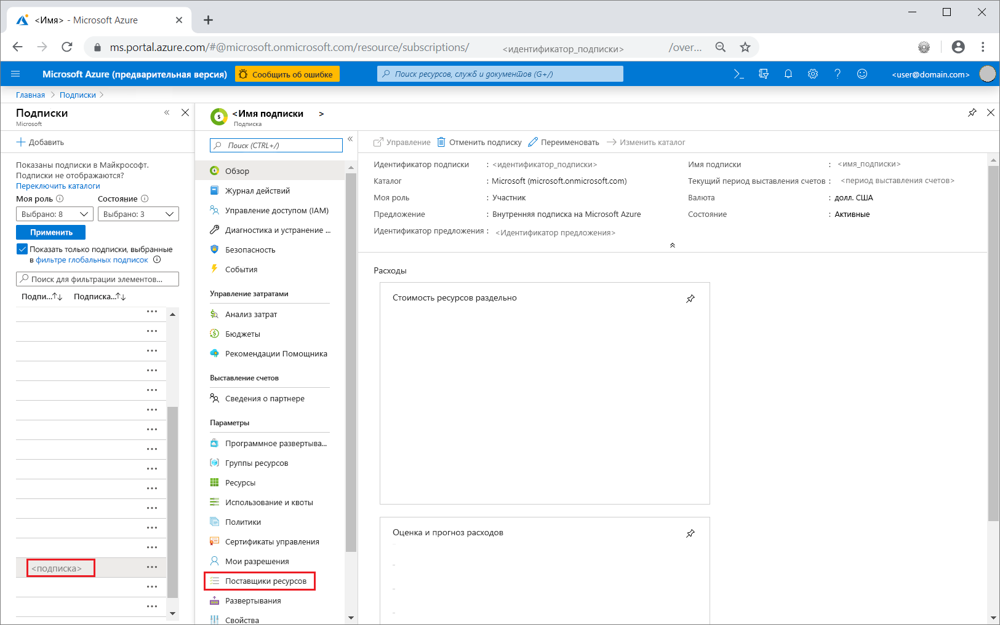

2. В поле поиска введите migration, а затем справа от **Microsoft.DataMigration** щелкните **Зарегистрировать**.

    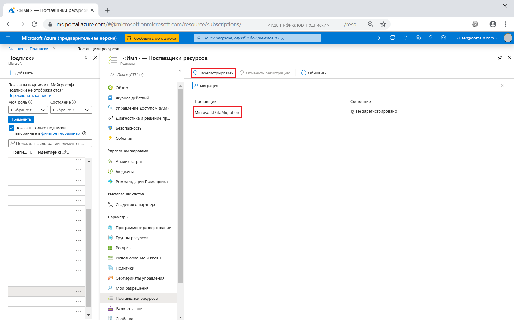

## <a name="create-an-instance-of-the-service"></a>Создание экземпляра службы

1. Щелкните **+Создать ресурс**, чтобы создать экземпляр Azure Database Migration Service.

2. Выполните в Marketplace поиск по слову migration, выберите службу **Azure Database Migration Service**, а затем на экране **Azure Database Migration Service** нажмите кнопку **Create**.

3. На экране **Создать Migration Service** сделайте следующее:

    - Выберите **имя службы**, которое хорошо запоминается и будет уникальным для идентификации экземпляра Azure Database Migration Service.
    - Выберите **подписку** Azure, в которой нужно создать экземпляр.
    - Выберите существующую **группу ресурсов** или создайте новую.
    - Выберите **расположение**, наиболее близкое к исходному или целевому серверу.

    > [!IMPORTANT]
    > На этапе предварительной версии гибридный режим поддерживается только в регионе "Восточная часть США". Так как гибридная рабочая роль устанавливается в локальной сети, производительность практически или совсем не снижается, даже если выполняется миграция в другой регион.

    - Для параметра **Режим службы** выберите **Гибридная служба (предварительная версия)** .

      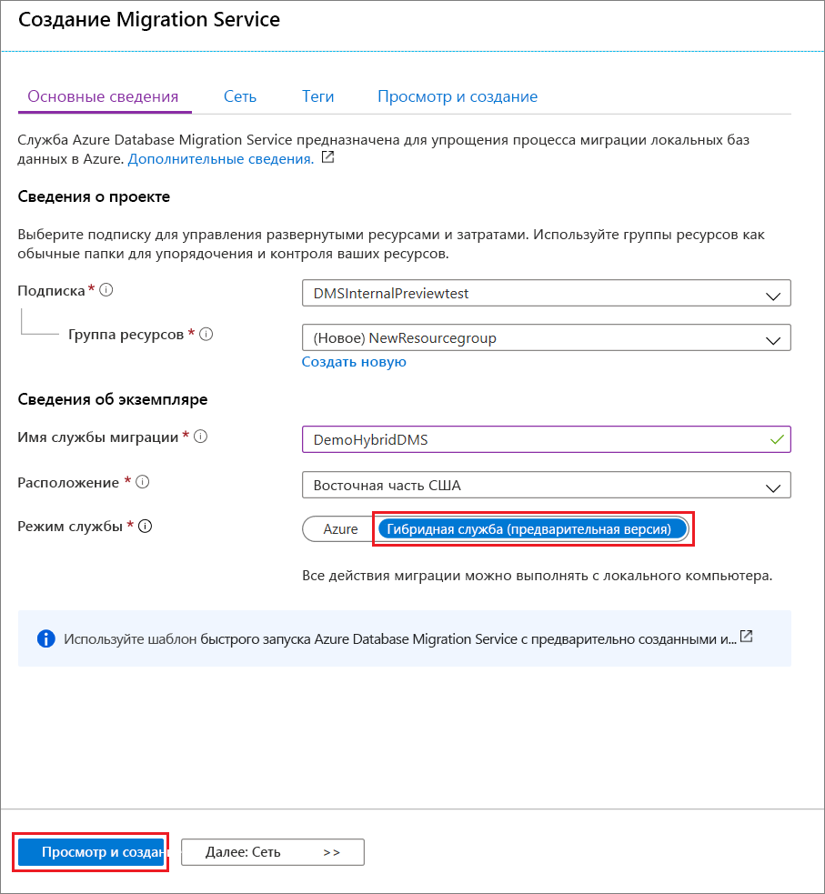

4. Выберите **Review + create** (Просмотреть и создать).

5. На вкладке **Просмотр и создание** просмотрите условия, проверьте другие предоставленные сведения, а затем выберите **Создать**.

    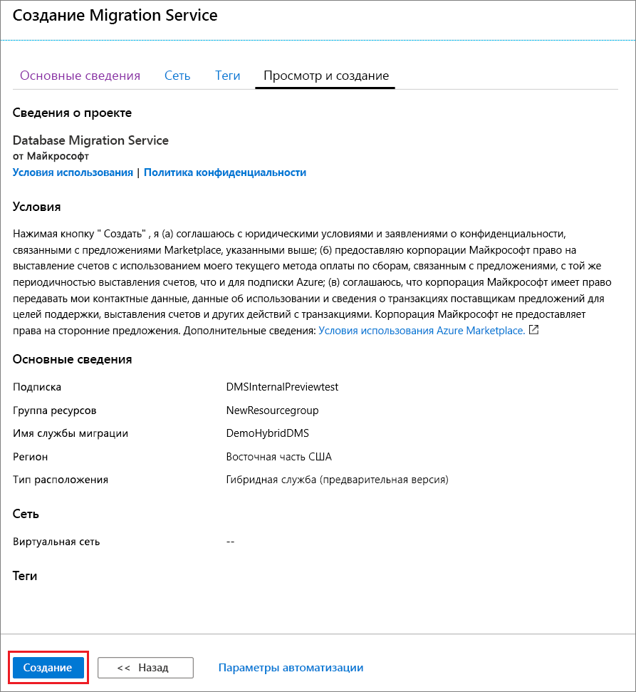

    Через несколько секунд экземпляр Azure Database Migration Service в гибридном режиме будет создан и готов к настройке. Экземпляр Azure Database Migration Service отобразится, как показано на рисунке ниже.

    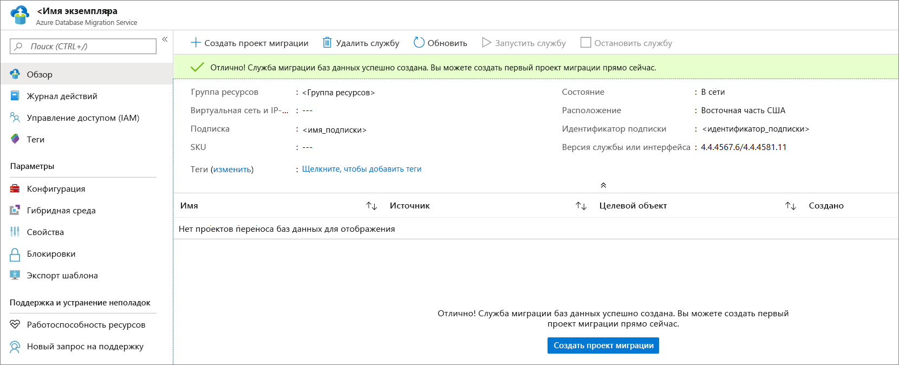

6. После создания службы выберите **Свойства**, а затем скопируйте значение поля **Идентификатор ресурса**, которое будет использоваться для установки гибридной рабочей роли Azure Database Migration Service.

    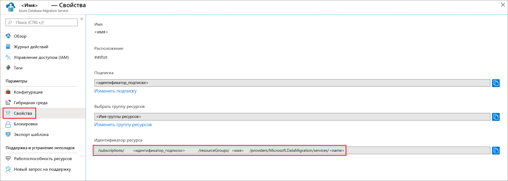

## <a name="create-azure-app-registration-id"></a>Создание идентификатора регистрации приложения Azure

Необходимо создать идентификатор регистрации приложения Azure, который локальный гибридная рабочая роль сможет использовать для взаимодействия с Azure Database Migration Service в облаке.

1. Войдите на **портал Azure** и выберите **Azure Active Directory**, а затем выберите **Новая регистрация**.
2. Укажите имя приложения, а затем в разделе **Поддерживаемые типы учетных записей** выберите поддерживаемый тип учетных записей, чтобы указать, кто может использовать приложение.

    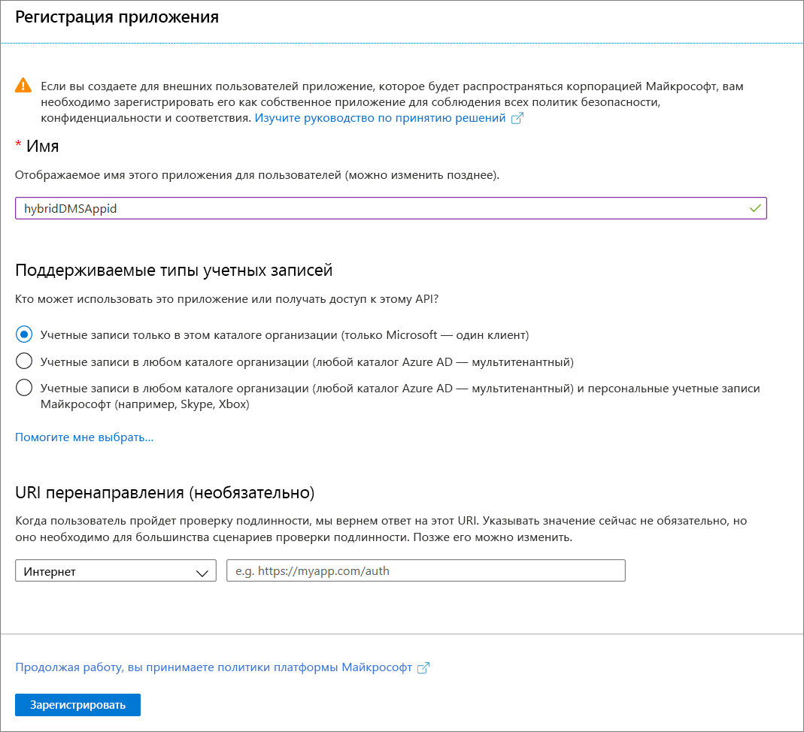

3. Используйте значения по умолчанию для полей **URI перенаправления (необязательно)** , а затем выберите **Зарегистрировать**.

4. После завершения регистрации идентификатора приложения запишите **идентификатор приложения (клиента)** , который будет использоваться при установке гибридной рабочей роли.

5. На портале Azure перейдите к Azure Database Migration Service, выберите **Управление доступом (IAM)** , а затем выберите **Добавить назначение ролей**, чтобы назначить участнику доступ по идентификатору приложения.

    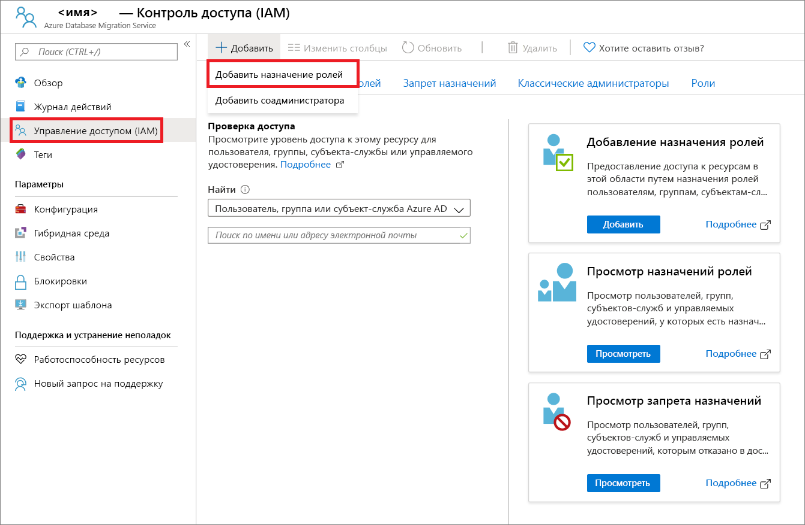

6. Выберите **Участник** в качестве роли, назначьте доступ для **пользователя Azure AD или субъекта-службы**, а затем выберите имя идентификатора приложения.

    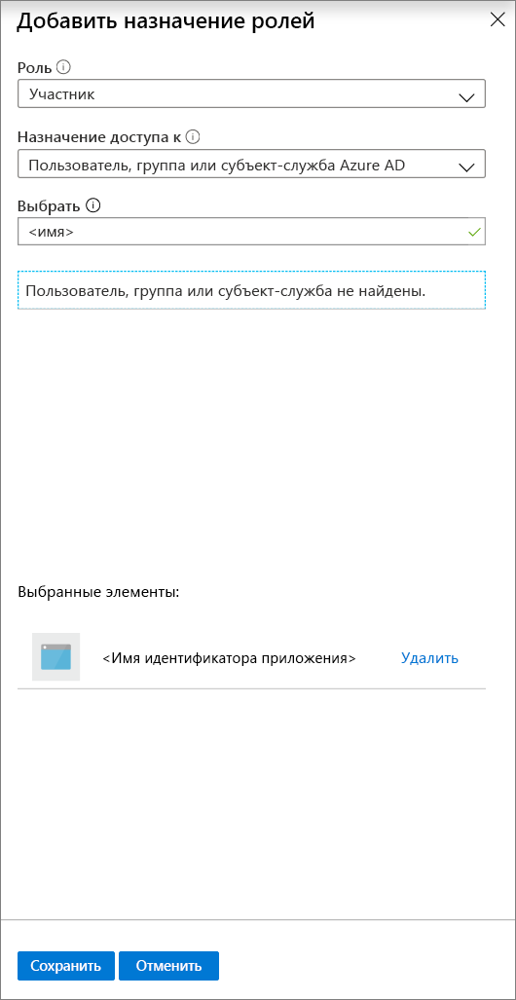

7. Выберите **Сохранить**, чтобы сохранить назначение роли для идентификатора приложения для ресурса Azure Database Migration Service.

## <a name="download-and-install-the-hybrid-worker"></a>Скачивание и установка гибридной рабочей роли

1. На портале Azure перейдите к своему экземпляру Azure Database Migration Service.

2. В разделе **Параметры** выберите **Гибридные**, а затем выберите **Скачать установщик**, чтобы скачать гибридную рабочую роль.

    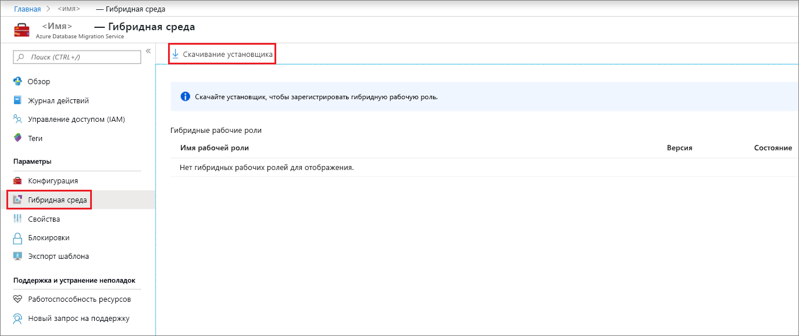

3. Извлеките содержимое ZIP-файла на сервер, на котором будет размещена гибридная рабочая роль Azure Database Migration Service.

4. В папке установки найдите и откройте файл **dmsSettings.json**, укажите в нем **ApplicationId** и **resourceId**, а затем сохраните этот файл.

    
 
5. Создайте сертификат, который Azure Database Migration Service сможет использовать для аутентификации связи с гибридной рабочей ролью, с помощью следующей команды.

    ```
    <drive>:\<folder>\Install>DMSWorkerBootstrap.exe -a GenerateCert
    ```

    Сертификат создается в папке установки.

    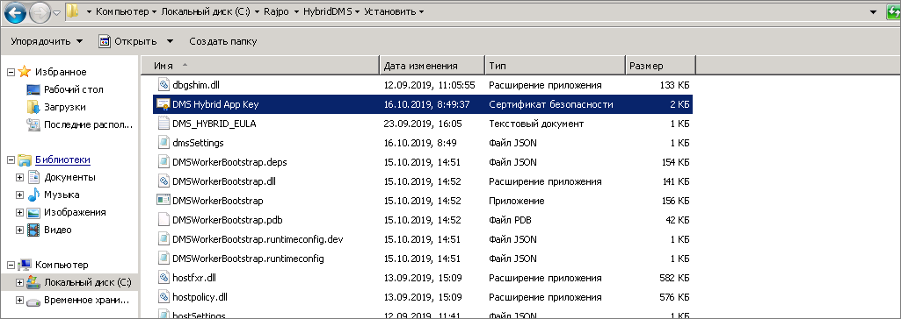

6. На портале Azure перейдите к идентификатору приложения в разделе **Управление**, выберите **Certificates & secrets** (Сертификаты и секреты), а затем выберите **Отправить сертификат**, чтобы выбрать только что созданный открытый сертификат.

    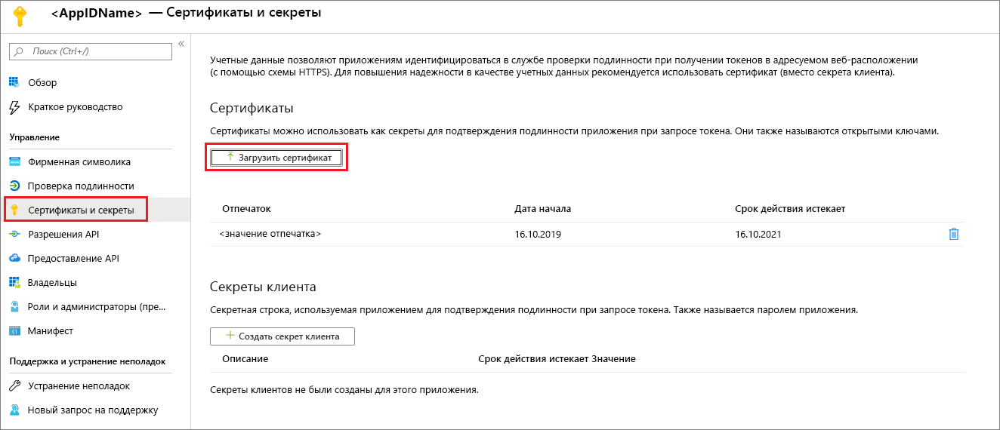

7. Установите гибридную рабочую роль Azure Database Migration Service на локальном сервере, выполнив следующую команду.

    ```
    <drive>:\<folder>\Install>DMSWorkerBootstrap.exe -a Install -IAcceptDMSLicenseTerms
    ```

8. Если установщик выполнится без ошибок, служба будет показывать состояние "В сети" для Azure Database Migration Service и все будет готово к миграции баз данных.

    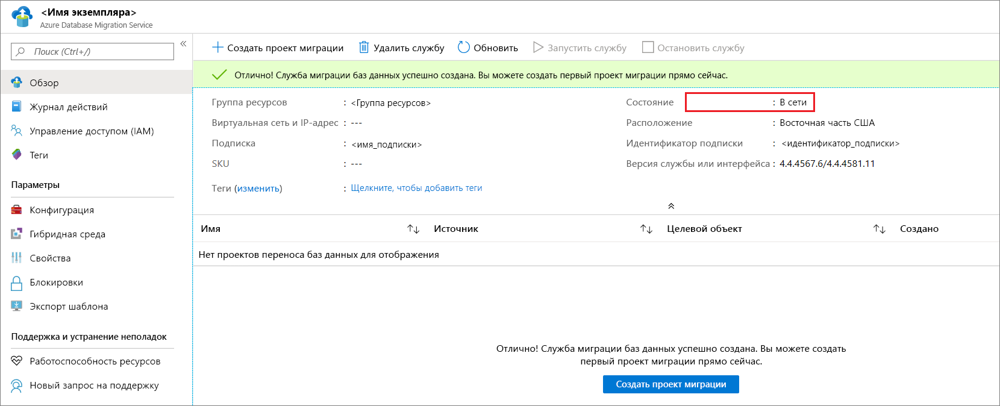

## <a name="uninstall-azure-database-migration-service-hybrid-mode"></a>Удаление гибридного режима Azure Database Migration Service

В настоящее время удаление гибридного режима Azure Database Migration Service поддерживается только посредством установщика гибридной рабочей роли Azure Database Migration Service на локальном сервере с помощью следующей команды.

```
<drive>:\<folder>\Install>DMSWorkerBootstrap.exe -a uninstall
```

## <a name="next-steps"></a>Дополнительная информация

> [!div class="nextstepaction"]
> [Перенос SQL Server в управляемый экземпляр Базы данных SQL Azure по сети](tutorial-sql-server-managed-instance-online.md)
> [Перенос SQL Server в отдельную базу данных или базу данных в пуле в Базе данных SQL Azure в автономном режиме](tutorial-sql-server-to-azure-sql.md)
