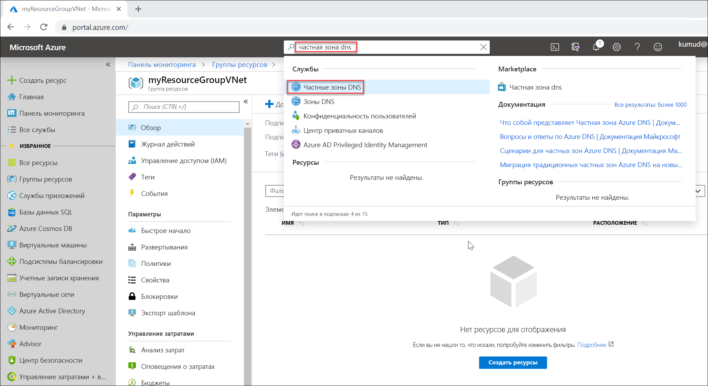

# <a name="quickstart-create-an-azure-private-dns-zone-using-the-azure-portal"></a>Краткое руководство. Создание частной зоны Azure DNS на портале Azure

В этом кратком руководстве описывается создание первой частной зоны и записи DNS с помощью портала Azure.

Зона DNS используется для размещения DNS-записей определенного домена. Чтобы разместить свой домен в Azure DNS, необходимо создать зону DNS для этого доменного имени. Каждая запись DNS для вашего домена создается внутри этой зоны DNS. Чтобы опубликовать частную зону DNS в виртуальной сети, укажите список виртуальных сетей, которые могут разрешать записи в зоне.  Они называются *связанными* виртуальными сетями. Когда автоматическая регистрация включена, Azure DNS также обновляет записи зоны при каждом создании виртуальной машины, изменении ее IP-адреса или удалении.

Из этого краткого руководства вы узнаете, как выполнять следующие задачи:

> [!div class="checklist"]
> * Создание частной зоны DNS
> * Создание виртуальной сети
> * Связывание виртуальной сети
> * Создание тестовых виртуальных машин
> * Создание дополнительной записи DNS
> * Проверка частной зоны

Если у вас еще нет подписки Azure, [создайте бесплатную учетную запись Azure](https://azure.microsoft.com/free/?WT.mc_id=A261C142F), прежде чем начинать работу.

При необходимости инструкции из этого руководства можно выполнить с помощью [Azure PowerShell](private-dns-getstarted-powershell.md) или [Azure CLI](private-dns-getstarted-cli.md).

## <a name="create-a-private-dns-zone"></a>Создание частной зоны DNS

В следующем примере будет создана зона DNS **private.contoso.com** в группе ресурсов **MyAzureResourceGroup**.

Зона DNS содержит записи DNS для домена. Чтобы разместить свой домен в Azure DNS, необходимо создать зону DNS для этого доменного имени.



1. На панели поиска портала введите **частные зоны DNS** в текстовом поле поиска и нажмите клавишу **ВВОД**.
1. Выберите **Частная зона DNS**.
2. Выберите **Create private dns zone** (Создать частную зону DNS).

1. На странице **Create Private DNS zone** (Создание частной зоны DNS) введите или выберите следующие значения:

   - **Группа ресурсов.** Выберите **Создать**, введите *MyAzureResourceGroup* и нажмите кнопку **ОК**. Имя группы ресурсов должно быть уникальным в пределах подписки Azure. 
   -  **Имя.** Введите *private.contoso.com* для этого примера.
1. Для поля **Расположение группы ресурсов** выберите **Центрально-западная часть США**.

1. Выберите **Review + Create** (Просмотреть и создать).

1. Нажмите кнопку **Создать**.

Создание зоны может занять несколько минут.

## <a name="create-a-virtual-network"></a>Создание виртуальной сети

1. В левом верхнем углу страницы портала выберите **Создать ресурс**, затем **Сети**, а затем выберите **Виртуальная сеть**.
2. В поле **Имя** введите **myAzureVNet**.
3. Для поля **Группа ресурсов** выберите **myAzureResourceGroup**.
4. Для поля **Расположение** выберите **Центрально-западная часть США**.
5. Примите остальные значения по умолчанию и нажмите кнопку **Создать**.

## <a name="link-the-virtual-network"></a>Связывание виртуальной сети

Чтобы связать частную зону DNS с виртуальной сетью, создайте связь виртуальной сети.


1. Откройте группу ресурсов **MyAzureResourceGroup** и выберите частную зону **private.contoso.com**.
2. В левой области выберите **Virtual network links** (Связи виртуальных сетей).
3. Выберите **Добавить**.
4. Введите **myLink** для поля **Имя связи**.
5. Для поля **Виртуальная сеть** выберите **myAzureVNet**.
6. Установите флажок **Enable auto registration** (Включить автоматическую регистрацию).
7. Нажмите кнопку **ОК**.

## <a name="create-the-test-virtual-machines"></a>Создание тестовых виртуальных машин

Теперь создайте две виртуальные машины, чтобы иметь возможность проверить частную зону DNS.

1. В верхней левой части портала выберите **Создать ресурс**, а затем — **Windows Server 2016 Datacenter**.
1. Для группы ресурсов выберите **MyAzureResourceGroup**.
1. В качестве имени виртуальной машины введите **myVM01**.
1. Выберите **Западно-центральная часть США** для поля **Регион**.
1. Введите **azureadmin** для имени администратора.
2. Введите **Azure12345678** в качестве пароля и подтвердите пароль.

5. Для параметра **Общедоступные входящие порты** выберите **Разрешить выбранные порты**, а затем для параметра **Выбрать входящие порты** выберите **RDP (3389)** .
10. Примите остальные значения по умолчанию для страницы и нажмите кнопку **Далее: Диски >** .
11. Примите значения по умолчанию на странице **Диски**, а затем щелкните **Далее: Сети >** .
1. Установите флажок **myAzureVNet** для виртуальной сети.
1. Примите остальные значения по умолчанию для страницы и нажмите кнопку **Далее: Управление >** .
2. Для параметра **Диагностика загрузки** выберите **Выкл**, примите другие значения по умолчанию, а затем выберите **Просмотр и создание**.
1. Проверьте значения параметров и щелкните **Создать**.

Повторите эти шаги и создайте еще одну виртуальную машину с именем **myVM02**.

Создание обеих виртуальных машин займет несколько минут.

## <a name="create-an-additional-dns-record"></a>Создание дополнительной записи DNS

 В следующем примере создается запись с относительным именем **db** в зоне DNS **private.contoso.com** в группе ресурсов **MyAzureResourceGroup**. Полное доменное имя набора записей — **db.private.contoso.com**. Тип записи — A с IP-адресом **myVM01**.

1. Откройте группу ресурсов **MyAzureResourceGroup** и выберите частную зону **private.contoso.com**.
2. Выберите **+ Набор записей**.
3. В поле **Имя** введите **db**.
4. В поле **IP-адрес** введите IP-адрес, который отображается для **myVM01**. При запуске виртуальной машины это должно быть автоматически зарегистрировано.
5. Нажмите кнопку **ОК**.

## <a name="test-the-private-zone"></a>Проверка частной зоны

Теперь вы можете проверить разрешение имени для частной зоны **private.contoso.com**.

### <a name="configure-vms-to-allow-inbound-icmp"></a>Настройка виртуальных машин для получения входящего ICMP-трафика

Можно воспользоваться командой проверки связи (ping) для проверки разрешения имени. Для этого настройте брандмауэр для обеих виртуальных машин, чтобы получать входящие пакеты ICMP.

1. Подключитесь к myVM01 и откройте окно Windows PowerShell с правами администратора.
2. Выполните следующую команду:

   ```powershell
   New-NetFirewallRule –DisplayName "Allow ICMPv4-In" –Protocol ICMPv4
   ```

Повторите действия для myVM02.

### <a name="ping-the-vms-by-name"></a>Проверка связи с виртуальными машинами по имени

1. В командной строке Windows PowerShell на виртуальной машине myVM02 проверьте связь с myVM01, используя автоматически зарегистрированное имя узла.
   ```
   ping myVM01.private.contoso.com
   ```
   Результат должен выглядеть примерно так:
   ```
   PS C:\> ping myvm01.private.contoso.com

   Pinging myvm01.private.contoso.com [10.2.0.4] with 32 bytes of data:
   Reply from 10.2.0.4: bytes=32 time<1ms TTL=128
   Reply from 10.2.0.4: bytes=32 time=1ms TTL=128
   Reply from 10.2.0.4: bytes=32 time<1ms TTL=128
   Reply from 10.2.0.4: bytes=32 time<1ms TTL=128

   Ping statistics for 10.2.0.4:
       Packets: Sent = 4, Received = 4, Lost = 0 (0% loss),
   Approximate round trip times in milli-seconds:
       Minimum = 0ms, Maximum = 1ms, Average = 0ms
   PS C:\>
   ```
2. Теперь проверьте связь с именем **db**, созданным ранее.
   ```
   ping db.private.contoso.com
   ```
   Результат должен выглядеть примерно так:
   ```
   PS C:\> ping db.private.contoso.com

   Pinging db.private.contoso.com [10.2.0.4] with 32 bytes of data:
   Reply from 10.2.0.4: bytes=32 time<1ms TTL=128
   Reply from 10.2.0.4: bytes=32 time<1ms TTL=128
   Reply from 10.2.0.4: bytes=32 time<1ms TTL=128
   Reply from 10.2.0.4: bytes=32 time<1ms TTL=128

   Ping statistics for 10.2.0.4:
       Packets: Sent = 4, Received = 4, Lost = 0 (0% loss),
   Approximate round trip times in milli-seconds:
       Minimum = 0ms, Maximum = 0ms, Average = 0ms
   PS C:\>
   ```

## <a name="delete-all-resources"></a>Удаление всех ресурсов

Удалите группу ресурсов **MyAzureResourceGroup**, если ресурсы, созданные в этом руководстве, больше не нужны.


## <a name="next-steps"></a>Дополнительная информация

> [!div class="nextstepaction"]
> [Сценарии применения частных зон DNS Azure](private-dns-scenarios.md)

