# Краткое руководство. Отправка событий хранилища BLOB-объектов в конечную веб-точку с помощью портала Azure

"Сетка событий Azure" — это служба обработки событий для облака. В этой статье описано, как с помощью портала Azure создать учетную запись хранилища BLOB-объектов и подписку на связанные события, а также активировать событие для просмотра результата. Как правило, события отправляются на конечную точку, которая обрабатывает данные событий и выполняет соответствующие действия. Но в этой статье для простоты события отправляются в веб-приложение, которое собирает и отображает сообщения.

[!INCLUDE [quickstarts-free-trial-note.md](../../includes/quickstarts-free-trial-note.md)]

По завершении можно увидеть, что данные событий отправлены в веб-приложение.

## Создание учетной записи хранения

1. Войдите на [портал Azure](https://portal.azure.com/).

1. Чтобы создать хранилище BLOB-объектов, выберите **Создать ресурс**. 

1. Щелкните **Хранилище**, чтобы отфильтровать доступные параметры, и выберите **Учетная запись хранения — BLOB-объект, файл, таблица, очередь**.

   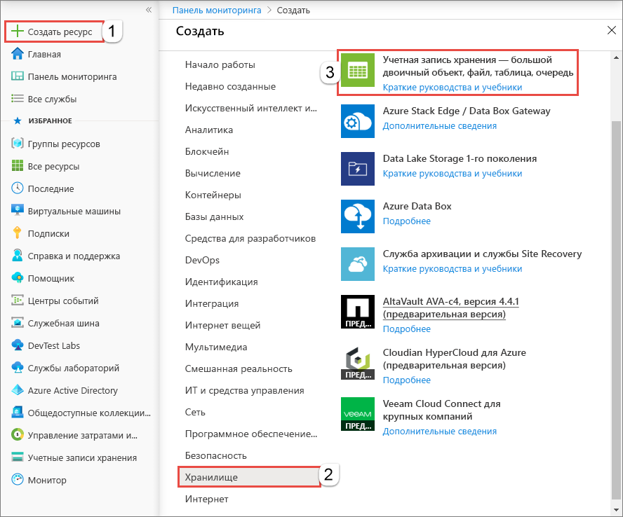

   Чтобы подписаться на события, создайте учетную запись хранения общего назначения версии 2 или учетную запись хранения BLOB-объектов.
   
1. На странице **Создание учетной записи хранения** выполните следующие действия:
    1. Выберите подписку Azure. 
    2. **Группа ресурсов** — создайте группу ресурсов Azure или выберите существующую. 
    3. Введите имя своей учетной записи хранения. 
    4. Выберите **Review + create** (Просмотреть и создать). 

       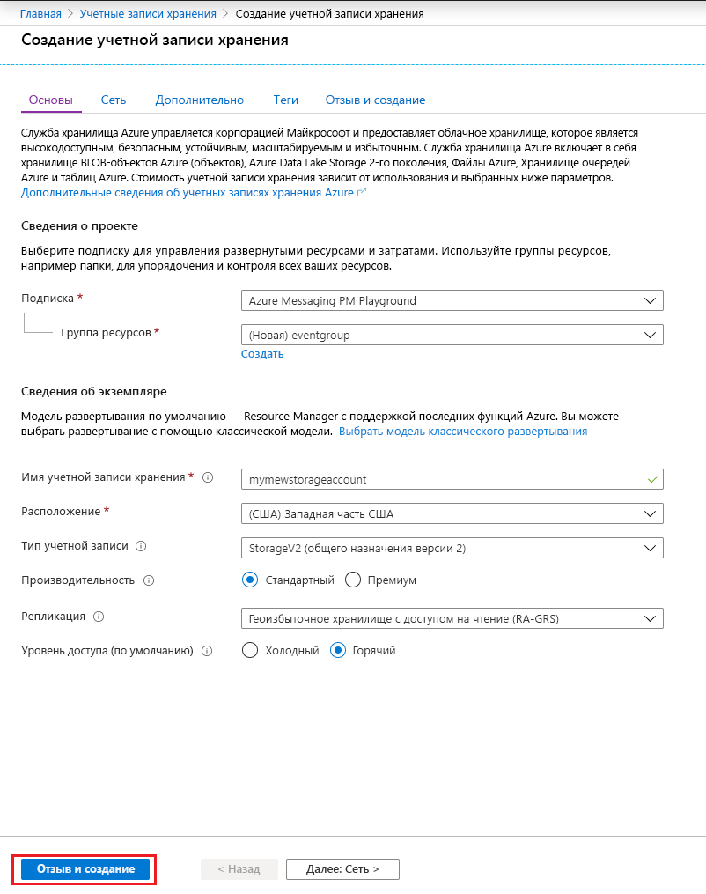    
    5. На странице **Просмотр и создание** проверьте параметры и нажмите кнопку **Создать**. 

        >[!NOTE]
        > Интеграцию событий поддерживают только учетные записи хранения типа **StorageV2 (версия 2, общего назначения)** и **BlobStorage**. **Хранилище (версия 1, общего назначения)** *не* поддерживает интеграцию со службой "Сетка событий".

## Создание конечной точки сообщения

Перед созданием подписки на события хранилища BLOB-объектов необходимо создать конечную точку для сообщения о событии. Обычно конечная точка выполняет действия на основе данных событий. Чтобы упростить работу с этим руководством, разверните [готовое веб-приложение](https://github.com/Azure-Samples/azure-event-grid-viewer), которое отображает сообщения о событиях. Развернутое решение содержит план службы приложений, веб-приложение службы приложений и исходный код из GitHub.

1. Выберите **Развернуть в Azure**, чтобы развернуть решение в своей подписке. 

   
2. На странице **Настраиваемое развертывание** выполните следующие действия: 
    1. В качестве **группы ресурсов** выберите ту же группу ресурсов, которую вы использовали при создании учетной записи хранения. После завершения работы с руководством вам будет проще выполнить очистку, удалив группу ресурсов.  
    2. В поле **Имя сайта** введите имя веб-приложения.
    3. В поле **Имя плана размещения** введите имя плана службы приложений для размещения веб-приложения.
    4. Установите флажок **Я принимаю указанные выше условия**. 
    5. Щелкните **Приобрести**. 

       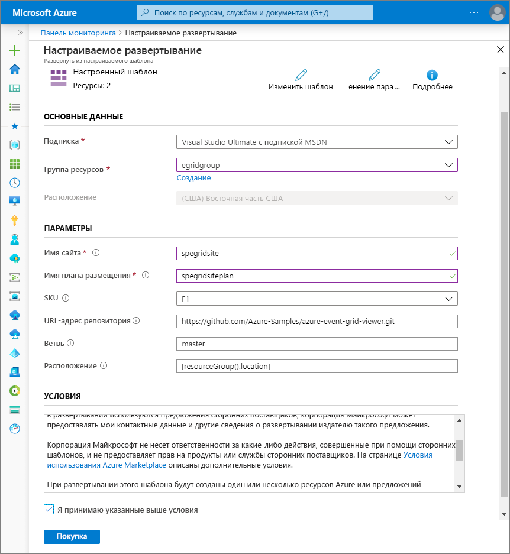
1. Завершение развертывания может занять несколько минут. На портале перейдите к оповещениям (значок колокольчика) и выберите **Перейти к группе ресурсов**. 

    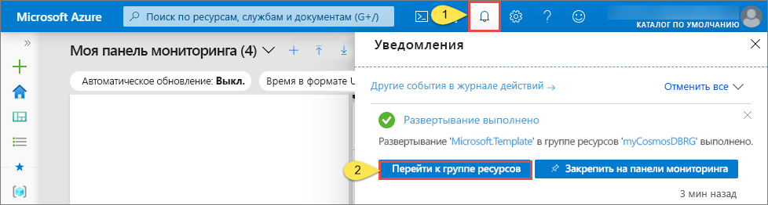
4. На странице **Группа ресурсов** в списке ресурсов выберите созданное вами веб-приложение. В списке вы также увидите план службы приложений и учетную запись хранения. 

    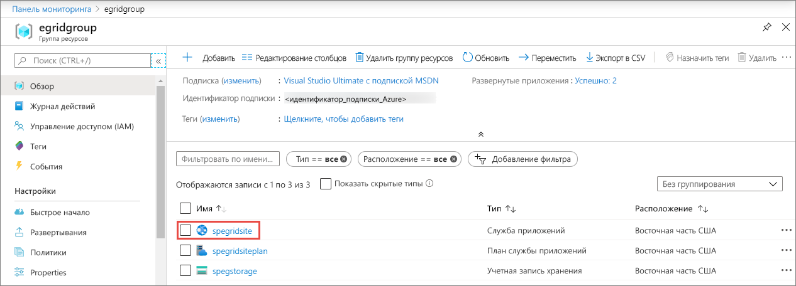
5. На странице **Служба приложений** для веб-приложения выберите URL-адрес для перехода на веб-сайт. URL-адрес должен иметь следующий формат: `https://<your-site-name>.azurewebsites.net`.
    
    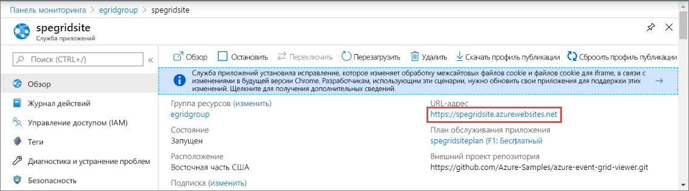

6. Убедитесь, что сайт открывается, но не имеет опубликованных событий.

   

[!INCLUDE [event-grid-register-provider-portal.md](../../includes/event-grid-register-provider-portal.md)]

## Создание подписки на хранилище BLOB-объектов

Подпишитесь на раздел, чтобы определить в сетке событий Azure, какие из них необходимо отслеживать и куда их отправлять.

1. На портале перейдите к созданной ранее учетной записи хранения. В меню слева нажмите **Все ресурсы** и выберите нужную учетную запись хранения. 
2. На странице **учетной записи хранения** выберите **События** в меню слева. 
1. Выберите **Дополнительные параметры** и **Веб-перехватчик**. Вы отправите события в приложение для просмотра с помощью веб-перехватчика для конечной точки. 

   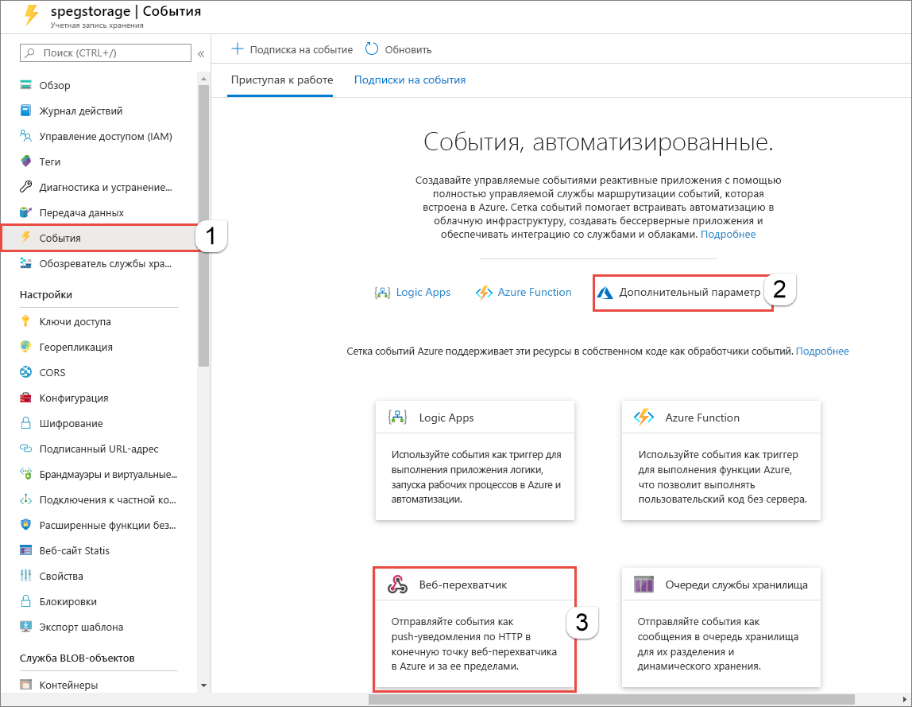
3. На странице **Создание подписки на события** сделайте следующее: 
    1. Укажите **имя** подписки на события.
    2. Введите **имя** **системного раздела**. См. [общие сведения о системных разделах](system-topics.md).

       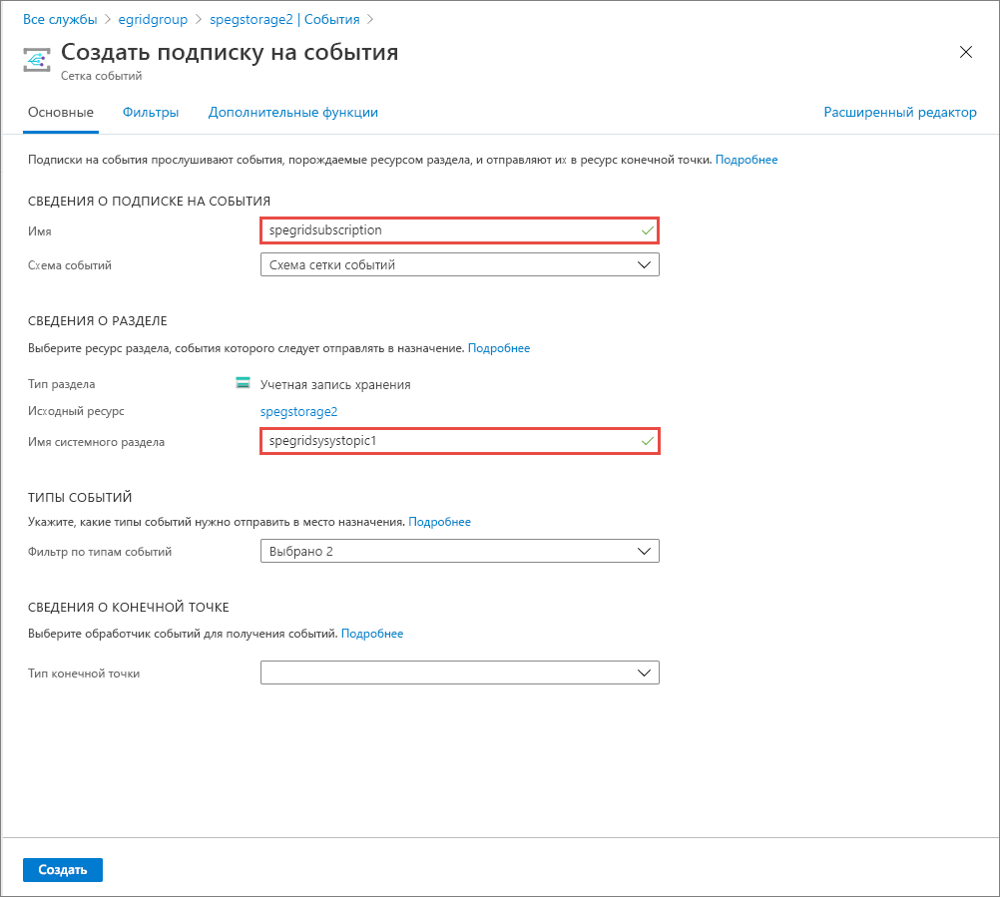
    2. Выберите значение **Веб-перехватчик** для параметра **Тип конечной точки**. 

       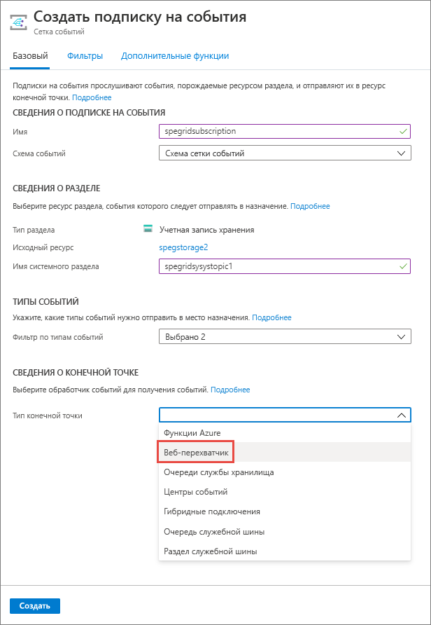
4. Рядом с параметром **Конечная точка** щелкните **Выбрать конечную точку**, введите URL-адрес веб-приложения и добавьте строку `api/updates` к URL-адресу домашней страницы (например, `https://spegridsite.azurewebsites.net/api/updates`), после чего нажмите кнопку **Подтвердить выбор**.

   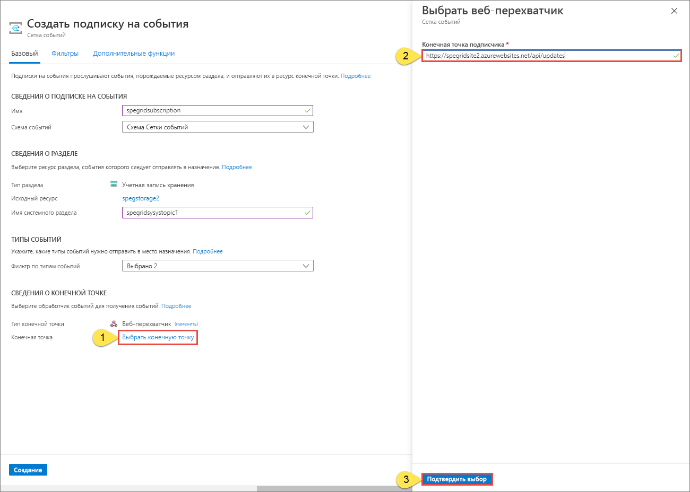
5. Теперь на странице **Создать подписку на события** нажмите кнопку **Создать**, чтобы создать подписку на события. 

   

1. Теперь снова откройте веб-приложение и убедитесь, что оно успешно получило отправленное событие подтверждения подписки. Щелкните значок с изображением глаза, чтобы развернуть данные события. Сетка событий отправляет событие подтверждения, чтобы конечная точка могла подтвердить, что она готова получать данные события. Веб-приложение содержит код для проверки подписки.

   

Теперь необходимо активировать событие, чтобы увидеть, как Сетка событий Azure распределяет сообщение к вашей конечной точке.

## Отправка события в конечную точку

Событие для хранилища BLOB-объектов активируется при отправке файла. Определенное содержимое для файла не требуется. В статье предполагается, что у вас есть файл с именем testfile.txt, но вы также можете использовать любой другой файл.

1. На портале Azure перейдите в свою учетную запись хранения больших двоичных объектов и выберите **Контейнеры** на странице **Обзор**.

   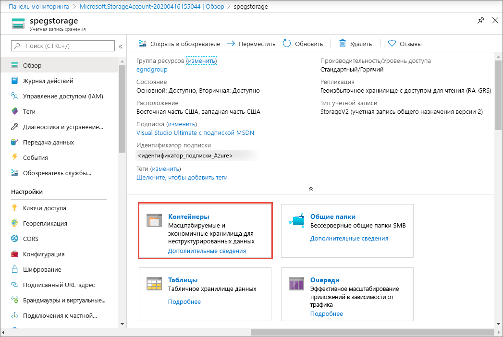

1. Выберите **+ Container** (+ Контейнер). Присвойте контейнеру имя и любой уровень доступа, после чего нажмите кнопку **Создать**. 

   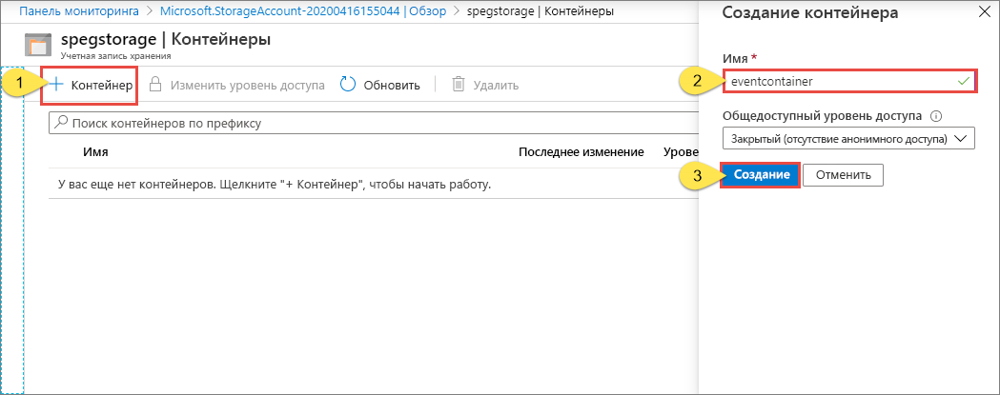

1. Выберите новый контейнер.

   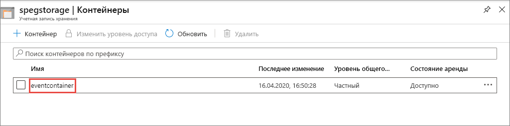

1. Чтобы отправить файл, выберите **Отправить**. На странице **Отправить BLOB-объект** найдите и выберите файл, который нужно передать для тестирования, а затем нажмите кнопку **Отправить**. 

   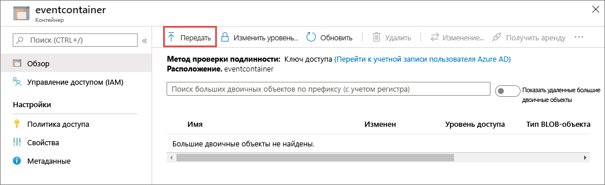

1. Перейдите к тестовому файлу и отправьте его.

1. Вы активировали событие, а служба "Сетка событий" отправила сообщение в конечную точку, настроенную вами при оформлении подписки. Сообщение имеет формат JSON и содержит массив с одним или несколькими событиями. В следующем примере сообщение JSON содержит массив с одним событием. Просмотрите веб-приложение. Вы увидите полученное событие **создания большого двоичного объекта**. 

   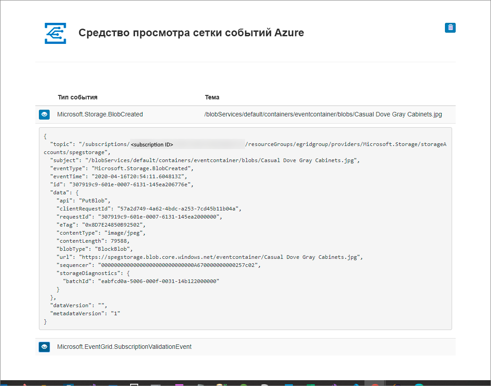

## Очистка ресурсов

Если вы планируете продолжить работу с этим событием, не удаляйте ресурсы, созданные при работе с этой статьей. В противном случае удалите ресурсы, созданные при работе с этой статьей.

Выберите группу ресурсов и щелкните **Удалить группу ресурсов**.

## Дальнейшие действия

Теперь, когда вы знаете, как создавать пользовательские раздели и подписки на события, ознакомьтесь с дополнительными сведениями о сетке событий, которые могут помочь вам:

- [An introduction to Azure Event Grid](overview.md) (Общие сведения о службе "Сетка событий Azure")
- [Перенаправление событий хранилища BLOB-объектов в пользовательскую конечную веб-точку (предварительная версия)](../storage/blobs/storage-blob-event-quickstart.md?toc=%2fazure%2fevent-grid%2ftoc.json)
- [Monitor virtual machine changes with Azure Event Grid and Logic Apps](monitor-virtual-machine-changes-event-grid-logic-app.md) (Отслеживание изменений виртуальной машины с помощью Azure Logic Apps и службы "Сетка событий Azure")
- [Потоковая передача больших данных в хранилище данных](event-grid-event-hubs-integration.md)
