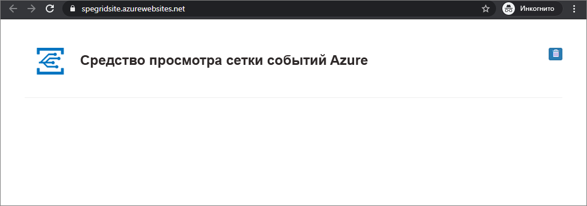

# <a name="build-your-own-disaster-recovery-for-custom-topics-in-event-grid"></a>Самостоятельное выполнение аварийного восстановления пользовательских разделов в Сетке событий Azure

При аварийном восстановлении основное внимание уделяется восстановлению после серьезной потери функциональности приложения. Из этого руководства вы узнаете, как настроить архитектуру обработки событий для восстановления, если служба Сетки событий станет неработоспособной в конкретном регионе.

Кроме того, вы узнаете, как создать архитектуру отработки отказа "активный — пассивный" для настраиваемых разделов в службе Сетки событий. Отработка отказа выполняется путем зеркального отображения разделов и подписок в двух регионах, а также последующего управления отработкой отказа, если раздел становится недоступным. Архитектура, показанная в этом руководстве, позволяет выполнять отработку отказа для всего нового трафика. При использовании такой конфигурации важно помнить, что передаваемые события невозможно будет восстановить, пока скомпрометированный регион не станет работоспособным.

## <a name="create-a-message-endpoint"></a>Создание конечной точки сообщения

Чтобы протестировать конфигурацию отработки отказа, вам понадобится конечная точка для получения событий. Конечная точка не является частью инфраструктуры отработки отказа, но используется как обработчик событий, чтобы упростить тестирование.

Для этого разверните [пример веб-приложения](https://github.com/Azure-Samples/azure-event-grid-viewer), которое отображает сообщения о событиях. Развернутое решение содержит план службы приложений, веб-приложение службы приложений и исходный код из GitHub.

1. Выберите **Развернуть в Azure**, чтобы развернуть решение в своей подписке. На портале Azure укажите значения остальных параметров.

   <a href="https://portal.azure.com/#create/Microsoft.Template/uri/https%3A%2F%2Fraw.githubusercontent.com%2FAzure-Samples%2Fazure-event-grid-viewer%2Fmaster%2Fazuredeploy.json" target="_blank"></a>

1. Завершение развертывания может занять несколько минут. Когда развертывание успешно завершится, откройте веб-приложение и убедитесь, что оно работает. Откройте браузер и перейдите по адресу `https://<your-site-name>.azurewebsites.net`.
Обязательно сохраните этот URL-адрес, так как он понадобится вам в будущем.

1. Вы увидите сайт без опубликованных событий.

   

[!INCLUDE [event-grid-register-provider-portal.md](../../includes/event-grid-register-provider-portal.md)]


## <a name="create-your-primary-and-secondary-topics"></a>Создание основных и дополнительных разделов

Во-первых, создайте два раздела Сетки событий — основной и дополнительный. По умолчанию все ваши события будут поступать в основной раздел. При сбое службы в основном регионе события будут перенаправляться в дополнительный раздел.

1. Войдите на [портале Azure](https://portal.azure.com). 

1. В верхнем левом углу главного меню Azure выберите **Все службы** > **Сетка событий** > **Разделы Сетки событий**.

   

    Щелкните звездочку рядом с меню "Разделы Сетки событий", чтобы добавить его в меню ресурсов для быстрого доступа.

1. В меню "Разделы Сетки событий" выберите **+Добавить**, чтобы создать основной раздел.

    * Присвойте разделу логическое имя и добавьте -primary в виде суффикса, чтобы его было легко отслеживать.
    * Этот регион в разделе будет основным.

    

1. Перейдите к созданному разделу и скопируйте **конечную точку раздела**. Этот универсальный код ресурса (URI) потребуется вам позже.

    

1. Получите ключ доступа к разделу, который также потребуется позже. Щелкните **Ключи доступа** в меню ресурсов и скопируйте ключ 1.

    

1. В колонке "Раздел" щелкните **+Подписка на события**, чтобы создать подписку и подключить веб-сайт приемника событий, который вы подготовили ранее.

    * Присвойте подписке на события логическое имя и добавьте -primary в виде суффикса, чтобы ее было легко отслеживать.
    * Выберите веб-перехватчик в качестве типа конечной точки.
    * Определите конечную точку для URL-адреса приемника событий, которая должна выглядеть примерно так: `https://<your-event-reciever>.azurewebsites.net/api/updates`

    

1. Выполните соответствующие действия, чтобы создать дополнительный раздел и подписку. На этот раз вместо -primary используйте суффикс -secondary, чтобы облегчить отслеживание. Убедитесь, что вы разместили раздел в другом регионе Azure. Хотя вы можете разместить раздел в любом регионе, рекомендуется использовать [связанные регионы Azure](../best-practices-availability-paired-regions.md). Размещение дополнительных раздела и подписки в другом регионе гарантирует получение новых событий даже при сбое основного региона.

Теперь вам потребуется:

   * Сайт приемника событий для тестирования.
   * Основной раздел, размещенный в основном регионе.
   * Основная подписка на события для подключения основного раздела к сайту приемника событий.
   * Дополнительный раздел в дополнительном регионе.
   * Дополнительная подписка на события для подключения дополнительного раздела к сайту приемника событий.

## <a name="implement-client-side-failover"></a>Реализация отработки отказа на стороне клиента

Теперь, когда у вас есть географически избыточная пара разделов и подписок, вы можете реализовать отработку отказов на стороне клиента. Существует несколько способов реализовать отработку отказа, но у них есть общая особенность: если один раздел перестает работать, трафик перенаправляется в другой раздел.

### <a name="basic-client-side-implementation"></a>Базовая реализация на стороне клиента

В примере кода ниже показан простой издатель .Net, который всегда пытается сначала выполнить публикацию в основной раздел. Если это не удается, выполняется отработка отказа в дополнительный раздел. В любом случае также запускается проверка работоспособности API другого раздела с помощью запроса GET для `https://<topic-name>.<topic-region>.eventgrid.azure.net/api/health`. Если отправить запрос GET к конечной точке **/api/health**, работоспособный раздел всегда возвращает ответ с кодом **200 ОК**.

```csharp
using System;
using System.Net.Http;
using System.Collections.Generic;
using Microsoft.Azure.EventGrid;
using Microsoft.Azure.EventGrid.Models;
using Newtonsoft.Json;

namespace EventGridFailoverPublisher
{
    // This captures the "Data" portion of an EventGridEvent on a custom topic
    class FailoverEventData
    {
        [JsonProperty(PropertyName = "teststatus")]
        public string TestStatus { get; set; }
    }

    class Program
    {
        static void Main(string[] args)
        {
            // TODO: Enter the endpoint each topic. You can find this topic endpoint value
            // in the "Overview" section in the "Event Grid Topics" blade in Azure Portal..
            string primaryTopic = "https://<primary-topic-name>.<primary-topic-region>.eventgrid.azure.net/api/events";
            string secondaryTopic = "https://<secondary-topic-name>.<secondary-topic-region>.eventgrid.azure.net/api/events";

            // TODO: Enter topic key for each topic. You can find this in the "Access Keys" section in the
            // "Event Grid Topics" blade in Azure Portal.
            string primaryTopicKey = "<your-primary-topic-key>";
            string secondaryTopicKey = "<your-secondary-topic-key>";

            string primaryTopicHostname = new Uri( primaryTopic).Host;
            string secondaryTopicHostname = new Uri(secondaryTopic).Host;

            Uri primaryTopicHealthProbe = new Uri("https://" + primaryTopicHostname + "/api/health");
            Uri secondaryTopicHealthProbe = new Uri("https://" + secondaryTopicHostname + "/api/health");

            var httpClient = new HttpClient();

            try
            {
                TopicCredentials topicCredentials = new TopicCredentials(primaryTopicKey);
                EventGridClient client = new EventGridClient(topicCredentials);

                client.PublishEventsAsync(primaryTopicHostname, GetEventsList()).GetAwaiter().GetResult();
                Console.Write("Published events to primary Event Grid topic.");

                HttpResponseMessage health = httpClient.GetAsync(secondaryTopicHealthProbe).Result;
                Console.Write("\n\nSecondary Topic health " + health);
            }
            catch (Microsoft.Rest.Azure.CloudException e)
            {
                TopicCredentials topicCredentials = new TopicCredentials(secondaryTopicKey);
                EventGridClient client = new EventGridClient(topicCredentials);

                client.PublishEventsAsync(secondaryTopicHostname, GetEventsList()).GetAwaiter().GetResult();
                Console.Write("Published events to secondary Event Grid topic. Reason for primary topic failure:\n\n" + e);

                HttpResponseMessage health = httpClient.GetAsync(primaryTopicHealthProbe).Result;
                Console.Write("\n\nPrimary Topic health " + health);
            }

            Console.ReadLine();
        }

        static IList<EventGridEvent> GetEventsList()
        {
            List<EventGridEvent> eventsList = new List<EventGridEvent>();

            for (int i = 0; i < 5; i++)
            {
                eventsList.Add(new EventGridEvent()
                {
                    Id = Guid.NewGuid().ToString(),
                    EventType = "Contoso.Failover.Test",
                    Data = new FailoverEventData()
                    {
                        TestStatus = "success"
                    },
                    EventTime = DateTime.Now,
                    Subject = "test" + i,
                    DataVersion = "2.0"
                });
            }

            return eventsList;
        }
    }
}
```

### <a name="try-it-out"></a>Попробуйте сейчас

Теперь, когда у вас есть все необходимые компоненты, вы можете протестировать реализацию отработки отказа. Запустите пример кода, приведенный выше, в Visual Studio или другой среде, которую вы предпочитаете использовать. Замените следующие четыре значения конечными точками и ключами из ваших разделов:

   * primaryTopic — конечная точка для основного раздела;
   * secondaryTopic — конечная точка для дополнительного раздела;
   * primaryTopicKey — ключ для основного раздела;
   * secondaryTopicKey — ключ для дополнительного раздела.

Попробуйте запустить издатель событий. Ваши тестовые события должны появиться в окне просмотра Сетки событий, как показано ниже.


Чтобы убедиться, что отработка отказа выполняется, измените несколько символов в ключе основного раздела, чтобы он стал недействительным. Попробуйте еще раз запустить издатель. Ваши новые события по-прежнему будут отображаться в средстве просмотра Сетки событий, но в консоли можно увидеть, что теперь они публикуются через дополнительный раздел.

### <a name="possible-extensions"></a>Возможность расширения

В зависимости от ваших потребностей существует множество вариантов того, как дополнить этот пример. Для масштабных сценариев вам может понадобиться отдельно регулярно проверять API работоспособности раздела. Таким образом, если произошел сбой в работе раздела, вам не нужно проверять его при каждой публикации. Как только вы узнали, что раздел неработоспособен, вы можете по умолчанию выполнять публикацию в дополнительный раздел.

Точно так же в зависимости от своих потребностей вы можете реализовать логику восстановления после отказа. Если вам крайне важно выполнить публикацию в ближайший центр обработки данных, чтобы сократить задержку, вы можете периодически проверять API работоспособности раздела, для которого была выполнена отработка отказа. Как только раздел снова станет работоспособным, можно безопасно выполнить восстановление размещения в ближайший центр обработки данных.

## <a name="next-steps"></a>Дополнительная информация

- Узнайте, как [получать события для конечной точки HTTP](./receive-events.md).
- Узнайте, как настроить [маршрутизацию событий к гибридным подключениям](./custom-event-to-hybrid-connection.md).
- Узнайте, как [выполнять аварийное восстановление с помощью Azure DNS и диспетчера трафика](https://docs.microsoft.com/azure/networking/disaster-recovery-dns-traffic-manager).
