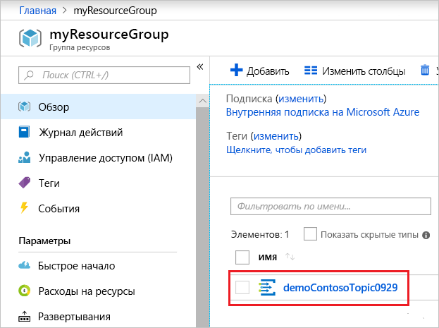

# <a name="quickstart-route-custom-events-to-web-endpoint-with-the-azure-portal-and-event-grid"></a>Краткое руководство. Перенаправление пользовательских событий в конечную веб-точку с помощью портала Azure и службы "Сетка событий"

"Сетка событий Azure" — это служба обработки событий для облака. В рамках этой статьи с помощью портала Azure вы создадите пользовательский раздел, подпишетесь на раздел и активируете событие для просмотра результата. Как правило, события отправляются на конечную точку, которая обрабатывает данные событий и выполняет соответствующие действия. Но в этой статье для простоты события отправляются в веб-приложение, которое собирает и отображает сообщения.

По завершении можно увидеть, что данные событий отправлены в веб-приложение.


[!INCLUDE [quickstarts-free-trial-note.md](../../includes/quickstarts-free-trial-note.md)]

[!INCLUDE [event-grid-register-provider-portal.md](../../includes/event-grid-register-provider-portal.md)]

## <a name="create-a-custom-topic"></a>Создание пользовательской темы

Раздел сетки событий содержит определяемую пользователем конечную точку, в которой можно размещать свои события. 

1. Войдите на [портал Azure](https://portal.azure.com/).

1. Чтобы создать пользовательский раздел, выберите **Создать ресурс**. 

   

1. Выполните поиск по запросу *Раздел сетки событий* и выберите его из списка результатов.

   

1. Нажмите кнопку **Создать**.

   

1. Укажите уникальное имя для пользовательского раздела. Имя раздела должно быть уникальным, так как оно представлено записью службы доменных имен (DNS). Не используйте имя, указанное на изображении. Вместо этого создайте собственное имя длиной от 3 до 50 символов, которое может содержать только буквы (a–z, A–Z), цифры (0–9) и дефисы (-). Укажите имя для группы ресурсов. Нажмите кнопку **Создать**.

   

1. После создания пользовательского раздела появится уведомление об успехе.

   

   Если при развертывании возникла ошибка, выясните, что ее вызвало. Выберите **Сбой развертывания**.

   

   Выберите сообщение об ошибке.

   

   На следующем изображение показано развертывание, которое завершилось ошибкой, так как имя пользовательского раздела уже используется. Увидев эту ошибку, повторите развертывание с другим именем.

   

## <a name="create-a-message-endpoint"></a>Создание конечной точки сообщения

Перед подпиской на пользовательский раздел необходимо создать конечную точку для сообщения о событии. Обычно конечная точка выполняет действия на основе данных событий. Чтобы упростить работу с этим руководством, разверните [готовое веб-приложение](https://github.com/Azure-Samples/azure-event-grid-viewer), которое отображает сообщения о событиях. Развернутое решение содержит план службы приложений, веб-приложение службы приложений и исходный код из GitHub.

1. Выберите **Развернуть в Azure**, чтобы развернуть решение в своей подписке. На портале Azure укажите значения остальных параметров.

   <a href="https://portal.azure.com/#create/Microsoft.Template/uri/https%3A%2F%2Fraw.githubusercontent.com%2FAzure-Samples%2Fazure-event-grid-viewer%2Fmaster%2Fazuredeploy.json" target="_blank"></a>

1. Завершение развертывания может занять несколько минут. Когда развертывание успешно завершится, откройте веб-приложение и убедитесь, что оно работает. Откройте браузер и перейдите по адресу `https://<your-site-name>.azurewebsites.net`.

1. Вы увидите сайт без опубликованных событий.

   

## <a name="subscribe-to-custom-topic"></a>Подписка на события пользовательского раздела

Подпишитесь на соответствующий раздел, чтобы определить в Сетке событий Azure, какие события необходимо отслеживать и куда их отправлять.

1. На портале выберите свой пользовательский раздел.

   

1. Выберите **+ Event Subscription** (+ Подписка на события).

   

1. Выберите **веб-перехватчик** в качестве типа конечной точки. Укажите имя подписки на события.

   

1. Выберите **Выбрать конечную точку**. 

1. Для конечной точки веб-перехватчика укажите URL-адрес веб-приложения и добавьте `api/updates` к URL-адресу домашней страницы. Выберите **Подтвердить выбор**.

   

1. Когда вы укажете значения подписки на события, выберите **Создать**.

Теперь снова откройте веб-приложение и убедитесь, что оно успешно получило отправленное событие подтверждения подписки. Щелкните значок с изображением глаза, чтобы развернуть данные события. Сетка событий отправляет событие подтверждения, чтобы конечная точка могла подтвердить, что она готова получать данные события. Веб-приложение содержит код для проверки подписки.


## <a name="send-an-event-to-your-topic"></a>Отправка события в тему

Теперь необходимо активировать событие, чтобы увидеть, как Сетка событий Azure распределяет сообщение к вашей конечной точке. Отправьте тестовое событие в пользовательский раздел с помощью PowerShell или Azure CLI. Как правило, приложение или служба Azure отправит данные события.

В первом примере используется Azure CLI. Он возвращает URL-адрес, ключ пользовательского раздела и пример данных события. Используйте имя пользовательского раздела для `<topic_name>`. Будет создан пример данных событий. Элемент `data` JSON отображает полезные данные события. Любое значение JSON с правильным форматом может быть в этом поле. Кроме того, можно использовать поле темы для дополнительной маршрутизации и фильтрации. CURL — это служебная программа, которая отправляет HTTP-запросы.

```azurecli-interactive
endpoint=$(az eventgrid topic show --name <topic_name> -g myResourceGroup --query "endpoint" --output tsv)
key=$(az eventgrid topic key list --name <topic_name> -g myResourceGroup --query "key1" --output tsv)

event='[ {"id": "'"$RANDOM"'", "eventType": "recordInserted", "subject": "myapp/vehicles/motorcycles", "eventTime": "'`date +%Y-%m-%dT%H:%M:%S%z`'", "data":{ "make": "Ducati", "model": "Monster"},"dataVersion": "1.0"} ]'

curl -X POST -H "aeg-sas-key: $key" -d "$event" $endpoint
```

Во втором примере для выполнения аналогичных действий используется PowerShell.

```azurepowershell-interactive
$endpoint = (Get-AzureRmEventGridTopic -ResourceGroupName gridResourceGroup -Name <topic-name>).Endpoint
$keys = Get-AzureRmEventGridTopicKey -ResourceGroupName gridResourceGroup -Name <topic-name>

$eventID = Get-Random 99999

#Date format should be SortableDateTimePattern (ISO 8601)
$eventDate = Get-Date -Format s

#Construct body using Hashtable
$htbody = @{
    id= $eventID
    eventType="recordInserted"
    subject="myapp/vehicles/motorcycles"
    eventTime= $eventDate   
    data= @{
        make="Ducati"
        model="Monster"
    }
    dataVersion="1.0"
}

#Use ConvertTo-Json to convert event body from Hashtable to JSON Object
#Append square brackets to the converted JSON payload since they are expected in the event's JSON payload syntax
$body = "["+(ConvertTo-Json $htbody)+"]"

Invoke-WebRequest -Uri $endpoint -Method POST -Body $body -Headers @{"aeg-sas-key" = $keys.Key1}
```

Вы активировали событие, а служба "Сетка событий" отправила сообщение в конечную точку, настроенную вами при оформлении подписки. Откройте веб-приложение и просмотрите в нем отправленные события.

```json
[{
  "id": "1807",
  "eventType": "recordInserted",
  "subject": "myapp/vehicles/motorcycles",
  "eventTime": "2017-08-10T21:03:07+00:00",
  "data": {
    "make": "Ducati",
    "model": "Monster"
  },
  "dataVersion": "1.0",
  "metadataVersion": "1",
  "topic": "/subscriptions/{subscription-id}/resourceGroups/{resource-group}/providers/Microsoft.EventGrid/topics/{topic}"
}]
```


## <a name="clean-up-resources"></a>Очистка ресурсов

Если вы планируете продолжить работу с этим событием, не удаляйте ресурсы, созданные при работе с этой статьей. В противном случае удалите ресурсы, созданные при работе с этой статьей.

Выберите группу ресурсов и щелкните **Удалить группу ресурсов**.

## <a name="next-steps"></a>Дополнительная информация

Теперь, когда вы знаете, как создавать пользовательские раздели и подписки на события, ознакомьтесь с дополнительными сведениями о сетке событий, которые могут помочь вам:

- [An introduction to Azure Event Grid](overview.md) (Общие сведения о службе "Сетка событий Azure")
- [Перенаправление событий хранилища BLOB-объектов в пользовательскую конечную веб-точку (предварительная версия)](../storage/blobs/storage-blob-event-quickstart.md?toc=%2fazure%2fevent-grid%2ftoc.json)
- [Monitor virtual machine changes with Azure Event Grid and Logic Apps](monitor-virtual-machine-changes-event-grid-logic-app.md) (Отслеживание изменений виртуальной машины с помощью Azure Logic Apps и службы "Сетка событий Azure")
- [Потоковая передача больших данных в хранилище данных](event-grid-event-hubs-integration.md)
