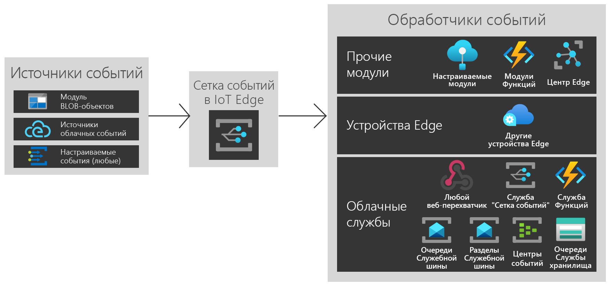

# Что такое "Сетка событий Azure" в Azure IoT Edge?
Служба "Сетка событий" в IoT Edge предоставляет широкие и гибкие возможности для пограничного устройства, использующего службу "Сетка событий Azure". Она создает разделы, выполняет публикацию событий и подписку для нескольких назначений, будь то модули на одном устройстве, другие пограничные устройства или службы в облаке.

Как и в облаке, "Сетка событий" в модуле IoT Edge выполняет маршрутизацию, фильтрацию и надежную доставку событий при масштабировании. Она выполняет фильтрацию событий, чтобы обеспечить передачу только соответствующих событий в различные обработчики событий с помощью универсальных строчных, числовых и логических фильтров. Логика повторных попыток гарантирует, что событие достигнет целевого назначения, даже если оно недоступно во время публикации. Она позволяет использовать службу "Сетка событий" в IoT Edge в качестве эффективного механизма хранения и переадресации.

Служба "Сетка событий" в IoT Edge поддерживает как CloudEvents версии 1.0, так и пользовательские схемы событий. Кроме того, для удобства взаимодействия она поддерживает ту же семантику издателя и подписчика, что и Сетка событий в облаке.

В статье представлен обзор службы "Сетка событий Azure" в IoT Edge. Пошаговые инструкции по использованию этого модуля на граничных устройствах см. в разделе [Локальная публикация событий и подписка на них](pub-sub-events-webhook-local.md). 

На этом рисунке показаны некоторые способы использования службы "Сетка событий" в IoT Edge, а также неполный список поддерживаемых функциональных возможностей.

## Когда следует использовать службу "Сетка событий" в IoT Edge

Сетка событий в IoT Edge обеспечивает простую в использовании, надежную модель событий между пограничным устройством и облаком.

Служба "Сетка событий" в IoT Edge предусматривает область симметричной среды выполнения для облачной службы Azure, поэтому вы можете использовать те же события и вызовы API в любом месте, где это необходимо. Если вы выполняете публикацию или подписку в облаке, на граничном устройстве или между ними, служба "Сетка событий" в IoT Edge теперь может быть универсальным решением для любой ситуации.

Используйте службу "Сетка событий" в IoT Edge, чтобы активировать простые рабочие процессы между модулями. Например, создайте раздел и опубликуйте события создания BLOB-объектов хранилища из модуля хранилища в разделе. Теперь вы можете создать подписку на одну или несколько функций или пользовательских модулей для этих разделов.

Расширьте функциональные возможности между пограничными устройствами. Если вы публикуете события модуля BLOB-объектов и хотите использовать вычислительную мощность нескольких ближайших пограничных устройств, создайте подписки между устройствами.

И, наконец, подключитесь к облаку. Если вы хотите периодически синхронизировать события модуля BLOB-объектов с облаком, используйте больше доступных вычислений в облаке или отправьте обработанные данные, создав дополнительные подписки на облачные службы.

Служба "Сетка событий" в IoT Edge предоставляет гибкую и несвязанную архитектуру событий.

## Источники событий

Как и в облаке, служба "Сетка событий" в IoT Edge позволяет осуществлять прямую интеграцию между модулями для создания архитектуры, управляемой событиями. В настоящее время события в службу "Сетка событий" в IoT Edge можно отправлять из таких источников:

* Хранилище BLOB-объектов Azure в IoT Edge
* Источники CloudEvents
* Пользовательские модули и контейнеры через HTTP-запрос POST;

## Обработчики событий

Служба "Сетка событий" в IoT Edge построена для отправки событий в любое место. В настоящее время поддерживаются следующие назначения:

* Другие модули, включая функции и пользовательские модули центра Интернета вещей
* Другие пограничные устройства
* Веб-перехватчики
* Облачная служба Сетки событий Azure
* Центры событий
* Очереди служебной шины
* Разделы шины обслуживания
* Очереди службы хранилища

## Поддерживаемые среды
В настоящее время поддерживаются 64-разрядные среды Windows и Linux, а также 32-разрядная среда ARM.

## Основные понятия

Есть пять основных понятий, с которыми нужно ознакомиться перед началом работы со службой "Сетка событий Azure":

* **События** — это то, что произошло.
* **Источники событий** — это расположения, в которых произошли события.
* **Разделы** — это конечная точка, в которую издатель отправляет событие.
* **Подписки на события** — это конечная точка или встроенный механизм для маршрутизации событий, иногда в несколько обработчиков. Кроме того, подписки используются обработчиками для интеллектуальной фильтрации входящих событий.
* **Обработчик событий** — приложение или служба, которые реагируют на событие.

## Стоимость

Служба "Сетка событий" в IoT Edge предоставляется бесплатно на время использования общедоступной предварительной версии.

## Проблемы
Сообщайте о любых проблемах с использованием сетки событий в IoT Edge в [https://github.com/Azure/event-grid-iot-edge/issues](https://github.com/Azure/event-grid-iot-edge/issues).

## Дальнейшие действия

* [Публикация событий и подписка на них локально](pub-sub-events-webhook-local.md)
* [Публикация событий и подписка на них в облаке](pub-sub-events-webhook-cloud.md)
* [Пересылка событий в облако Сетки событий](forward-events-event-grid-cloud.md)
* [Пересылка событий в IoTHub](forward-events-iothub.md)
* [Реагирование на события хранилища BLOB-объектов локально](react-blob-storage-events-locally.md)