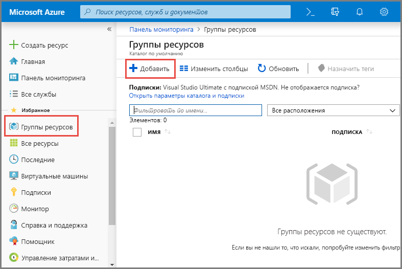
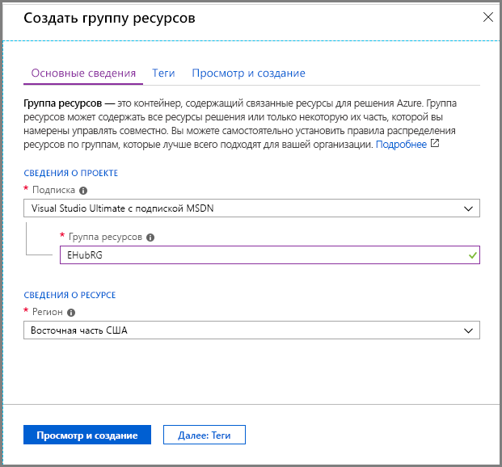
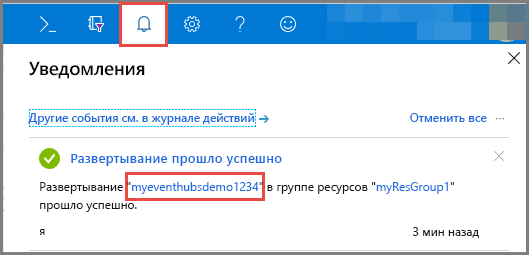
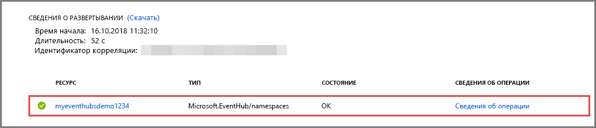
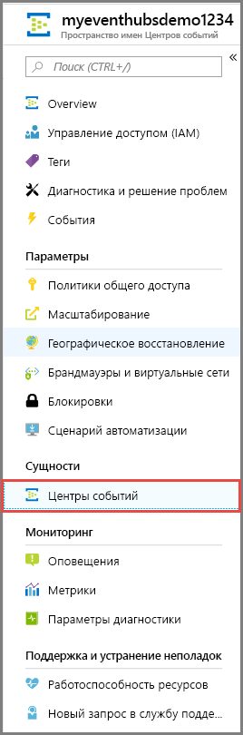
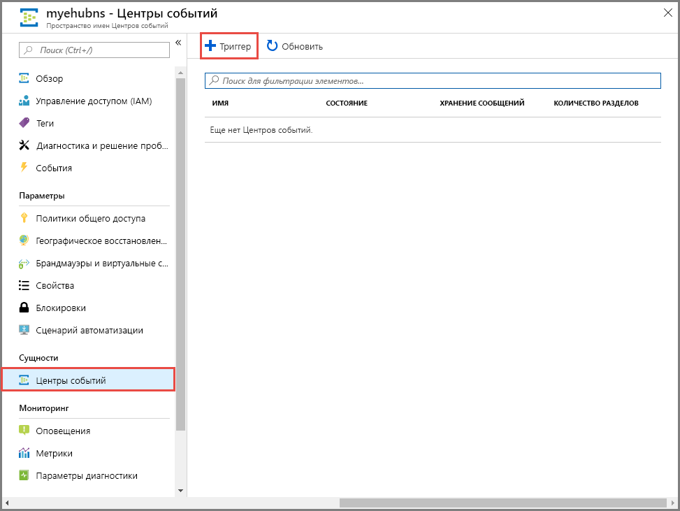
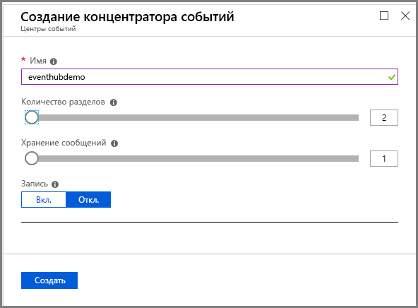

# Краткое руководство. Создание концентратора событий с помощью портала Azure
Центры событий Azure — это платформа потоковой передачи больших данных и служба приема событий, принимающая и обрабатывающая миллионы событий в секунду. Центры событий могут обрабатывать и сохранять события, данные и телеметрию, созданные распределенным программным обеспечением и устройствами. Данные, отправляемые в концентратор событий, можно преобразовывать и сохранять с помощью любого поставщика аналитики в реальном времени, а также с помощью адаптеров пакетной обработки или хранения. Подробный обзор Центров событий см. в статьях [Что такое Центры событий Azure?](event-hubs-about.md) и [Обзор функций Центров событий](event-hubs-features.md).

В этом кратком руководстве вы создадите концентратор событий на [портале Azure](https://portal.azure.com).

## Предварительные требования

В рамках этого краткого руководства вам потребуются:

- Подписка Azure. Если у вас еще нет подписки Azure, [создайте бесплатную учетную запись](https://azure.microsoft.com/free/), прежде чем начать работу.
- [Visual Studio 2017 с обновлением 3 (версия 15.3, 26730.01)](https://www.visualstudio.com/vs) или более новая версия.
- [Пакет SDK для .NET Standard](https://www.microsoft.com/net/download/windows) версии 2.0 или более новой.

## Создание группы ресурсов

Группа ресурсов — это логическая коллекция ресурсов Azure. Все ресурсы развертываются и управляются в группе ресурсов. Чтобы создать группу ресурсов, сделайте следующее:

1. Войдите на [портале Azure](https://portal.azure.com).
2. В области навигации слева щелкните **Группа ресурсов**. Нажмите кнопку **Добавить**.

   

2. Введите уникальное имя группы ресурсов. Система мгновенно проверит, доступно ли имя в текущей выбранной подписке Azure.

3. В разделе **Подписки** щелкните имя подписки Azure, в которой необходимо создать группу ресурсов.

4. Выберите географическое расположение группы ресурсов.

5. Нажмите кнопку **Создать**.

   

## Создание пространства имен в Центрах событий

Пространство имен Центров событий предоставляет уникальный контейнер, ограничивающий область действия. Вы можете обращаться к этому контейнеру по полному доменному имени и создавать в нем концентраторы событий. Чтобы создать пространство имен в группе ресурсов с использованием портала, выполните следующие действия:

1. На портале Azure щелкните **Создать ресурс** в левой верхней части экрана.

2. Последовательно выберите **Интернет вещей** и **Центры событий**.

3. В разделе **создания пространства имен** укажите имя пространства имен. Система немедленно проверяет, доступно ли оно.

   

4. Убедившись, что пространство имен доступно, выберите ценовую категорию: "Базовый" или "Стандартный". Также выберите подписку Azure, группу ресурсов и расположение для создания ресурса.
 
5. Щелкните **Создать** , чтобы создать пространство имен. Полная подготовка ресурсов для системы может занять несколько минут.
6. Щелкните **Уведомления** и выберите **развертывание** с именем созданного пространства имен концентратора событий. 

   
6. Выберите пространство имен концентратора событий в списке ресурсов, созданных в развертывании. 

   
7. На странице **Пространство имен Центров событий** выберите **Политики общего доступа** и щелкните **RootManageSharedAccessKey**.
    
8. Нажмите кнопку копирования, чтобы скопировать строку подключения **RootManageSharedAccessKey** в буфер обмена. Сохраните эту строку подключения во временном расположении папке, например в Блокноте, для последующего использования.
    
## Создание концентратора событий

Чтобы создать концентратор событий в пространстве имен, выполните следующие действия:

1. На странице пространства имен концентраторов событий выберите **Центры событий**.
   
    

1. Щелкните **+Концентратор событий** в верхней части окна.
   
    
1. Введите имя концентратора событий, а затем щелкните **Создать**.
   
    

Поздравляем! Вы создали пространство имен Центров событий и создали концентратор событий в этом пространстве имен с помощью портала. 

## Дополнительная информация

В этой статье вы создали группу ресурсов, пространство имен Центров событий и концентратор событий. Пошаговые инструкции по отправке событий в концентратор и получении событий из него см. в следующих руководствах:  

- **Отправка событий в концентратор**: [Приступая к отправке событий в Центры событий Azure на платформе .NET Standard](event-hubs-dotnet-standard-getstarted-send.md), [Отправка событий в концентраторы событий Azure с помощью платформы .NET Framework](event-hubs-dotnet-framework-getstarted-send.md), [Отправка событий в Центры событий Azure с помощью Java](event-hubs-java-get-started-send.md), [Отправка событий в Центры событий с помощью Python](event-hubs-python-get-started-send.md), [Отправка событий в Центры событий Azure с помощью Node.js](event-hubs-node-get-started-send.md), [Отправка событий в Центры событий с помощью Go](event-hubs-go-get-started-send.md), [Отправка событий в Центры событий Azure с помощью C](event-hubs-c-getstarted-send.md)
- **Получение событий из концентратора**: [Основные сведения о получении сообщений с помощью узла EventProcessorHost в .NET Standard](event-hubs-dotnet-standard-getstarted-receive-eph.md), [Получение событий от Центров событий Azure с помощью платформы .NET Framework](event-hubs-dotnet-framework-getstarted-receive-eph.md), [Получение событий от Центров событий Azure с помощью Java](event-hubs-java-get-started-receive-eph.md), [Получение событий из концентраторов событий с помощью Python](event-hubs-python-get-started-receive.md), [Получение событий от Центров событий Azure с помощью Node.js](event-hubs-node-get-started-receive.md), [Получение событий из концентраторов событий с помощью Go](event-hubs-go-get-started-receive-eph.md), [Получение событий из Центров событий с помощью Apache Storm](event-hubs-storm-getstarted-receive.md)

[Azure portal]: https://portal.azure.com/
[3]: ./media/event-hubs-quickstart-portal/sender1.png
[4]: ./media/event-hubs-quickstart-portal/receiver1.png
