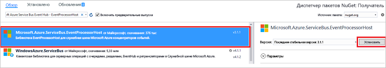

# <a name="receive-events-from-azure-event-hubs-using-the-net-framework"></a>Получение событий от Центров событий Azure с помощью платформы .NET Framework

## <a name="introduction"></a>Введение

Центры событий — это служба, которая обрабатывает большие объемы данных телеметрии о событиях, поступающих от подключенных устройств и приложений. После сбора дынных в Центрах событий их можно сохранить с помощью кластера хранилища или преобразовать с помощью поставщика аналитики в реальном времени. Эта возможность сбора и обработки большого объема данных о событиях является ключевым компонентом в современных архитектурах приложений, включая "Интернет вещей". Подробный обзор Центров событий см. в статьях [Что такое Центры событий Azure?](event-hubs-about.md) и [Обзор функций Центров событий](event-hubs-features.md).

В этом руководстве показано, как создать консольное приложение .NET Framework, которое получает сообщения из концентратора событий с помощью [узла обработчика событий](event-hubs-event-processor-host.md). [Узел обработчика событий](event-hubs-event-processor-host.md) представляет собой класс .NET, который упрощает прием событий из концентраторов событий путем управления постоянными контрольными точками и одновременно принимает сообщения от этих концентраторов событий. С помощью класса EventProcessorHost можно разделить события между несколькими получателями даже в том случае, если они размещены в разных узлах. В этом примере показано, как использовать EventProcessorHost для одного получателя. В примере [развертывания обработки событий][Scale out Event Processing with Event Hubs] показано, как использовать EventProcessorHost с несколькими получателями.

## <a name="prerequisites"></a>Предварительные требования

Для работы с данным руководством вам потребуется:

* [Microsoft Visual Studio 2017 или более поздней версии](https://visualstudio.com).

## <a name="create-an-event-hubs-namespace-and-an-event-hub"></a>Создание пространства имен Центров событий и концентратора событий
Первым шагом является использование [портала Azure](https://portal.azure.com) для создания пространства имен типа Центров событий и получение учетных данных управления, необходимых приложению для взаимодействия с концентратором событий. Чтобы создать пространство имен и концентратор событий, выполните процедуру, описанную в [этой статье](event-hubs-create.md), а затем перейдите к следующим шагам в этом руководстве.

[!INCLUDE [event-hubs-create-storage](../../includes/event-hubs-create-storage.md)]

## <a name="create-a-console-application"></a>Создание консольного приложение

Создайте в Visual Studio новый проект Visual C# для классических приложений с помощью шаблона проекта **Консольное приложение**. Присвойте проекту имя **Получатель**.
   


## <a name="add-the-event-hubs-nuget-package"></a>Добавление пакета NuGet для Центров событий

1. В обозревателе решений щелкните правой кнопкой мыши проект **Получатель** и выберите пункт **Управление пакетами NuGet для решения**.
2. Щелкните вкладку **Обзор** и выполните поиск `Microsoft Azure Service Bus Event Hub - EventProcessorHost`. Щелкните **Установить**и примите условия использования.
   
    
   
    Visual Studio скачает, установит и добавит ссылку на [пакет концентратора событий служебной шины Azure EventProcessorHost NuGet](https://www.nuget.org/packages/Microsoft.Azure.ServiceBus.EventProcessorHost)со всеми его зависимостями.

## <a name="implement-the-ieventprocessor-interface"></a>Реализация интерфейса IEventProcessor

1. Щелкните правой кнопкой мыши проект **Получатель**, а затем выберите пункты **Добавить** и **Класс**. Присвойте новому классу имя **SimpleEventProcessor**, а затем нажмите кнопку **Добавить**, чтобы создать класс.
   
    
2. Добавьте в начало файла SimpleEventProcessor.cs следующие инструкции:
    
      ```csharp
      using Microsoft.ServiceBus.Messaging;
      using System.Diagnostics;
      ```
    
3. Замените следующий код текстом класса:
    
      ```csharp
      class SimpleEventProcessor : IEventProcessor
      {
        Stopwatch checkpointStopWatch;
        
        async Task IEventProcessor.CloseAsync(PartitionContext context, CloseReason reason)
        {
            Console.WriteLine("Processor Shutting Down. Partition '{0}', Reason: '{1}'.", context.Lease.PartitionId, reason);
            if (reason == CloseReason.Shutdown)
            {
                await context.CheckpointAsync();
            }
        }
        
        Task IEventProcessor.OpenAsync(PartitionContext context)
        {
            Console.WriteLine("SimpleEventProcessor initialized.  Partition: '{0}', Offset: '{1}'", context.Lease.PartitionId, context.Lease.Offset);
            this.checkpointStopWatch = new Stopwatch();
            this.checkpointStopWatch.Start();
            return Task.FromResult<object>(null);
        }
        
        async Task IEventProcessor.ProcessEventsAsync(PartitionContext context, IEnumerable<EventData> messages)
        {
            foreach (EventData eventData in messages)
            {
                string data = Encoding.UTF8.GetString(eventData.GetBytes());
        
                Console.WriteLine(string.Format("Message received.  Partition: '{0}', Data: '{1}'",
                    context.Lease.PartitionId, data));
            }
        
            //Call checkpoint every 5 minutes, so that worker can resume processing from 5 minutes back if it restarts.
            if (this.checkpointStopWatch.Elapsed > TimeSpan.FromMinutes(5))
            {
                await context.CheckpointAsync();
                this.checkpointStopWatch.Restart();
            }
        }
      }
      ```
    
      Этот класс вызывается из **EventProcessorHost** для обработки событий, полученных от концентратора событий. В классе `SimpleEventProcessor` используется контрольный таймер для периодического вызова метода контрольных точек в контексте **EventProcessorHost**. Благодаря этому в случае перезагрузки получателя будет потеряно не более пяти минут обработки.

## <a name="update-the-main-method-to-use-simpleeventprocessor"></a>Обновление метода Main для использования класса SimpleEventProcessor

1. Добавьте в класс **Program** в начале файла следующую инструкцию `using`.
    
      ```csharp
      using Microsoft.ServiceBus.Messaging;
      ```
    
2. Замените метод `Main` в классе `Program` следующим кодом. При этом укажите имя концентратора событий и сохраненную ранее строку подключения уровня пространства имен, а также учетную запись хранения и ключ, которые вы скопировали в предыдущих разделах. 
    
      ```csharp
      static void Main(string[] args)
      {
        string eventHubConnectionString = "{Event Hubs namespace connection string}";
        string eventHubName = "{Event Hub name}";
        string storageAccountName = "{storage account name}";
        string storageAccountKey = "{storage account key}";
        string storageConnectionString = string.Format("DefaultEndpointsProtocol=https;AccountName={0};AccountKey={1}", storageAccountName, storageAccountKey);
        
        string eventProcessorHostName = Guid.NewGuid().ToString();
        EventProcessorHost eventProcessorHost = new EventProcessorHost(eventProcessorHostName, eventHubName, EventHubConsumerGroup.DefaultGroupName, eventHubConnectionString, storageConnectionString);
        Console.WriteLine("Registering EventProcessor...");
        var options = new EventProcessorOptions();
        options.ExceptionReceived += (sender, e) => { Console.WriteLine(e.Exception); };
        eventProcessorHost.RegisterEventProcessorAsync<SimpleEventProcessor>(options).Wait();
        
        Console.WriteLine("Receiving. Press enter key to stop worker.");
        Console.ReadLine();
        eventProcessorHost.UnregisterEventProcessorAsync().Wait();
      }
      ```
    
3. Запустите программу и убедитесь в отсутствии ошибок.
  
Поздравляем! Теперь вы можете получать сообщения из концентратора событий с помощью узла EventProcessorHost.


> [!NOTE]
> В этом руководстве используется один экземпляр [EventProcessorHost](event-hubs-event-processor-host.md). Чтобы увеличить пропускную способность, рекомендуем запустить несколько экземпляров [EventProcessorHost](event-hubs-event-processor-host.md), как показано в примере [развертывания обработки событий](https://code.msdn.microsoft.com/Service-Bus-Event-Hub-45f43fc3). В этом случае различные экземпляры автоматически координируются друг с другом для распределения нагрузки полученных событий. 

## <a name="next-steps"></a>Дополнительная информация
С помощью этого руководства вы создали приложение .NET Framework, получающее сообщения из концентратора событий. Чтобы узнать, как отправлять события в концентратор событий с помощью .NET Framework, см. статью [Отправка событий в концентраторы событий Azure с помощью платформы .NET Framework](event-hubs-dotnet-framework-getstarted-send.md).

<!-- Images. -->
[19]: ./media/event-hubs-csharp-ephcs-getstarted/create-eh-proj1.png
[20]: ./media/event-hubs-csharp-ephcs-getstarted/create-eh-proj2.png
[21]: ./media/event-hubs-csharp-ephcs-getstarted/run-csharp-ephcs1.png
[22]: ./media/event-hubs-csharp-ephcs-getstarted/run-csharp-ephcs2.png

<!-- Links -->
[EventProcessorHost]: /dotnet/api/microsoft.servicebus.messaging.eventprocessorhost
[Event Hubs overview]: event-hubs-about.md
[Scale out Event Processing with Event Hubs]: https://code.msdn.microsoft.com/Service-Bus-Event-Hub-45f43fc3
[Event Hubs Programming Guide]: event-hubs-programming-guide.md
[Azure Storage account]:../storage/common/storage-create-storage-account.md
[Event Processor Host]: event-hubs-event-processor-host.md
[Azure portal]: https://portal.azure.com
