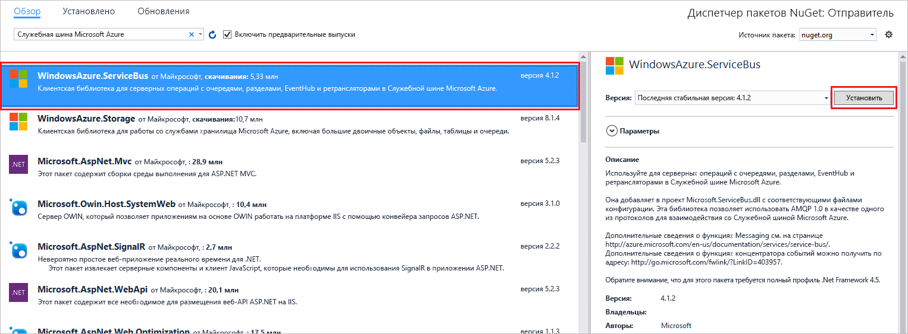

# <a name="send-events-to-or-receive-events-from-azure-event-hubs-using-net-framework"></a>Отправлять события или получения событий из концентраторов событий Azure с помощью .NET Framework
Центры событий Azure — это платформа потоковой передачи больших данных и служба приема событий, принимающая и обрабатывающая миллионы событий в секунду. Служба "Центры событий" может обрабатывать и сохранять события и данные, в том числе телеметрические, созданные распределенным программным обеспечением и устройствами. Данные, отправляемые в концентратор событий, можно преобразовывать и сохранять с помощью любого поставщика аналитики в режиме реального времени, а также с помощью адаптеров пакетной обработки или хранения. Подробный обзор Центров событий см. в статьях [Что такое Центры событий Azure?](event-hubs-about.md) и [Обзор функций Центров событий](event-hubs-features.md).

Этом руководстве показано, как создавать консольные приложения .NET Framework в C# для отправки событий или получать события из концентратора событий. 

## <a name="prerequisites"></a>Технические условия
Для работы с данным руководством вам потребуется:

- [Microsoft Visual Studio 2017 или более поздней версии](https://visualstudio.com).
- **Создать пространство имен концентраторов событий и концентратора событий**. Первым шагом является использование [портала Azure](https://portal.azure.com) для создания пространства имен типа Центров событий и получение учетных данных управления, необходимых приложению для взаимодействия с концентратором событий. Чтобы создать пространство имен и концентратор событий, выполните инструкции из [этой статьи](event-hubs-create.md). Затем получите **строку подключения для пространства имен концентратора событий** , следуя указаниям из статьи: [Получение строки подключения на портале](event-hubs-get-connection-string.md#get-connection-string-from-the-portal). Строка подключения понадобится нам позже.

## <a name="send-events"></a>Отправка событий 
В этом разделе показано, как создать консольное приложение .NET Framework, для отправки событий в концентратор событий. 

### <a name="create-a-console-application"></a>Создание консольного приложение

Создайте в Visual Studio новый проект Visual C# для классических приложений с помощью шаблона проекта **Консольное приложение** . Назовите проект **Sender**.
   


### <a name="add-the-event-hubs-nuget-package"></a>Добавление пакета NuGet для Центров событий

1. В обозревателе решений щелкните правой кнопкой мыши проект **Sender** и выберите пункт **Управление пакетами NuGet для решения**. 
2. Щелкните вкладку **Обзор** и выполните поиск `WindowsAzure.ServiceBus`. Щелкните **Установить**и примите условия использования. 
   
    
   
    Visual Studio скачает, установит и добавит ссылку на [пакет NuGet библиотеки служебной шины Azure](https://www.nuget.org/packages/WindowsAzure.ServiceBus).

### <a name="write-code-to-send-messages-to-the-event-hub"></a>Написание кода для отправки сообщений в концентратор событий

1. Добавьте следующие инструкции `using` в начало файла **Program.cs** :
   
    ```csharp
    using System.Threading;
    using Microsoft.ServiceBus.Messaging;
    ```
2. Добавьте в класс **Program** приведенные ниже поля и укажите в качестве значений имя концентратора событий, созданного в предыдущем разделе, и сохраненную ранее строку подключения уровня пространства имен. Вы можете скопировать строку подключения для концентратора событий из поля **Строка подключения — первичный ключ** в разделе **RootManageSharedAccessKey** на странице Центра событий на портале Azure. Подробные сведения см. в [этом разделе](event-hubs-get-connection-string.md#get-connection-string-from-the-portal).
   
    ```csharp
    static string eventHubName = "Your Event Hub name";
    static string connectionString = "namespace connection string";
    ```
3. Добавьте следующий метод в класс **Program** .
   
      ```csharp
      static void SendingRandomMessages()
      {
          var eventHubClient = EventHubClient.CreateFromConnectionString(connectionString, eventHubName);
          while (true)
          {
              try
              {
                  var message = Guid.NewGuid().ToString();
                  Console.WriteLine("{0} > Sending message: {1}", DateTime.Now, message);
                  eventHubClient.Send(new EventData(Encoding.UTF8.GetBytes(message)));
              }
              catch (Exception exception)
              {
                  Console.ForegroundColor = ConsoleColor.Red;
                  Console.WriteLine("{0} > Exception: {1}", DateTime.Now, exception.Message);
                  Console.ResetColor();
              }
       
              Thread.Sleep(200);
          }
      }
      ```
   
      Этот метод постоянно отправляет события в концентратор событий с задержкой 200 мс.
4. Наконец, добавьте следующие строки в метод **Main** :
   
      ```csharp
      Console.WriteLine("Press Ctrl-C to stop the sender process");
      Console.WriteLine("Press Enter to start now");
      Console.ReadLine();
      SendingRandomMessages();
      ```
5. Запустите программу и убедитесь в отсутствии ошибок.
  
## <a name="receive-events"></a>Получение событий
В этом разделе можно написать консольное приложение .NET Framework, которая получает сообщения из концентратора событий с помощью [узла обработчика событий](event-hubs-event-processor-host.md). [Узел обработчика событий](event-hubs-event-processor-host.md) представляет собой класс .NET, который упрощает прием событий из концентраторов событий путем управления постоянными контрольными точками и одновременно принимает сообщения от этих концентраторов событий. С помощью класса EventProcessorHost можно разделить события между несколькими получателями даже в том случае, если они размещены в разных узлах. 

[!INCLUDE [event-hubs-create-storage](../../includes/event-hubs-create-storage.md)]

### <a name="create-a-console-application"></a>Создание консольного приложение

Создайте в Visual Studio новый проект Visual C# для классических приложений с помощью шаблона проекта **Консольное приложение**. Присвойте проекту имя **Получатель**.
   


### <a name="add-the-event-hubs-nuget-package"></a>Добавление пакета NuGet для Центров событий

1. В обозревателе решений щелкните правой кнопкой мыши проект **Получатель** и выберите пункт **Управление пакетами NuGet для решения**.
2. Щелкните вкладку **Обзор** и выполните поиск `Microsoft Azure Service Bus Event Hub - EventProcessorHost`. Щелкните **Установить**и примите условия использования.
   
    
   
    Visual Studio скачает, установит и добавит ссылку на [пакет концентратора событий служебной шины Azure EventProcessorHost NuGet](https://www.nuget.org/packages/Microsoft.Azure.ServiceBus.EventProcessorHost)со всеми его зависимостями.

### <a name="implement-the-ieventprocessor-interface"></a>Реализация интерфейса IEventProcessor

1. Щелкните правой кнопкой мыши проект **Получатель**, а затем выберите пункты **Добавить** и **Класс**. Присвойте новому классу имя **SimpleEventProcessor**, а затем нажмите кнопку **Добавить**, чтобы создать класс.
   
    
2. Добавьте в начало файла SimpleEventProcessor.cs следующие инструкции:
    
      ```csharp
      using Microsoft.ServiceBus.Messaging;
      using System.Diagnostics;
      ```
    
3. Замените следующий код текстом класса:
    
      ```csharp
      class SimpleEventProcessor : IEventProcessor
      {
        Stopwatch checkpointStopWatch;
        
        async Task IEventProcessor.CloseAsync(PartitionContext context, CloseReason reason)
        {
            Console.WriteLine("Processor Shutting Down. Partition '{0}', Reason: '{1}'.", context.Lease.PartitionId, reason);
            if (reason == CloseReason.Shutdown)
            {
                await context.CheckpointAsync();
            }
        }
        
        Task IEventProcessor.OpenAsync(PartitionContext context)
        {
            Console.WriteLine("SimpleEventProcessor initialized.  Partition: '{0}', Offset: '{1}'", context.Lease.PartitionId, context.Lease.Offset);
            this.checkpointStopWatch = new Stopwatch();
            this.checkpointStopWatch.Start();
            return Task.FromResult<object>(null);
        }
        
        async Task IEventProcessor.ProcessEventsAsync(PartitionContext context, IEnumerable<EventData> messages)
        {
            foreach (EventData eventData in messages)
            {
                string data = Encoding.UTF8.GetString(eventData.GetBytes());
        
                Console.WriteLine(string.Format("Message received.  Partition: '{0}', Data: '{1}'",
                    context.Lease.PartitionId, data));
            }
        
            //Call checkpoint every 5 minutes, so that worker can resume processing from 5 minutes back if it restarts.
            if (this.checkpointStopWatch.Elapsed > TimeSpan.FromMinutes(5))
            {
                await context.CheckpointAsync();
                this.checkpointStopWatch.Restart();
            }
        }
      }
      ```
    
      Этот класс вызывается из **EventProcessorHost** для обработки событий, полученных от концентратора событий. В классе `SimpleEventProcessor` используется контрольный таймер для периодического вызова метода контрольных точек в контексте **EventProcessorHost**. Благодаря этому в случае перезагрузки получателя будет потеряно не более пяти минут обработки.

### <a name="update-the-main-method-to-use-simpleeventprocessor"></a>Обновление метода Main для использования класса SimpleEventProcessor

1. Добавьте в класс **Program** в начале файла следующую инструкцию `using`.
    
      ```csharp
      using Microsoft.ServiceBus.Messaging;
      ```
    
2. Замените метод `Main` в классе `Program` следующим кодом. При этом укажите имя концентратора событий и сохраненную ранее строку подключения уровня пространства имен, а также учетную запись хранения и ключ, которые вы скопировали в предыдущих разделах. 
    
      ```csharp
      static void Main(string[] args)
      {
        string eventHubConnectionString = "{Event Hubs namespace connection string}";
        string eventHubName = "{Event Hub name}";
        string storageAccountName = "{storage account name}";
        string storageAccountKey = "{storage account key}";
        string storageConnectionString = string.Format("DefaultEndpointsProtocol=https;AccountName={0};AccountKey={1}", storageAccountName, storageAccountKey);
        
        string eventProcessorHostName = Guid.NewGuid().ToString();
        EventProcessorHost eventProcessorHost = new EventProcessorHost(eventProcessorHostName, eventHubName, EventHubConsumerGroup.DefaultGroupName, eventHubConnectionString, storageConnectionString);
        Console.WriteLine("Registering EventProcessor...");
        var options = new EventProcessorOptions();
        options.ExceptionReceived += (sender, e) => { Console.WriteLine(e.Exception); };
        eventProcessorHost.RegisterEventProcessorAsync<SimpleEventProcessor>(options).Wait();
        
        Console.WriteLine("Receiving. Press enter key to stop worker.");
        Console.ReadLine();
        eventProcessorHost.UnregisterEventProcessorAsync().Wait();
      }
      ```
    
3. Запустите программу и убедитесь в отсутствии ошибок.
  
## <a name="next-steps"></a>Дальнейшие действия
Ознакомьтесь со следующими статьями: 

- [EventProcessorHost](event-hubs-event-processor-host.md)
- [Возможностями и терминологией в концентраторах событий Azure](event-hubs-features.md).
- [Часто задаваемые вопросы о Центрах событий](event-hubs-faq.md)


<!-- Links -->
[EventProcessorHost]: /dotnet/api/microsoft.servicebus.messaging.eventprocessorhost
[Event Hubs overview]: event-hubs-about.md
[Event Hubs Programming Guide]: event-hubs-programming-guide.md
[Azure Storage account]:../storage/common/storage-create-storage-account.md
[Event Processor Host]: event-hubs-event-processor-host.md
[Azure portal]: https://portal.azure.com
