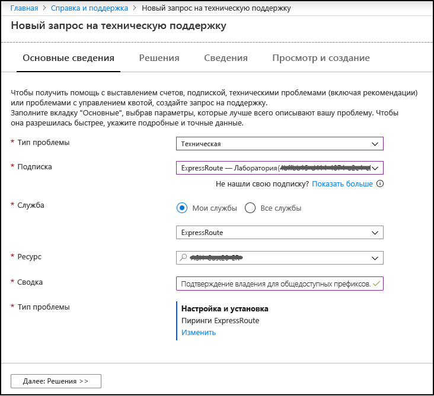
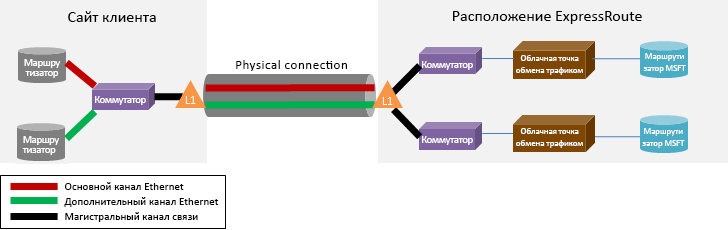

# Вопросы и ответы по ExpressRoute

## Что такое ExpressRoute?

ExpressRoute — это служба Azure, которая позволяет создавать частные подключения между центрами обработки данных Microsoft и инфраструктурой вашей локальной среды или среды для совместной работы. Подключения ExpressRoute не осуществляются через общедоступный Интернет и обеспечивают повышенный уровень безопасности, надежности и быстродействия с низким уровнем задержки по сравнению с обычными подключениями через Интернет.

### Каковы преимущества использования ExpressRoute и частных сетевых подключений?

Подключения ExpressRoute не проходят через общедоступный Интернет. Они предоставляют большую безопасность, надежность и скорость с меньшими и согласованными задержками, чем обычные подключения через Интернет. В некоторых случаях использование подключений ExpressRoute для передачи данных между локальными устройствами и Azure дает возможность значительно сократить затраты.

### Где доступна эта служба?

Сведения о расположении этой службы и ее доступности см. на странице [Партнеры и расположения ExpressRoute](expressroute-locations.md).

### Как использовать ExpressRoute для подключения к Microsoft, если нет соглашений ни с одним из партнеров-поставщиков ExpressRoute?

Вы можете выбрать регионального поставщика и получить подключения Ethernet к одному из поддерживаемых расположений поставщиков Exchange. Затем вы можете взаимодействовать с Майкрософт в этом расположении поставщиков. Проверьте, есть ли ваш поставщик услуг в расположениях Exchange, в последнем разделе на странице [Партнеры и расположения ExpressRoute](expressroute-locations.md). Затем можно заказать канал ExpressRoute через поставщика услуг, чтобы подключиться к Azure.

### Сколько стоит ExpressRoute?

Сведения о ценах см. на [этой странице](https://azure.microsoft.com/pricing/details/expressroute/).

### Если я оплачиваю канал ExpressRoute определенной пропускной способности, должно ли подключение VPN, приобретенное у моего поставщика сетевых услуг, иметь ту же скорость?

Нет. Вы можете приобрести у своего поставщика услуг VPN-подключение любой скорости. Однако ваше подключение к Azure ограничено пропускной способностью приобретенного вами канала ExpressRoute.

### Если я оплачиваю канал ExpressRoute определенной пропускной способности, могу ли я при необходимости быстро увеличить его скорость?

Да. Каналы ExpressRoute настроены так, что позволяют вдвое повысить приобретенную пропускную способность без дополнительной оплаты. Уточните у своего поставщика услуг, поддерживает ли он эту возможность. Это не в течение длительного периода времени и не гарантируется.  Если трафик течет через ExpressRoute Шлюз, пропускная способность для sku фиксируется и не разрывается.

### Можно ли использовать одно и то же частное сетевое подключение с виртуальной сетью и другими службами Azure одновременно?

Да. После настройки канал ExpressRoute позволит вам получать доступ к службам в виртуальной сети и к другим службам Azure одновременно. Вы подключаетесь к виртуальным сетям по пути частного пиринга, а к другим службам — по пути пиринга Майкрософт.

### Как рекламируются VNets на ExpressRoute Private Peering?

Шлюз ExpressRoute будет рекламировать *адресное пространство (ы)* Azure VNet, вы не можете включить/исключить на уровне подсети. Это всегда VNet Адрес пространства, который рекламируется. Кроме того, если VNet Peering используется и заглянул VNet имеет "Использование удаленного шлюза" включен, адресное пространство заглянул VNet также будет объявлено.

### Сколько префиксов можно рекламировать от VNet до нахребетного на ExpressRoute Private Peering?

Существует максимум 200 префиксов, рекламируемых на одном подключении ExpressRoute, или через VNet пиринг с помощью шлюза транзита. Например, если у вас есть 199 адресных пространств на одном VNet, подключенном к схеме ExpressRoute, все 199 из этих префиксов будут объявлены в местные. Кроме того, если у вас есть VNet включен, чтобы шлюз транзита с 1 адреспространства и 150 говорил VNets включен с помощью "Разрешить удаленный шлюз" вариант, VNet развернуты с шлюзом будет рекламировать 151 префиксы на помещение.

### Что произойдет, если я префиксу предел на подключение ExpressRoute?

Связь между схемой ExpressRoute и шлюзом (и заглянув vNets с использованием шлюза транзита, если это применимо) будет идти вниз. Он восстановится, когда лимит префикса больше не будет превышен.  

### Могу ли я фильтровать маршруты, поступающие из моей сети?

Единственный способ фильтрации/включения маршрутов находится на переднем крае маршрутизаторе. Маршруты, определяемые пользователем, могут быть добавлены в VNet, чтобы повлиять на определенную маршрутизирующую маршрутизм, но это будет статично, а не частью рекламы BGP.

### Предлагается ли с ExpressRoute соглашение об уровне обслуживания (SLA)?

Дополнительные сведения.см на странице [Соглашение об уровне обслуживания для ExpressRoute](https://azure.microsoft.com/support/legal/sla/).

## Поддерживаемые службы

ExpressRoute поддерживает [три домена маршрутизатора](expressroute-circuit-peerings.md) для различных типов услуг: приватный пиринг, пиринг Microsoft и публичный пиринг (унипраженный).

### Частный пиринг

**Поддерживается:**

* Виртуальные сети, в том числе все виртуальные машины и облачные службы

### Пиринг Майкрософт

Если схема ExpressRoute включена для пиринга Azure Microsoft, вы можете получить доступ к [общедоступным диапазонам IP-адресов, используемым](../virtual-network/virtual-network-ip-addresses-overview-arm.md#public-ip-addresses) в Azure по схеме. Peering Azure Microsoft обеспечит доступ к службам, которые в настоящее время размещены в Azure (с геоограничениями в зависимости от SKU вашей цепи). Чтобы проверить доступность для конкретной службы, можно проверить документацию для этой службы, чтобы увидеть, есть ли зарезервированный диапазон, опубликованный для этой службы. Затем просмотрите ip-диапазоны целевой службы и сравните с диапазонами, перечисленными в [диапазонах IP-адресов Azure и тегах служб - Public Cloud XML file.](https://www.microsoft.com/download/details.aspx?id=56519) Кроме того, вы можете открыть билет поддержки для службы, о котором идет речь для уточнения.

**Поддерживается:**

* [Офис 365](https://aka.ms/ExpressRouteOffice365)
* Power BI - Доступно через региональное сообщество Azure, смотрите [здесь,](https://docs.microsoft.com/power-bi/service-admin-where-is-my-tenant-located) как узнать регион вашего арендатора Power BI.
* Azure Active Directory
* [Виртуальный рабочий стол Windows](https://azure.microsoft.com/services/virtual-desktop/)
* [Azure DevOps](https://blogs.msdn.microsoft.com/devops/2018/10/23/expressroute-for-azure-devops/) (сообщество Azure Global Services)
* Открытые общественные IP-адреса для IaaS (Виртуальные машины, виртуальные сетевые шлюзы, балансеры нагрузки и т.д.)  
* Большинство других служб Azure также поддерживаются. Сведения о поддержке уточняйте непосредственно в службе, которую требуется использовать.

**Не поддерживается:**

* CDN
* Azure Front Door
* Многофакторный сервер аутентификации (наследие)
* Диспетчер трафика

### Общедоступный пиринг

Общедоступный пиринг был отключен в новых каналах ExpressRoute. Службы Azure теперь доступны в пиринге Майкрософт. Если схема, созданная до того, как публичное пиринг был уронизирован, вы можете использовать пиринг microsoft или публичный пиринг, в зависимости от служб, которые вы хотите.

Для получения дополнительной информации и конфигурации шаги для публичного пиринга, см [ExpressRoute общественности пиринг](about-public-peering.md).

### Почему я вижу статус «Рекламируемые публичные префиксы» как «необходимая проверка», при настройке пиринга Майкрософт?

Корпорация Майкрософт проверяет, присваиваются ли вам указанные «Рекламированные общедоступные префиксы» и «Peer ASN» (или «Клиент ASN») в реестре интернет-рекламы. Если вы получаете общедоступные префиксы от другой организации и если назначение не записано в реестре разгромов, автоматическая проверка не будет завершена и потребует ручной проверки. Если автоматическая проверка не справляется, вы увидите сообщение "Необходимая проверка".

Если вы видите сообщение 'Проверка необходима', соберите документ (ы), которые показывают, что общедоступные префиксы назначены вашей организации организацией, которая указана как владелец префиксов в реестре разгромов, и отправьте эти документы для ручной проверки открытие опорного билета, как показано ниже.

### Динамика 365 поддерживается на ExpressRoute?

Среды Dynamics 365 и Common Data Service (CDS) размещаются в Azure, поэтому клиенты получают поддержку ExpressRoute для ресурсов Azure. Вы можете подключиться к конечным точкам обслуживания, если фильтр маршрутизатора включает в себя регионы Azure, в которых размещаются среды Dynamics 365/CDS.

> [!NOTE]
> [ExpressRoute Premium](https://docs.microsoft.com/azure/expressroute/expressroute-faqs#expressroute-premium) **не** требуется для подключения Dynamics 365 через Azure ExpressRoute.

## Данные и подключения

### Существуют ли ограничения на объем данных, передаваемых посредством ExpressRoute?

Мы не устанавливаем ограничения на объем передачи данных. Сведения о ценах на пропускную способность см. на [этой странице](https://azure.microsoft.com/pricing/details/expressroute/).

### Какие скорости подключения поддерживаются в ExpressRoute?

Поддерживаемая пропускная способность:

50 Мбит/с, 100 Мбит/с, 200 Мбит/с, 500 Мбит/с, 1 Гбит/с, 2 Гбит/с, 5 Гбит/с, 10 Гбит/с

### Какие поставщики услуг доступны?

Список поставщиков и расположений услуг см. в разделе [Партнеры и расположения ExpressRoute](expressroute-locations.md).

## Технические сведения

### Каковы технические требования для подключения моего локального расположения к Azure?

Требования см. на [странице предварительных требований ExpressRoute](expressroute-prerequisites.md).

### Обладают ли подключения к ExpressRoute избыточностью?

Да. Каждый канал ExpressRoute имеет избыточную пару перекрестных подключений для обеспечения высокой доступности.

### Будет ли потеряно подключение в случае сбоя одной из моих связей ExpressRoute?

Вы не потеряете подключение при сбое одного из перекрестных подключений. Избыточное подключение доступно для поддержки сетевой нагрузки и обеспечения высокого уровня доступности канала ExpressRoute. Вы можете дополнительно создать канал в другом расположении пиринга для обеспечения отказоустойчивости на уровне канала.

### Как реализовать избыточность при приватных пирингах?

Несколько схем ExpressRoute из разных вонючих местоположений могут быть подключены к одной и той же виртуальной сети, чтобы обеспечить высокую доступность в случае, если одна схема становится недоступной. Затем можно [назначить более высокие веса](https://docs.microsoft.com/azure/expressroute/expressroute-optimize-routing#solution-assign-a-high-weight-to-local-connection) локальному соединению в пользу конкретной схемы. Настоятельно рекомендуется, чтобы клиенты настроить по крайней мере две схемы ExpressRoute, чтобы избежать одной точки отказа. 

Смотрите [здесь](https://docs.microsoft.com/azure/expressroute/designing-for-high-availability-with-expressroute) для проектирования для высокой доступности и [здесь](https://docs.microsoft.com/azure/expressroute/designing-for-disaster-recovery-with-expressroute-privatepeering) для проектирования для аварийного восстановления.  

### Как реализовать избыточность в пиринге Майкрософт?

Настоятельно рекомендуется, когда клиенты используют Microsoft peering для доступа к общедоступным службам Azure, таким как Azure Storage или Azure S'L, а также клиентам, использующим microsoft peering для Office 365, что они реализуют несколько схем в разных пирингах места, чтобы избежать одной точки сбоя. Клиенты могут либо рекламировать одну и ту же префиксу на обеих схемах и использовать [AS PATH, предусмотрачивая](https://docs.microsoft.com/azure/expressroute/expressroute-optimize-routing#solution-use-as-path-prepending) или рекламировать различные префиксы, чтобы определить путь от находного.

Смотрите [здесь](https://docs.microsoft.com/azure/expressroute/designing-for-high-availability-with-expressroute) для проектирования для высокой доступности.

### Как обеспечить высокий уровень доступности в виртуальной сети, подключенной к ExpressRoute?

Высокого уровня доступности можно достичь, подключив к виртуальной сети каналы ExpressRoute в разных расположениях пиринга (например, Сингапур, Сингапур 2). Если один канал ExpressRoute выйдет из строя, подключение выполнит отработку отказа на другой канал ExpressRoute. По умолчанию трафик, исходящий из виртуальной сети, маршрутизируется по принципу выбор маршрута в зависимости от стоимости (ECMP). При выборе канала можно руководствоваться весом подключения. Дополнительные сведения см. в статье [Оптимизация маршрутизации ExpressRoute](expressroute-optimize-routing.md).

### Как я могу гарантировать, что на пути ExpressRoute предпочтительнее мой трафик, предназначенный для общедоступных служб Azure, таких как Azure Storage и Azure S'L в области пиринга или публичного пиринга Майкрософт?

Необходимо реализовать атрибут *Local Preference* в маршрутизаторе(ы), чтобы гарантировать, что путь от локального к Azure всегда предпочтительнен на вашей схеме ExpressRoute (ы).

Дополнительные сведения [смотрите здесь,](https://docs.microsoft.com/azure/expressroute/expressroute-optimize-routing#path-selection-on-microsoft-and-public-peerings) на выборах пути BGP и общих конфигурациях маршрутизатора. 

### Если у меня отсутствует совместное размещение в Cloud Exchange, а поставщик услуг предлагает подключение "точка – точка", мне нужно заказать два физических подключения между моей локальной сетью и сетью Майкрософт?

Требуется только одно физическое подключение, если ваш поставщик услуг может установить два виртуальных канала Ethernet через физическое подключение. Физическое подключение (например оптоволоконное) прерывается на устройстве уровня 1 (L1) (см. изображение). Два виртуальных канала Ethernet имеют разные идентификаторы виртуальной локальной сети — один для основного канала и один для дополнительного. Эти идентификаторы виртуальной локальной сети находятся во внешнем заголовке 802.1Q Ethernet. Внутренний заголовок 802.1Q Ethernet (не показан) сопоставляется с конкретным [доменом маршрутизации ExpressRoute](expressroute-circuit-peerings.md).

### Можно ли расширить одну из своих виртуальных локальных сетей до Azure с помощью ExpressRoute?

Нет. Мы не поддерживаем расширения подключений второго уровня до Azure.

### Можно ли получить в своей подписке несколько каналов ExpressRoute?

Да. Вы можете получить в своей подписке несколько каналов ExpressRoute. По умолчанию ограничение составляет 10. Если вам требуется увеличить это количество, обратитесь в службу поддержки Майкрософт.

### Можно ли использовать каналы ExpressRoute от разных поставщиков услуг?

Да. Вы можете использовать каналы ExpressRoute от нескольких поставщиков услуг. Каждый канал ExpressRoute связан только с одним поставщиком услуг. 

### В одном регионе находятся два расположения пиринга ExpressRoute, например Сингапур и Сингапур 2. Какое расположение пиринга выбрать для создания канала ExpressRoute?
Если ваш поставщик услуг предлагает ExpressRoute в обоих расположениях, можно обратиться к поставщику и выбрать одно из расположений для настройки ExpressRoute. 

### Можно ли использовать несколько каналов ExpressRoute в одном регионе? Можно ли их связать в одной виртуальной сети?

Да. Вы можете использовать несколько каналов ExpressRoute от одного или нескольких разных поставщиков услуг. Если регион включает несколько расположений пиринга ExpressRoute, а каналы созданы в разных расположениях пиринга, их можно связать в одной виртуальной сети. Если схемы создаются в одном и том же месте пиринга, можно связать до 4 схем с одной и той же виртуальной сетью.

### Как подключить мои виртуальные сети к каналу ExpressRoute?

Основными шагами являются:

* Установка канала ExpressRoute и обращение к поставщику услуг, чтобы он включил этот канал.
* Вы или поставщик должны настроить пиринг BGP.
* Связывание виртуальной сети с каналом ExpressRoute.

Дополнительные сведения см. в статье [Процедуры ExpressRoute для подготовки каналов и состояний каналов](expressroute-workflows.md).

### Существуют границы подключения к каналу ExpressRoute?

Да. Обзор границ подключения для канала ExpressRoute см. в статье [Партнеры и одноранговые расположения ExpressRoute](expressroute-locations.md). Возможность подключения к каналу ExpressRoute ограничена одной геополитической областью. Подключение можно расширить за пределы границ геополитической области, подключив расширенную функцию ExpressRoute.

### Можно связать несколько виртуальных сетей с каналом ExpressRoute?

Да. Можно создать до 10 подключений к виртуальной сети на канал ExpressRoute уровня "Стандартный" и до 100 — на [канал ExpressRoute уровня "Премиум"](#expressroute-premium). 

### У меня есть несколько подписок Azure, содержащих виртуальные сети. Можно ли подключить к одному каналу ExpressRoute виртуальные сети, являющиеся отдельными подписками?

Да. Можно связать до 10 виртуальных сетей в той же подписке, что и канал, или в разных подписках, используя один канал ExpressRoute. Это ограничение можно увеличить, подключив расширенную функцию ExpressRoute.

Дополнительные сведения см. в статье [Подключение виртуальной сети к каналу ExpressRoute](expressroute-howto-linkvnet-arm.md).

### У меня есть несколько подписок Azure, связанных с разными клиентами Azure Active Directory или регистрациями соглашения Enterprise Agreement. Могу ли я подключить виртуальные сети, относящиеся к разным клиентам и регистрациям, к одному каналу ExpressRoute, не относящийся к тому же клиенту или той же регистрации?

Да. Авторизация ExpressRoute может выходить за границы подписки, клиента и регистрации. При этом дополнительная настройка не требуется. 

Дополнительные сведения см. в статье [Подключение виртуальной сети к каналу ExpressRoute](expressroute-howto-linkvnet-arm.md).

### Являются ли виртуальные сети, подключенные к одному каналу, изолированными друг от друга?

Нет. С точки зрения маршрутизации все виртуальные сети, связанные с одним каналом ExpressRoute, входят в один домен маршрутизации и не изолированы друг от друга. Если вам требуется изоляция, необходимо создать отдельный канал ExpressRoute.

### Можно ли связать одну виртуальную сеть с несколькими каналами ExpressRoute?

Да. Вы можете связать одну виртуальную сеть с четырьмя схемами ExpressRoute в одинаковых или разных местах. 

### Могу ли я получать доступ к Интернету из виртуальных сетей, подключенных к каналам ExpressRoute?

Да. Если вы не объявляли маршруты по умолчанию (0.0.0.0/0) или префиксы интернет-маршрутов в сеансе BGP, то сможете подключаться к Интернету из виртуальной сети, связанной с каналом ExpressRoute.

### Могу ли я блокировать возможность подключения к Интернету из виртуальных сетей, подключенных к каналам ExpressRoute?

Да. Вы можете объявлять маршруты по умолчанию (0.0.0.0/0), чтобы блокировать все интернет-подключения к виртуальным машинам, развернутым в виртуальной сети, и направлять весь трафик через канал ExpressRoute.

Если вы объявляете маршруты по умолчанию, мы будем принудительно отправлять трафик к службам, предлагаемым через пиринг Майкрософт (таким как служба хранилища Azure и база данных SQL) обратно в вашу локальную среду. Вы должны будете настроить свои маршруты для возврата трафика в Azure по пути пиринга Майкрософт или через Интернет. Если вы включили функцию конечной точки службы, трафик, предназначенный для службы, не будет принудительно направляться в локальное расположение. Трафик останется в магистральной сети Azure. Чтобы узнать больше о конечных точках обслуживания, смотрите [конечные точки виртуального сетевого обслуживания](../virtual-network/virtual-network-service-endpoints-overview.md?toc=%2fazure%2fexpressroute%2ftoc.json)

### Могут виртуальные сети, связанные с одним каналом ExpressRoute, взаимодействовать друг с другом?

Да. Виртуальные машины, развернутые в виртуальных сетях, подключенных к одному каналу ExpressRoute, могут взаимодействовать друг с другом.

### Можно ли использовать подключения типа "сеть-сеть" для виртуальных сетей вместе с ExpressRoute?

Да. ExpressRoute может сосуществовать с VPN типа "сеть-сеть". См. статью [Настройка параллельных подключений "сеть-сеть" и ExpressRoute с помощью PowerShell](expressroute-howto-coexist-resource-manager.md).

### Почему со шлюзом ExpressRoute в виртуальной сети связан общедоступный IP-адрес?

Общедоступный IP-адрес используется только для внутреннего управления и не нарушает безопасность виртуальной сети.

### Существуют ли ограничения на количество маршрутов, которые можно объявлять?

Да. Мы принимаем до 4000 префиксов маршрутов для частного пиринга и до 200 для пиринга Майкрософт. Это значение можно увеличить до 10 000 маршрутов для частного пиринга, если включить расширенную функцию ExpressRoute.

### Существуют ли ограничения на диапазоны IP-адресов, которые можно объявлять в сеансе BGP?

Мы не принимаем частные префиксы (RFC1918) для сеанса пиринга BGP Майкрософт. Мы принимаем любой размер префикса (до /32) как на Microsoft, так и на приватном пиринге.

### Что произойдет, если превысить ограничения BGP?

Сеансы BGP будут удалены. Они будут восстановлены, как только число префиксов станет ниже ограничения.

### Что такое время удержания ExpressRoute BGP? Можно ли его изменить?

Время удержания — 180 секунд. Сообщения для проверки активности отправляются каждые 60 секунд. Это параметры зафиксированы корпорацией Майкрософт. Их невозможно изменить. Вы можете настроить разные таймеры, и параметры сеанса BGP будут согласованы соответствующим образом.

### Можно ли изменить пропускную способность канала ExpressRoute?

Да, можно попытаться увеличить пропускную способность канала ExpressRoute на портале Azure или с помощью PowerShell. Если доступна емкость физического порта, на котором был создан канал, то изменение завершится успешно. 

Если внести изменение не удалось, это означает, что в текущем порту недостаточно емкости и необходимо создать новый канал ExpressRoute с более высокой пропускной способностью, или что в этом расположении недостаточно емкости. Во втором случае увеличить пропускную способность будет невозможно. 

Необходимо также уточнить у своего поставщика услуг подключения, чтобы убедиться, обновлены ли параметры регулирования в его сетях для поддержки увеличения пропускной способности. Обратите внимание, что уменьшить пропускную способность канала ExpressRoute невозможно. Необходимо создать новый канал ExpressRoute с более низкой пропускной способностью, а затем удалить старый канал.

### Как изменить пропускную способность канала ExpressRoute?

Вы можете изменить пропускную способность канала ExpressRoute с помощью REST API или командлета PowerShell.

## ExpressRoute Premium

### Что такое ExpressRoute Premium?

ExpressRoute Premium — это коллекция следующих возможностей:

* Увеличенное ограничение таблицы маршрутизации с 4000 маршрутов до 10 000 маршрутов для общедоступного пиринга и частного пиринга.
* Увеличенное число виртуальных сетей и соединений ExpressRoute Global Reach, которые можно включить на канале ExpressRoute (по умолчанию — 10). Дополнительные сведения см. в таблице [Ограничения ExpressRoute](#limits).
* Подключение к офису 365
* Глобальные подключения через основную сеть Microsoft. Теперь можно связать виртуальную сеть в одном геополитическом регионе с каналом ExpressRoute в другом регионе. 
    **Примеры:**

    *  Вы можете связать виртуальную сеть, созданную в Западной Европе, с каналом ExpressRoute, созданным в Кремниевой долине. 
    *  В пиринге Майкрософт префиксы из других геополитических регионов объявлены таким образом, что можно подключиться, например, к SQL Azure в Западной Европе из канала в Кремниевой долине.

### Сколько виртуальных сетей и подключений ExpressRoute Global Reach можно включить на одном канале ExpressRoute, если у меня включена функция ExpressRoute ценовой категории "Премиум"?

В следующих таблицах показаны ограничения ExpressRoute, а также количество виртуальных сетей и подключений ExpressRoute Global Reach на канал ExpressRoute:

[!INCLUDE [ExpressRoute limits](../../includes/expressroute-limits.md)]

### Как включить ExpressRoute Premium?

Функциональность ExpressRoute Premium можно включить, когда эта функция включена, и можно отключить, обновив состояние канала. Вы можете включить ExpressRoute Premium во время создания канала либо путем вызова REST API или командлета PowerShell.

### Как отключить ExpressRoute Premium?

Вы можете отключить ExpressRoute Premium, вызвав REST API или командлет PowerShell. Перед отключением ExpressRoute Premium необходимо убедиться, что потребности подключения были масштабированы для соответствия ограничениям по умолчанию. Мы не сможем удовлетворить запрос на отключение ExpressRoute Premium, если ваше использование выходит за рамки ограничений по умолчанию.

### Можно ли выбирать в наборе функций Premium только нужные мне функции?

Нет. Функции выбрать нельзя. При включении ExpressRoute Premium мы включаем все функции.

### Сколько стоит ExpressRoute Premium?

Сведения о стоимости см. на [этой странице](https://azure.microsoft.com/pricing/details/expressroute/).

### ExpressRoute Premium оплачивается дополнительно к стандартной оплате ExpressRoute?

Да. Плата за ExpressRoute Premium начисляется дополнительно к плате за канал ExpressRoute и плате, взимаемой поставщиком услуг подключения.

## ЭкспрессРут Местный
### Что такое ExpressRoute Local?
ExpressRoute Local является SKU схемы ExpressRoute, в дополнение к стандарту SKU и Премиум SKU. Ключевой особенностью Local является то, что локальная схема в расположении вглядывающей сяра экспресс-маршрут дает вам доступ только к одному или двум регионам Azure в одном метро или рядом с ним. В отличие от этого, стандартная схема предоставляет доступ ко всем регионам Azure в геополитической области и к схеме Premium для всех регионов Azure по всему миру. 

### Каковы преимущества ExpressRoute Local?
В то время как вам нужно оплатить передачу данных для вашей схемы Standard или Premium ExpressRoute, вы не платите передачу данных отдельно для вашей локальной схемы ExpressRoute. Другими словами, цена ExpressRoute Local включает сборы за передачу данных. ExpressRoute Local является более экономичным решением, если у вас есть огромное количество данных для передачи, и вы можете принести свои данные через частное соединение в одноранговой области ExpressRoute вблизи желаемых регионов Azure. 

### Какие функции доступны, а что нет на ExpressRoute Local?
По сравнению со схемой Standard ExpressRoute, локальная схема имеет тот же набор функций, за исключением:
* Область доступа к регионам Azure, описанная выше
* ExpressRoute Global Reach недоступен на местном

ExpressRoute Local также имеет те же ограничения на ресурсы (например, количество VNets на схему), что и Standard. 

### Где доступна ExpressRoute Local и к каким регионам Azure отображается каждое пиринговое местоположение?
ExpressRoute Local доступен в местах пиринга, где один или два региона Azure находятся рядом. Он недоступен в месте пиринга, где нет региона Azure в этом штате или провинции или стране. Пожалуйста, смотрите точные отображения на [странице Местоположений](expressroute-locations-providers.md).  

## ExpressRoute для Office 365

[!INCLUDE [expressroute-office365-include](../../includes/expressroute-office365-include.md)]

### Как создать канал ExpressRoute для подключения к службам Office 365?

1. Просмотрите сведения на странице [Предварительные требования к подключению ExpressRoute](expressroute-prerequisites.md), чтобы убедиться, что вы выполнили требования.
2. Чтобы убедиться, что ваши потребности подключения удовлетворяются, просмотрите список поставщиков и расположений услуг в статье [Партнеры и одноранговые расположения ExpressRoute](expressroute-locations.md).
3. Спланируйте действия по увеличению пропускной способности, просмотрев раздел [Сетевое планирование и настройка производительности для Office 365](https://aka.ms/tune/).
4. Настройте подключение, выполнив действия, описанные в статье [Процедуры ExpressRoute для подготовки каналов и состояний каналов](expressroute-workflows.md).

> [!IMPORTANT]
> Убедитесь, что вы включили надстройку ExpressRoute Premium при настройке подключения к службам Office 365.
> 
> 

### Могут ли мои существующие схемы ExpressRoute поддерживать подключение к службам Office 365?

Да. Ваши существующие каналы ExpressRoute можно настроить для поддержки подключения к службам Office 365. Убедитесь, что вы имеете достаточную емкость для подключения к службам Office 365 и что вы включили надстройку Премиум. [Сетевое планирование и настройка производительности для Office 365](https://aka.ms/tune/) помогут вам спланировать потребности подключения. Также ознакомьтесь с разделом [Создание и изменение канала ExpressRoute](expressroute-howto-circuit-classic.md).

### К каким службам Office 365 можно получить доступ через подключение ExpressRoute?

Актуальный список служб, поддерживаемых в ExpressRoute, см. на странице [URL-адреса и диапазоны IP-адресов Office 365](https://aka.ms/o365endpoints).

### Каковы затраты на использование ExpressRoute для служб Office 365?

Для использования служб Office 365 необходимо включить надстройку "Премиум". Сведения о ценах см. на [странице с ценами](https://azure.microsoft.com/pricing/details/expressroute/).

### В каких регионах поддерживается ExpressRoute для Office 365?

Дополнительные сведения см. в [этой статье](expressroute-locations.md).

### Можно ли получить доступ к Office 365 через Интернет, даже если в моей организации был настроен ExpressRoute?

Да. Конечные точки службы Office 365 доступны через Интернет, даже если в вашей сети был настроен ExpressRoute. Обратитесь к команде, обслуживающей сеть в вашей организации, если сеть настроена на подключение к службам Office 365 через ExpressRoute.

### Как спланировать высокий уровень доступности для сетевого трафика Office 365 в Azure ExpressRoute?
См. рекомендации в разделе [Высокий уровень доступности и отработка отказов при использовании Azure ExpressRoute](https://aka.ms/erhighavailability).

### Можно ли получать доступ к службам сообщества Office 365 для US Gov организаций (GCC) через канал ExpressRoute Azure для US Gov организаций?

Да. Конечные точки служб Office 365 GCC доступны через ExpressRoute Azure для US Gov организаций. Однако сначала необходимо открыть запрос в службу поддержки на портале Azure, чтобы предоставить корпорации Майкрософт префиксы, которые вы планируете публиковать. Подключение к службам Office 365 GCC будет установлено после выполнения запроса в службу поддержки. 

## Фильтры маршрутов для пиринга Майкрософт

### Я включаю пиринг Майкрософт впервые, какие маршруты я увижу?

Вы не увидите никаких маршрутов. Необходимо подключить фильтр маршрутов к каналу, чтобы запустить объявления префиксов. Инструкции см. в статье [Настройка фильтров маршрута для пиринга Майкрософт](how-to-routefilter-powershell.md).

### Включив пиринг Майкрософт, я пытаюсь выбрать Exchange Online, но получаю ошибку, что у меня недостаточно прав.

При использовании фильтров маршрутов любой клиент может включить пиринг Майкрософт. Однако для использования служб Office 365 вам все еще нужно получить авторизацию Office 365.

### У меня был включен пиринг Майкрософт до 1 августа 2017 г. Как воспользоваться фильтрами маршрутов?

Существующая схема будет продолжать рекламировать префиксы для Office 365. Если вы хотите добавить общедоступные префиксы Azure над тем же пиршеством Microsoft, можно создать фильтр маршрута, выбрать необходимые службы (включая службу Office 365) и прикрепить фильтр к началу работы Майкрософт. Инструкции см. в статье [Настройка фильтров маршрута для пиринга Майкрософт](how-to-routefilter-powershell.md).

### У меня есть пиринг Майкрософт в одном расположении, теперь я хочу включить его в другом расположении, но не вижу префиксов.

* Пиринг Майкрософт для каналов ExpressRoute, которые были настроены до 1 августа 2017 г., позволяет объявлять все префиксы служб, даже если не настроены фильтры маршрутов.

* Пиринг Майкрософт для каналов ExpressRoute, настроенных 1 августа 2017 г. или позднее, не будет объявлять префиксы, пока к каналу не будет присоединен фильтр маршрутов. По умолчанию вы не увидите никаких префиксов.

## ЭкспрессРут Прямая

[!INCLUDE [ExpressRoute Direct](../../includes/expressroute-direct-faq-include.md)]

## Global Reach

[!INCLUDE [Global Reach](../../includes/expressroute-global-reach-faq-include.md)]
