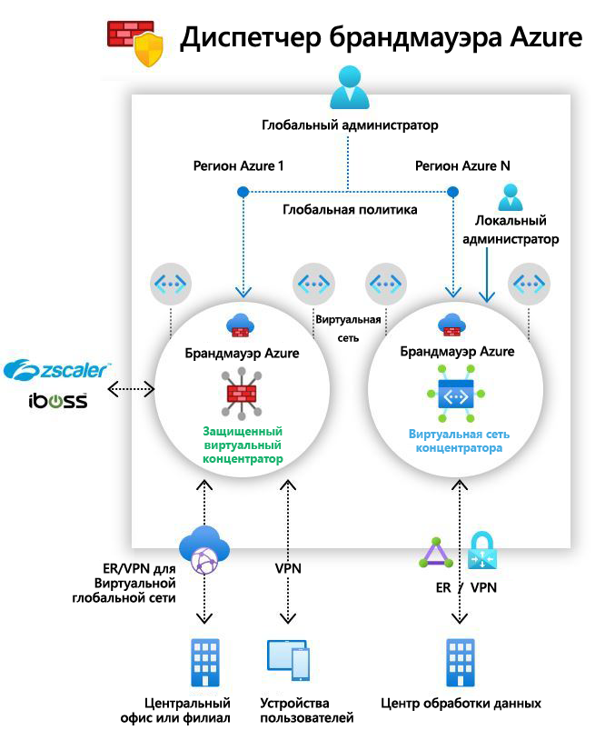

# Что такое предварительная версия Диспетчера брандмауэра Azure?

[!INCLUDE [Preview](../../includes/firewall-manager-preview-notice.md)]

Диспетчер брандмауэра Azure (предварительная версия) — это служба, обеспечивающая централизованное управление маршрутизацией и политиками защиты для облачных периметров безопасности. 

Диспетчер брандмауэра обеспечивает управление безопасностью для двух типов архитектуры сети:

- **Защищенный виртуальный концентратор**.

   [Концентратор Виртуальной глобальной сети Azure](../virtual-wan/virtual-wan-about.md#resources) — это управляемый корпорацией Майкрософт ресурс, который позволяет легко создавать звездообразные архитектуры. Если с этим концентратором связаны политики безопасности и маршрутизации, он называется *[защищенным виртуальным концентратором](secured-virtual-hub.md)* . 
- **Центральная виртуальная сеть**.

   Это стандартная виртуальная сеть Azure, которую вы создаете и которой управляете самостоятельно. Если с таким концентратором связаны политики безопасности, он называется *центральной виртуальной сетью*. В настоящее время поддерживается только политика брандмауэра Azure. Можно также создать периферийные виртуальные сети, содержащие серверы рабочей нагрузки и службы. Вы также можете управлять брандмауэрами в автономных виртуальных сетях, не являющихся одноуровневыми для любого периферийного узла.

Подробное сравнение таких типов архитектуры, как *защищенный виртуальный концентратор* и *центральная виртуальная сеть*, см. в [этой статье](vhubs-and-vnets.md).

## Возможности предварительной версии Диспетчера брандмауэра Azure

Предварительная версия Диспетчера брандмауэра Azure предлагает следующие функции.

### Централизованное развертывание и настройка Брандмауэра Azure

Вы можете централизованно развертывать и настраивать несколько экземпляров Брандмауэра Azure, охватывающих разные регионы и подписки Azure. 

### Иерархические политики (глобальные и локальные)

С помощью предварительной версии Диспетчера брандмауэра Azure можно централизованно управлять политиками Брандмауэра Azure в нескольких защищенных виртуальных концентраторах. Центральный ИТ-отдел может создавать глобальные политики брандмауэра, применяемые в масштабе всей организации. Локально создаваемые политики брандмауэра обеспечивают модель самообслуживания DevOps для повышения гибкости.

### Интеграция со сторонними решениями "безопасность как услуга" для усиления защиты

В дополнение к Брандмауэру Azure можно интегрировать решения "безопасность как услуга" (SECaaS) сторонних поставщиков, чтобы лучше защитить виртуальные сети и подключения филиалов к Интернету.

Эта функция доступна только в средах защищенных виртуальных концентраторов.

- Фильтрация трафика из виртуальной сети в Интернет

   - Фильтруйте исходящий трафик виртуальной сети с помощью предпочтительного стороннего поставщика безопасности.
   - Используйте расширенную защиту интернет-трафика с учетом пользователей для облачных рабочих нагрузок в Azure.

- Фильтрация трафика из филиалов в Интернет

   Используйте возможности подключения и глобального распространения Azure, чтобы легко добавить сторонние фильтры для трафика филиалов в Интернет.

Дополнительные сведения о доверенных партнерах по безопасности см. в статье [Что такое доверенные партнеры по безопасности Диспетчера брандмауэра Azure (предварительная версия)?](trusted-security-partners.md)

### Централизованное управление маршрутами

Легко маршрутизируйте трафик в защищенный концентратор для фильтрации и ведения журналов без необходимости вручную настраивать пользовательские маршруты в периферийных виртуальных сетях. 

Эта функция доступна только в средах защищенных виртуальных концентраторов.

Вы можете использовать решения сторонних поставщиков для фильтрации трафика из филиалов в Интернет параллельно с Брандмауэром Azure для трафика из филиалов в виртуальную сеть, между виртуальными сетями и из виртуальной сети в Интернет. Кроме того, решения сторонних поставщиков можно использовать для фильтрации трафика из виртуальной сети в Интернет, если Брандмауэр Azure не требуется для трафика из филиалов в виртуальную сеть или между виртуальными сетями. 

## Доступность по регионам

Политики брандмауэра Azure можно использовать в разных регионах. Например, можно создать политику в западной части США и использовать ее в восточной части США. 

## Известные проблемы

Ниже описываются известные проблемы в предварительной версии Диспетчера брандмауэра Azure.

|Проблема  |Описание  |Меры по снижению риска  |
|---------|---------|---------|
|Ограничения сторонней фильтрации|Решения сторонних поставщиков для фильтрации трафика из виртуальной сети в Интернет нельзя использовать вместе с Брандмауэром Azure, применяемым для трафика из филиалов в виртуальную сеть или между виртуальными сетями.|Эта проблема изучается.|
|Разделение трафика в настоящее время не поддерживается|Разделение трафика Office 365 и общедоступной платформы PaaS Azure в настоящее время не поддерживается. Таким образом, при выборе стороннего поставщика для трафика из виртуальной сети или филиалов в Интернет весь трафик Office 365 и общедоступной платформы PaaS Azure также направляется через партнерскую службу.|В настоящее время исследуется возможность разделения трафика в концентраторе.
|Один защищенный виртуальный концентратор на регион|У вас не может быть несколько защищенных виртуальных концентраторов для одного региона|Создайте несколько виртуальных глобальных сетей в регионе.|
|Базовые политики должны находиться в том же регионе, что и локальная|Создавайте все локальные политики в том же регионе, в котором находится базовая политика. Тем не менее политику, созданную в одном регионе, можно применить к защищенному концентратору из другого региона.|Эта проблема изучается.|
|Обмен данными между концентраторами не работает с защищенным виртуальным концентратором|Связь между защищенными виртуальными концентраторами пока не поддерживается.|Эта проблема изучается.|
|Все защищенные виртуальные концентраторы, совместно использующие одну и ту же виртуальную глобальную сеть, должны находиться в одной группе ресурсов.|Сейчас это поведение соответствует концентраторам Виртуальной глобальной сети.|Создайте несколько Виртуальных глобальных сетей, чтобы разрешить создание защищенных виртуальных концентраторов в разных группах ресурсов.|
|Политика брандмауэра не поддерживает IP-группы|IP-группы доступны в общедоступной предварительной версии и в настоящее время поддерживаются только традиционными правилами брандмауэра.|Идет исправление

## Дальнейшие действия

- Ознакомьтесь с [общими сведениями о развертывании предварительной версии Диспетчера брандмауэра Azure](deployment-overview.md).
- Сведения о [защищенных виртуальных концентраторах](secured-virtual-hub.md).