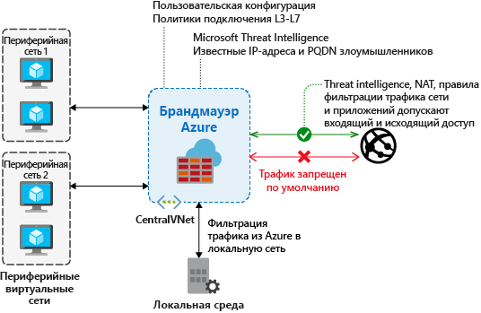

# Что такое брандмауэр Azure?

Брандмауэр Azure — это управляемая облачная служба сетевой безопасности, которая защищает ресурсы виртуальной сети Azure. Брандмауэр разработан как служба с полным отслеживанием состояния со встроенной высокой доступностью и неограниченной облачной масштабируемостью. 

Вы можете централизованно создавать, применять и регистрировать политики приложений и сетевых подключений в подписках и виртуальных сетях. Брандмауэр Azure использует статический общедоступный IP-адрес для виртуальных сетевых ресурсов, позволяя внешним брандмауэрам идентифицировать трафик, исходящий из виртуальной сети.  Служба полностью интегрирована с Azure Monitor для ведения журналов и аналитики.

## Функции

Брандмауэр Azure обеспечивает следующие функции.

### высокую доступность;

Встроен высокий уровень доступности, поэтому не требуются дополнительные подсистемы балансировки нагрузки и ничего не нужно настраивать.

### неограниченную облачную масштабируемость;

Брандмауэр Azure может увеличивать масштаб настолько, насколько это необходимо для изменения потоков сетевого трафика, поэтому нет необходимости выделять бюджет для пикового трафика.

### Правила фильтрации FQDN для приложений

Можно ограничить исходящий трафик HTTP или HTTPS указанным списком полных доменных имен (FQDN), включая подстановочные знаки. Эта функция не требует завершения SSL-запросов.

### правила фильтрации трафика;

Можно централизованно создавать *разрешение* или *запрет* правил сетевой фильтрации по исходному и целевому IP-адресу, порту и протоколу. Брандмауэр Azure полностью отслеживает состояние, поэтому он может различать правомерные пакеты для разных типов подключений. Правила применяются и регистрируются в нескольких подписках и виртуальных сетях.

### теги FQDN;

Теги FQDN помогают разрешать прохождение трафика известных служб Azure через брандмауэр. К примеру, вам нужно, чтобы брандмауэр пропускал трафик Центра обновления Windows. Вы создаете правило приложения и добавляете тег Центра обновления Windows. Теперь трафик из Центра обновления Windows сможет проходить через брандмауэр.

### Теги служб

Тег службы представляет группу префиксов IP-адресов, чтобы упростить создание правила безопасности. Нельзя создать собственный тег службы или задать IP-адреса, которые будут входить в тег. Корпорация Майкрософт управляет префиксами адресов, входящих в тег службы, и автоматически обновляет этот тег при изменении адресов.

### Анализ угроз

Фильтрация на основе Microsoft Threat Intelligence может быть включена в брандмауэре с целю создания оповещений и запрета трафика, поступающего с известных вредоносных IP-адресов и доменов, а также передающегося на них. IP-адреса и домены также передаются из канала Microsoft Threat Intelligence.

### поддержку исходящих данных SNAT;

Все исходящие IP-адреса виртуального трафика преобразовываются к общедоступному IP-адресу брандмауэра Azure (преобразование исходных сетевых адресов (NAT)). Можно определить и разрешить трафик, исходящий из виртуальной сети, к удаленным интернет-адресатам.

### Поддержка DNAT для входящего трафика

Входящий трафик, поступающий на общедоступный IP-адрес брандмауэра, преобразуется (этот процесс называется преобразованием сетевых адресов назначения — DNAT) и фильтруется по частным IP-адресам в виртуальных сетях. 

### ведение журналов Azure Monitor;

Все события интегрируются с Azure Monitor, позволяя архивировать журналы в учетную запись хранения, передавать события в концентратор событий или отправлять их в журналы Azure Monitor.

## Известные проблемы

В брандмауэре Azure существуют следующие известные проблемы.

|Проблема  |ОПИСАНИЕ  |Устранение  |
|---------|---------|---------|
|Конфликт компонента JIT центра безопасности Azure (ASC)|Если виртуальная машина имеет доступ с помощью JIT и находится в подсети с определенным пользователем маршрутом, который указывает на брандмауэр Azure в качестве шлюза по умолчанию, то JIT ASC не будет работать. Это результат асимметричной маршрутизации: пакет поступает через общедоступный IP-адрес виртуальной машины (JIT открыл доступ), но путь возврата проходит через брандмауэр, который удаляет пакет, потому что на брандмауэре нет установленного сеанса.|Чтобы обойти эту проблему, поместите виртуальные машины JIT в отдельную подсеть, которая не имеет определенного пользователем маршрута к брандмауэру.|
Правила сетевой фильтрации для протоколов, которые отличаются от TCP или UDP (например, ICMP), не работают для трафика, связанного с Интернетом|Правила сетевой фильтрации для протоколов, которые отличаются от TCP или UDP, не работают со SNAT для общедоступных IP-адресов. Протоколы, которые отличаются от TCP или UDP, поддерживаются между периферийными зонами подсетей и виртуальной сетью.|Брандмауэр Azure использует Load Balancer (цен. категория "Стандартный"), [который сейчас не поддерживает SNAT для IP-протоколов](https://docs.microsoft.com/azure/load-balancer/load-balancer-standard-overview#limitations). Изучаются варианты поддержки этого сценария в будущем выпуске.|
|В PowerShell и CLI отсутствует поддержка протокола ICMP|Azure PowerShell и CLI не поддерживают ICMP как допустимый протокол в правилах сети.|Протокол ICMP по-прежнему можно использовать с помощью портала и REST API. Мы добавим поддержку ICMP в PowerShell и CLI в ближайшее время.|
|Для тегов FQDN требуется указать протокол порта|Для правила приложения с тегами FQDN требуется указать определение протокола порта.|В качестве значения протокола порта можно использовать **HTTPS**. Мы планируем сделать это поле необязательным при использовании тегов FQDN.|
|Не поддерживается перемещение брандмауэра в другую группу ресурсов или подписку.|Не поддерживается перемещение брандмауэра в другую группу ресурсов или подписку.|Мы планируем реализовать эту функцию. Чтобы переместить брандмауэр в другую группу ресурсов или подписку, нужно удалить текущий экземпляр и повторно создать его в новой группе ресурсов или подписке.|
|Диапазон портов в правилах сети и приложений|Максимальное количество портов составляет 64000, так как порты с большим номером резервируются для управления и проб работоспособности. |Мы планируем ослабить это ограничение.|
|Оповещения Threat Intelligence могут быть замаскированы.|Правила сети, настроенные на режим только предупреждения и назначенные на порт 80/443 для исходящей фильтрации, маскируют предупреждения аналитики угроз.|С помощью правил приложения создайте фильтрацию исходящего трафика для порта 80/443. Или измените режим аналитики угроз на **Alert and Deny** (Оповещение и отказ).|
|Брандмауэр Azure использует Azure DNS только для разрешения имен.|Брандмауэр Azure разрешает полные доменные имена только с помощью Azure DNS. Пользовательский DNS-сервер не поддерживается. Это не влияет на разрешение DNS в других подсетях.|Мы планируем ослабить это ограничение.
## Дополнительная информация

- [Руководство по развертыванию и настройке службы "Брандмауэр Azure" с помощью портала Azure](tutorial-firewall-deploy-portal.md)
- [Deploy Azure Firewall using a template](deploy-template.md) (Развертывание службы "Брандмауэр Azure" с помощью шаблона)
- [Create an Azure Firewall test environment](scripts/sample-create-firewall-test.md) (Создание тестовой среды службы "Брандмауэр Azure")