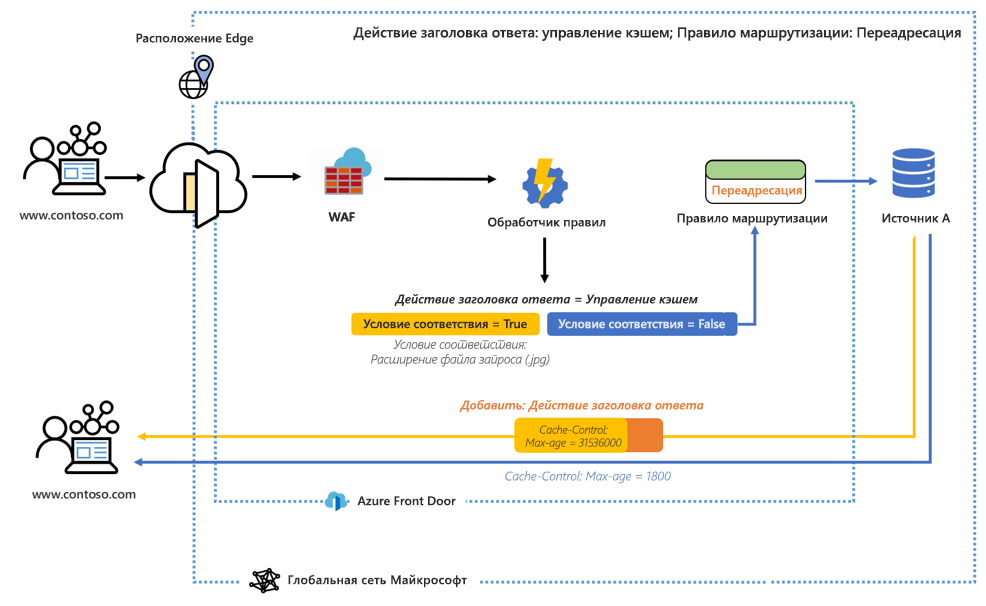
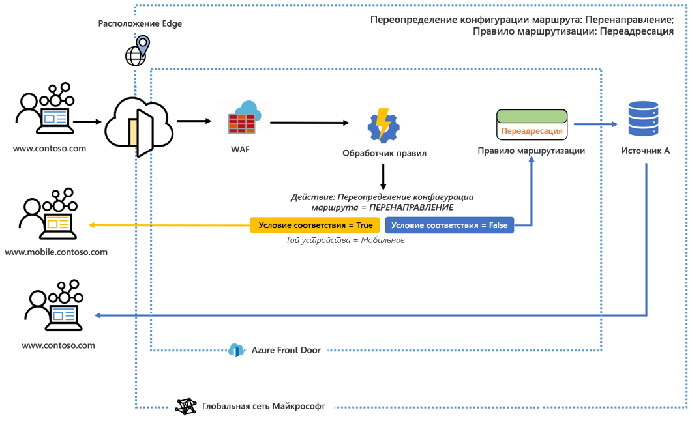

# Что такое обработчик правил для Azure Front Door? 

Обработчик правил позволяет настроить обработку HTTP-запросов в пограничной среде и обеспечивает более полный контроль над поведением веб-приложения. Обработчик правил для Azure Front Door выполняет несколько важных функций, в том числе следующие:

* Применение протокола HTTPS, чтобы все пользователи могли взаимодействовать с вашим содержимым через безопасное подключение.
* Реализация заголовков безопасности, чтобы предотвратить возникновение уязвимостей в браузере, например HTTP Strict-Transport-Security (HSTS), X-XSS-Protection, Content-Security-Policy и X-Frame-Options, а также Access-Control-Allow-Origin в сценариях CORS. Атрибуты для системы безопасности можно также определять с помощью файлов cookie.
* Направление запросов к мобильным или классическим приложениям на основе шаблонов по содержимому заголовков запросов, файлов cookie или строк запросов.
* Использование возможностей перенаправления для возврата перенаправлений 301, 302, 307 и 308 клиенту, чтобы направить их на другие имена узлов, пути или протоколы.
- Динамическое изменение конфигурации кэширования маршрута на основе входящих запросов.
- Перезапись пути URL-адреса запроса и пересылка запроса в соответствующую серверную часть в настроенном внутреннем пуле.

## Architecture 

Обработчик правил обрабатывает запросы в пограничной среде. Когда запрос достигает конечной точки Front Door, сначала будет запущен WAF, за которым следует конфигурация обработчика правил, связанная с интерфейсом или доменом. Если выполняется конфигурация обработчика правил, значит условия родительского правила маршрутизации уже выполнены. Чтобы выполнялись все действия в каждом правиле, должны быть удовлетворены все условия соответствия в правиле. Если запрос не соответствует хотя бы одному из условий в конфигурации подсистемы правил, выполняется правило маршрутизации по умолчанию. 

Например, на следующей схеме для обработчика правил настроено добавление заголовка ответа. Если условие соответствия выполняется, заголовок изменяет максимальный возраст элемента управления кэшем. 

В другом примере мы видим, что обработчик правил настроен на отправку пользователю мобильной версии сайта, если условие соответствия, тип устройства, имеет значение true. 

В обоих примерах, когда ни одно из условий соответствия не соблюдается, указанное правило маршрута будет выполняться. 

## Терминология 

С помощью обработчика правил AFD можно создать для обработчика правил набор конфигураций, каждая из которых состоит из набора правил. Ниже приведена полезная терминология, которую вы будете использовать при настройке обработчика правил. 

- *Конфигурации обработчика правил*. Набор правил, применяемых к одному правилу маршрутизации. Каждая конфигурация ограничена 25 правилами. Вы можете создать до 10 конфигураций. 
- *Правило обработчика правил*. Правило, состоящее из не более 10 условий соответствия и 5 действий.
- *Условие соответствия* Существует много условий соответствия, которые можно использовать для анализа входящих запросов. Правило может содержать до 10 условий соответствия. Условия соответствия оцениваются с помощью оператора **AND**. Полный список условий соответствия можно найти [здесь](front-door-rules-engine-match-conditions.md). 
- *Action* (Действие). Действия определяют, что происходит со входящими запросами. На сегодня доступны действия в заголовке запроса или ответа, переадресация, перенаправление и перезапись. Правило может содержать до пяти действий, но только одно из них может быть переопределением конфигурации маршрутов.  Полный список действий можно найти [здесь](front-door-rules-engine-actions.md).

## Дальнейшие действия

- Узнайте, как настроить свою первую [конфигурацию обработчика правил](front-door-tutorial-rules-engine.md). 
- Дополнительные сведения о [создании Front Door](quickstart-create-front-door.md).
- Дополнительные сведения о том, [как работает Front Door](front-door-routing-architecture.md).
