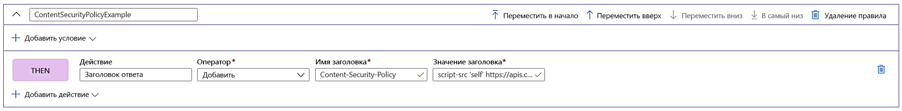

# Добавление заголовков безопасности с помощью обработчика правил

Чтобы предотвратить возникновение уязвимостей в браузере, реализуйте заголовки безопасности, например HTTP Strict-Transport-Security (HSTS), X-XSS-Protection, Content-Security-Policy или X-Frame-Options. Атрибуты для системы безопасности можно также определять с помощью файлов cookie.

В следующем примере показано, как добавлять заголовок Content-Security-Policy ко всем входящим запросам, соответствующим определенному в маршруте пути, с которым связана конфигурация обработчика правил. В этом примере мы разрешим выполнение скриптов в приложении только с доверенного сайта **https://apis.contoso.com** .

## Добавление заголовка Content-Security-Policy на портале Azure

1. Прежде чем создавать это правило, изучите статью о [создании Front Door](quickstart-create-front-door.md) или о [создании обработчика правил](front-door-tutorial-rules-engine.md), если вы впервые используете Azure Front Door или компонент обработчика правил.

2. Щелкните **Добавить**, чтобы добавить новое правило. Введите имя для правила и щелкните **Добавить действие** > **Заголовок ответа**.

3. Для параметра "Оператор" укажите значение **Добавить**, чтобы добавлять этот заголовок в ответ на все входящие запросы по указанному маршруту.

4. Добавьте имя заголовка **Content-Security-Policy** и определите значения, которые будет принимать этот заголовок. В нашем примере это *"script-src 'self' https://apis.contoso.com."*

5. Завершив добавление всех правил, которые нужны для вашей конфигурации, обязательно перейдите по нужному маршруту и сопоставьте конфигурацию обработчика правил с правилом для этого маршрута. Этот шаг позволяет включить настроенное правило. 

> [!NOTE]
> В нашем примере к правилу не добавляются [условия соответствия](front-door-rules-engine-match-conditions.md). Это означает, что правило будет применяться ко всем входящим запросам, соответствующим пути, указанному в правиле маршрута. Если вы хотите применять его к некоторому подмножеству этих запросов, добавьте нужные условия соответствия в это правило.

## Дальнейшие действия

- Дополнительные сведения об [обработчике правил AFD](front-door-rules-engine.md). 
- Дополнительные сведения о [создании Front Door](quickstart-create-front-door.md).
- Дополнительные сведения о том, [как работает Front Door](front-door-routing-architecture.md).
- Дополнительные сведения см. в статье [Условия соответствия для обработчика правил Azure Front Door](front-door-rules-engine-match-conditions.md).
- Ознакомьтесь с дополнительными сведениями об обработчике правил AFD см. в [справочнике по CLI](https://docs.microsoft.com/cli/azure/ext/front-door/network/front-door/rules-engine?view=azure-cli-latest). 
- Ознакомьтесь с дополнительными сведениями об обработчике правил AFD в [справочнике по PowerShell](https://docs.microsoft.com/powershell/module/az.frontdoor/?view=azps-3.8.0). 
