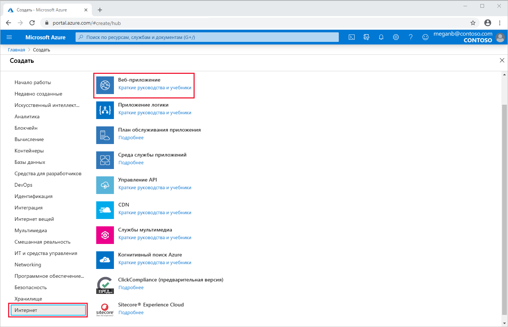
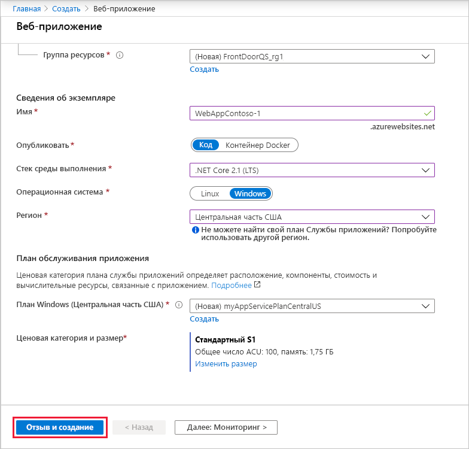
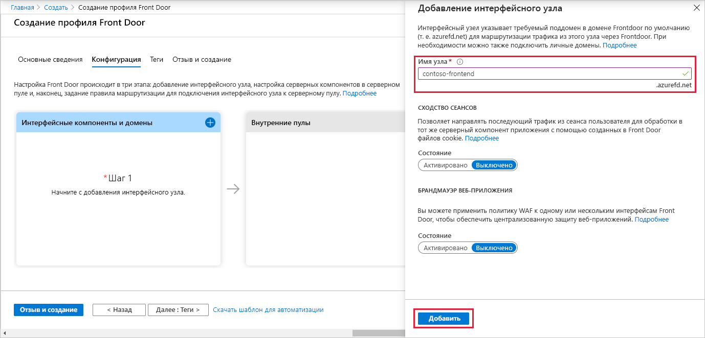
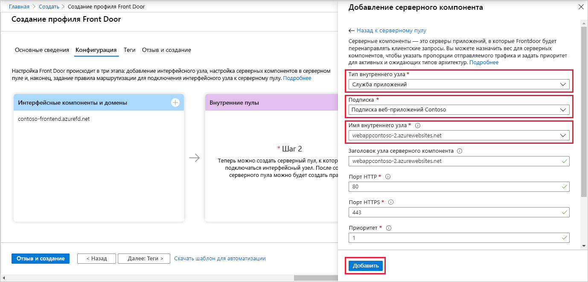
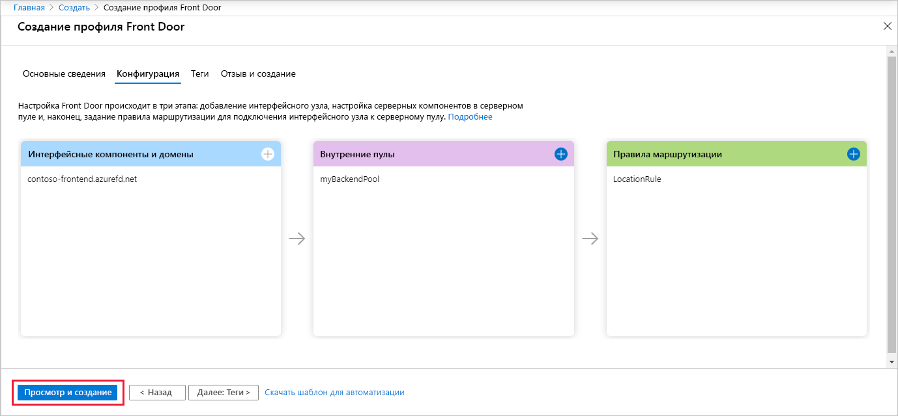
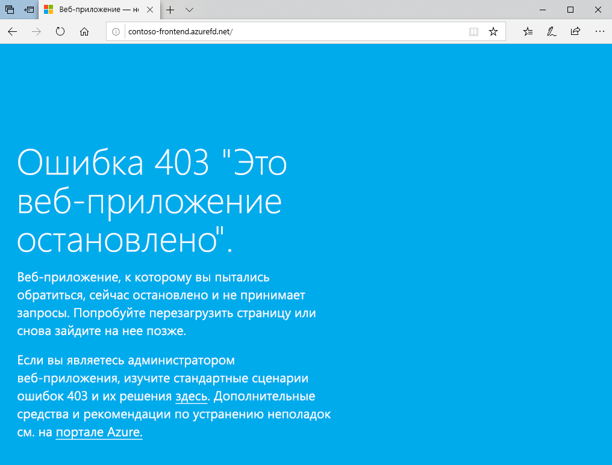

# Краткое руководство. Создание службы Front Door для глобального веб-приложения высокого уровня доступности

Начало работы с Azure Front Door: обеспечение высокого уровня доступности для веб-приложения с помощью портала Azure.

В этом кратком руководстве Azure Front Door объединяет два экземпляра веб-приложения, которые выполняются в разных регионах Azure. Конфигурация Front Door основана на серверных частях с одинаковыми приоритетами и весовыми коэффициентами. Такая конфигурация направляет трафик на тот сайт с приложением, который расположен ближе всего к пользователю. Azure Front Door постоянно отслеживает работу веб-приложения. Эта служба обеспечивает автоматическую отработку отказа на следующий доступный сайт, когда ближайший сайт становится недоступным.

## Предварительные требования

- Учетная запись Azure с активной подпиской. [Создайте учетную запись](https://azure.microsoft.com/free/?WT.mc_id=A261C142F) бесплатно.

## Создание двух экземпляров веб-приложения

Для этого краткого руководства потребуются два экземпляра веб-приложения, которые выполняются в разных регионах Azure. Оба экземпляра этого веб-приложения работают в режиме *активный — активный*, то есть любой из них будет принимать трафик. Эта конфигурация отличается от конфигурации *активный — резервный*, когда один из экземпляров используется только для отработки отказа.

Если у вас нет веб-приложения, создайте его, как показано ниже.

1. Войдите на портал Azure по адресу https://portal.azure.com.

1. На домашней странице или в меню Azure выберите **Создать ресурс**.

1. Щелкните **Веб** > **Веб-приложение**.

   

1. В разделе **Веб-приложение** выберите значение **Подписка**.

1. Для параметра **Группа ресурсов** выберите **Создать**. Введите строку *FrontDoorQS_rg1* в поле **Имя** и щелкните **OK**.

1. В разделе **Сведения об экземпляре** введите уникальное **Имя** для этого веб-приложения. В нашем примере это *WebAppContoso-1*.

1. Выберите **Стек среды выполнения**, в нашем примере это *.NET Core 2.1 (LTS)* .

1. Выберите регион, например *Центральная часть США*.

1. В поле **План Windows** выберите **Создать новый**. Введите *myAppServicePlanCentralUS* в поле **Имя** и щелкните **OK**.

1. Для параметра **Номер SKU и размер** должно быть выбрано значение **"Стандартный" S1, общее число ACU — 100, 1,75 ГБ памяти**.

1. Щелкните **Просмотр и создание**, проверьте раздел **Сводка** и щелкните **Создать**. Развертывание может занять несколько минут.

   

Когда развертывание завершится, создайте второе веб-приложение. Повторите ту же процедуру с теми же значениями, за исключением следующих.

| Параметр          | Значение     |
| ---              | ---  |
| **Группа ресурсов**   | Выберите **Создать** и введите *FrontDoorQS_rg2* |
| **имя**;             | Введите для веб-приложения уникальное имя, в нашем примере это *WebAppContoso-2*.  |
| **Регион**           | В нашем примере это *Центрально-южная часть США*. |
| **План службы приложений** > **План Windows**.         | Выберите **Создать новый** и введите *myAppServicePlanSouthCentralUS*, а затем щелкните **OK**. |

## Создание профиля Front Door для приложения

Создайте в Azure Front Door конфигурацию, которая распределяет трафик пользователей между двумя серверами веб-приложений на основе минимальных значений задержки. Для начала добавьте интерфейсный узел для Azure Front Door.

1. На домашней странице или в меню Azure выберите **Создать ресурс**. Щелкните **Сеть** > **Front Door**.

1. В разделе **Создание профиля Front Door** выберите **Подписка**.

1. В поле **Группа ресурсов** выберите **Создать новую**, затем введите значение *FrontDoorQS_rg0* и щелкните **OK**.  Вместо этого вы можете использовать существующую группу ресурсов.

1. Если вы создаете группу ресурсов, выберите **Расположение группы ресурсов** и щелкните **Далее: конфигурация**.

1. В разделе **Интерфейсные серверы и домены** выберите **+** , чтобы открыть раздел **Добавление интерфейсного узла**.

1. Введите глобально уникальное имя узла в поле **Имя узла**. В нашем примере это *contoso-frontend*. Выберите **Добавить**.

   

Затем создайте внутренний пул, содержащий два веб-приложения.

1. В том же разделе **Создание профиля Front Door** выберите в поле **Внутренние пулы** значение **+** , чтобы открыть раздел **Добавление внутреннего пула**.

1. В поле **Имя** введите *myBackEndPool*.

1. Щелкните **Добавить внутренний компонент**. В раскрывающемся списке **Тип внутреннего узла** выберите *Служба приложений*.

1. Выберите свою подписку, а затем в поле **Имя внутреннего узла** выберите первое из созданных веб-приложений. В нашем примере это веб-приложение *WebAppContoso-1*. Выберите **Добавить**.

1. Снова щелкните **Добавление внутреннего компонента**. В раскрывающемся списке **Тип внутреннего узла** выберите *Служба приложений*.

1. Снова выберите подписку, а затем второе из созданных веб-приложений в поле **Имя внутреннего узла**. Выберите **Добавить**.

   

Осталось добавить правило маршрутизации. Это правило маршрутизации сопоставляет интерфейсный узел с внутренним пулом. Правило перенаправляет запросы к адресу `contoso-frontend.azurefd.net` на **myBackendPool**.

1. В том же разделе **Создание профиля Front Door** выберите в разделе **Правила маршрутизации** значение **+** , чтобы настроить правило маршрутизации.

1. В разделе **Добавить правило** введите в поле **Имя** значение *LocationRule*. Сохраните все значения по умолчанию и щелкните **Добавить**, чтобы добавить правило маршрутизации.

   >[!WARNING]
   > **Обязательно** убедитесь, что каждый из интерфейсных узлов в службе Front Door имеет связанное правило маршрутизации с путем по умолчанию (`\*`). Это означает, что среди всех правил маршрутизации должно быть по крайней мере одно правило для каждого из интерфейсных узлов, определенных в пути по умолчанию (`\*`). В противном случае трафик пользователей может маршрутизироваться неправильно.

1. Выберите **Просмотр и создание**, а затем щелкните **Создать**.

   

## Проверка работы Azure Front Door

После создания экземпляра Front Door потребуется несколько минут, чтобы конфигурация была развернута глобально. После завершения перейдите к созданному вами интерфейсному узлу. Для этого откройте в браузере адрес `contoso-frontend.azurefd.net`. Ваш запрос будет автоматически направлен на ближайший к вам сервер из настроенного ранее внутреннего пула с указанными серверами.

Если вы использовали приложения, предложенные для этого быстрого руководства, вы увидите информационную страницу.

Чтобы проверить мгновенную глобальную отработку отказа, сделайте следующее.

1. Откройте браузер и перейдите по следующему адресу интерфейсной части: `contoso-frontend.azurefd.net`.

1. На портале Azure найдите и выберите *Службы приложений*. Прокрутите страницу вниз до одного из настроенных веб-приложений, в нашем примере это **WebAppContoso-1**.

1. Выберите это веб-приложение, щелкните **Остановить** и подтвердите действие, щелкнув **Да**.

1. Обновите страницу в браузере. Вы увидите ту же самую информационную страницу.

   >[!TIP]
   >Но эти действия могут выполняться с небольшой задержкой. Возможно, нужно будет обновить страницу еще раз.

1. Теперь найдите и остановите второе приложение.

1. Обновите страницу в браузере. На этот раз вы увидите сообщение об ошибке.

   

## Очистка ресурсов

После завершения работы вы можете удалить все созданные элементы. При удалении группы ресурсов полностью удаляется ее содержимое. Если вам больше не нужна эта служба Front Door, удалите все ее ресурсы, чтобы избежать лишних расходов.

1. На портале Azure найдите и выберите элемент **Группы ресурсов** или щелкните **Группы ресурсов** в меню портала Azure.

1. Примените фильтр или прокрутите список, чтобы найти нужную группу ресурсов, в нашем примере это **FrontDoorQS_rg0**.

1. Выберите эту группу ресурсов и щелкните **Удалить группу ресурсов**.

   >[!WARNING]
   >Это действие невозможно отменить.

1. Введите имя группы ресурсов для подтверждения и щелкните **Удалить**.

Повторите эту процедуру для двух других групп.

## Дальнейшие действия

Теперь вы можете переходить к следующей статье, где описано добавление личного домена в Front Door.
> [!div class="nextstepaction"]
> [Добавить личный домен](front-door-custom-domain.md)
