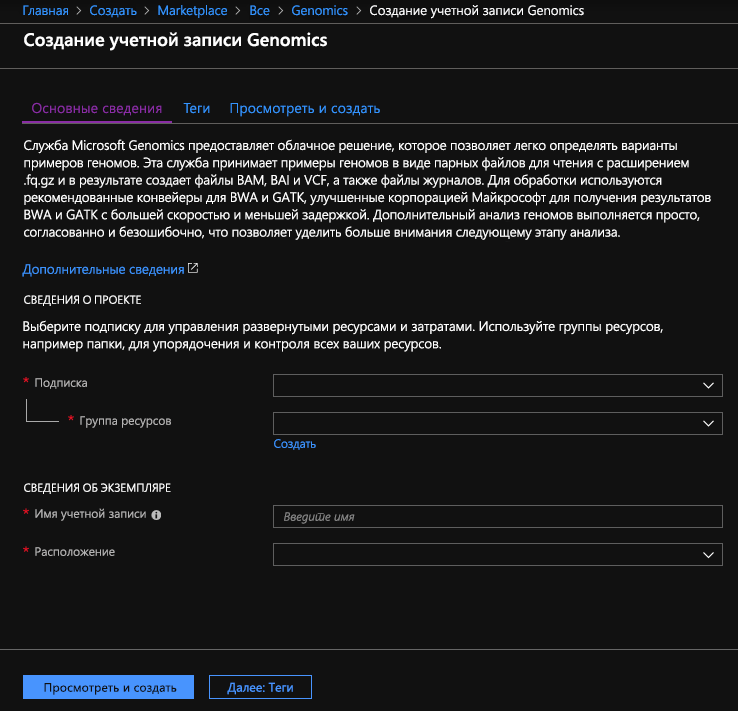
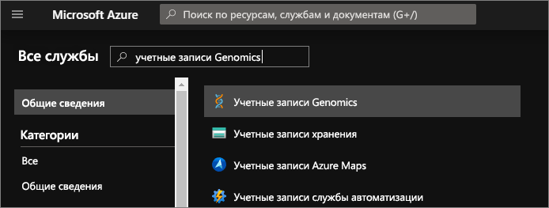
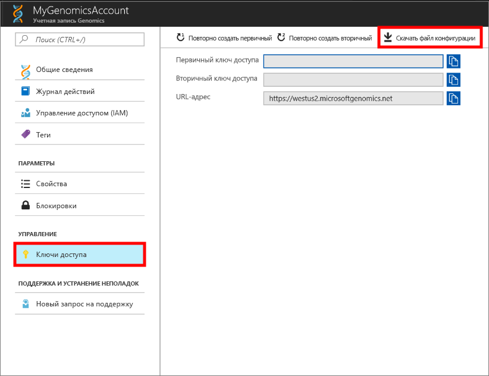
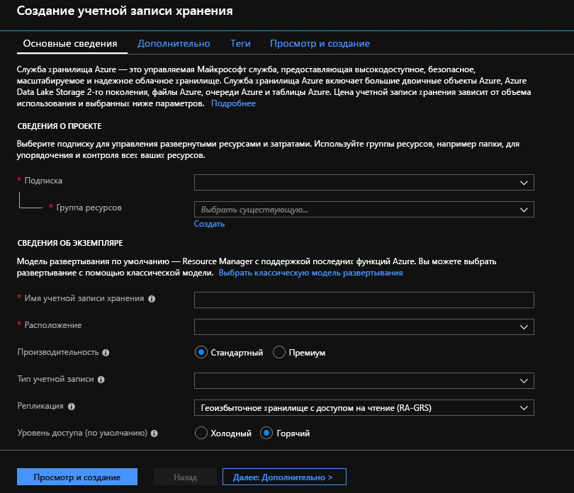

# <a name="quickstart-run-a-workflow-through-the-microsoft-genomics-service"></a>Краткое руководство. Запуск рабочего процесса в службе Microsoft Genomics

В этом кратком руководстве вы отправите входные данные в учетную запись службы "Хранилище BLOB-объектов Azure" и запустите рабочий процесс через службу Microsoft Genomics с помощью клиента Python Genomics. Microsoft Genomics — это масштабируемая надежная служба вторичного анализа, которая может быстро обрабатывать геном, начиная с простых операций чтения до выполнения согласованного считывания и вызовов вариантов. 

## <a name="prerequisites"></a>Предварительные требования

- Учетная запись Azure с активной подпиской. [Создайте учетную запись](https://azure.microsoft.com/free/?ref=microsoft.com&utm_source=microsoft.com&utm_medium=docs&utm_campaign=visualstudio) бесплатно. 
- [Python версии 2.7.12+](https://www.python.org/downloads/release/python-2714/), с установленным `pip` и `python` в системном пути. Клиент Microsoft Genomics не совместим с Python 3. 

## <a name="set-up-create-a-microsoft-genomics-account-in-the-azure-portal"></a>Настройка. Создание учетной записи Microsoft Genomics на портале Azure

Чтобы создать учетную запись Microsoft Genomics, перейдите на [страницу создания учетной записи Genomics](https://portal.azure.com/#create/Microsoft.Genomics) на портале Azure. Если у вас нет подписки Azure, создайте ее, прежде чем создавать учетную запись Microsoft Genomics. 



Настройте учетную запись Genomics, указав следующую информацию, как показано на предыдущем рисунке. 

 |**Параметр**          |  **Рекомендуемое значение**  | **Описание поля** |
 |:-------------       |:-------------         |:----------            |
 |Подписка         | Имя вашей подписки|Это единица выставления счетов для служб Azure. Дополнительные сведения см. на странице [подписок](https://account.azure.com/Subscriptions) |      
 |Группа ресурсов       | MyResourceGroup       |  Группы ресурсов позволяют объединить несколько ресурсов Azure (учетная запись хранения, учетная запись Genomics и т. д.) в одну группу для простоты управления. Дополнительные сведения см. в разделе [Группы ресурсов](https://docs.microsoft.com/azure/azure-resource-manager/resource-group-overview#resource-groups). Допустимые имена групп ресурсов см. в статье [Соглашения об именовании](/azure/architecture/best-practices/resource-naming). |
 |Имя учетной записи         | MyGenomicsAccount     |Выберите уникальный идентификатор учетной записи. Допустимые имена см. в статье [Соглашения об именовании](/azure/architecture/best-practices/resource-naming). |
 |Расположение                   | западная часть США 2                    |    Служба доступна в таких регионах: западная часть США 2, Западная Европа и Юго-Восточная Азия. |

В строке меню вверху выберите пункт **Уведомления**, чтобы отслеживать процесс развертывания.


Дополнительные сведения о Microsoft Genomics см. [Что такое Microsoft Genomics?](overview-what-is-genomics.md)

## <a name="set-up-install-the-microsoft-genomics-python-client"></a>Настройка. Установка клиента Microsoft Genomics Python

Вам нужно установить в своей локальной среде два клиента: Python и Microsoft Genomics Python. 

### <a name="install-python"></a>Установка Python

Клиент Microsoft Genomics Python совместим с Python 2.7.12 или более поздней версией 2.7.xx. Предлагаемая версия — 2.7.14 Файл установки можно скачать [здесь](https://www.python.org/downloads/release/python-2714/). 

> [!IMPORTANT]
> Версия Python 3.x не совместима с версией Python 2.7.xx.  MSGen — это приложение Python 2.7. При выполнении MSGen убедитесь, что вы используете в своей среде Python версию Python 2.7.xx. При попытке использования MSGen с версией Python 3.x могут возникнуть ошибки.

### <a name="install-the-microsoft-genomics-client"></a>Установка клиента Microsoft Genomics

Используйте Python `pip`, чтобы установить клиент Microsoft Genomics `msgen`. В следующих инструкциях предполагается, что Python уже есть в системном пути. Если не удается распознать установку `pip`, добавьте Python и вложенную папку скриптов в системный путь.

```
pip install --upgrade --no-deps msgen
pip install msgen
```

Если вы не хотите устанавливать `msgen` как двоичный файл во всей системе и изменять пакеты Python во всей системе, используйте флаг `–-user` с `pip`.
Если вы выполняете установку с помощью пакетов или файла setup.py, устанавливаются все необходимые пакеты. Если вы выполняете установку иначе, базовые необходимые пакеты для `msgen` можно скачать по этим ссылкам: 

 * [Azure-storage](https://pypi.python.org/pypi/azure-storage); 
 * [Requests](https://pypi.python.org/pypi/requests). 

Эти пакеты также можно установить с помощью `pip`, `easy_install` или стандартной процедуры `setup.py`. 

### <a name="test-the-microsoft-genomics-client"></a>Тестирование клиента Microsoft Genomics
Чтобы протестировать клиент Microsoft Genomics, скачайте файл конфигурации из своей учетной записи Genomics. Перейдите к учетной записи Genomics на портале Azure, выберите пункт **Все службы** в левом верхнем углу, а затем найдите и выберите учетную запись Genomics.



Выберите учетную запись Genomics, которую вы только что создали, откройте раздел **Ключи доступа** и скачайте файл конфигурации.



Протестируйте работу клиента Microsoft Genomics Python с помощью следующей команды:

```Python
msgen list -f "<full path where you saved the config file>"
```

## <a name="create-a-microsoft-azure-storage-account"></a>Создание учетной записи хранения Microsoft Azure 
Служба Microsoft Genomics ожидает входные файлы в виде блочных BLOB-объектов в учетной записи хранения Azure. Она также записывает выходные файлы как блочные BLOB-объекты в определенный пользователем контейнер в учетной записи хранения Azure. Входные и выходные файлы могут находиться в разных учетных записях хранения.
Если в вашей учетной записи хранения Azure уже есть данные, вам нужно только убедиться, что она находится в том же расположении, что и учетная запись Genomics. Иначе при запуске службы Genomics вы будете платить за исходящий трафик. Если у вас еще нет учетной записи хранения Azure, необходимо создать ее и отправить туда данные. Дополнительные сведения об учетных записях хранения Azure см. [здесь](https://docs.microsoft.com/azure/storage/common/storage-create-storage-account). Из этой статьи вы узнаете, что такое учетная запись хранения и для чего она нужна. Чтобы создать учетную запись хранения Azure, перейдите на [страницу создания учетной записи](https://portal.azure.com/#create/Microsoft.StorageAccount-ARM) на портале Azure.  



Настройте учетную запись хранения, указав следующую информацию, как показано на предыдущем рисунке. Используйте стандартные параметры для учетной записи хранения. Укажите только, что она не является учетной записью общего назначения, а предназначена для хранилища BLOB-объектов. В хранилище BLOB-объектов операции скачивания или отправки могут выполняться в 2–5 раз быстрее.  Рекомендуется модель развертывания по умолчанию (Azure Resource Manager).  

 |**Параметр**          |  **Рекомендуемое значение**  | **Описание поля** |
 |:-------------------------       |:-------------         |:----------            |
 |Подписка         | Ваша подписка Azure. |Дополнительные сведения о подписках см. [здесь](https://account.azure.com/Subscriptions). |      
 |Группа ресурсов       | MyResourceGroup       |  Вы можете выбрать группу ресурсов, к которой относится учетная запись Genomics. Допустимые имена групп ресурсов см. в статье [Naming rules and restrictions for Azure resources](/azure/architecture/best-practices/resource-naming) (Правила и ограничения именования для ресурсов Azure) |
 |Имя учетной записи хранения         | MyStorageAccount     |Выберите уникальный идентификатор учетной записи. Допустимые имена см. в статье [Naming rules and restrictions for Azure resources](/azure/architecture/best-practices/resource-naming) (Правила и ограничения именования для ресурсов Azure) |
 |Расположение                  | западная часть США 2                  | Используйте то же расположение, что и для учетной записи Genomics, для сокращения расходов на исходящий трафик и уменьшения задержки при передаче данных.  | 
 |Производительность                  | Standard                   | По умолчанию используется уровень "Стандартный". Дополнительные сведения об учетных записях хранения уровня "Стандартный" и "Премиум" см. в статье [Introduction to Azure Storage](https://docs.microsoft.com/azure/storage/common/storage-introduction) (Введение в хранилище Microsoft Azure).    |
 |Тип учетной записи       | BlobStorage       |  В хранилище BLOB-объектов операции скачивания или отправки могут выполняться в 2–5 раз быстрее, чем в хранилище общего назначения. |
 |Репликация                  | Локально избыточное хранилище                  | Локально избыточное хранилище реплицирует ваши данные в центр данных в регионе, в котором создана учетная запись хранения. Дополнительные сведения см. в статье о [репликации службы хранилища Azure](https://docs.microsoft.com/azure/storage/common/storage-redundancy).    |
 |Уровень доступа                  | Горячий                   | Горячий уровень доступа означает, что доступ к объектам в учетной записи хранения будет осуществляться часто.    |

Щелкните **Review + create** (Просмотр и создание), чтобы создать учетную запись хранения. Как и во время создания учетной записи Genomics, вы можете выбрать значок **Уведомления** в строке меню вверху, чтобы отслеживать процесс развертывания. 

## <a name="upload-input-data-to-your-storage-account"></a>Передача входных данных в учетную запись хранения

Служба Microsoft Genomics ожидает в качестве входных файлов парные файлы для чтения (файлы fastq или bam). Вы можете отправить собственные данные или использовать общедоступные примеры данных. Если вы хотите использовать общедоступные примеры данных, вы найдете их по ссылкам ниже:

[https://msgensampledata.blob.core.windows.net/small/chr21_1.fq.gz](https://msgensampledata.blob.core.windows.net/small/chr21_1.fq.gz)
[https://msgensampledata.blob.core.windows.net/small/chr21_2.fq.gz](https://msgensampledata.blob.core.windows.net/small/chr21_2.fq.gz)

Создайте в своей учетной записи хранения один контейнер больших двоичных объектов для входных данных и еще один — для выходных данных.  Передайте входные данные в контейнер больших двоичных объектов. Для этого можно использовать различные инструменты, например [Обозреватель службы хранилища Microsoft Azure](https://azure.microsoft.com/features/storage-explorer/), [BlobPorter](https://github.com/Azure/blobporter) или [AzCopy](https://docs.microsoft.com/azure/storage/common/storage-use-azcopy?toc=%2fazure%2fstorage%2fblobs%2ftoc.json). 

## <a name="run-a-workflow-through-the-microsoft-genomics-service-using-the-python-client"></a>Запуск рабочего процесса в службе Microsoft Genomics с помощью Python 

Для запуска рабочего процесса в службе Microsoft Genomics измените файл *config.txt*, указав в нем контейнер хранилища входных и выходных данных.
Откройте файл *config.txt*, скачанный из учетной записи Genomics. Разделы, которые необходимо указать: ключ подписки и шесть элементов в конце файла (имя учетной записи хранения, ключ и имя контейнера для входных данных, имя учетной записи хранения, ключ и имя контейнера для выходных данных). Чтобы найти эти сведения, перейдите на портале в раздел **Ключи доступа** вашей учетной записи хранения или непосредственно в Обозреватель службы хранилища Azure.  


Если необходимо запустить GATK4, установите значение `gatk4` для параметра `process_name`.

Служба Genomics записывает файлы VCF по умолчанию. Если необходимо получить выходные данные в формате gVCF, а не VCF (эквивалентные `-emitRefConfidence` в GATK 3.x и `emit-ref-confidence` в GATK 4.x), добавьте параметр `emit_ref_confidence` в ваш *config.txt* и установите для него `gvcf`, как показано на рисунке, приведенном выше.  Чтобы изменить выходные данные VCF, удалите их из файла *config.txt* или установите для параметра `emit_ref_confidence` значение `none`. 

### <a name="submit-your-workflow-to-the-microsoft-genomics-service-the-microsoft-genomics-client"></a>Отправка рабочего процесса в клиент Microsoft Genomics службы Microsoft Genomics

Используйте клиент Microsoft Genomics Python для отправки рабочего процесса с помощью следующей команды:

```python
msgen submit -f [full path to your config file] -b1 [name of your first paired end read] -b2 [name of your second paired end read]
```

Чтобы просмотреть состояние рабочего процесса, используйте следующую команду: 
```python
msgen list -f c:\temp\config.txt 
```

После выполнения рабочего процесса вы можете просмотреть выходные файлы в контейнере выходных данных своей учетной записи хранения Azure. 

## <a name="next-steps"></a>Дальнейшие действия
С помощью инструкций из этой статьи вы научились отправлять примеры входных данных в службу хранилища Azure и отправлять рабочий процесс в службу Microsoft Genomics через клиент Python `msgen`. Дополнительные сведения о других типах входных файлов, которые могут использоваться в службе Microsoft Genomics, см. в статьях об отправке [парных FASTQ-файлов](quickstart-input-pair-FASTQ.md) | [BAM-файлов](quickstart-input-BAM.md) | [нескольких FASTQ- или BAM-файлов](quickstart-input-multiple.md). Кроме того, вы можете выполнить задачи в этом руководстве с помощью нашего [руководства службы "Записные книжки Azure"](https://aka.ms/genomicsnotebook).
