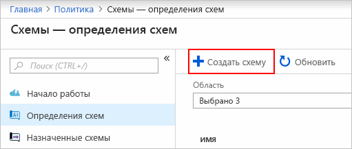
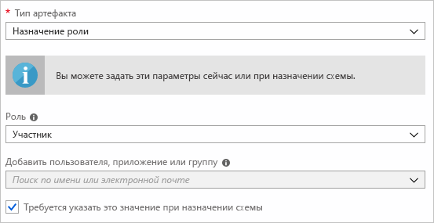
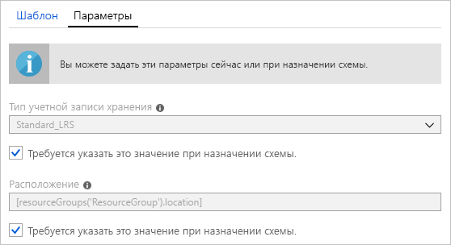
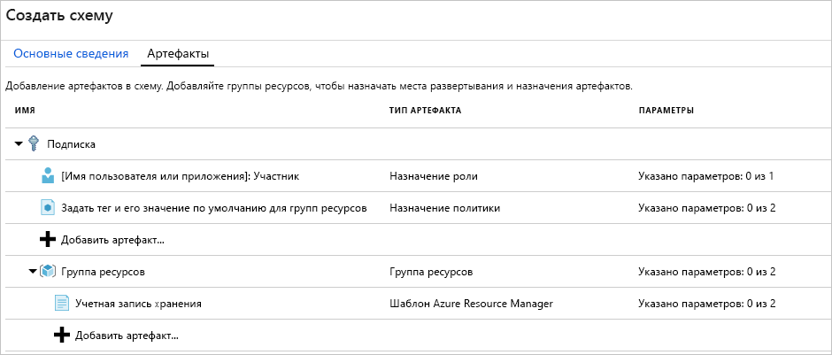
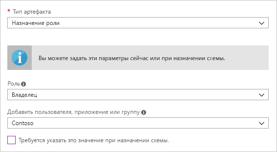
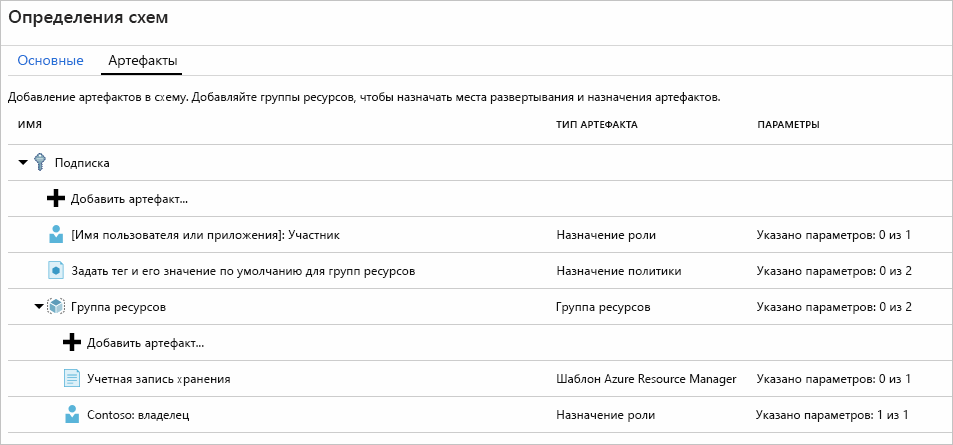
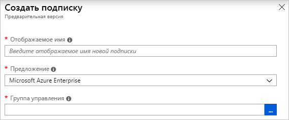
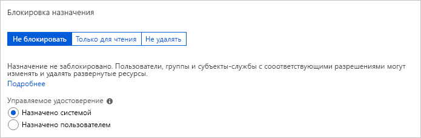
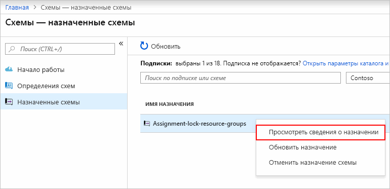

# <a name="quickstart-define-and-assign-a-blueprint-in-the-portal"></a>Краткое руководство. Определение и назначение схемы на портале

Когда вы узнаете, как создавать и назначать схемы, вы сможете определить типичные шаблоны для разработки многоразовых и быстро развертываемых конфигураций на основе шаблонов Resource Manager, политик, правил безопасности и т. п. Из этого руководства вы узнаете, как с помощью службы Azure Blueprints выполнять некоторые общие задачи, связанных с созданием, публикацией и назначением схемы в вашей организации. Сюда входят следующие задачи:

## <a name="prerequisites"></a>Предварительные требования

Если у вас еще нет подписки Azure, [создайте бесплатную учетную запись Azure](https://azure.microsoft.com/free), прежде чем начинать работу.

## <a name="create-a-blueprint"></a>Создание схемы

Первым этапом при определении стандартной модели соответствия требованиям является формирование схемы на основе доступных ресурсов. В этом примере вы создадите схему с именем **MyBlueprint**, чтобы настроить роли и назначения политик для подписки. Затем вы добавите группу ресурсов, создадите шаблон Resource Manager и назначение ролей для новой группы ресурсов.

1. Выберите **Все службы** в левой области. Найдите и выберите пункт **Схемы**.

1. Выберите **Определения схем** на странице слева и нажмите кнопку **+Создать схему** в верхней части страницы.

   Можно также щелкнуть **Создать** на странице **Приступая к работе**, чтобы перейти непосредственно к созданию схемы.

   

1. Укажите **имя схемы**, например **MyBlueprint** (здесь можно использовать до 48 букв и цифр, без пробелов и специальных символов). Поле **Описание схемы** пока оставьте пустым.

1. В поле **Расположение определения** щелкните многоточие справа, выберите [группу управления](../management-groups/overview.md) или подписку, в которой вы хотите сохранить схему, и щелкните **Выбрать**.

1. Убедитесь, что информация верна. Поля **Имя схемы** и **Расположение определения** нельзя будет изменить позже. Затем щелкните **Далее. артефакты** в нижней части страницы или вкладку **Артефакты** в верхней части страницы.

1. Добавьте назначение роли на уровне подписки.

   1. Выберите строку **+ Добавить артефакт** в разделе **Подписка**. Справа в окне браузера откроется окно **Добавление артефакта**.

   1. Выберите **Назначение ролей** в поле **Тип артефакта**.

   1. В поле **Роль** выберите **Участник**. Оставьте в поле **Добавить пользователя, приложение или группу** флажок, который обозначает динамический параметр.

   1. Нажмите кнопку **Добавить**, чтобы добавить артефакт в схему.

   

   > [!NOTE]
   > Большинство артефактов поддерживают параметры. Параметр, которому значение присваивается во время создания схемы, называется *статическим параметром*. Если значение параметра присваивается во время назначения схемы, это *динамический параметр*. Дополнительные сведения см. в описании [параметров схемы](./concepts/parameters.md).

1. Добавьте назначение политики на уровне подписки.

   1. Выберите строку **+ Добавить артефакт** под артефактом назначения ролей.

   1. Выберите **Назначение политик** в поле **Тип артефакта**.

   1. Для параметра **Тип** укажите **Встроенный**. В поле **Поиск** введите **тег**.

   1. Выйдите из поля **Поиск**, чтобы была выполнена фильтрация. Выберите **Добавить тег и его значение по умолчанию для групп ресурсов**.

   1. Нажмите кнопку **Добавить**, чтобы добавить артефакт в схему.

1. Выберите строку назначения политики **Добавить тег и его значение по умолчанию для групп ресурсов**.

1. Откроется окно, где можно задать параметры артефакта как часть определения схемы. В этом окне можно задать параметры для всех назначений (статические параметры), основанные на этой схеме. Здесь не настраиваются параметры во время назначения (динамические параметры). В этом примере используются динамические параметры, которые определяются во время назначения схемы. Поэтому сохраните здесь значения по умолчанию и щелкните **Отменить**.

1. Добавьте группу ресурсов на уровне подписки.

   1. Выберите строку **+ Добавить артефакт** в разделе **Подписка**.

   1. Выберите **Группа ресурсов** в поле **Тип артефакта**.

   1. Оставьте пустыми поля **Отображаемое имя артефакта**, **Имя группы ресурсов** и **Расположение**, но убедитесь, что для каждого свойства параметра установлен флажок, назначающий их динамическими.

   1. Нажмите кнопку **Добавить**, чтобы добавить артефакт в схему.

1. Добавьте шаблон в группу ресурсов:

   1. Щелкните левой кнопкой мыши строку **+ Добавить артефакт** под записью **ResourceGroup**.

   1. Выберите **Шаблон Azure Resource Manager** в поле **Тип артефакта**, для параметра **Отображаемое имя артефакта** укажите **StorageAccount**, а поле **Описание** оставьте пустым.

   1. На вкладке **Шаблон** в окне редактора вставьте следующий шаблон Resource Manager.
      Вставив шаблон, выберите вкладку **Параметры** и убедитесь, что параметры шаблона **storageAccountType** и **location** успешно обнаружены. Каждый параметр обнаруживается и заполняется автоматически, но настраивается как динамический.

      > [!IMPORTANT]
      > Если вы импортируете шаблон, убедитесь, что файл содержит только код JSON, но не HTML. Указывая ссылку на URL-адрес на сайте GitHub, обязательно выберите формат **RAW** для получения чистых JSON-файлов без HTML-оболочки, которая используется для отображения на сайте GitHub. Если импортированный файл не формата JSON, произойдет ошибка.

      ```json
      {
          "$schema": "https://schema.management.azure.com/schemas/2015-01-01/deploymentTemplate.json#",
          "contentVersion": "1.0.0.0",
          "parameters": {
              "storageAccountType": {
                  "type": "string",
                  "defaultValue": "Standard_LRS",
                  "allowedValues": [
                      "Standard_LRS",
                      "Standard_GRS",
                      "Standard_ZRS",
                      "Premium_LRS"
                  ],
                  "metadata": {
                      "description": "Storage Account type"
                  }
              },
              "location": {
                  "type": "string",
                  "defaultValue": "[resourceGroup().location]",
                  "metadata": {
                      "description": "Location for all resources."
                  }
              }
          },
          "variables": {
              "storageAccountName": "[concat('store', uniquestring(resourceGroup().id))]"
          },
          "resources": [{
              "type": "Microsoft.Storage/storageAccounts",
              "name": "[variables('storageAccountName')]",
              "location": "[parameters('location')]",
              "apiVersion": "2018-07-01",
              "sku": {
                  "name": "[parameters('storageAccountType')]"
              },
              "kind": "StorageV2",
              "properties": {}
          }],
          "outputs": {
              "storageAccountName": {
                  "type": "string",
                  "value": "[variables('storageAccountName')]"
              }
          }
      }
      ```

   1. Снимите флажок **storageAccountType** и обратите внимание на то, что раскрывающийся список содержит только значения, включенные в шаблон Resource Manager в разделе **allowedValues**. Установите флажок, чтобы снова назначить параметр динамическим.

   1. Нажмите кнопку **Добавить**, чтобы добавить артефакт в схему.

   

1. Завершенная схема должны выглядеть следующим образом. Обратите внимание, что для каждого артефакта в столбце **Параметры** есть надпись **Указано параметров: _x_ из _y_** . Динамические параметры устанавливаются при каждом назначении схемы.

   

1. Теперь, когда добавлены все планируемые артефакты, нажмите кнопку **Сохранить черновик** в нижней части страницы.

## <a name="edit-a-blueprint"></a>Редактирование схемы

В окне [Создание схемы](#create-a-blueprint) вы не добавили описание и не добавили назначения ролей в новую группу ресурсов. Чтобы исправить это, выполните следующие действия:

1. Выберите **Определения схем** на странице слева.

1. В списке схем щелкните правой кнопкой мыши ту, которую недавно создали, и выберите действие **Изменить схему**.

1. В поле **Описание схемы** укажите требуемые сведения о схеме и входящих в нее артефактах. В этом случае введите нечто вроде: **Эта схема позволяет задать политику использования тегов и назначение ролей при подписке, создать группу ресурсов, а также развернуть шаблон ресурсов и назначение ролей этой группе ресурсов.**

1. Выберите **Далее: артефакты** в нижней части страницы или вкладку **Артефакты** в верхней части страницы.

1. Добавьте назначение ролей в группу ресурсов.

   1. Выберите строку **+ Добавить артефакт** непосредственно под записью **ResourceGroup**.

   1. Выберите **Назначение ролей** в поле **Тип артефакта**.

   1. Для параметра **Роль** выберите **Владелец** и снимите флажок для поля **Добавить пользователя, приложение или группу**.

   1. Найдите и выберите нужного пользователя, приложение или группу. Этот артефакт использует статический параметр, который остается одинаковым при каждом назначении этой схемы.

   д. Нажмите кнопку **Добавить**, чтобы добавить артефакт в схему.

   

1. Завершенная схема должны выглядеть следующим образом. Обратите внимание, что для добавленного назначение роли отображается надпись **Указано параметров: 1 из 1**. Это означает, что параметр статический.

   

1. Щелкните **Сохранить черновик** после обновления.

## <a name="publish-a-blueprint"></a>Публикация схемы

Теперь, когда артефакты добавлены в схему, пора ее опубликовать.
После публикации схему можно будет назначить подписке.

1. Выберите **Определения схем** на странице слева.

1. В списке схем выберите созданную ранее схему и щелкните **Опубликовать схему**.

1. В открывшемся диалоговом окне укажите **версию** (буквы, цифры и дефисы, максимальная длина — 20 символов), например **v1**. Также можно ввести текст в поле **Сведения об изменениях**, например **Первая публикация**.

1. Щелкните **Опубликовать** в нижней части страницы.

## <a name="assign-a-blueprint"></a>Назначение схемы

После публикации схемы ее можно назначить подписке. Назначьте созданную схему одной из подписок в иерархии группы управления. Если схема сохранена в подписке, схему можно будет назначить только этой подписке.

1. Выберите **Определения схем** на странице слева.

1. В списке схем щелкните правой кнопкой мыши созданную ранее схему или щелкните левой кнопкой мыши многоточие и выберите **Опубликовать схему**.

1. На странице **Назначение схемы** выберите в раскрывающемся списке **Подписки** подписки, в которых необходимо развернуть эту схему.

   Если есть доступные и поддерживаемые предложения Enterprise в разделе [Выставление счетов Azure](../../billing/index.md), ссылка **Создать новую** под полем **Подписки** активируется. Выполните следующие действия.

   1. Чтобы создать новую подписку, а не выбирать существующую, щелкните ссылку **Создать новую**.

   1. Введите **отображаемое имя** новой подписки.

   1. В раскрывающемся списке выберите доступное **предложение**.

   1. С помощью кнопки с многоточием выберите [группу управления](../management-groups/overview.md), для которой подписка будет дочерним элементом.

   1. В нижней части страницы выберите **Создать**.

   

   > [!IMPORTANT]
   > Новая подписка создается немедленно после нажатия кнопки **Создать**.

   > [!NOTE]
   > Для каждой выбранной подписки создается назначение. Вы можете позднее изменять назначения одной подписки, не применяя эти изменения ко всем выбранным подпискам.

1. В поле **Имя назначения** укажите уникальное имя этого назначения.

1. В поле **Расположение** выберите регион для управляемого удостоверения и объекта развертывания подписки, в котором необходимо создать назначение. Azure Blueprint использует это управляемое удостоверение для развертывания всех артефактов в назначенную схему. Дополнительные сведения см. в статье [Управляемые удостоверения для ресурсов Azure](../../active-directory/managed-identities-azure-resources/overview.md).

1. В раскрывающемся списке **Версия определения схемы** для версий **Опубликовано** сохраните выбранной запись **v1** (по умолчанию здесь указывается последняя опубликованная версия).

1. Для **назначения блокировки** оставьте значение по умолчанию **Не блокировать**. Дополнительные сведения см. в статье о [блокировке ресурсов схем](./concepts/resource-locking.md).

   

1. В разделе **Управляемое удостоверение** оставьте значение по умолчанию **Назначено системой**.

1. Для назначения роли на уровне подписки **[имя пользователя, группы или приложения]: участник** найдите и выберите пользователя, приложение или группу.

1. Для назначения политик на уровне подписки установите для параметра **Имя тега** значение **CostCenter**, а для параметра **Значение тега** — значение **ContosoIT**.

1. Для артефакта **ResourceGroup** присвойте параметру **Имя** значение **StorageAccount**, а в раскрывающемся списке **Расположение** выберите **Восточная часть США 2**.

   > [!NOTE]
   > Каждый артефакт, который был добавлен в группу ресурсов при определении схемы, отображается с отступом по той группе ресурсов или объекту, в которых он развертывается.
   > Артефакты, которые не принимают параметры или не имеют параметров, определяемых во время назначения, включаются в список только для понимания контекста.

1. В шаблоне Azure Resource Manager **StorageAccount** выберите значение **Standard_GRS** для параметра **storageAccountType**.

1. Изучите блок со сведениями в нижней части страницы и щелкните **Назначить**.

## <a name="track-deployment-of-a-blueprint"></a>Отследить развертывание схемы

Когда схема была назначена одной или нескольким подпискам, происходит следующее:

- схема добавляется на страницу **Назначенные схемы** для каждой подписки;
- начинается процесс развертывания всех артефактов, определенных в схеме.

Теперь, когда схема успешно назначена подписке, проверьте ход выполнения развертывания.

1. Выберите **Назначенные схемы** на странице слева.

1. В списке схем щелкните правой кнопкой мыши созданную ранее схему и выберите **Просмотреть сведения о назначении**.

   

1. На странице **Назначение схемы** убедитесь, что все артефакты успешно развернуты и во время их развертывания не произошло ошибок. Если возникли ошибки, перейдите к статье об [устранение неполадок со схемами](./troubleshoot/general.md), чтобы узнать, как определить проблему.

## <a name="unassign-a-blueprint"></a>Отмена назначения схемы

Удалите назначение схемы из подписки, если оно вам больше не нужно. Схема можно заменить на более новую с обновленными шаблонами, политиками и архитектурами. При удалении схемы назначенные артефакты оставляются. Чтобы удалить назначение схемы, выполните следующие действия:

1. Выберите **Назначенные схемы** на странице слева.

1. В списке схем выберите ту, для который нужно отменить назначение. В верхней части страницы щелкните **Отменить назначение схемы**.

1. Прочитайте сообщение с подтверждением и щелкните **ОК**.

## <a name="delete-a-blueprint"></a>Удаление схемы

1. Выберите **Определения схем** на странице слева.

1. Щелкните правой кнопкой мыши ту схему, которую нужно удалить, и выберите пункт **Удалить схему**. Выберите **Да** в диалоговом окне подтверждения.

> [!NOTE]
> Если удалить схему таким способом, все ее опубликованные версии также будут удалены.
> Чтобы удалить только одну версию, откройте схему, щелкните вкладку **Опубликованные версии**, щелкните версию для удаления и выберите действие **Удалить эту версию**. Кроме того, вы не можете удалить схему, пока не удалите все назначения схемы для этого определения.

## <a name="next-steps"></a>Дополнительная информация

В рамках этого краткого руководства вы создали, назначили и удалили схему с помощью портала Azure. Чтобы узнать больше о схемах Azure, перейдите к статье о жизненном цикле схемы.

> [!div class="nextstepaction"]
> [Ознакомьтесь со сведениями о жизненном цикле схем](./concepts/lifecycle.md)